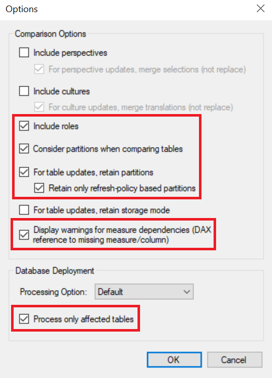
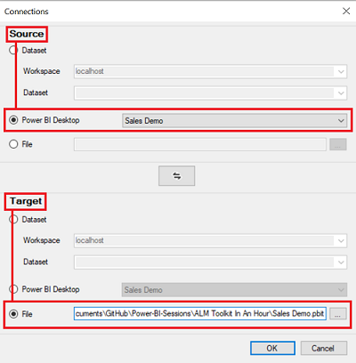
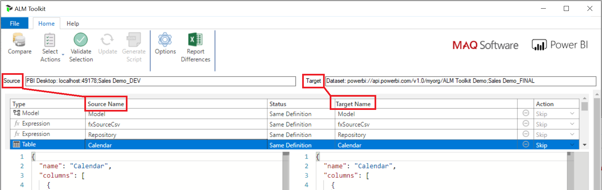
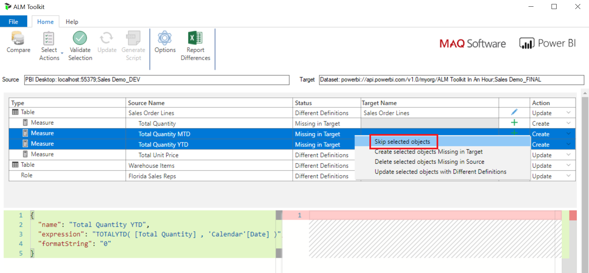

# ALM Toolkit In An Hour 

### About:
ALM Toolkit is a free and open-source tool to manage Microsoft Power BI datasets including the actions database compare, code merging, source-control integration, reusing definitions and self-service to corporate BI deployments.

In readiness for [XMLA endpoint read/write](https://docs.microsoft.com/en-us/power-platform-release-plan/2020wave1/business-intelligence/xmla-readwrite), objects specific to Power BI are also supported:
- Incremental refresh policies/partitions
- Aggregations
- Table level storage for composite models

Website: http://alm-toolkit.com/
___

**Follow Along:**
- [Download and Install ALM Toolkit](http://alm-toolkit.com/)
- [Download the Sales Demo_DEV.pbix File](https://github.com/microsoft/pbiworkshops/raw/main/ALM%20Toolkit%20In%20An%20Hour/Sales%20Demo_DEV.pbix)
- [Download the Sales Demo_FINAL.pbix File](https://github.com/microsoft/pbiworkshops/raw/main/ALM%20Toolkit%20In%20An%20Hour/Sales%20Demo_FINAL.pbix)

___

# Table of Contents
- [Prerequisites](#prerequisites)
- [Setup](#setup)
- [Tabular Object Model Hierarchy](#tabular-object-model-hierarchy)
- [Comparison](#comparison)
- [Actions](#actions)

___

# Prerequisites

For this workshop a **Power BI Pro** license is required for publishing and a workspace backed by either **Premium Capacity** or **Premium Per User** with XMLA connectivity enabled.

___

# Setup

## Instructions

### Power BI Desktop [Only applicable to July and August 2020 Versions]
1. Ensure the Power BI preview feature [Store datasets using enhanced metadata format](https://docs.microsoft.com/en-us/power-bi/connect-data/desktop-enhanced-dataset-metadata) is enabled.
2. Navigate to the **File** menu and select Options and Settings and then **Options**.
3. Navigate to **Preview features** and enable **Store datasets using enhanced metadata format**.

### Power BI service
1. Navigate to the [Power BI service](https://app.powerbi.com).
2. Within the Power BI service, select the Workspaces option within the navigation menu and locate a workspace that is backed by either Premium Capacity or Premium Per User.
3. Within the Workspace:
    - Select **New** and the **Upload a file** option
        - Upload the **Sales Demo_FINAL.pbix**
    - Select **Settings** and within the **Premium** tab, press the **Copy** button below the **Workspace Connection** address

### ALM Toolkit
1. Navigate to the **External Tools** ribbon in Power BI Desktop and select **ALM Toolkit**.
2. Select **Options** and enable the following options:
    - Include roles
    - Consider partitions when comparing tables
    - For table updates, retain partitions
        - Retain only refresh-policy based partitions
    - Display warnings for measure dependencies (DAX reference to missing measure/column)
    - Process only affected tables



### Processing Options

| Mode | Description |
| :--- | :-----|
| Recalc | Updates and recalculates hierarchies, relationships, and calculated columns. |
| Default | Detects the process state of database objects, and performs processing necessary to deliver unprocessed or partially processed objects to a fully processed state. Data for empty tables and partitions is loaded; hierarchies, calculated columns, and relationships are built or rebuilt (recalculated). |
| Do Not Process | Will copy metadata but won't perform processing. |
| Full | Processes a database and all the objects that it contains. <b>When Process Full is run for an object that has already been processed, Analysis Services drops all data in the object, and then processes the object.</b> This kind of processing is required when a structural change has been made to an object. This option requires the most resources. |

[Learn More About Processing Options](https://docs.microsoft.com/en-us/analysis-services/tabular-models/process-database-table-or-partition-analysis-services?view=asallproducts-allversions#bkmk_process_db)

___

# Tabular Object Model Hierarchy
**Source:** Microsoft Docs

The Tabular Object Model (TOM) exposes native tabular metadata, such as model, tables, columns, and relationships objects. A high-level view of the object model tree, provided below, illustrates how the component parts are related.


From a logical perspective, all tabular objects form a tree, the root of which is a Model, descended from Database. Server and Database are not considered tabular because these objects can also represent a multidimensional database hosted on a server running in Multidimensional mode, or a tabular model at a lower compatibility level that does not use tabular metadata for object definitions.

**Important Note:** The underlying **model.bim** file can now be incorporated into your CI/CD pipelines for deployments with Azure DevOps. To deploy changes directly to existing datasets published in the Power BI service, enabling the XMLA read/write endpoint in the capacity settings and Power BI Premium is required. Once changes have been made to a dataset published in the service using the XMLA end point, a PBIX file will no longer be able to be downloaded.

[Learn More About Data Modeling and Management Tools](https://docs.microsoft.com/en-us/power-bi/admin/service-premium-connect-tools#data-modeling-and-management-tools)

___

# Comparison

Deployment of tabular models normally employs an all-or-nothing (**Power BI Desktop - Publish to Web**), or partial-metadata deployment strategy. With ALM Toolkit modelers can compare tabular object differences and perform merging across models that are in development (**Source**) to their intended destination (**Target**) supporthing both approaches.

### Supported Connections:
- Dataset
    - Analysis Services Database
        - SQL Server Analysis Services (SSAS)
        - Azure Analysis Services (AAS)
        - [Power BI Premium Dataset (via XMLA)](https://docs.microsoft.com/en-us/power-bi/admin/service-premium-connect-tools)
- Power BI Desktop (PBIX)
- File (Metdata Only)
    - Power BI Template File (PBIT)
    - Business Intelligence Model (BIM)

**Important Note:** The target model compatibility level must be greater than or equal to the compatibility level of the source
model. **Currently not all properties are supported within Power BI Desktop for merging.**

### Objective: Compare schema differences after a change has been made.

## Instructions

### Power BI Desktop
1. Open the **Sales Demo_DEV.pbix** file.
2. Navigate to the **External Tools** tab and select the option **ALM Toolkit**.

### ALM Toolkit
1. Within the Connections dialog box confirm the following and press **OK** when complete.
    1. **Source** is the Power BI Desktop file **Sales Demo_DEV.pbix** that is currently open.
    2. **Target** is the **Sales Demo_FINAL.pbix** file that has been uploaded to the Power BI service.
    


### Power BI Desktop
1. Within the **Sales Demo_DEV.pbix** file, navigate to **File**, **Options and Settings**, **Options**, the **CURRENT FILE** sections **Data Load** properties and disable **Auto date/time**.

### ALM Toolkit
1. Press Compare and confirm the following remain unchanged.
    1. **Source** is the Power BI Desktop file **Sales Demo_DEV.pbix**.
    2. **Target** is the **Workspace Connection** address for the **Sales Demo_FINAL.pbix**.
2. Navigate to the **Home** tab and select **Select Actions** and the **Hide Skip Objects with Same Definition** option.
3. Select the row containing the Table object Source Name **Calendar** to compare the differences.



4. Navigate to the **Home** tab and select **Validate Selection** to review the applicable changes in the **Warning List** dialog box before pressing **OK**
5. Navigate to the **Home** tab, select **Update** and within the ALM Toolkit diablog box press **Yes** to confirm updating the target.
6. Within the **Deploy** dialog box press **Close**
7. Within the **ALM Toolkit** dialog box press **Yes** to refresh the comparison.

**Note:** If Power BI Desktop prompts with an dialog box stating **Something went wrong** press Cancel. This is due to Auto time intelligence still being enabled in the **CURRENT FILE** sections **Data Load** properties which is causing conflict with the missing objects.

___

# Actions

Within ALM Toolkit modelers can Create, Update, Delete or Skip items that are in development (**Source**) before deploying changes to their intended destination (**Target**).

### Objective: Choose the appropriate actions to update the target.

### Power BI Desktop
1. Within the Sales Demo (PBIX) file, navigate to the **Fields** pane and alternate click the **Warehouse Items** table and select **Edit query**.
2. With the Power Query Editor
    1. Hold shift and select the columns **TaxRate, UnitPrice, Suggested Retail Price and TypicalWeightPerUnit**.
    2. Navigate to the **Transform** tab and select the **Detect Data Type** option to classify the column types.
    3. Navigate to the **Home** tab and select **Close & Apply**.
3. Navigate to the **Report** option and select the **[State/Province]** field from the **State/Provinces** table.
4. Navigate to the **Modeling** tab
    1. Select the **View as** option to view as the **Florida Sales Reps** role and select **OK**.
    2. Select **Stop viewing** within the notification bar.
    3. Select the **Manage roles** option and navigate to the **State/Provinces** table to review the current DAX filter expression.

    ```[State/Province] = "FLORIDA"```

5. Navigate to the **Data** option and select the **[State/Province]** field from the **State/Provinces** table to review the current items.
6. Navigate to the **Modeling** tab and select the **Manage roles** option and navigate to the **State/Provinces** table to update the current DAX filter expression.

    ```[State/Province] = "FL"```

7. Navigate to the **Report** option
    1. Select the **[OrderID]** field from the **Sales Order Lines** table, alternate click and select **Hide**.
    2. Alternate select the **Sales Order Lines** table and select **New Measure** to create the following measures
        1. ```Total Quantity = SUM('Sales Order Lines'[Quantity])```
        2. ```Total Quantity MTD = TOTALMTD([Total Quantity], 'Calendar'[Date])```
    3. Select the **Total Unit Price** measure and update to the following DAX expression and set the **Format** property to **Currency**.
    
        ```Total Unit Price = SUMX('Sales Order Lines', [Quantity] * [Unit Price])```

### ALM Toolkit
1. Press Compare and confirm the following remain unchanged.
    1. **Source** is the Power BI Desktop file **Sales Demo_DEV.pbix** that is currently open.
    2. **Target** is the Power BI Desktop file **Sales Demo_FINAL.pbix** that is currently open.
2. Navigate to the **Home** tab and select **Report Differenes** to output an Excel file for version history.
3. Navigate to the **Home** tab and select **Select Actions** and the **Hide Skip Objects with Same Definition** option.
4. Select the following rows to compare teh differences and confirm or change the **Action**
    1. **Table** objects
        1. Source Name **Warehouse Items** and set the **Action** to **Update**.
        2. Source Name **Sales Order Lines** and set the **Action** to **Update**.
    2. **Role** objects
        1. Source Name **Florida Sales Rep** and set the **Action** to **Update**.
    3. **Measure** objects
        1. Source Name **Total Unit Price** and set the **Action** to **Update**.
        2. Source Name **Total Quantity** and **Total Quantity MTD** set the **Action** to **Skip**.
        


5. Navigate to the **Home** tab and select **Validate Selection** to review the applicable changes in the **Warning List** dialog box before pressing **OK**
6. Navigate to the **Home** tab, select **Update** and within the ALM Toolkit diablog box press **Yes** to confirm updating the target.
7. Within the **Deploy** dialog box press **Close**
8. Within the **ALM Toolkit** dialog box press **Yes** to refresh the comparison.

___

# Continue Your Journey

### An indepth walk through of ALM Toolkit
[PowerBI.Tips - Tutorial - ALM Toolkit](https://www.youtube.com/watch?v=yKvMrQlUrCU)

### Whitepaper
[Model Comparison and Merging for Analysis Services](https://github.com/microsoft/Analysis-Services/blob/master/BismNormalizer/Model%20Comparison%20and%20Merging%20for%20Analysis%20Services.pdf)

**Note:** BISM Normalizer is a Visual Studio Plugin whereas ALM Toolkit is the same underlying technology in a standalone application.
