# Data pipeline

In this lab, we will guide you through the process of creating a comprehensive data ingestion solution using data pipelines in Microsoft Fabric. We will start by setting up the copy activity to transfer data from a sample source to a dynamic destination within a lakehouse. This includes using the expression builder to create a dynamic folder structure based on the current date of execution.

Throughout the lab, you will validate and run the pipeline, ensuring that the data ingestion process is successful and that the data is organized correctly in the lakehouse. By the end of this lab, you will have a solid understanding of how to efficiently manage a data ingestion workflow.

### Create a data pipeline

1. Continuing from the [Getting started](GettingStarted.md) tutorial where we built a lakehouse and a sample data pipeline, we will now proceed to select and add a **New item** from the **High-volume data ingest** task.

    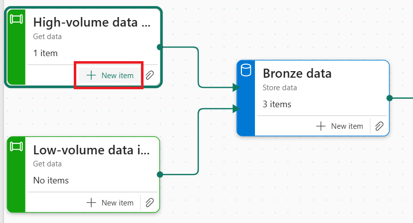

1. Within the Create an item window, the available options within Microsoft Fabric have been filtered down to **Recommended items** only again. Select the **Data pipeline** item.

    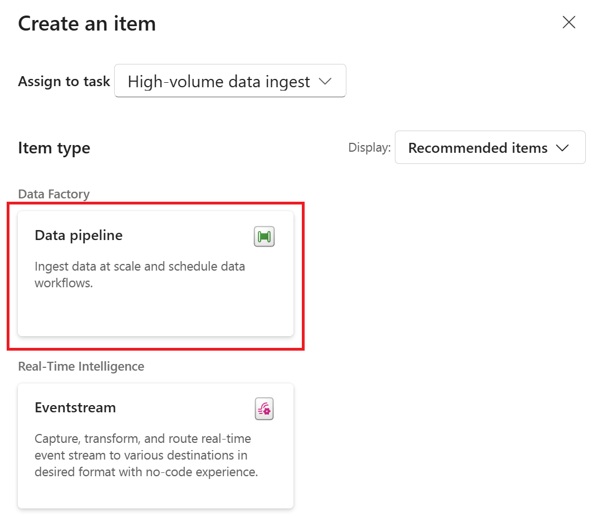

1. In the New pipeline window, set the data pipeline name to "**getContosoSample**" and then select **Create**.

    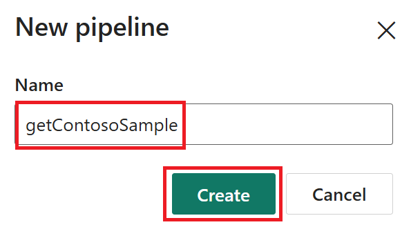

### Creating a data connection

1. From the new and empty data pipeline, select the **Pipeline activity** watermark option and then choose **Copy data** to add this activity to the authoring canvas.

    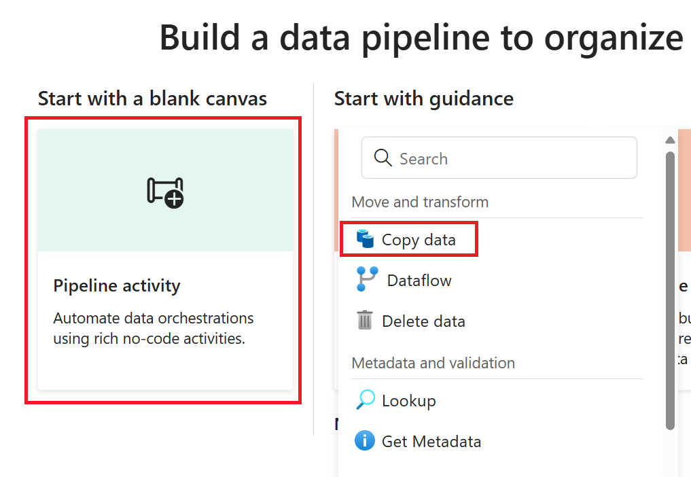

1. With the **Copy data** activity selected, navigate to the **Source** tab. Within the **Connection** drop-down menu, select the **More** option to launch the Get data navigator. This navigator provides a comprehensive interface for connecting to various data sources, ensuring that you can easily integrate different data streams into your pipeline.

    

1. From the Get data navigator, select **Add** from the left side-rail and then choose the **Http** connector. The Http connector allows you to connect to web-based data sources, providing flexibility in accessing data from various online resources.

    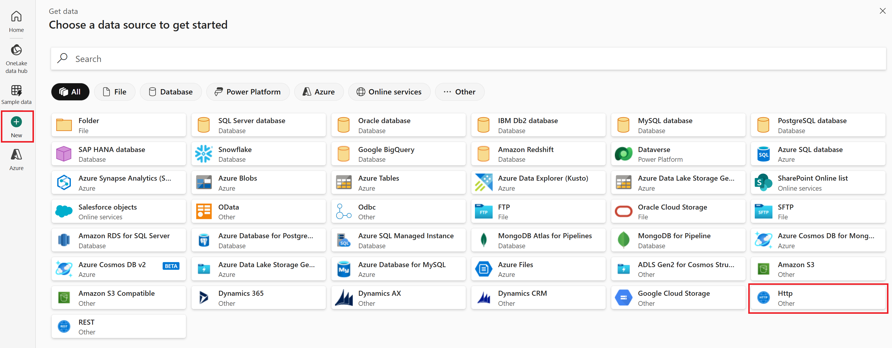

1. Paste the following sample Zip file address from GitHub into the **Url** path. Optionally, you can also set the **Connection name** property to something more discoverable for future use, such as "ContosoSample." Naming your connections helps in easily identifying and managing different data sources within your project. Once complete, select **Connect** to establish the connection.

    ```text
    https://github.com/microsoft/pbiworkshops/raw/main/Day%20After%20Dashboard%20in%20a%20Day/Source_Files/ContosoSales.zip
    ```

    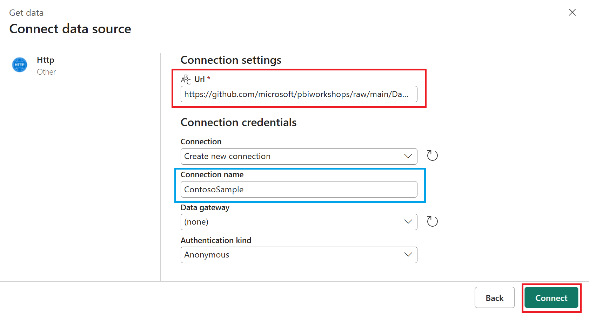

### Copy activity settings

1. With the **Copy data** activity selected and the **Source** tab displayed, select the **Settings** option next to the File format field. Within the **Compression type** setting, choose **ZipDeflate (.zip)** and select **OK** to complete.

    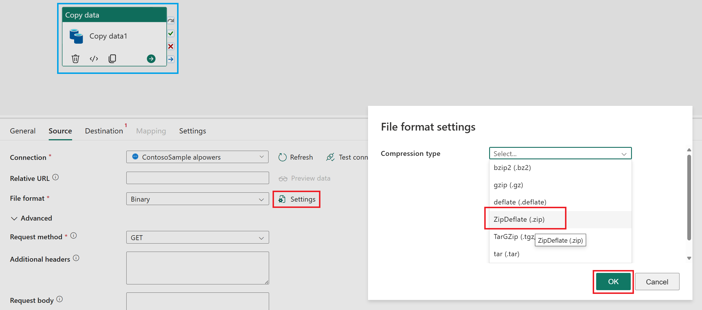

1. Next, with the Copy data activity still selected and the Source tab displayed, expand the **Advanced** section. Deselect the option to **Preserve zip file name as folder**. This allows you to customize the folder name for your zip contents, providing more flexibility in organizing your data.

    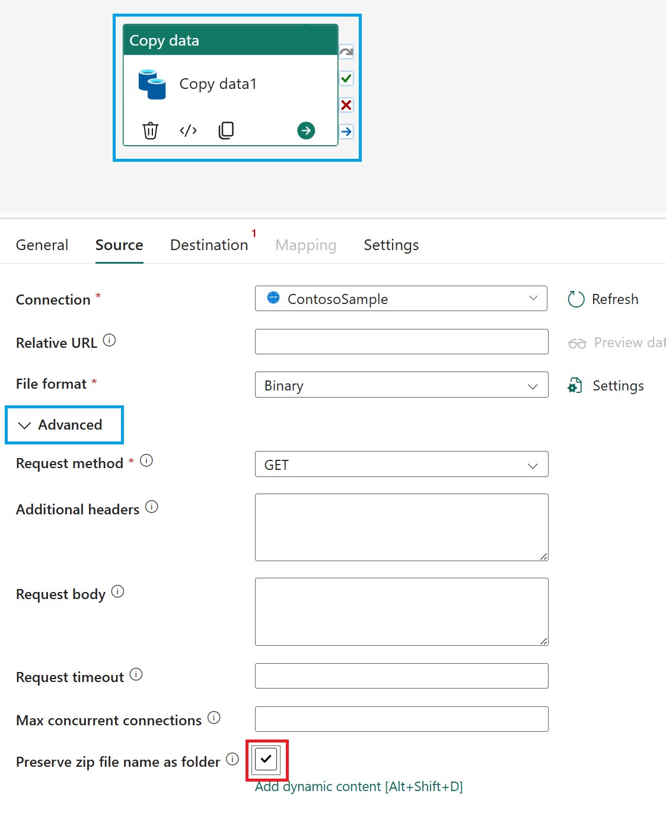

1. With the Copy data activity still selected, navigate to the **Destination** tab. From the list of connections, select the previously configured lakehouse **b_IADLake**. This step ensures that the data is being copied to the correct destination, which is essential for maintaining data integrity and organization.

    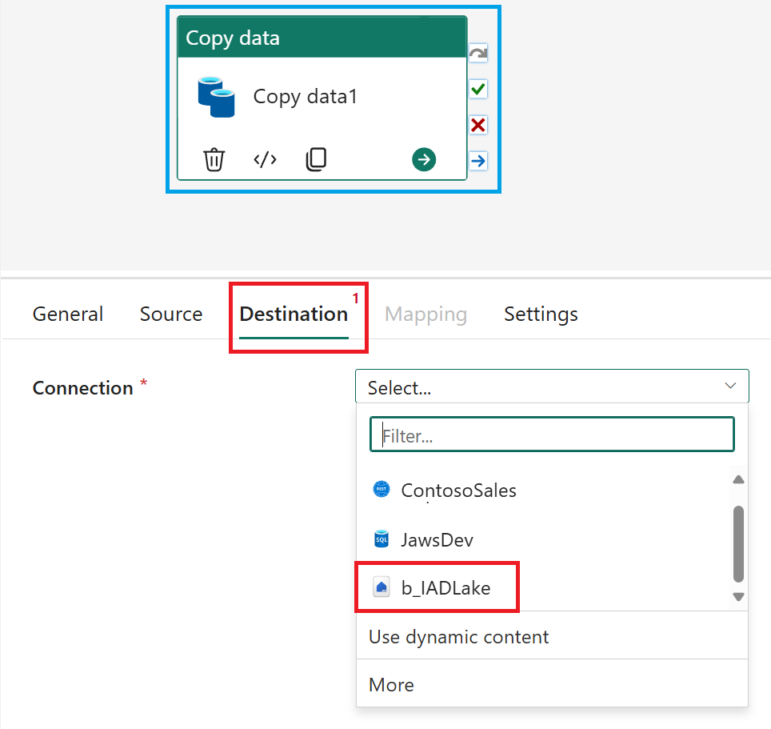

1. Within the Destination settings, select the **Files** option and then the **Directory** file path text input box. This will display the **Add dynamic content [Alt+Shift+D]** property. Select this text to open the pipeline expression builder. The expression builder allows us to create dynamic file paths, which can be customized based on various dynamic parameters such as date and time or static text values.

    

1. In the Pipeline expression builder window, select the **Functions** tab. Here, you can explore various functions that exist within the expression library, in this example we'll use both date and string functions to create a dynamic folder path. When you're ready, copy and paste the code block below into the expression input box. Press **Ok** when complete.

    ```text
    @concat(
        formatDateTime(
            convertFromUtc(
                utcnow(), 'Central Standard Time'
            ),
            'yyyy/MM/dd'
        ),
        '/ContosoSales'
    )
    ```

    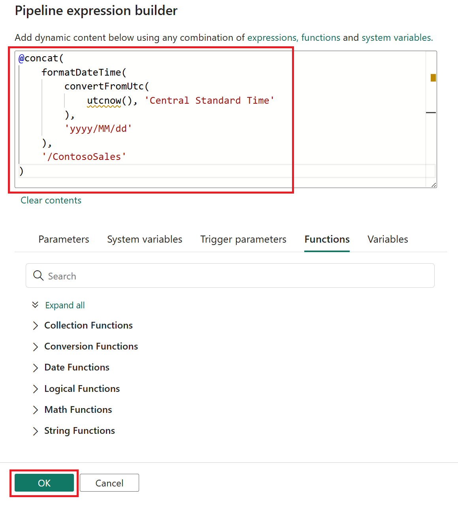

1. With the Copy data activity and Destination settings still selected, select the drop-down for the **Copy behavior** and then choose the **Preserve hierarchy** option. This option maintains the original file names as they are within the zip file, ensuring that the file structure is preserved during the copy process.

    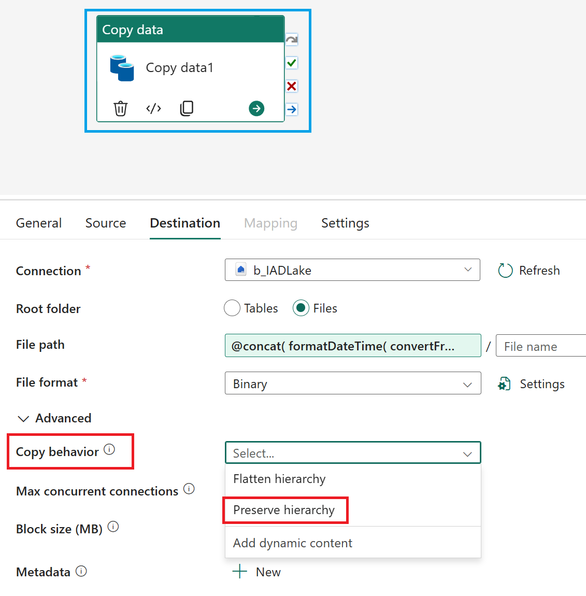

1. Navigate to the General tab with the Copy data activity selected. Update the **Name** and **Description** fields with the appropriate text. This step helps in identifying and managing the activity within your pipeline, making it easier to understand its purpose and functionality.

    | Property | Text |
    | :-- | :-- |
    | Name | Get and Unzip files |
    | Description | Copies sample data from GitHub and stores raw content in lakehouse files |

    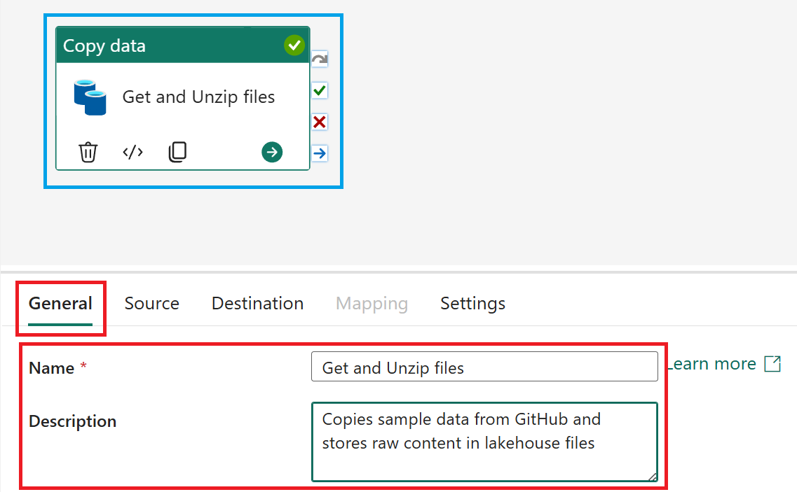

1. From the **Home** tab, select the **Validate** option to first confirm that there are no issues with your pipeline. This validation step helps in identifying any errors to be fixed before running the pipeline. Once validated, select the **Save** option and then **Run** to start the ingestion from the data pipeline. Running the pipeline initiates the data transfer, allowing you to see the results of your configuration in action within the output window.

    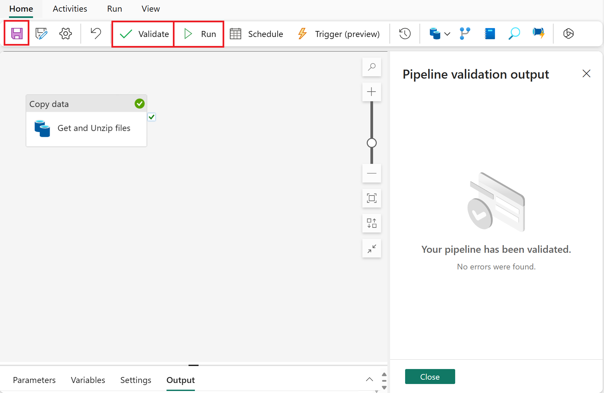

1. Deselect any previously selected activities within the authoring canvas. This action will make the global properties and **Output** view visible. After starting the run of your pipeline, both the Pipeline status and any individual Activity statuses should show a **Succeeded** status. This indicates that everything ran as intended, confirming that your data ingestion process was successful.

    

1. If we return to our previously created **b_IADLake** lakehouse item (either by selecting it on the left side rail if still open or by returning to the workspace item list to open), we can confirm that the zip file's content has now been added to the Files section. The files should be organized with a nested folder structure based on the year, month, date, and data source title for the pipeline run.

    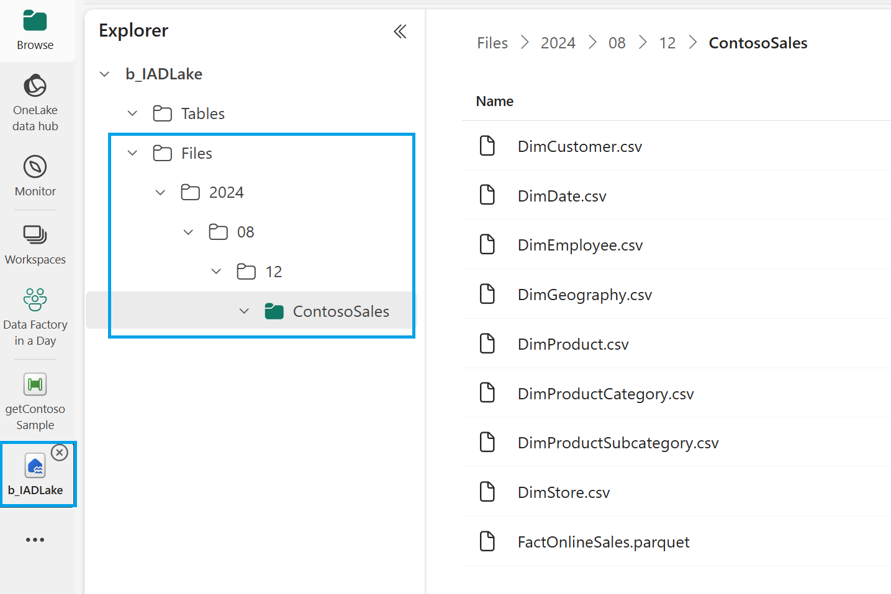

### Enriching raw data

#### Creating and using variables

1. Select the **New item** option on the **Silver data** from your task flow to add another storage item to your project. Within the **Item type** selection, select **Lakehouse**.

    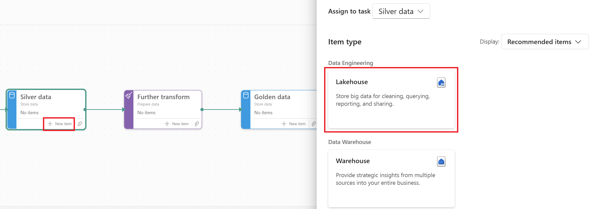

1. In the New lakehouse window, set the lakehouse name to "s_IADLake" (shorthand for silver in a day) and then select **Create**. Consistentcy in naming conventions like this help in easily identifying and managing different storage layers in your project.

    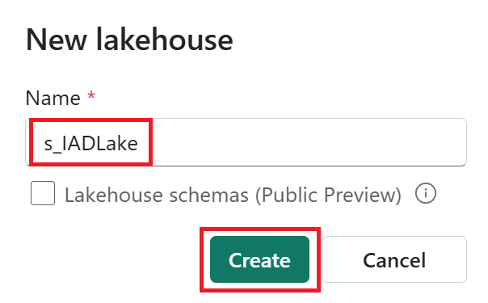

1. Within the lakehouse item from the **Home** tab select **Get data** from **New data pipeline**.

    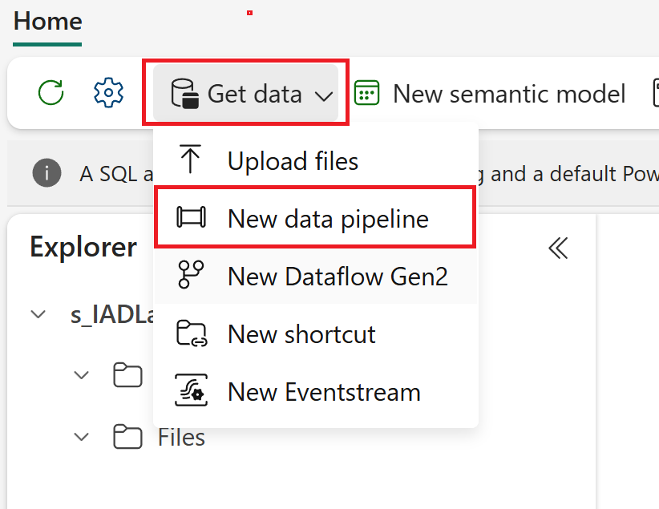

1. In the New pipeline window, set the data pipeline name to **createContosoTables** and then select Create. This step initializes your pipeline and gives it a meaningful name that reflects its purpose.

    If prompted with the Copy data assistant window, select X in the top right corner to be taken into an empty authoring canvas. This ensures that you start with a clean slate for your pipeline configuration.

    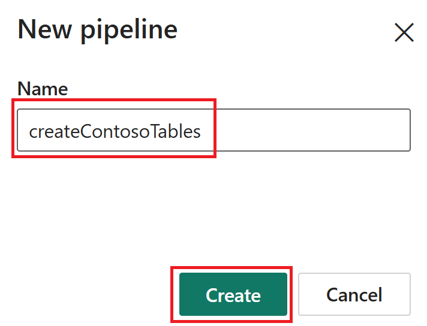

1. Select the **Activities** tab and then the **Set variable** activity to add this to your canvas. The Set variable activity allows you to define and assign values to variables that can be used throughout your pipeline.

    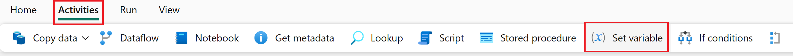

1. With the **Set variable** activity selected, navigate to the **Settings** tab. Next to the **Name** property, select **New**. This step allows you to create a new variable that will be used in your pipeline.

    

1. Within the Add new variable window, set the **Name** value to **fileDirectory** and ensure the Type remains as a string before selecting Confirm. Naming your variable helps in identifying its purpose and ensures that it is correctly referenced in subsequent steps.

    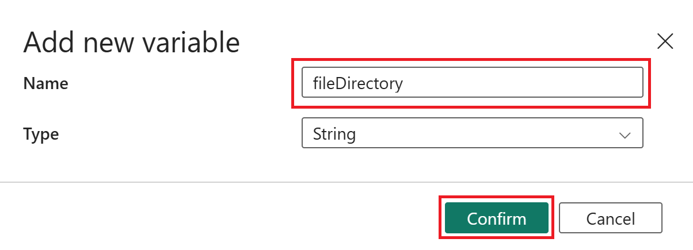

1. Select the **Value** text input box. This will display the **Add dynamic content [Alt+Shift+D]** property. Select this text to open the pipeline expression builder.

    In the Pipeline expression builder window copy and paste the code block below into the expression input box. Press **Ok** when complete.

    ```text
    @concat(
        formatDateTime(
            convertFromUtc(
                utcnow(), 'Central Standard Time'
            ),
            'yyyy/MM/dd'
        ),
        '/ContosoSales'
    )
    ```

    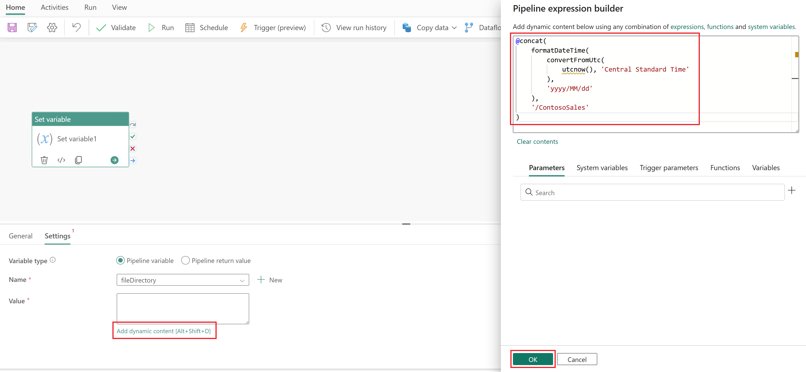

1. Navigate to the General tab with the Set variable activity selected. Update the **Name** field with the text "**Set file directory**". This step helps in identifying and managing the activity within your pipeline in subsequent steps, making it easier to understand its purpose and functionality.

    

1. Select the **Activities** tab and then the **Get metadata** activity to add this to your canvas.

    Within the **Settings** options, select the **Files** option and then the **Directory** file path text input box. This will display the **Add dynamic content [Alt+Shift+D]** property. Select this text to open the pipeline expression builder.

    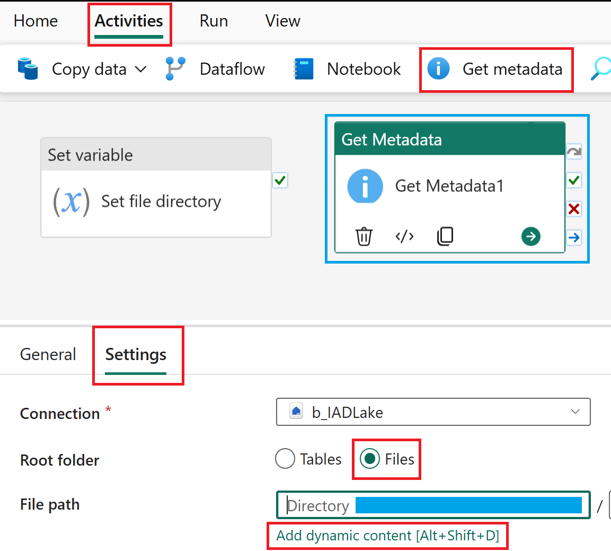

1. In the Pipeline expression builder window, select the **Variables** option. Within the available variable list, select **fileDirectory** and then OK. This step ensures that the file path for the metadata retrieval is dynamically set based on the value of the fileDirectory variable.

    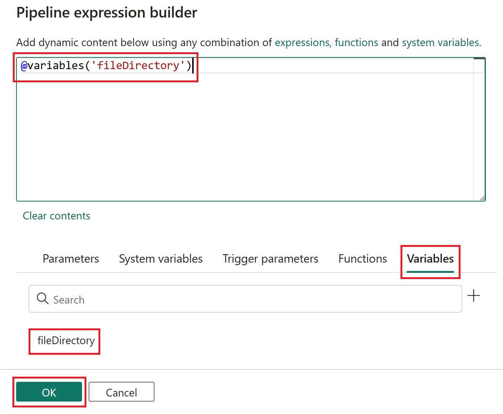

1. With the Get metadata activity still selected, navigate to the **Settings** tab. Add new Field list values by selecting **New** twice. Within each of the drop-downs, configure the values as **Child items** and **Item name**. This ensures that the metadata activity retrieves information about the child items and their names within the specified directory.

    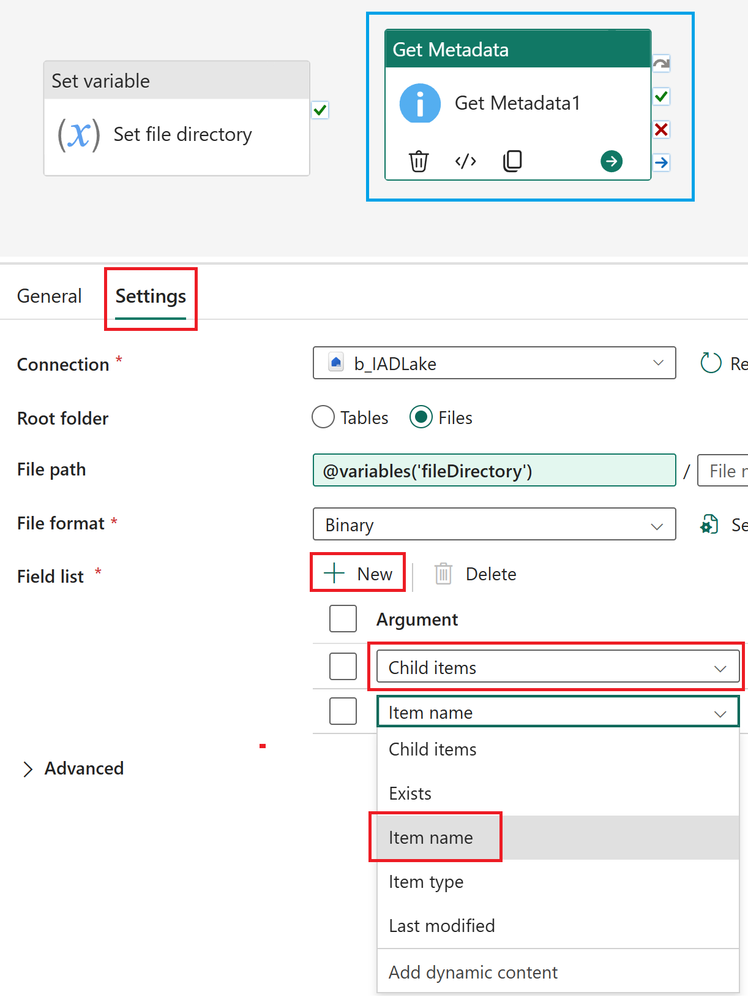

1. Next, navigate to the General tab with the Get metadata activity selected. Update the **Name** field with the text "**Get child items in folder**". This step helps in identifying and managing the activity within your pipeline, making it easier to understand its purpose and functionality.

    

1. Create a conditional path by dragging and dropping the **On completion** option between the **Set file directory** activity and the **Get child items in folder** activity. This step establishes a logical flow in your pipeline, ensuring that the metadata retrieval occurs only after the file directory has been set. 

    Once complete, select **Validate** on the **Home** tab to ensure there are no errors within the pipeline. After validation, select **Run** to start the pipeline.

    A new window will prompt you as unsaved changes have been detected. Select **Save and run** to continue. 

    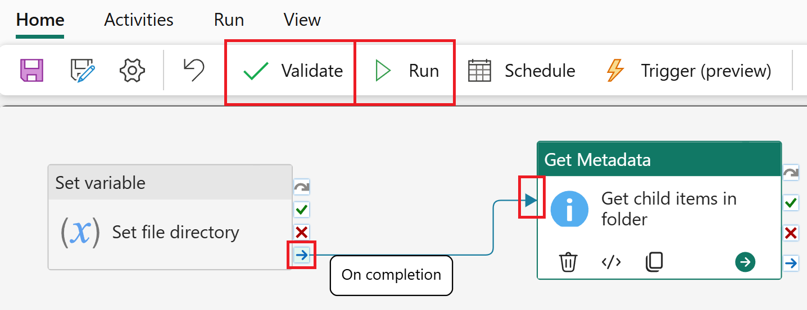

1. Deselect any previously selected activities within the authoring canvas and navigate to the **Output** view. This view allows you to monitor the current status of your pipeline both during and after its run. In this example, both the Pipeline status and the Activity status should show a **Succeeded** status. This indicates that everything ran as intended, confirming that your data ingestion process was successful.

    From the **Get child items in folder** activity, select the last column called **Output** to review the contents of the activity. This step allows you to verify that the filenames from your directory have been correctly retrieved and included in the output.

    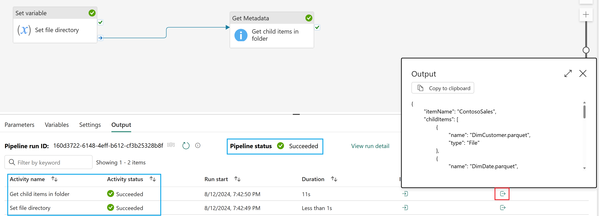

#### ForEach loop and conditional branches

1. Select the **Activities** tab and then the **ForEach** activity to add this to your canvas. This activity allows you to iterate over a collection of items, performing a set of actions for each item in the collection.

    With the **ForEach** activity selected, navigate to the General tab and update the **Name** field with the text **For each file**. Naming your activities helps in identifying their purpose and makes it easier to manage your pipeline.

    Next, create a conditional path by dragging and dropping the **On success** option between the **Get child items in folder activity** and the **For each file activity**. This step establishes a logical flow in your pipeline, ensuring that the ForEach retrieval occurs only after the file directory has been successfully completed.

    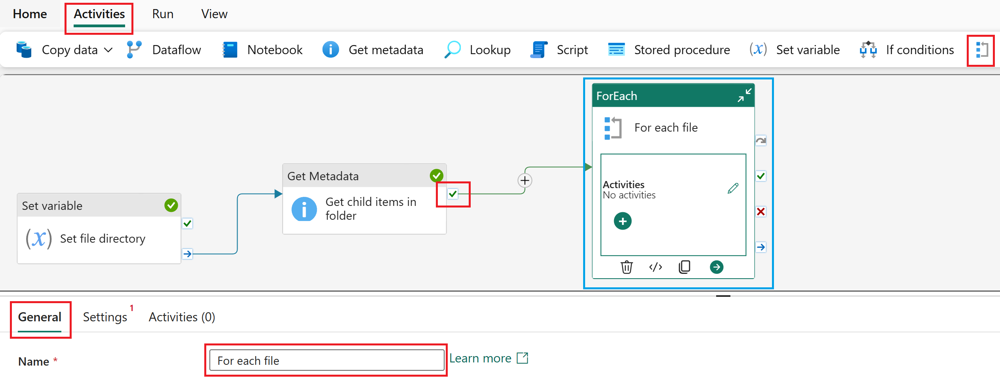

1. With the For each file activity still active, navigate to the **Settings** tab. Check the option for **Sequential** order and then select the Items text input box. This will display the **Add dynamic content [Alt+Shift+D]** property. Select this text to open the pipeline expression builder. The sequential order ensures that the items are processed one after another, maintaining the order of execution.

    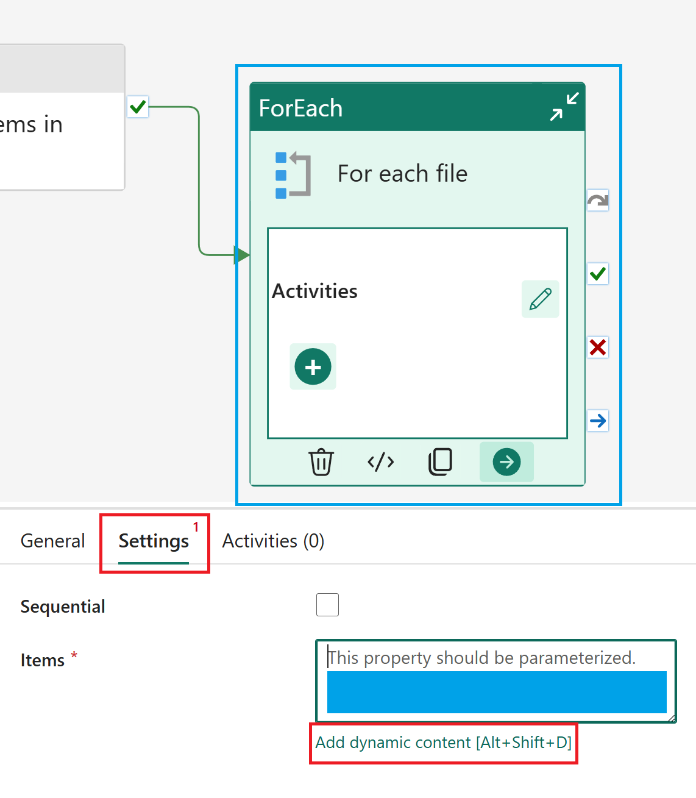

1. Within the Pipeline expression builder window, select the **Activity outputs** section. Then, choose the **Get child items in folder** output of **childItems**. The full option title is **Get child items in folder childItems**. This step ensures that the ForEach activity iterates over the child items retrieved from the specified directory.

    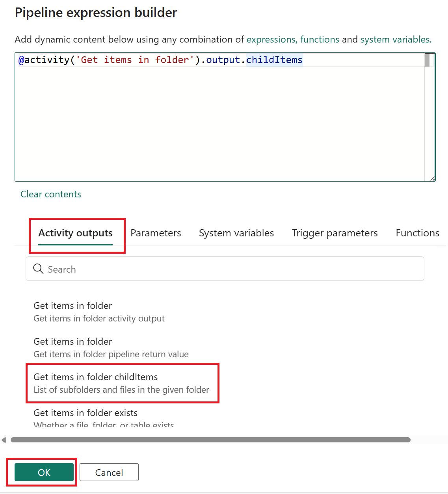

1. With all the activities deselected on your canvas, navigate to the project's **Variables** tab at the bottom. Select **New** and add two new variables from the table below. This step allows you to define additional variables that will be used in your pipeline.

    | Name | Type |
    | :-- | :-- |
    | fileName | String |
    | tableName | String |

    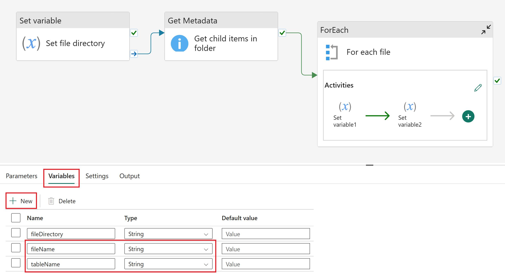

1. Select the variable activities in the For each file activity and update their configurations according to the table below. For the **Value** option, select the text input box, which will display the **Add dynamic content [Alt+Shift+D]** property. Select this text to open the pipeline expression builder.

    **Set variable1**

    | Tab | Setting | Value  |
    | :-- | :-- | :-- |
    | General | Name | Set fileName |
    | Settings | Name | fileName |
    | Settings | Value | ``@item().name`` |

    **Set variable1**

    | Tab | Setting | Value  |
    | :-- | :-- | :-- |
    | General | Name | Set tableName |
    | Settings | Name | tableName |
    | Settings | Value | ``@split(variables('fileName'),'.')[0]`` |

    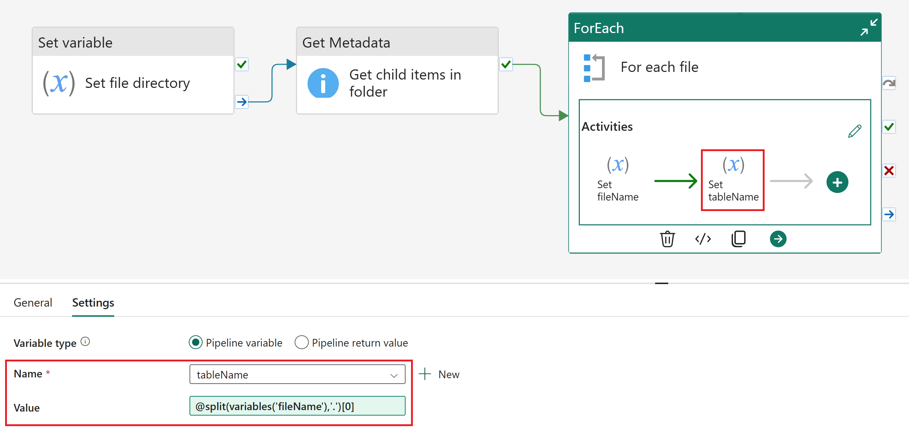

1. Select the **Edit** option on the For each activity to drill into the nested authoring canvas. This step allows you to configure the activities that will be executed for each item in the collection.

    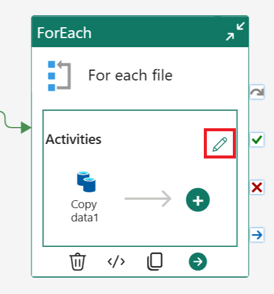

1. From the **Activities** tab, select the ellipses (**...**) and then the **Switch** activity to add this to the authoring canvas. The Switch activity allows you to define different execution paths based on the value of an expression, providing flexibility in handling different scenarios.

    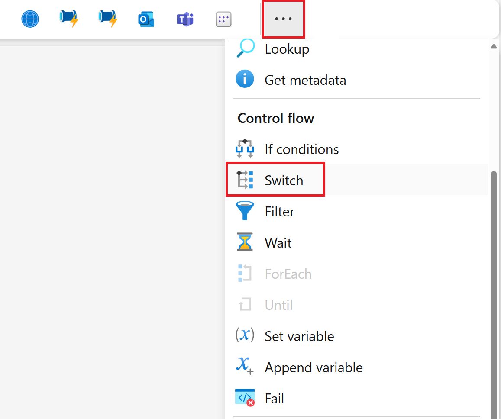

1. With the **Switch** activity selected, navigate to the **Activities** tab and select the **Expression** text input box. This will display the **Add dynamic content [Alt+Shift+D]** property. Select this text to open the pipeline expression builder.

    Copy and paste the code block below into the expression input box. Press **Ok** when complete.

    ```text
    @if(
        contains(variables('fileName'), 'Dim'),
        'Dim',
        'Fact'
    )
    ```

    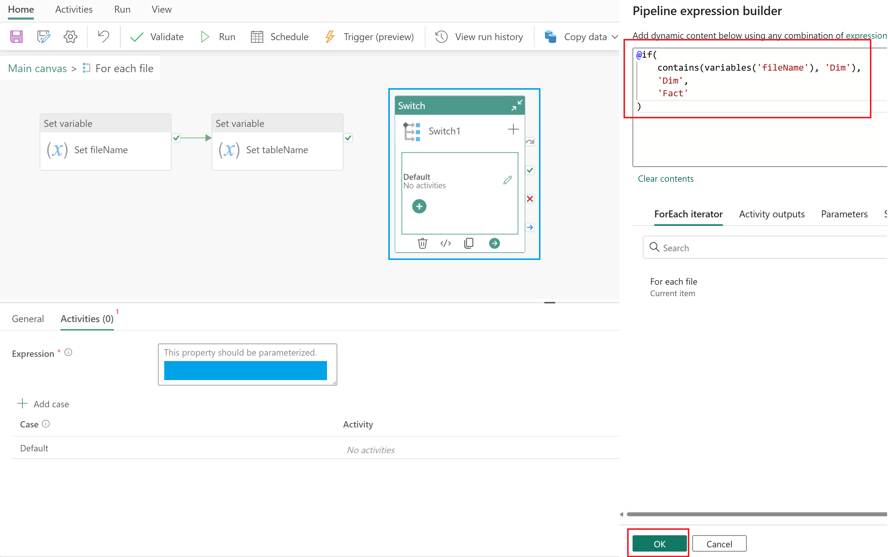

1. Still within the **Activities** tab, select the **Add case** option to add two cases: one for **Dim** and another for **Fact**. These cases will handle different scenarios based on the contents of the fileName variable, distinguishing between dimension tables and fact tables.

    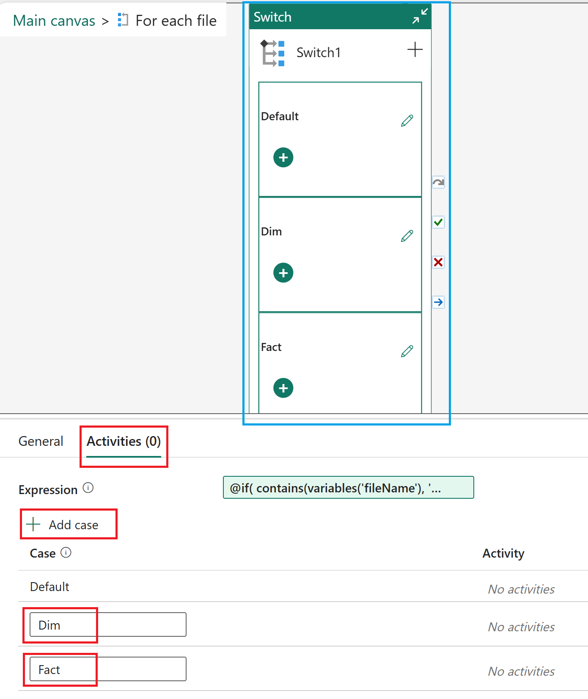

1. Navigate to the **General** tab with the Switch activity selected. Update the **Name** field with the text **Switch by Prefix**.

    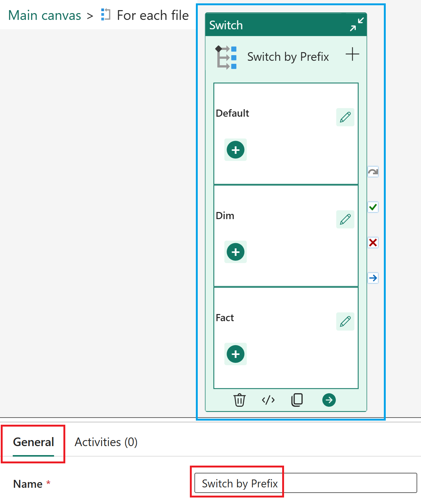

1. Select the **Add activity** option within the Dim switch condition and add the **Copy data** activity. This step defines the actions to be taken when the fileName variable indicates a dimension table.

    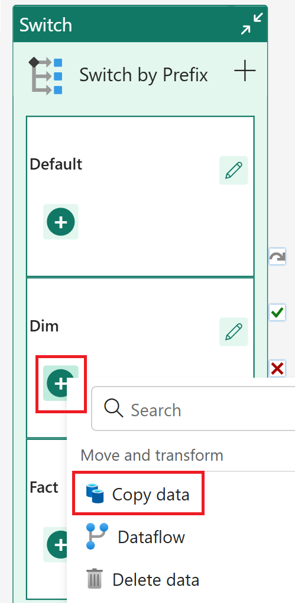

1. With the **Copy data** activity selected within the Dim switch condition, configure the following options in the **Source** tab:

    | Property | Value |
    | :-- | :-- |
    | Source | Select the previously configured **b_IADLake** lakehouse. |
    | Root folder | Files |
    | File path | File path |
    | Directory | Select the variable **fileDirectory** within the expression builder's Variables section. |
    | File name | Select the variable **fileName** within the expression builder's Variables section. |
    | File format | Parquet |

    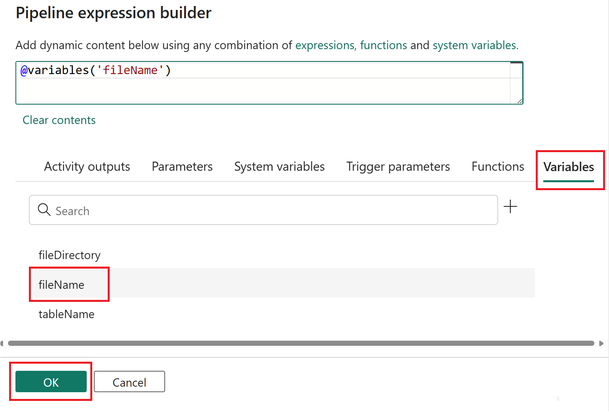

    The final configuration will match the image below.

    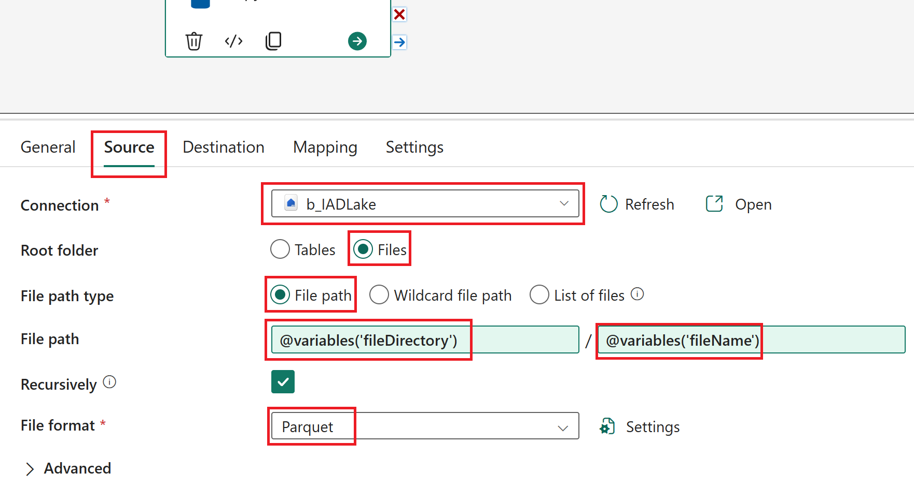

1. With the **Copy data** activity selected within the Dim switch condition, configure the following options in the **Destination** tab:
    | Property | Value |
    | :-- | :-- |
    | Source | Select the previously configured **s_IADLake** lakehouse. |
    | Destination | Tables |
    | Table name | Select the variable **tableName** within the expression builder's Variables section. |
    | Table action | Overwrite |

    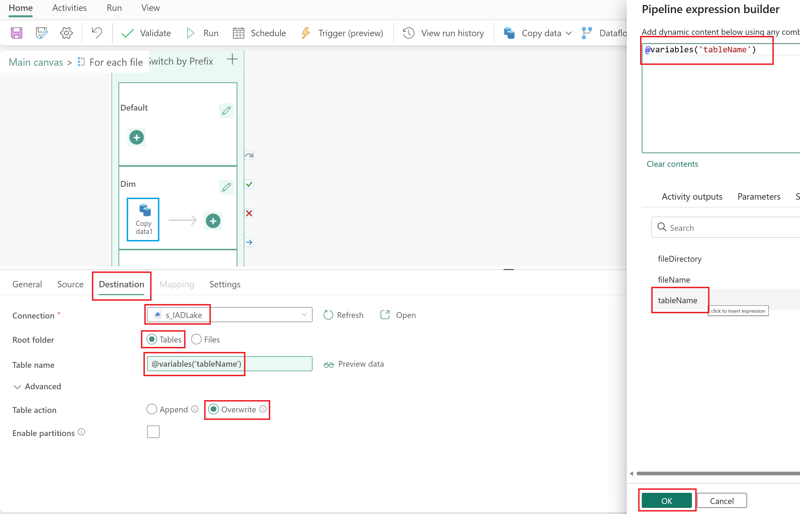

1. Navigate to the General tab with the Copy data activity selected. Update the **Name** with the text **Copy dimensions**.

    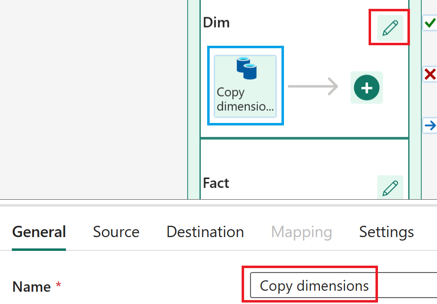

1. Right-click the **Copy dimensions** activity and select the **Copy** option. Using the breadcrumb trail, select the **For each file** to return to the parent canvas. This step allows you to duplicate existing activities.

    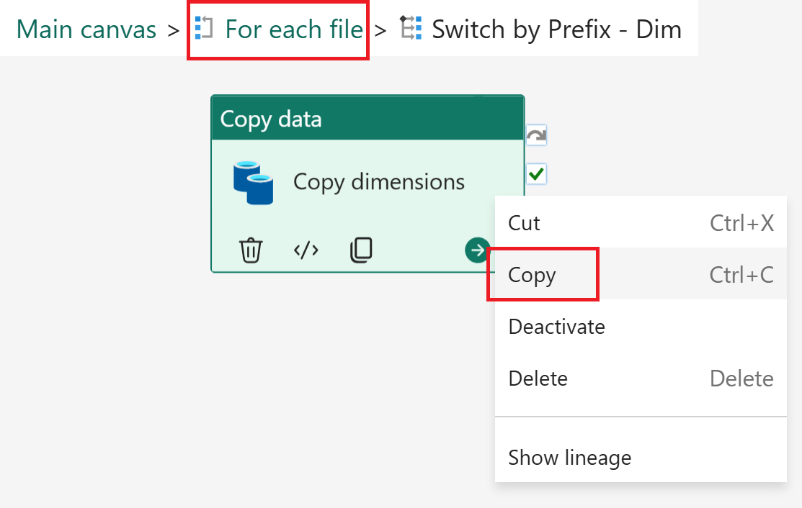

1. From the Switch activity, select the **Edit** option to go into the authoring canvas. This step allows you to configure the activities within the nested switch conditions.

    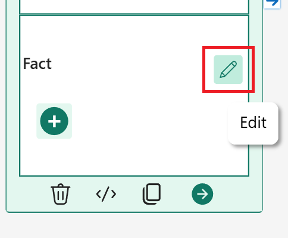

1. Within the **Fact** condition, right-click the authoring canvas and select **Paste**. This step adds the previously copied Copy dimensions activity to the Fact condition authoring canvas.

    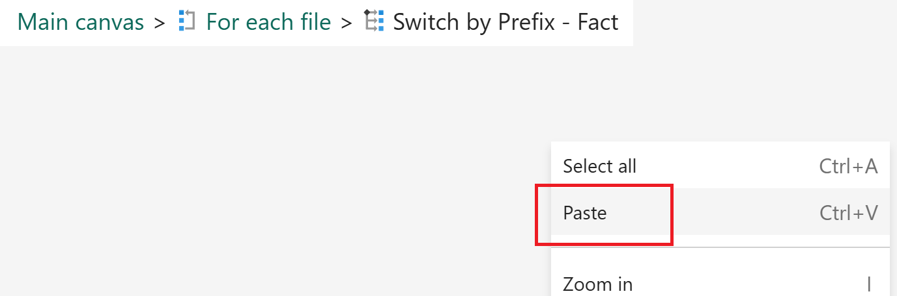

1. Navigate to the General tab with the Copy data activity selected. Update the **Name** with the text **Copy facts**.

    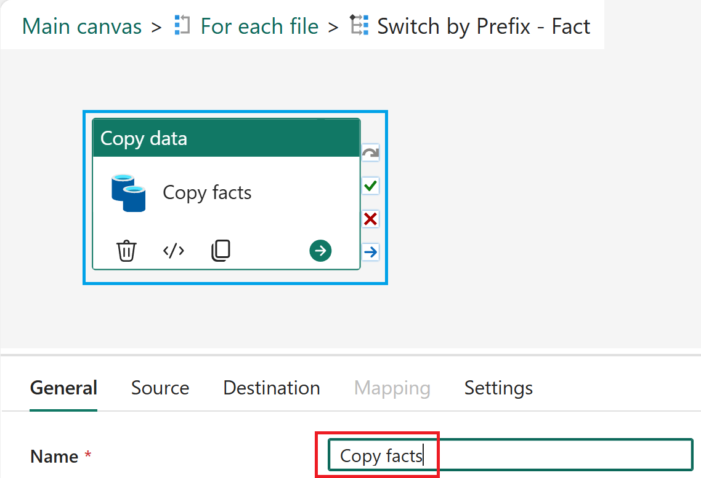

1. Select the **Destinations** tab and update the following **Table action** to the **Append** option. This ensures that the data is appended to the existing table, rather than overwriting it. Then, select the **For each** option from the breadcrumb trail to return to the top level of your pipeline.

    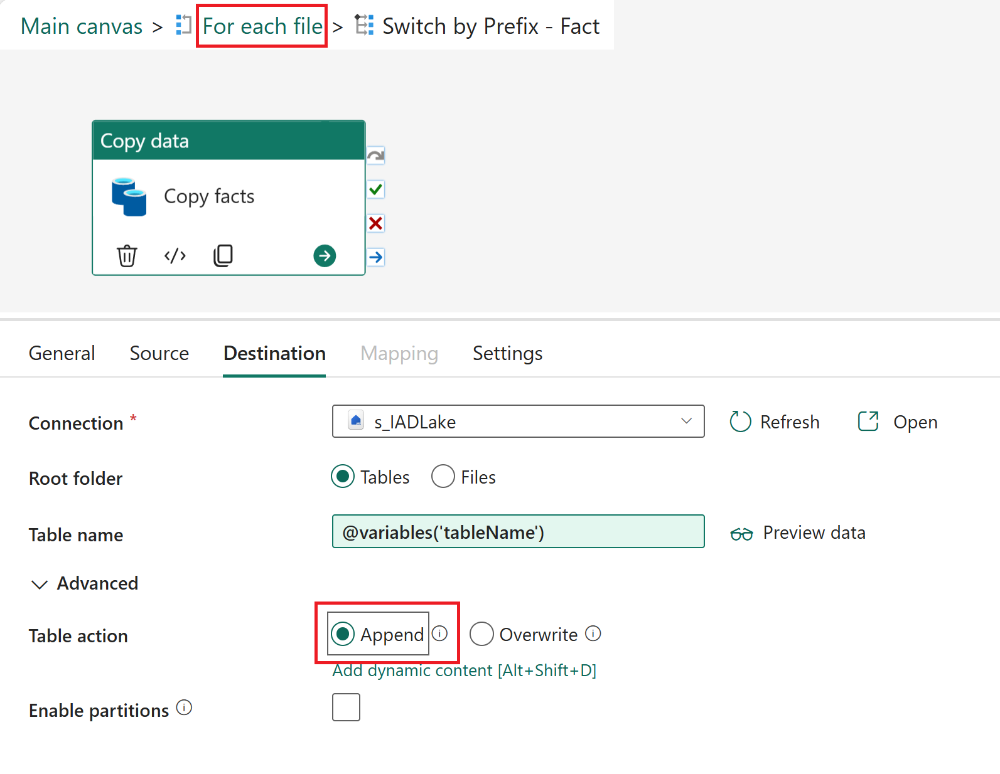

1. Set the conditional path activity to **On success** from the **Set tableName** variable activity to the **Switch by Prefix activity**. Then, select the **Main canvas** option from the breadcrumb trail to return to the top level of your pipeline.

    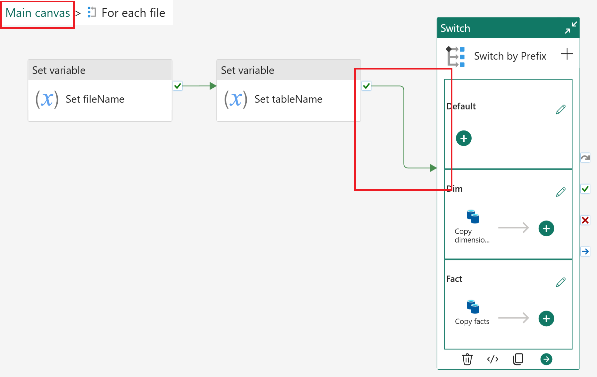

1. From the **Home** tab, select the **Validate** option to first confirm that there are no issues with your pipeline. This validation step helps in identifying any errors to be fixed before running the pipeline.

    Once validated, select the **Save** option and then **Run** to start the ingestion from the data pipeline. If a save window is prompted, confirm by selecting **Save and run**. Running the pipeline initiates the data transfer, allowing you to see the results of your configuration in action within the output window.

    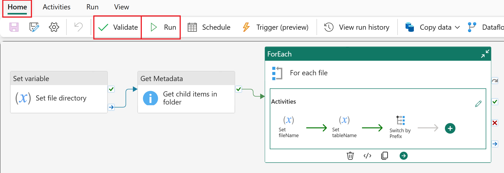

1. The data pipeline is now running multiple activities in a sequential order and writing these to the Silver data layers lakehouse as delta parquet tables. These tables are optimized for analysis, providing several benefits for data processing and querying.

    v-Order optimized tables are crucial for analysis in Microsoft Fabric because they enhance performance and efficiency. By organizing data in a columnar format, v-Order tables allow for faster data retrieval and reduced storage costs. This optimization is particularly beneficial for analytical workloads, where large volumes of data need to be processed and queried quickly. Additionally, delta parquet tables support efficient data updates and versioning, making it easier to manage and analyze evolving datasets.

    By leveraging v-Order optimized tables, you can ensure that your data is stored in a way that maximizes performance and scalability, enabling more effective and timely analysis. This approach helps in making informed decisions based on up-to-date and well-organized data.

    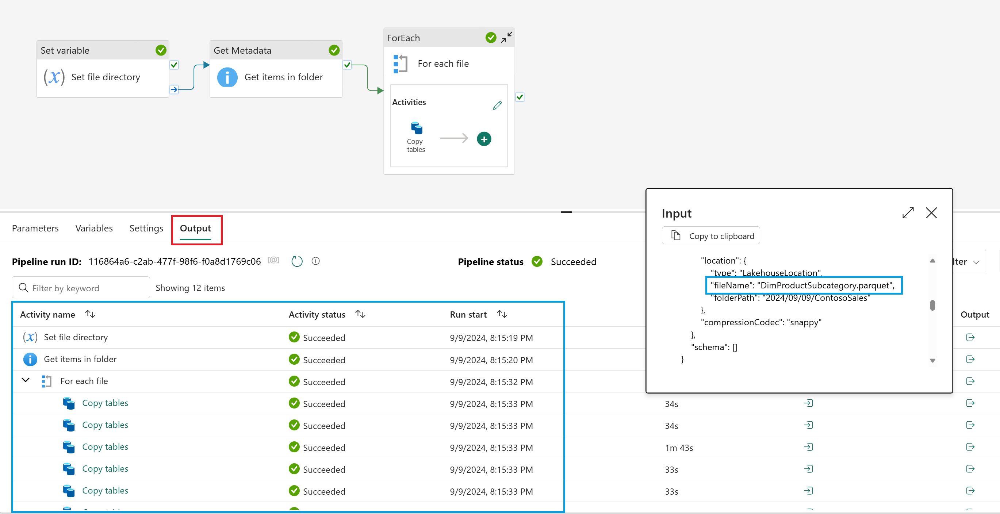

# Next steps

In this lab, we explored the process of creating dynamic data pipelines using Microsoft Fabric. Throughout the lab, we configured various activities, including setting variables, retrieving metadata, and using the ForEach and Switch activities to handle different scenarios. We also learned how to validate and run the pipeline, ensuring that the data ingestion process is successful and that the data is correctly organized in the lakehouse.

By moving data across the bronze and silver data lakehouse layers, we demonstrated how to manage and optimize data workflows. The use of delta parquet tables, optimized with v-Order, highlighted the importance of efficient data storage and retrieval for analytical workloads. These optimizations enhance performance, scalability, and overall productivity, enabling more effective data analysis and decision-making.

- Continue to the [Dataflow Gen2](./DataPipeline.md) lab
- Return to the [Data Factory in a Day](./README.md) homepage