# Getting started

### Premium license configuration

We'll begin by navigating to a new, empty, or non-production workspace to check if a capacity has been assigned to the workspace. If not, we can enable it by following these steps:

1. Click the **Settings** option located in the top right corner of the workspace to access the settings.

    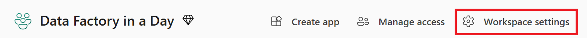

1. Within the **Settings** pane, navigate to the **License info** tab to check the license configuration. Ensure that one of the following modes is enabled:

    **License mode:**
    - [Premium capacity](https://docs.microsoft.com/power-bi/admin/service-premium-gen2-faq)
    - [Fabric capacity](https://learn.microsoft.com/fabric/enterprise/buy-subscription#buy-an-azure-sku)
    - [Trial](https://learn.microsoft.com/fabric/get-started/fabric-trial)

    1. Once you have verified the licensing mode, select your desired capacity from the **License capacity** drop-down list.

    1. Click **Select license** to save your changes and the **X** in the top right corner of the window to close the **Workspace settings** pane.

    

### Medallion task flow

1. To begin, from the empty workspace, select the option **Select a task flow** to choose one of Microsoft's predesigned task flows. These predesigned task flows provide a structured approach to managing data projects, ensuring that best practices are followed and that the workflow is efficient and effective.

    **Note:** If you do not see the task flow section within your workspace, check for the chevron to expand or collapse this section from the workspace item view. This ensures that you have access to all the necessary tools and options for your project.

    

1. From the **Select a task flow** window, choose the **Medallion** option. This option includes the description "Organize and improve data progressively as it moves through each layer," which is crucial for data projects. The medallion architecture helps in structuring data into different layers, such as bronze, silver, and gold, to enhance data quality and accessibility. Select the **Select** option to continue.

    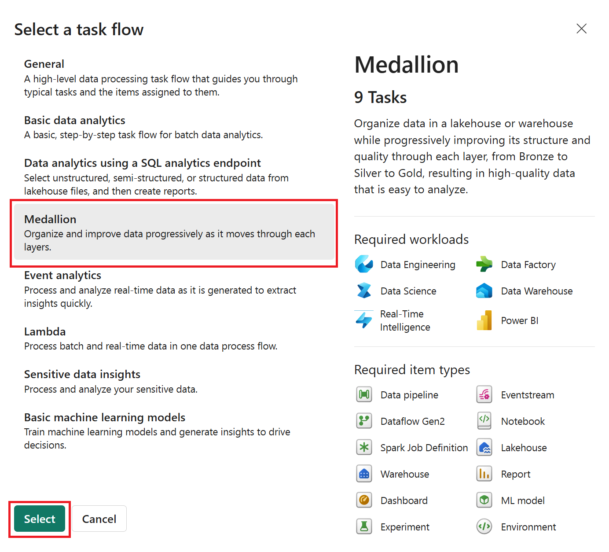

1. A task flow has now been created within your workspace, which can be considered an architectural template. This template provides a structured framework for your data project. No items have been created yet, so select the **New item** option on the **Bronze data** task to start adding items to your task flow.

    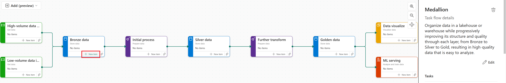

1. Within the Create an item window, the available options within Microsoft Fabric have been filtered down to **Recommended items** only. This filtering is helpful for choosing the correct items for your project, ensuring that you select the most appropriate tools and resources. Select the **Lakehouse** item for your data storage.

    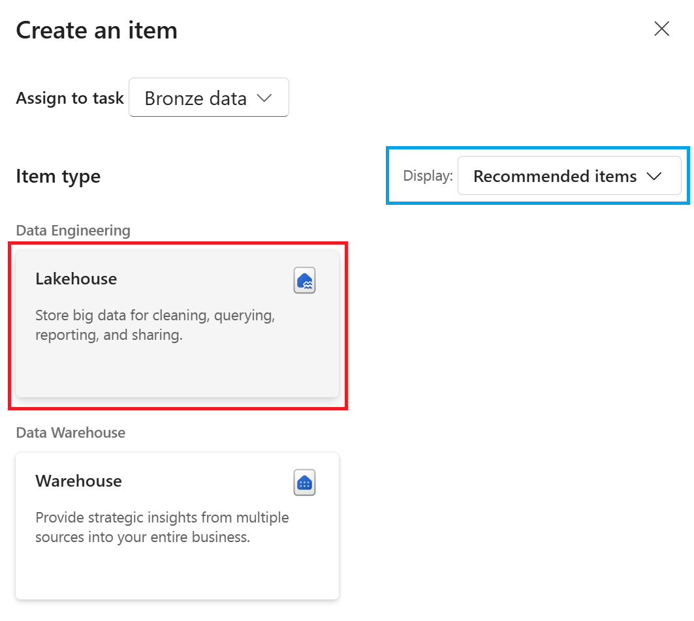

1. In the New lakehouse window, set the lakehouse name to "b_IADLake" (shorthand for bronze in a day) and then select **Create**. Naming conventions like this help in easily identifying and managing different components of your project.

    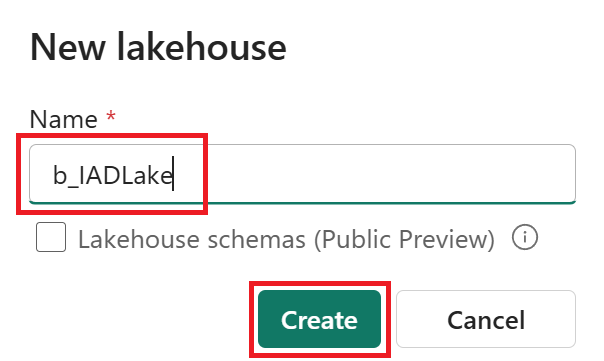

1. A new lakehouse will be created for you. For now, return to the workspace by selecting the workspace name on the left side-rail. This step ensures that you can continue working on other aspects of your project while the lakehouse is being set up.

    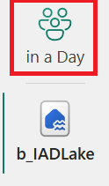

1. Within the workspace, you will notice that three items have now been created and are associated with your lakehouse. These items include the lakehouse (storage), SQL analytics endpoint, and a default Semantic model. As you continue to add more items to your projects and select different tasks, the workspace item view list will filter to show only those components associated with each task. This filtering helps you stay organized and focused on the relevant parts of your project.

    To proceed, select **New item** from the **High-volume data ingest** task. This task is crucial for handling large volumes of data efficiently, ensuring that your data ingestion processes are scalable and robust.

    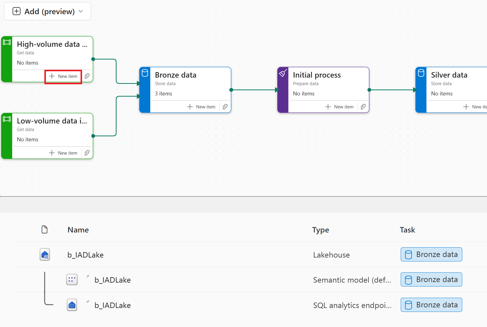

1. Within the Create an item window, the available options within Microsoft Fabric have been filtered down to **Recommended items** only again. Select the **Data pipeline** item which is essential for automating the movement and transformation of data from various sources to destinations.

    

1. In the New pipeline window, set the data pipeline name to "**samplePipeline**" and then select **Create**.

    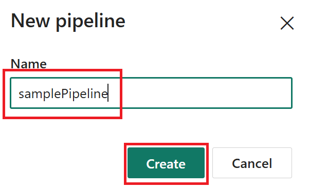

### Copy activity

1. From the new and empty data pipeline, select the **Copy data assistant** watermark option to walk through a guided configuration. This assistant provides a step-by-step guide to help you configure the data copy process, ensuring that you set up the pipeline correctly and efficiently.

    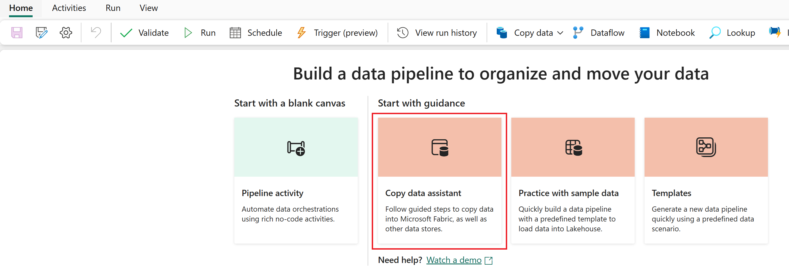

1. The first step within the copy data assistant is to choose a data source. Start by selecting the **Sample data** tab and then the **Public Holidays** option from the available options. Choosing a sample data source allows you to practice and understand the data ingestion process without affecting your actual data.

    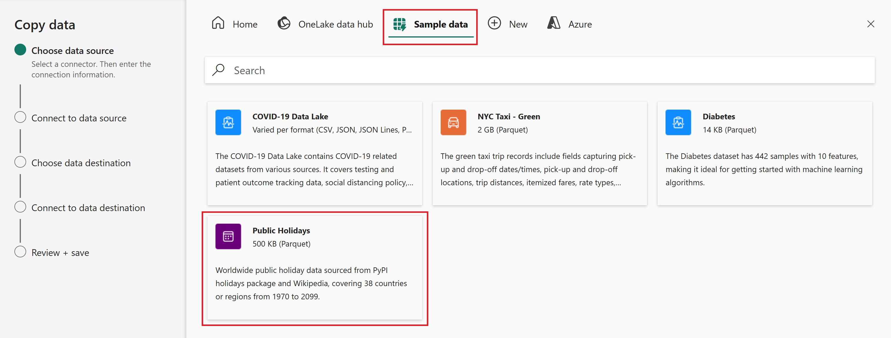

1. A preview of the data source will now be displayed. This preview helps you verify that you have selected the correct data source and understand the structure of the data. Once you have reviewed the preview, select **Next** to proceed.

    

1. Choose the **b_IADLakehouse** lakehouse item for the data destination. This step is crucial as it determines where your data will be stored.

    **Note:** You can also find a list of items that you have access to via the **OneLake data hub** tab or by typing the item name directly into the **Search** bar. This flexibility ensures that you can easily locate and select the appropriate data destination.

    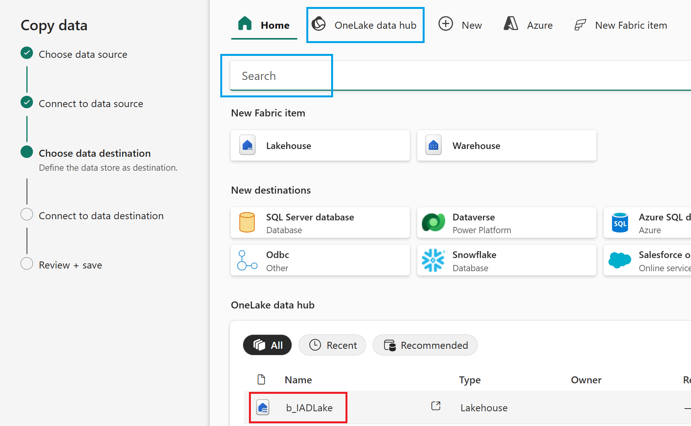

1. Within the data destination configuration, select the **Files** option and set the File name to **Holidays.csv**. Set the Copy behavior to **Merge files** before selecting **Next**.

    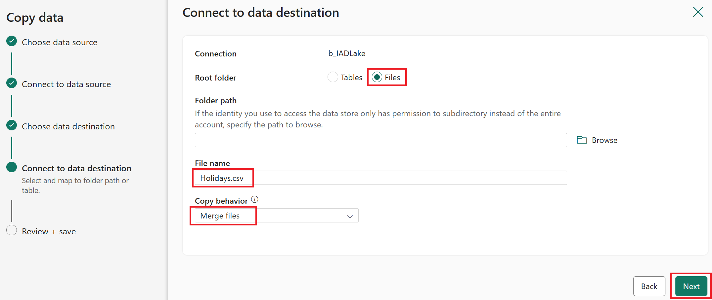

1. Set the Compression type to **None**. This setting is important for determining how your data will be stored and accessed. In this case, no compression is applied, which can be useful for maintaining the original data format.

    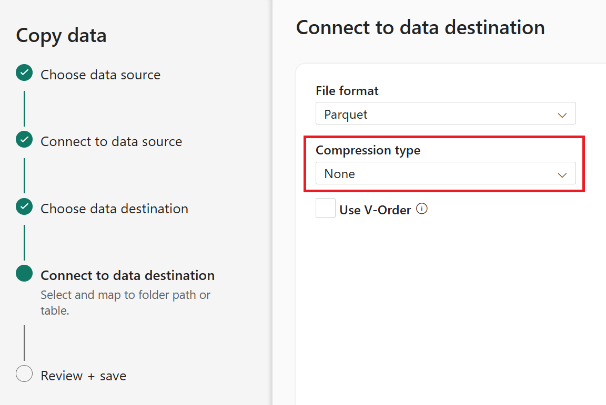

1. Set the File format to **DelimitedText** and then select **Next**. This format is commonly used for storing tabular data, making it easy to import and export data between different systems.

    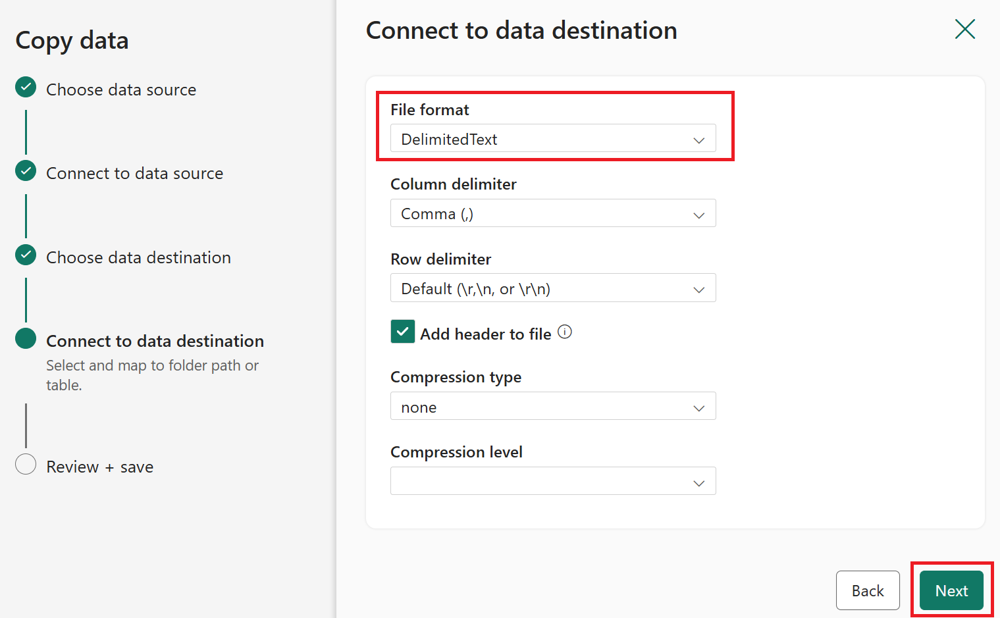

1. Within the Review + save window, disable the **Start data transfer immediately** option and then select **OK** to review your configured copy activity within the data pipeline canvas. 

    This step allows you to review and confirm your settings before initiating the data transfer, ensuring that everything is configured correctly.

    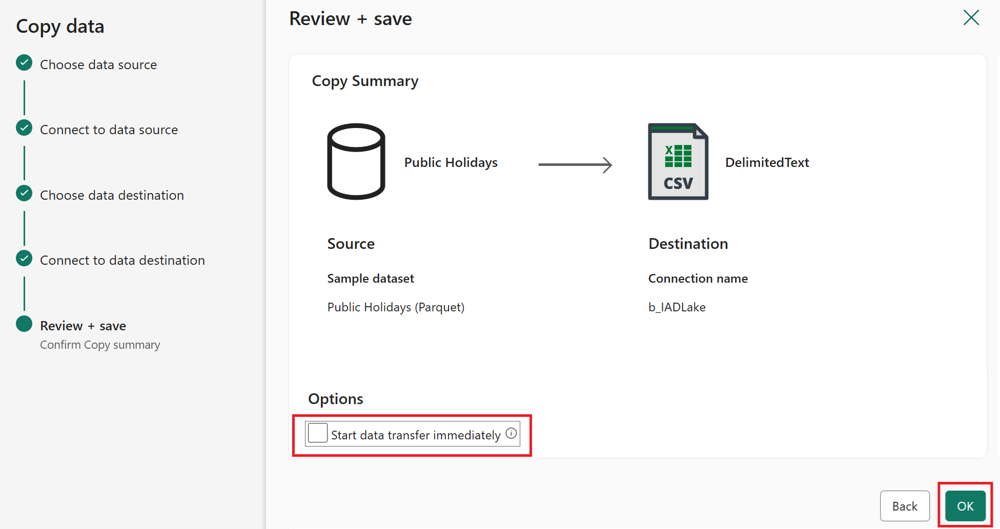

# Authoring canvas

1. Within the authoring canvas, select the **Copy data** activity. Below, you will find the properties section where you can review the Source, Destination, Settings, and more. This section allows you to edit their configurations directly, ensuring that your data copy activity is set up correctly and tailored to your specific needs.

    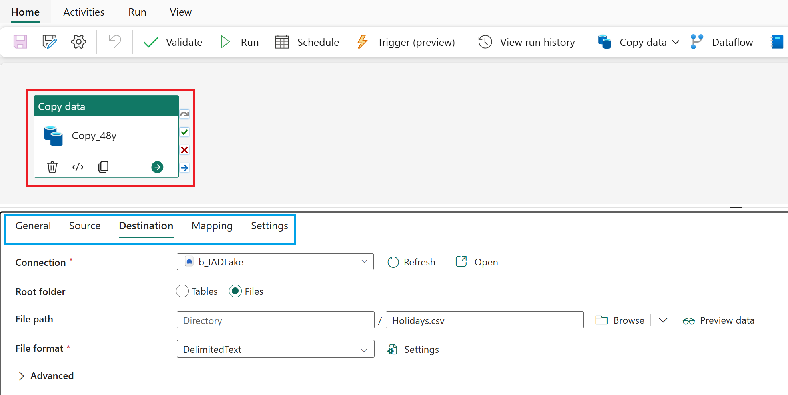

1. Next, from the **Home** tab on the ribbon, select the **Validate** option. This step is important to ensure that the complete contents of your pipeline (in this sample, just the Copy activity) are valid. In the Pipeline validation output window, you should see the confirmation message "Your pipeline has been validated. No errors were found." This validation step helps you catch any potential issues before running the pipeline.

    Select the **Run** option to start the pipeline and begin your data ingestion process. Running the pipeline initiates the data transfer from the source to the destination.

    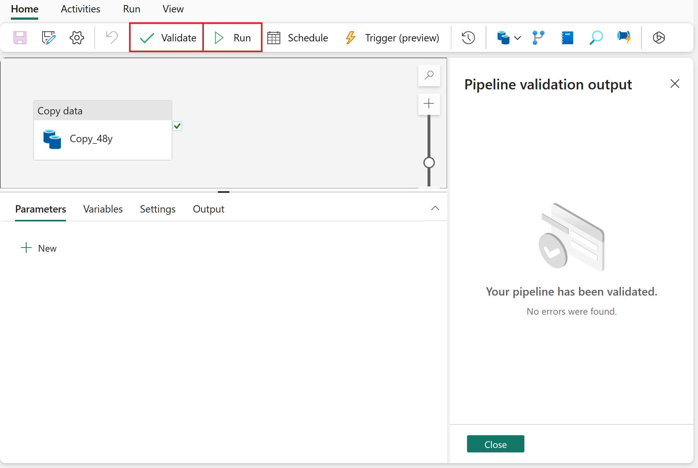

1. Deselect any previously selected activities within the authoring canvas. The global properties and **Output** view will then become visible. After starting the run of your pipeline, both the **Pipeline status** and the **Activity status** should show a **Succeeded** status. This indicates that everything ran as intended, confirming that your data ingestion process was successful.

    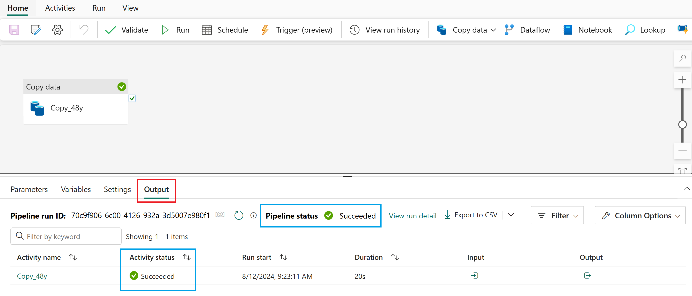

1. If we return to our previously created **b_IADLake** lakehouse item (either by selecting it on the left side rail if still open or by returning to the workspace item list to open), we can confirm that the **Holidays.csv** file has been added to the **Files** section. Selecting the file will allow you to get a preview of the data, ensuring that the data has been ingested correctly.

    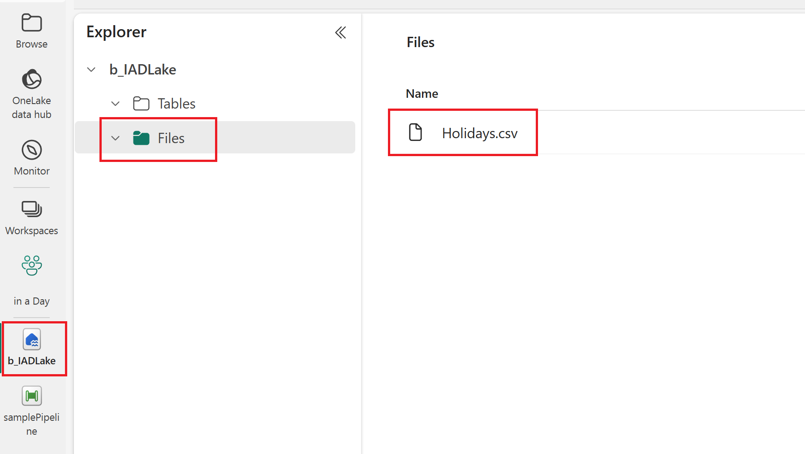

### Pipeline expression builder

1. We want to make the output of our file from the pipeline dynamic to a new folder location based on the current date of execution. To start, delete the existing **Holidays.csv** file from our lakehouse by selecting the ellipses (**...**) and then the **Delete** option. This step ensures that we have a clean slate for our new dynamic file output.


    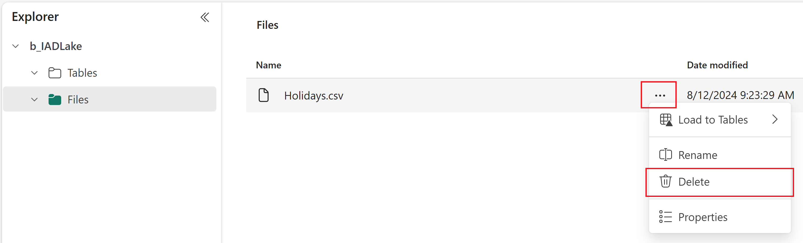

1. A confirmation window will be displayed. Select **Delete** to confirm the removal of the file.

    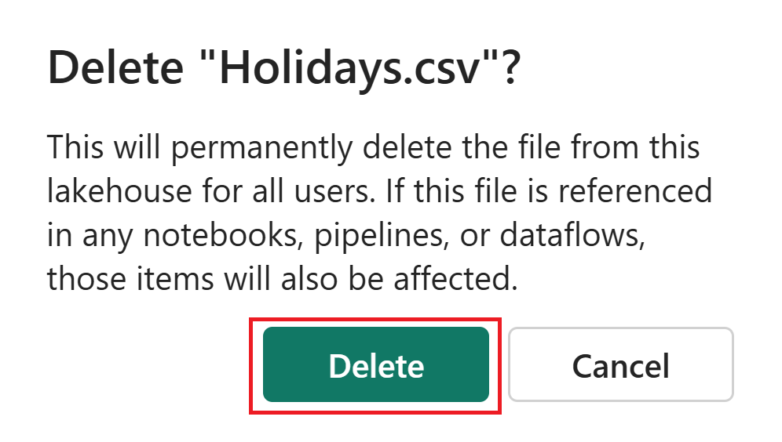

1. Return to our previously created **samplePipeline** data pipeline item. You can do this either by selecting it on the left side rail if it is still open or by returning to the workspace item list to open it. This step brings you back to the pipeline where we will make the necessary changes to create an expression for a dynamic file output.

    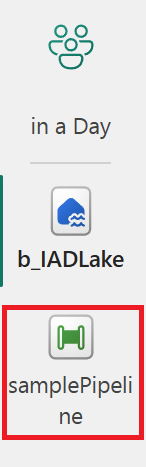

1. Select the **Copy data** activity and then go to the **Destination** tab. Select the text box input for the **File path**, where after selection you will see the text **Add dynamic content [Alt+Shift+D]**. Select this text to open the pipeline expression builder.

    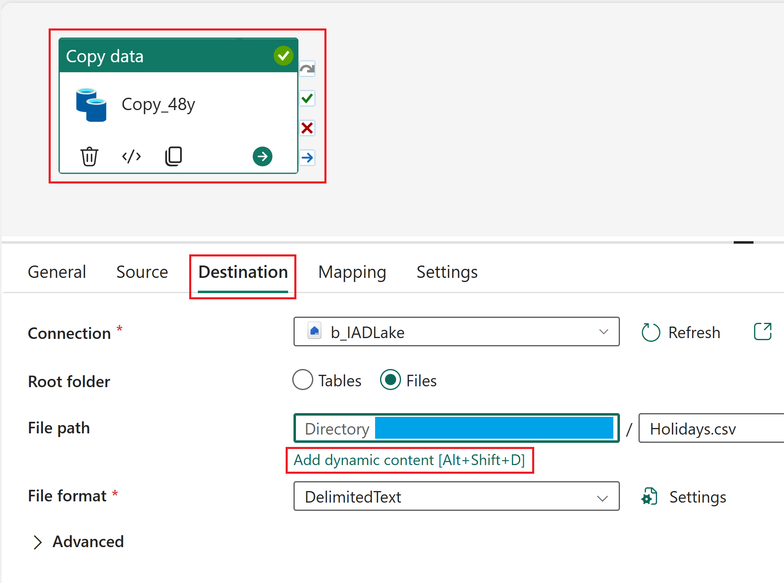

1. Within the Pipeline expression builder window, select the **Functions** tab. Here, you can explore various functions that exist within the expression library. These functions provide powerful tools for creating dynamic expressions. When you're ready, copy and paste the code block below into the expression input box. Press **Ok** when complete.

    **Note:** This expression will be used to create a folder structure within your pipeline that writes the file to nested folders based on the current year, the current month, and the current date of the run time. The forward slash "**/**" character is how the folder structure is defined. This dynamic folder structure helps in organizing your data based on the date, making it easier to manage and retrieve.

    ```text
    @formatDateTime(
        convertFromUtc(
            utcnow(), 'Central Standard Time'
        ),
        'yyyy/MM/dd'
    )
    ```

    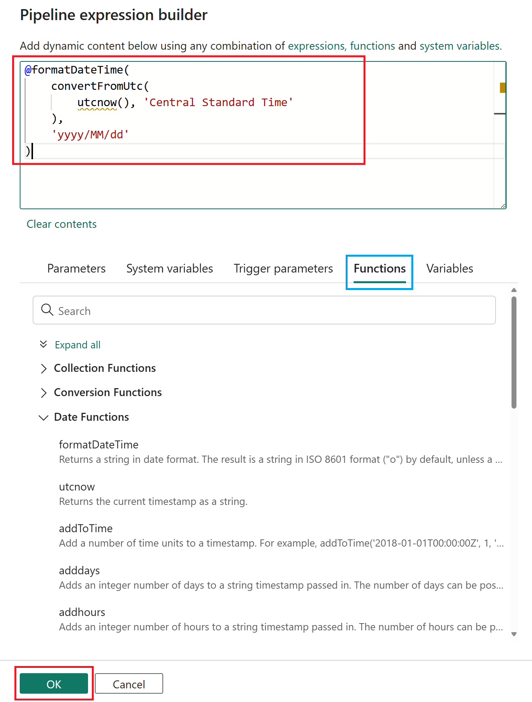

1. From the **Home** tab on the ribbon, select the **Validate** option once again.

    Select the **Run** option to start the pipeline and begin your data ingestion process. Running the pipeline initiates the data transfer from the source to the updated destination folder path.

    

1. Deselect any previously selected activities within the authoring canvas. The global properties and **Output** view will then become visible. After starting the run of your pipeline, both the **Pipeline status** and the **Activity status** should show a **Succeeded** status. This indicates that everything ran as intended, confirming that your data ingestion process was successful.

    

1. If we return to our previously created **b_IADLake** lakehouse item (either by selecting it on the left side rail if still open or by returning to the workspace item list to open), we can confirm that the **Holidays.csv** file has now been added to the Files section with a nested folder structure based on the year, month, and date of the run. This confirmation step ensures that the dynamic file output is working as intended and that your data is being organized correctly.

    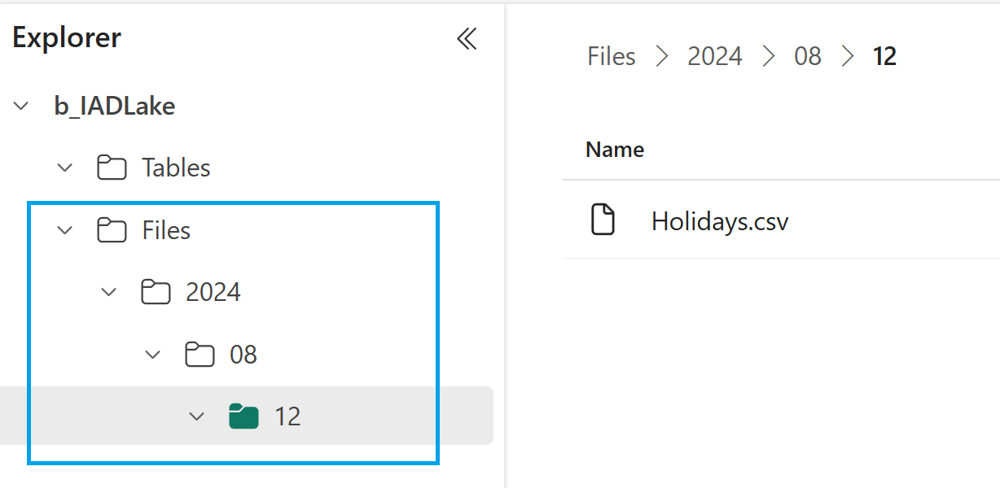

# Next steps

This conclusion of the lab has demonstrated how to get started with creating a task flow, a data pipeline, the copy activity, and the expression builder. By following these steps, you have gained practical experience in setting up and creating a data ingestion solution using Microsoft Fabric.

- Continue to the [Data pipeline](./DataPipeline.md) lab
- Return to the [Data Factory in a Day](./README.md) homepage