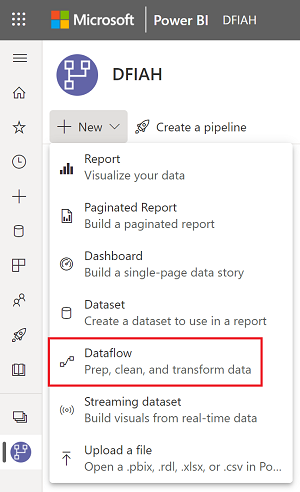

# Dataflows In An Hour 

Dataflows promote reusability of the underlying tables, preventing the need to create separate connections with your cloud or on-premise data sources. Dataflows allow users to seamlessly ingest and prepare data that can be widely reused by other users across the Power Platform including various Data Connectors, Data Transformations and other Power Query Online authoring enhancements.

## Prerequisites

For this workshop a **Power BI Pro** license and access to a workspace (recommended non-production) is required for dataflow creation. A workspace backed by either a **Premium Capacity** or **Premium Per User** will be noted when necessary.

# What is a dataflow?

A dataflow is a collection of tables that are created and managed in workspaces in the Power BI service. A table is a set of columns that are used to store data, much like a table within a database. You can add and edit tables in your dataflow, as well as manage data refresh schedules, directly from the workspace in which your dataflow was created.

[Learn More](https://docs.microsoft.com/en-us/power-bi/transform-model/dataflows/dataflows-introduction-self-service)

___

## Creating a dataflow

1. Navigate to the **[Power BI service](https://app.powerbi.com)**
2. Navigate to a group workspace, select **New** and select **Dataflow**

    ⚠ Important Note: Dataflows are not available within **My Workspace**

3. Within the **Define new tables** group select the **Add new tables** option.

## Connecting to a dataflow
1. Open Power BI Desktop

# Diagram view

The ‘Diagram View’ in Power Query reimagines self-service data prep and provides an interface to easily prepare and transform your data and visualize the data preparation process. This simplifies the experience for citizen data analysts to quickly create queries and understand the flow of data – both the ‘big picture view’ of how the queries are related and the ‘detailed view’ around specific data preparation steps within a query. We are very excited to share with you the public preview of the Visual data prep (Diagram View) within Power Query Online (e.g. within Power BI dataflows).

[Learn More]()

1. 

# Folding indicators

___

# Enhanced Compute tables

DirectQuery dataflows

# Cognitive Services [Optional]

With Cognitive Services in Power BI, you can apply different algorithms from Azure Cognitive Services to enrich your data in the self-service data prep for Dataflows.

#### Requirements:

Cognitive services are supported for Premium capacity nodes EM2, A2, or P1 and above. 

Cognitive services are also available with a Premium Per User (PPU) license.

[Learn More](https://docs.microsoft.com/en-us/power-bi/transform-model/dataflows/dataflows-machine-learning-integration)

___

# Continue Your Journey

### Dataflows best practices

This article provides a list of best practices, with links to articles and other information that will help you understand and use dataflows to their full potential.

Source: [Microsoft Docs](https://docs.microsoft.com/en-us/power-bi/transform-model/dataflows/dataflows-best-practices)