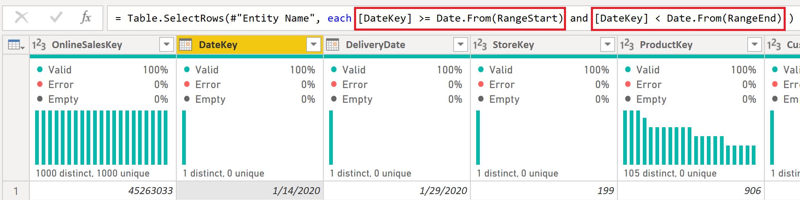

# Data Modeling

✏️ Lab scenario
---

For this portion of the lab, we've been tasked with creating a dataset that queries our data in **near-real time** for our report consumers. Based on these initial requirements we'll want to evaluate Power BI's storage mode options and monitor our performance to find the most optimal solution.

# Storage modes and data modeling

In Microsoft Power BI Desktop, we can specify the storage mode for each table individually in our model. Understanding the benefits of each storage mode can provide many advantages, including the following:

- Improved query performance
- Supporting the development of large datasets
- Faster dataset refreshes
- Enabling near-real time data

[Learn more about storage modes](https://docs.microsoft.com/power-bi/transform-model/desktop-storage-mode)

---

## DirectQuery

Models developed in DirectQuery mode don't import data. Instead, they consist only of metadata defining the model structure. When the model is queried, native queries are used to retrieve data from the underlying data source.

There are two main reasons to consider developing a DirectQuery model:

- When data volumes are too large - even when data reduction methods are applied - to load into a model, or practically refresh
- When reports and dashboards need to deliver "near real-time" data, beyond what can be achieved within scheduled refresh limits. (Scheduled refresh limits are eight times a day for shared capacity, and 48 times a day for a Premium capacity.)

    Learn more about [DirectQuery mode](https://docs.microsoft.com/power-bi/connect-data/service-dataset-modes-understand#directquery-mode) and [DirectQuery model guidance](https://docs.microsoft.com/power-bi/guidance/directquery-model-guidance)

---

1. One of the first things we might notice is that on our left side-rail the **Data** view is now missing and in the bottom right corner of Power BI Desktop is the text **Storage Mode: DirectQuery**.

    

1. To confirm that our connection to our dataflow is indeed working, we'll now add the following fields below into a **Table** visual to view data on a report page.

    | Table | field |
    |:----- | :------ |
    | DimCustomer_raw | EmailAddress|
    | DimCustomer_raw | Gender |

    

1. While the visual has rendered successfully, we want to confirm that the information is being sent to our source via a **Direct query**. To confirm we'll navigate to the **View** tab and then select **Performance analyzer**.

    

1. Once the **Performance analyzer** pane is visible, we'll now select **Start recording**.

    

1. With the **Performance analyzer** recording, we'll hover above the **Table** visual and select the **Analyze this visual** option to refresh a single visual. Once complete we'll select the expand/collapse box next to the **Table** visual to confirm that a **Direct query** value is now present. We can also now select the **Copy query** option and paste our query into a text editor of our choice.

    

1. From the copied query, we are able to view the **DAX Query** that was sent to the analysis services database engine.

    ```dax
    // DAX Query
    DEFINE
      VAR __DS0Core = 
        SUMMARIZE('DimCustomer_raw', 'DimCustomer_raw'[Gender], 'DimCustomer_raw'[EmailAddress])
    
      VAR __DS0PrimaryWindowed = 
        TOPN(501, __DS0Core, 'DimCustomer_raw'[Gender], 1, 'DimCustomer_raw'[EmailAddress], 1)
    
    EVALUATE
      __DS0PrimaryWindowed
    
    ORDER BY
      'DimCustomer_raw'[Gender], 'DimCustomer_raw'[EmailAddress]
    ```
---

<br>
<font size="6">Optional: Event traces</font>

 <b>Optional - Event traces</b>

One important item that was missing from our above query is the [Transact-SQL](https://docs.microsoft.com/learn/modules/introduction-to-transact-sql/) statement for the **Direct query** value. In order to trace this event we'll leverage [SQL Server Profiler](https://docs.microsoft.com/sql/tools/sql-server-profiler/sql-server-profiler) to view our event traces.

We can also leverage the [external tools in Power BI Desktop](https://docs.microsoft.com/power-bi/transform-model/desktop-external-tools) integration to easily view the event traces against our underlying Analysis Services instance.

<br>
<font size="4">Register SQL Server Profiler external tool</font>


1. Download and install [SQL Server Management Studio](https://docs.microsoft.com/en-us/sql/ssms/download-sql-server-management-studio-ssms).

1. Download the registered external tool [SQL Server Profiler External Tools](https://raw.githubusercontent.com/microsoft/pbiworkshops/main/Day%20After%20Dashboard%20in%20a%20Day/Source_Files/SQLProfiler.pbitool.json) (json) file. (Courtesy of Microsoft MVP [Steve Campbell](https://mvp.microsoft.com/PublicProfile/5004099))

1. After the above is downloaded add the local file (SQLProfiler.pbitool.json) to the below file path location. Once complete close and restart your Power BI Desktop application.

    ```
    C:\Program Files (x86)\Common Files\Microsoft Shared\Power BI Desktop\External Tools
    ```
[Learn more about external tools](https://docs.microsoft.com/power-bi/transform-model/desktop-external-tools)

<br>
<font size="4">DirectQuery events</font>

1. From the **Trace Properties** window select the **Events Selection** tab. Within the **Events** section, expand the **Query Processing** group and then select the **DirectQuery End** event. Once complete select the **Run** option in the bottom right to start tracing events.

    

1. We'll now return to the Power BI Desktop application and select the **Analyze this visual** option again to send a query to our source.

    

1. Returning to the **SQL Server Profiler** application, a **DirectQuery end** event is now displayed including the **Text data** of the SQL query generated by Power BI, the total time it took to return a result with the **Duration** and more.

    

    ```sql
    SELECT
        TOP (501) [t1].[EmailAddress],
        [t1].[Gender]
    FROM
        [DimCustomer_raw] AS [t1]
    GROUP BY
        [t1].[EmailAddress],
        [t1].[Gender]
    ORDER BY
        [t1].[Gender] ASC,
        [t1].[EmailAddress] ASC
    ```

<font size="6">✅ Lab check</font>

We've been able to confirm that as our Power BI visuals are being rendered our query will be instantly sent to our data source to retrieve new insights. With this initial requirement met, let's continue and start connecting our tables to create a dimensional model.

---

## Relationships

When using multiple tables, chances are you'll do some analysis using data from all those tables. Relationships between those tables are necessary to accurately calculate results and display the correct information in your reports.

Learn more about [creating and managing relationships](https://docs.microsoft.com/power-bi/transform-model/desktop-create-and-manage-relationships)

---

1. Navigate to the model view on the side-rail

    

1. To create a relationship between two of our tables, we'll drag-and-drop the following field values from the table listed below.
    1. If we hover above our table's headers we'll also get important details related to the **Storage mode**, **Data source type**, **Server name** and a visual indicator in the top left which provides indicates the **Storage mode** which in this example is **DirectQuery**.

    | Table | field |
    |:----- | :------ |
    | DimCustomer_raw | CustomerKey|
    | FactOnlineSales | CustomerKey |

    

1. From the **Create relationship** window, we can confirm that the **CustomerKey** field is selected within each table (as noted by the darker shade). Once validated we can select **OK** to proceed.

    

1. Returning now to the report page view, we'll complete the following steps.
    1. From the **FactOnlineSales** table add the **SalesAmount** field.
    1. Select the **Clear** option in the **Performance analyzer** pane to remove previous events.
    1. Select the **Analyze this visual** to test the performance of the added field.
    
    

1. **Optional:** Returning to the **SQL Server Profiler** application, we can locate the **DirectQuery end** event with the **Text data** display of the SQL query generated when using data across multiple tables. In this example a [**LEFT OUTER JOIN**](https://docs.microsoft.com/sql/relational-databases/performance/joins?view=sql-server-ver15#fundamentals) is used.

    

    ```sql
    SELECT
        TOP (1000001) *
    FROM (
        SELECT
            [t1].[EmailAddress],
            [t1].[Gender],
            SUM([t0].[SalesAmount]) AS [a0]
        FROM (
            [FactOnlineSales] AS [t0]
            LEFT OUTER JOIN [DimCustomer_raw] AS [t1]
            ON ([t0].[CustomerKey] = [t1].[CustomerKey])
        )
        GROUP BY
            [t1].[EmailAddress],
            [t1].[Gender]
    ) [MainTable]
    WHERE (NOT( ([a0] IS NULL)))
    ```

1. Since all of our sales include a customer key, we can improve our performance by changing the default join. We'll navigate now to the **Modeling** tab and select the **Manage relationships** option.

    

1. In the **Manage relationships** dialog window select the **Edit...** option.
    1. You can also double click to enter the relationship view.

    

1. In the **Edit relationship** dialog window select the checkbox next to the [**Assume referential integrity**](https://docs.microsoft.com/power-bi/connect-data/desktop-assume-referential-integrity) property, then **OK** and close the **Manage relationships** window to return to the report page.

    

1. Returning to our report page, we'll complete the following steps.
    1. Select the **Clear** option in the **Performance analyzer** pane to remove previous events.
    1. Select the **Analyze this visual** to test the performance of the added field.

    

1. **Optional:** Returning to the **SQL Server Profiler** application, we can locate the **DirectQuery end** event with the **Text data** display of the SQL query generated using an [**INNER JOIN**](https://docs.microsoft.com/sql/relational-databases/performance/joins?view=sql-server-ver15#fundamentals).

    

    ```sql
    SELECT
        TOP (1000001) *
    FROM (
        SELECT
            [t1].[EmailAddress],
            [t1].[Gender],
            SUM([t0].[SalesAmount]) AS [a0]
        FROM (
            [FactOnlineSales] AS [t0]
            INNER JOIN [DimCustomer_raw] AS [t1]
            ON ([t0].[CustomerKey] = [t1].[CustomerKey])
        )
        GROUP BY
            [t1].[EmailAddress],
            [t1].[Gender]
    ) [MainTable]
    WHERE (NOT( ([a0] IS NULL)))
    ```

1. Returning to the **Model** view we'll create the below relationships by dragging and dropping our fields and setting the necessary configurations within the **Edit relationship** window.
    1. We can also create relationships between tables by selecting the **Manage relationships** button from the **Home** tab and then **New...** option in the bottom left.

    | Active | From: Table (field) | field | Cardinality | Assume referential integrity | Cross filter direction | 
    | :----- |:----- | :------ | :----- | :----- | :----- |
    | ☑ | DimCustomer_raw (GeographyKey) | DimGeography_raw (GeographyKey) | Many to one (*:1) | ☑ | Single |
    | ☑ | DimEmployee (StoreKey) | DimStore (StoreKey) | Many to one (*:1) | ☑ | Both |
    | ☑ | DimProduct_raw (ProductSubcategoryKey) | DimProductSubcategory_raw (ProductSubcategoryKey) | Many to one (*:1) |  | Single |
    | ☑ | DimProductSubcategory_raw (ProductCategoryKey) | DimProductCategory_raw (ProductCategoryKey) | Many to one (*:1) | ☑ | Single |
    | ☑ | FactOnlineSales (CustomerKey) | DimCustomer_raw (CustomerKey) | Many to one (*:1) | ☑ | Single |
    | ☑ | FactOnlineSales (ProductKey) | DimProduct_raw (ProductKey) | Many to one (*:1) | ☑ | Single |
    | ☑ | FactOnlineSales (StoreKey) | DimStore (StoreKey) | Many to one (*:1) | ☑ | Single |
    | ☑ | FactOnlineSales (DateKey) | DimDate (DateKey) | Many to one (*:1) | ☑ | Single |
    |  | FactOnlineSales (DeliveryDate) | DimDate (DateKey) | Many to one (*:1) | ☑ | Single |


1. Within the Modeling view's **Properties** pane, set both the **Show the database in the header when applicable** and **Pin related fields to top of card** options to **Yes**.

    

<font size="6">✅ Lab check</font>

We've been able to create relationships between all of our data source's tables and a new requirement has come in that our data model has to be both - **near-real time** and **blazing fast**. 

For this we'll want to revisit the design of our model.

---

## Dimensional modeling

A well-structured model design should include tables that are either dimension-type tables or fact-type tables and should avoid mixing the two types together into a single table.

- **Dimension tables** describe business entities — the things you model.
    - Entities can include products, people, places, and concepts including time itself.
    - The most consistent table you'll find in a star schema is a **date** dimension table. 
    - A dimension table contains a key column (or columns) that acts as a unique identifier, and descriptive columns.

- **Fact tables** store observations or events, and can be sales orders, stock balances, exchange rates, temperatures, etc.
    - A fact table contains dimension key columns that relate to dimension tables, and numeric measure columns. 
    - The dimension key columns determine the dimensionality of a fact table, while the dimension key values determine the granularity of a fact table. For example, consider a fact table designed to store sale targets that has two dimension key columns Date and ProductKey. 
    - It's easy to understand that the table has two dimensions. The granularity, however, can't be determined without considering the dimension key values. In this example, consider that the values stored in the Date column are the first day of each month. In this case, the granularity is at month-product level.

It is also recommend to strive to deliver the **right number of tables** with the **right relationships** in place.

[Learn more about the star schema and the importance for Power BI](https://docs.microsoft.com/power-bi/guidance/star-schema)

---

1. Navigate to the model view on the side-rail.

    

1. In our modeling view, we notice some [snowflaked dimensions](https://www.kimballgroup.com/data-warehouse-business-intelligence-resources/kimball-techniques/dimensional-modeling-techniques/snowflake-dimension/) between the following tables:
    1. **DimCustomer_raw** to **DimGeography_raw**
    1. **DimProductCategory_raw** to **DimProductSubcategory_raw** and **DimProductCategory_raw** tables

    

    This type of modeling approaching may affect the duration of our datasets queries and could ultimately lead to reduced performance. To better optimize our model let's update our model to leverage the tables within our dataflow where we've already merged our tables into a correct view of our data.

1. Within them model view we'll select the vertical ellipses ( ⋮ ) at the top right of the **DimProduct_raw** table and then the **Edit query** option to return to the Power Query Editor.
    1. Important you can also right click the table header as opposed to selecting the ellipses.

    

1. In the Power Query Editor - **Queries** pane we'll update the following queries to our merged table from the previous [**Data Preparation**](https://github.com/microsoft/pbiworkshops/blob/main/Day%20After%20Dashboard%20in%20a%20Day/DataPreparation.md#joining-tables-using-the-diagram-view) lab instructions.
    
    1. We'll start by selecting the **DimProduct_raw** query and then complete the following.
        1. In the **APPLIED STEPS** next to the **Navigation** step select the settings icon.
        1. Within the **Navigation** window, we'll now select **Workspaces** to view our dataflows stored within the Power BI service.
            1. The Environments option, shows dataflows created with Power Apps.
        1. We can now navigate to the workspace location where we created and saved our dataflows from the data preparation lab instructions. Once found we'll then expand our dataflow to view all the available tables and update our selection to the **DimProduct** table.
        1. Within the **Query Settings** pane, update the **Name** value to now simply be titled **DimProduct**.

        

    1. Now select the **DimCustomer_raw** table where we'll try a different approach by leveraging our formula bar. Within the **Query Settings** pane's **APPLIED STEPS** section, select the **Navigation** step and complete the following before and after below to remove the **"_raw"** suffix.

    | Before | After |
    | :-- | :-- |
    |= #"Dataflow Id"{[entity="**DimCustomer_raw**",version=""]}[Data] | = #"Dataflow Id"{[entity="**DimCustomer**",version=""]}[Data] |

    

1. Within the **Queries** pane right click the **DimCustomer_raw** table and select the **Rename** option to update the table names to now simply be titled **DimCustomer**:

    

1. Within the **Queries** pane while holding ctrl on your keyboard (or shift if they are adjacent), click the following tables listed below and then right click to select the **Delete** option to bulk remove the tables from our dataset.
    1. DimGeography_raw
    1. DimProductCategory_raw
    1. DimProductSubcategory_raw

    

1. Now that we're ready to return to our modeling view navigate to the **Home** tab and select the **Close & Apply** option.

    

1. Returning to the **Model** view, our tables now resemble a star with our fact table, maintaining all of our sales records and our dimension tables which are then used to filter our results.

    

<font size="6">✅ Lab check</font>

We've been able to properly model our dataset into a proper star schema but a new requirement has come in that our data model has to be both - **near-real time** and **blazing fast**. For this we'll want to revisit our storage mode options and determine if each of our tables are configured properly.

---
## Mixed (Composite) mode

With mixed (composite) mode we can mix both Import and DirectQuery modes into a single model. Models developed in composite mode support configuring the storage mode as Import, DirectQuery, or Dual for each table.

A table configured as dual storage mode is both Import and DirectQuery, depending upon the query. This allows Power BI to determine the most efficient mode to use on a query-by-query basis.

[Learn more about composite mode](https://docs.microsoft.com/power-bi/connect-data/service-dataset-modes-understand#composite-mode)

---

1. Within the **Model** view, we'll select the following tables listed below by holding ctrl on our keyboard, navigating to the **Properties** pane and expanding the **Advanced** options. For the **Storage mode** option select the drop down and update the selection to **Import**.
    1. DimDate
    1. DimProduct
    1. DimStore
    1. DimEmployee

    

1. Within the **Storage mode** window is some very important text that changing our tables from DirectQuery is an irreversible operation and the recommendation that instead of setting the tables to **Import** that we should leverage the **Dual** storage mode so that our returned values can either be **Import** or **DirectQuery** mode depending upon the queries being submitted.

    

1. Returning to the **Model** view, there are new icons available within our tables representing **Dual** storage mode for our **DimProduct**, **DimDate** and **DimStore** tables. Our **DimEmployee** table also has an icon indicating that it is an **Import** only storage mode.

    

1. On the side-rail we now see three options - **Report**, **Data** and **Model** view. With the data view we can now view imported and cached data within our Power BI file. For now, let's select the **Report** view to continue.

    

1. On the report canvas we'll create a new table and add the following columns from the tables below to test the performance of our **Dual** and **Import** tables.

    | Table | Column | Storage Mode |
    | :---- | :----- | :----- |
    | DimStore | StoreName| Dual | 
    | DimEmployee | EmailAddress | Import | 
    
    

1. With results returned almost instantly, we want to understand if our query is being sent to our source via **Direct query** or if it's able to be successfully completed all thru an imported cache. To confirm we'll navigate to the **View** tab and then select **Performance analyzer**.

    

1. Once the **Performance analyzer** pane is visible, we'll now select **Start recording**.

    

1. Select the **Analyze this visual** button above the table visual and once complete, expand the **Table** object in the **Performance analyzer** pane. We can now review our results, and determine that there is no longer a **Direct query** entry.

    This means that Power BI was able to determine that we had the available data stored in-memory to satisfy our query and that we did not need return to our data source to directly obtain our results.

    

1. On the report canvas we'll create another new table and add the following columns from the tables below to test the performance between **Dual** and **DirectQuery** tables.

    | Table | Column | Storage Mode |
    | :---- | :----- | :----- |
    | DimStore | StoreName| Dual | 
    | FactOnlineSales | SalesAmount | DirectQuery |

    

1. Select the **Analyze this visual** button above the table visual and once complete, expand the new **Table** object in the **Performance analyzer** pane. We can now review our results, and determine that a **Direct query** entry is once again present.

    This means that Power BI was able to determine that we only a partial amount of data stored in-memory from our DimStore table and that it would need to transition our query to a DirectQuery method to satisfy our results.

    

1. **Optional:** Returning to the **SQL Server Profiler** application, we can locate the **DirectQuery end** event and review the SQL query that will be sent to our data source.

    

    ```sql
    SELECT 
      TOP (1000001) * 
    FROM 
      (
        SELECT 
          [t4].[StoreName], 
          SUM([t0].[SalesAmount]) AS [a0] 
        FROM 
          (
            [FactOnlineSales] AS [t0] 
            INNER JOIN [DimStore] AS [t4] on (
              [t0].[StoreKey] = [t4].[StoreKey]
            )
          ) 
        GROUP BY 
          [t4].[StoreName]
      ) AS [MainTable] 
    WHERE 
      (
        NOT(
          ([a0] IS NULL)
        )
      )
    ```

<font size="6">✅ Lab check</font>

We've been able to create a proper data model and tested different storage modes. After speaking directly with our end users we learned they would rather have **blazing fast** performance as the reports prepare them for their business day so they need to be able to quickly slice-and-dice their insights.

We've also learned that new information only comes in overnight and as long as this information can be made fully available before they start their morning. The request for **near real-time** meant as soon as its available, as opposed to the previous wait period in the prior reporting solution.

---

## Import mode

Import mode is the most common mode used to develop datasets. This mode delivers extremely fast performance thanks to in-memory querying. It also offers design flexibility to modelers, and support for specific Power BI service features (Q&A, Quick Insights, etc.). Because of these strengths, it's the default mode when creating a new Power BI Desktop solution.

It's important to understand that imported data is always stored to disk. When queried or refreshed, the data must be fully loaded into memory of the Power BI capacity. Once in memory, Import models can then achieve very fast query results. It's also important to understand that there's no concept of an Import model being partially loaded into memory.

When refreshed, data is compressed and optimized and then stored to disk by the VertiPaq storage engine. When loaded from disk into memory, it's possible to see 10x compression. So, it's reasonable to expect that 10 GB of source data can compress to about 1 GB in size. Storage size on disk can achieve a 20% reduction from the compressed size. (The difference in size can be determined by comparing the Power BI Desktop file size with the Task Manager memory usage of the file.)

Design flexibility can be achieved in three ways. Data modelers can:

Integrate data by caching data from dataflows, and external data sources, whatever the data source type or format
Leverage the entire set of Power Query Formula Language (informally referred to as M) functions when creating data preparation queries
Leverage the entire set of Data Analysis Expressions (DAX) functions when enhancing the model with business logic. There's support for calculated columns, calculated tables, and measures.

[Learn more about import mode](https://docs.microsoft.com/power-bi/connect-data/service-dataset-modes-understand#import-mode)

---

1. Navigate to the model view on the side-rail.

    

1. Within the model diagram view on the keyboard press **Ctrl+A** to select all tables (you can also hold ctrl and click to select them individually). Within the **Properties** pane expand the **Advanced** options and within the **Storage mode** option select **Import** to update all of our tables.

     

1. Within the **Storage mode** window is a warning letting us know that **Setting our storage mode to Import is an irreversible operation. You will not be able to switch it back to DirectQuery.** - select **OK** to procee.

    Understanding our business requirements fully now, we recognize that **Import** will give us the blazing-fast performance to create an enjoyable experience for our end users as they slice-and-dice information and we can meet the overall data freshness requirements through a scheduled refresh of our results each day.

    

1. Select the **Report** view to return to the report canvas.

    

1. From our previous sales by store table visual select the **Analyze this visual** button above the table visual once again and once complete, expand the new **Table** object in the **Performance analyzer** pane. We can now review our results, and determine that only a **DAX query** entry is present.

    This means that Power BI was able to determine that we have all of the available data stored in-memory to satisfy our queries requirements now.

    

<font size="6">✅ Lab check</font>

At this stage in our projects development we've explored several potential benefits of each storage mode, ultimately though the most important thing we learned was that had we gone to our business users and understood their requirements directly we could choose the right solution to meet their needs.

Important questions we should ask next time:
- How often is the data updated?

---

## Incremental Refresh


1. From the **Home** tab of the **Power Query Editor** select the **Manage Parameters** and then the **New Parameter** option.

    

1. From the **Manage Parameters** window, select the **New** button and create the below two values.
    1. **Important Note**: these are case sensitive, reserved keywords and must match exactly for incremenetal refresh to properly work.

    | Name | Type | Current Value |
    |:----- | :------ | :------ |
    | RangeStart | Date/Time | 1/1/2020 |
    | RangeEnd | Date/Time | 12/31/2022 |

    

1. From the **FactOnlineSales** table, select the **DateKey** field's drop down in the top right corner, the **Number Filters** option and then the **Between** value.

    

1. Within the **Filter Rows** menu, set the following values below.

    Keep rows where 'DateKey'
    | Keep Rows | |
    |:- | :- |
    | is greater than or equal to | 1/1/2020 |
    | is less than | 12/31/2022 |

    

    ⚠️ **Important** ⚠️

    Because our column type is **Date** and the parameters are required to be **DateTime** we were unable to select them within the dialog window and must populate them manually. In the following step will we will edit the formula bar to utilize our parameters and transform our values to extract only the date part.

1. In the **Power Query Editor** formula bar update the current date values to utilize the **RangeStart** and **RangeEnd** parameters by updating the formula to the below.

    ```powerquery-m
    = Table.SelectRows(#"Entity Name", each [DateKey] >= Date.From(RangeStart) and [DateKey] < Date.From(RangeEnd))
    ```

    

1. Now that we're ready to return to our modeling view navigate to the **Home** tab and select the **Close & Apply** option.

    

1. Navigate to the **Model** view on the side-rail of Power BI Desktop, where we'll now setup our incremental refresh policy on the **FactOnlineSales** table.

    

1. Either select the vertical ellipses ( ⋮ ) in the top right corner of the **FactOnlineSales** and or right click the table title and then select **Incremental refresh** option.

    

1. From the **Incremental refresh and real-time data** menu, set the following configurations below and select **Apply** once complete.
    1. ☑️Incrementally refresh this table
    1. Archive data starting **2 Years** before refresh date
    1. Incrementally refresh data starting **1 year** before refresh date

    

    ⚠️ **Important** ⚠️

    At the top of the Incremental refresh and real-time data window is the information section that states, **you won't be able to download it back to Power BI Desktop** once an incremental refresh policy has been applied. For this reason, we should ensure that our dataset is in a completed state prior to publishing, otherwise a full dataset refresh will be required for any subsequent re-publishing.

---

# Model properties

An important aspect of data modeling is usability.

---

1. Select the **Model** view and update the following table properties with the instructions below for each:
    1. From the **Fields** pane select the Previous Table Name from the list.
    1. In the **Properties** pane update the **Name**, **Description** and **Key column** fields.

    | Previous Table Name | Name | Description | Key column |
    | :---- | :---- | :---- | :---- |
    | DimCustomer | Customers | Contains customer information including address and contact details.  | CustomerKey |
    | DimDate | Calendar | Contains the organizational calendar including any custom days, weeks, months and years. | DateKey |
    | DimEmployee | Employees | Contains all employee information including address and contact details. | EmployeeKey |
    | DimStore | Stores | Contains all store information including address and contact details. | StoreKey |
    | DimProduct | Products | Contains all product information including descriptions and categorization. | ProductKey | 
    | FactOnlineSales | Online Sales | Contains all online sales transactions including quantities and amounts.  | OnlineSalesKey |
    
    

1. If we hover above the **Table** properties in any of the **Report**, **Data** or **Model** views we will now see the description field available in a tooltip. 
    1. The **Description** value can also be populated for columns/fields and measures upon active selection.
    1. For end users the **Description** fields will be available in various client applications and experiences ensuring they have a proper understanding of the property.

    

---

# Data Analysis Expressions

---

# Security

---

# Publish to Power BI

1. From the **Home** tab, select the **Publish** icon and navigate to a non-production workspace as our destination and select the **Select** button when complete.
    1. <i>This can also be the same workspace used in the data preparation lab.</i>

    

    ⚠️ **Important** ⚠️

    For enterprise scenarios, a recommended architectural approach may be to separate dataflows, datasets and reports into separate workspaces designated for specific use. For the purposes of this workshop we've edited/published all Power BI items in the same workspace to maintain simplicity of lab instructions.
    
    Learn more about [managed self-service BI](https://learn.microsoft.com/power-bi/guidance/powerbi-implementation-planning-usage-scenario-managed-self-service-bi) and for a complete overview [Power BI implementation planning](https://learn.microsoft.com/power-bi/guidance/powerbi-implementation-planning-introduction)

---

# Next steps
We hope this portion of the lab has shown how various storage modes and modeling options can offer a flexible and optimized experience to build enterprise scalable solutions using Power BI Desktop.

- Continue to the [Data Visualization](./DataVisualization.md) lab
- Return to the [Day After Dashboard in a Day](./README.md) homepage