# Data Modeling

✏️ Lab scenario
---

For this portion of the lab, we've been tasked with creating a dataset that queries our data in **near-real time** for our report consumers. Based on these initial requirements we'll want to evaluate Power BI's storage mode options and monitor our performance to find the most optimal solution.

---

## Create a semantic model

The data we've loaded is almost ready for analytical reporting we'll use the SQL endpoint to create relationships and SQL views in our lakehouse to create our semantic model. A semantic model, which is a metadata model that contains physical database objects that are abstracted and modified into logical dimensions. It's designed to present data for analysis according to the structure of the business.

---

### Query data using the SQL endpoint

We'll begin by enabling the setting to allow for editing data models in the cloud service.

1. Click the **Workspace settings** option within the workspace.

    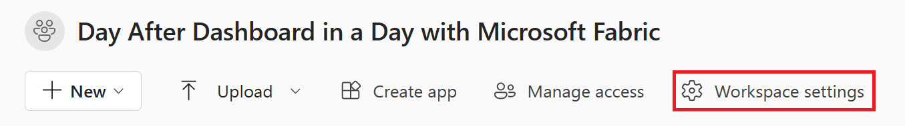

1. In the **Workspace settings** pane, navigate to the **Power BI** groups **General** tab and check **Users can edit data models in the Power BI service (preview)**.

    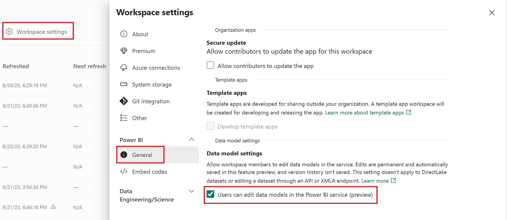

1. Back in the workspace view, select the **Lakehouse** item named **SalesLakehouse**.

    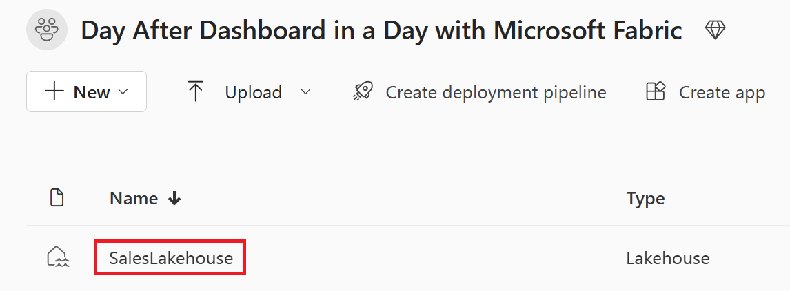

1. Once in the lakehouse explorer, we'll select the **Lakehouse** button in the top right and select the **SQL endpoint** to switch to the warehouse editor.

    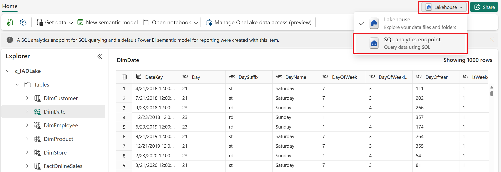

    > [!NOTE]
    > You can also select the SQL Endpoint item from the workspace item list to go directly to the Warehouse editor.
    > You can also create a **New Power BI dataset** directly from the Lakehouse editor.

1. In the **Explorer** pane select the ellipses **(...)** next to the **DimCustomer** table, then **New SQL query** and **Select Top 100**.

    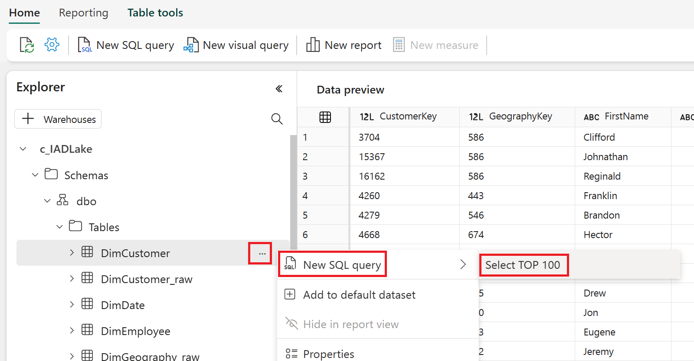

1. In the query editor a SELECT TOP (100) query was written for us, we could either save this as a view within our warehouse or modify the statement. For now we'll highlight the full query txt and select the **Visualize results** option.

    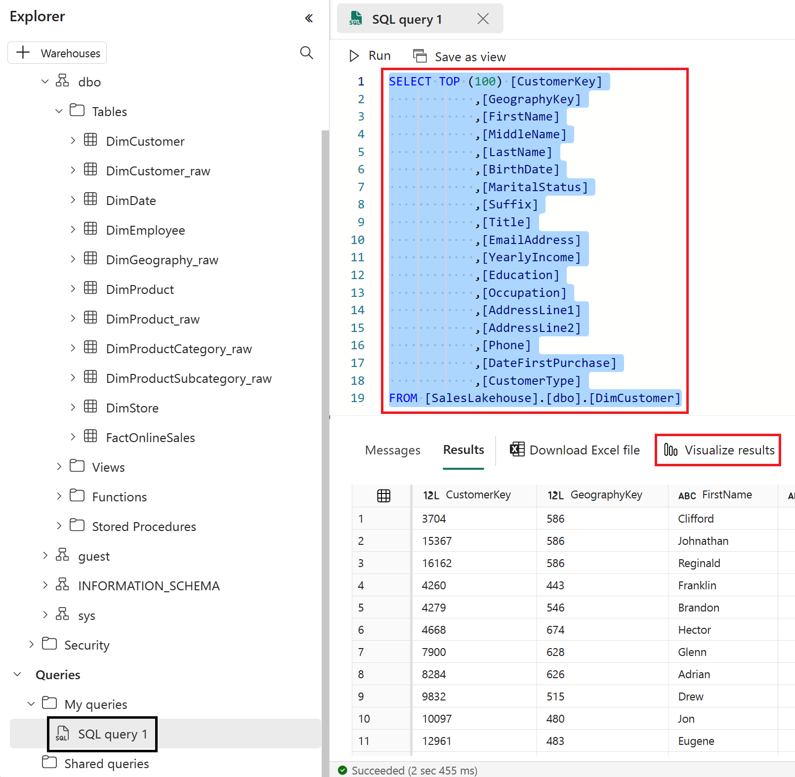

    > [!NOTE]
    > Your queries will be saved in the **My queries** group, if you want to share these queries with the creators you collaborate with in your workspace, you can right click them and select the option **Move to shared queries** to move them to the **Shared queries** section.

1. Within the **Visualize results** window select **Continue**.

    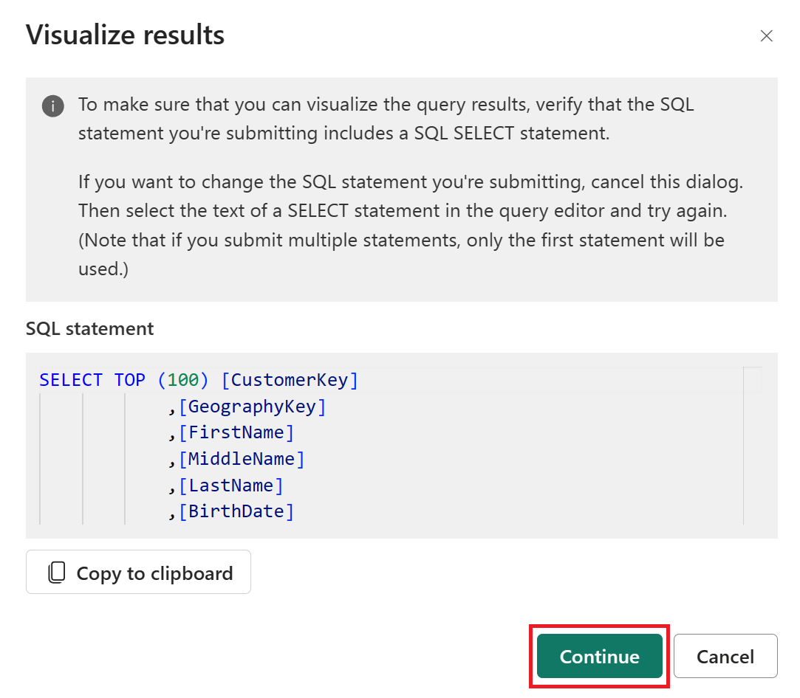

1. We're now able to drag and drop fields from our ad-hoc query and design a report with Power BI visuals. For now though, we'll select **Cancel**.

    > [!IMPORTANT]
    > If you were to save this report, the resulting dataset would be in a **DirectQuery** connectivity mode and would not leverage the **Direct Lake** mode.

    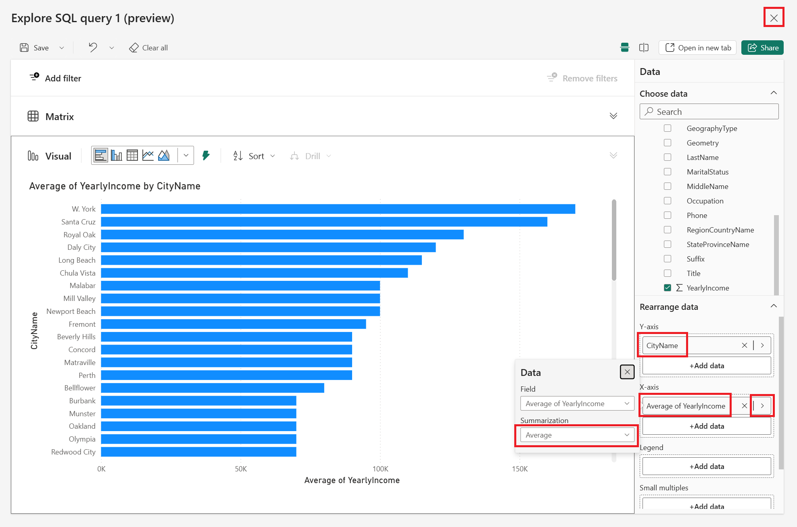

<font size="6">✅ Lab check</font>

With the SQL endpoint we are able to run ad-hoc SQL queries atop of our tables and visualize our results using DirectQuery mode all within a browser session. In the next section we want to focus on modeling our data and preparing it for analysis.

### Create relationships

In this section of the lab we are creating a star schema model, which is commonly used in data warehouses. In this model, the center of the star is a **Fact** table, and the surrounding tables are called **Dimension** tables, which are related to the Fact table with relationships.

It is also recommend to strive to deliver the **right number of tables** with the **right relationships** in place.

[Learn more about the star schema and the importance for Power BI](https://docs.microsoft.com/power-bi/guidance/star-schema)

---

1. From the ribbon, select **Reporting** and then **New semantic model**.

    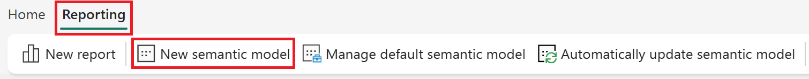

    > [!NOTE]
    > The **New semantic model** option is also visible from the Lakehouse explorer's **Home** tab.

1. In the **New dataset** window, update the **Name** to **SalesDirectLakeModel**. Seelct the following objects listed below and then click **Confirm**:

    | Object Name |
    | :-- |
    | DimCustomer |
    | DimDate |
    | DimEmployee |
    | DimProduct |
    | DimStore |
    | FactOnlineSales |

    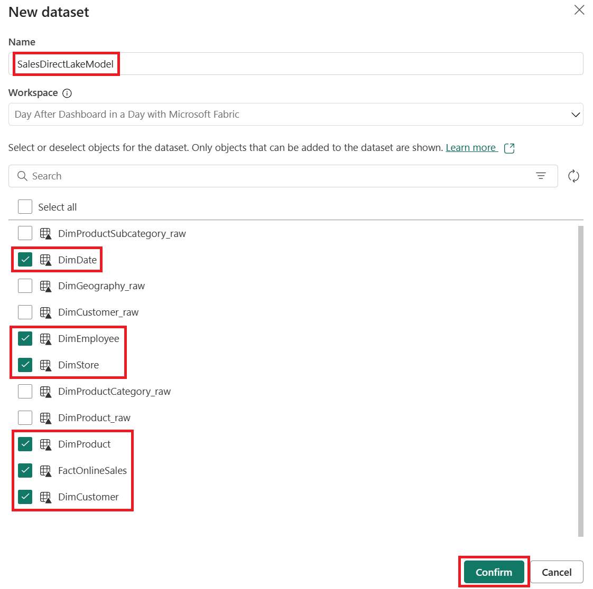

    > [!NOTE]
    > A new browser window will open with the created dataset. If you have pop-ups disabled, return to your workspace and open the dataset by selecting its name and then the ellipses **(...)** and **Open data model**.

1. Once in the model view, create a relationship between the **FactOnlineSales** table and the **DimCustomer** table by dragging and dropping the column **CustomerKey** from the **FactOnlineSales** table to the **CustomerKey** on the **DimCustomer** table.

    

1. From the **Create Relationship** window, ensure that you have selected the correct tables, columns and settings as showing in the following table. Click **Confirm** to continue.

    | Make this relationship active | From: Table 1 (column) | To: Table 2 (column) | Cardinality | Assume referential integrity | Cross filter direction |
    | :----- |:----- | :------ | :----- | :----- |  :----- | 
    | ☑ | FactOnlineSales (CustomerKey) | DimCustomer (CustomerKey) | Many to one (*:1) | ☑ | Single |

    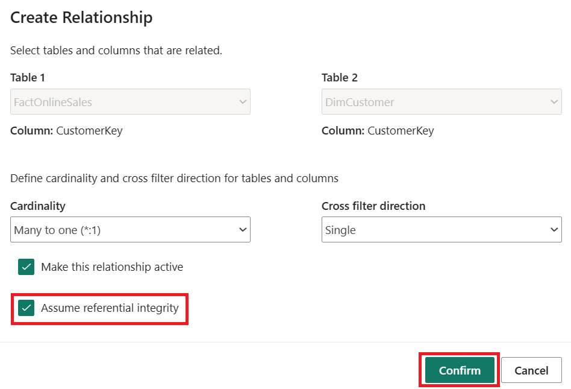

    > [!IMPORTANT]
    > The **Assume referential integrity** selection, enables running more efficient queries by using INNER JOIN statements rather than OUTER JOIN. This feature is only available when using Direct Lake and DirectQuery connectivity modes.
    > Learn more about [Referential integrity](https://docs.microsoft.com/power-bi/connect-data/desktop-assume-referential-integrity)

1. From the **Home** tab, select the **Manage relationships** option, and for each of the items listed below select **New relationship** and configure the relationships for each of the remaining tables and columns. Once complete select **Close**.

    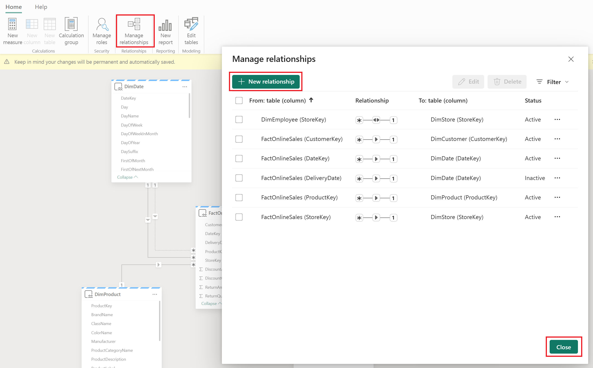

    | Make this relationship active | From: Table 1 (column) | To: Table 2 (column) | Cardinality | Assume referential integrity | Cross filter direction |
    | :----- |:----- | :------ | :----- | :----- | :----- |
    | ☑ | FactOnlineSales (ProductKey) | DimProduct (ProductKey) | Many to one (*:1) | ☑ | Single |
    | ☑ | FactOnlineSales (StoreKey) | DimStore (StoreKey) | Many to one (*:1) | ☑ | Single |
    | ☑ | FactOnlineSales (DateKey) | DimDate (DateKey) | Many to one (*:1) | ☑ | Single |
    |  | FactOnlineSales (DeliveryDate) | DimDate (DateKey) | Many to one (*:1) | ☑ | Single |
    | ☑ | DimEmployee (StoreKey) | DimStore (StoreKey) | Many to one (*:1) | ☑ | Both |

     The following image shows a finished view of the semantic model with all the created relationships included.

    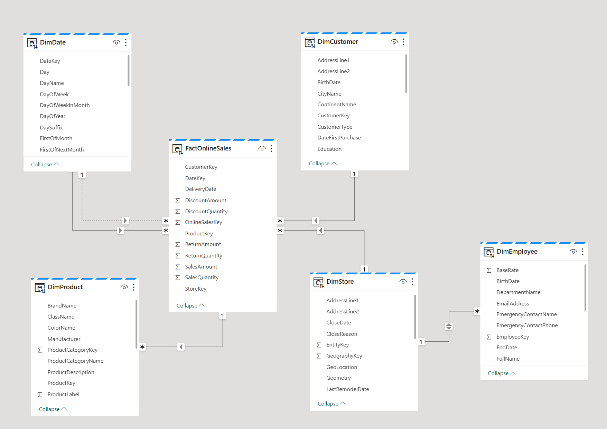

    > [!NOTE]
    > The DimDate table is a "role playing dimension", which  is a dimension that can filter related facts differently. At query time, the "role" of the dimension is established by which fact column you use to join the tables.
    > Learn more about [role-playing dimensions](https://learn.microsoft.com/power-bi/guidance/star-schema#role-playing-dimensions)

1. In the **Properties** pane, locate the **Pin related fields to top of card** option and set it to **Yes**. This will display the relationship keys at the top of each table, making it easier to visually inspect them.

    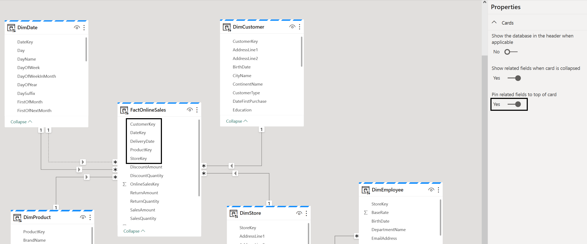

<font size="6">✅ Lab check</font>

We've been able to properly model our dataset into a proper star schema using Direct Lake but that is both near-real time and blazing fast.

## Writing DAX (Data Analysis Expresssion) formulas

Data Analysis Expressions (DAX) is a library of functions and operators that can be combined to build formulas and expressions in Microsoft Fabric, Power BI, Analysis Services, and Power Pivot in Excel data models.

Learn more about [DAX](https://learn.microsoft.com/dax/)

---

1. To create a new measure in the FactOnlineSales table, follow these steps:

    - Select the **FactOnlineSales** table in the **Tables** list.
    - On the **Home** tab, select **New measure**.

    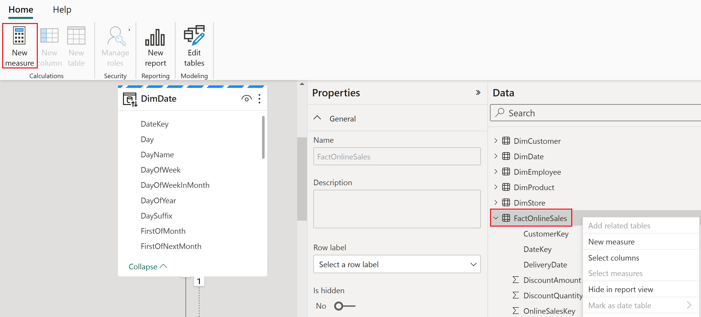

    > [!NOTE]
    > You can also right click the table name and select **Create measure** from the options menu.

1. In the formula editor, copy and paste or type the following measure to calculate the total sales amount. Select the **check mark** to commit.

    ```dax
    Total Sales Amount = SUM(FactOnlineSales[SalesAmount])
    ```

    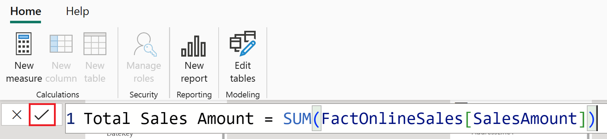

1. Perform these same steps for each of the formulas below. Once complete, all three measures will now be located in the **FactOnlineSales** table.

    ```dax
    Total Items Discounted = SUM(FactOnlineSales[DiscountQuantity])
    ```

    ```dax
    Total Return Items = SUM(FactOnlineSales[ReturnQuantity])
    ```

    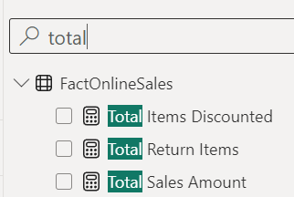

### SAMEPERIODLASTYEAR

Data Analysis Expressions (DAX) includes time-intelligence functions that enable you to manipulate data using time periods, including days, months, quarters, and years, and then build and compare calculations over those periods.

Learn more about [time intelligence functions](https://learn.microsoft.com/dax/time-intelligence-functions-dax)

---

1. To add a **[Total Sales SPLY]** measure, leveraging our **DimDate** table and our DateKey column, select the **FactOnlineSales** table in the Tables list. On the Home tab, select **New measure** and in the formula editor, copy and paste or type the following measure to calculate the total sales amount. Select the **check mark** to commit.

    ```dax
    CALCULATE([Total Sales Amount], SAMEPERIODLASTYEAR(Calendar[DateKey]))
    ```

    > [!NOTE]
    > We want to change our filtering context by using **CALCULATE**, and looking at the values within the current period and comparing them with the previous year.

1. To account for incomplete data where no sales occurred, include variables to determine values that are not blank and an **IF** condition for the applicable TRUE/FALSE branches. 

    - Select the measure created in the previous step in the **Data** pane and update the formula in the formula editor by either copy and paste or typing the following measure updates. Select the **check mark** to commit.:

    ```dax
    Total Sales SPLY = 
    VAR _hassalesdata =
        NOT ( ISBLANK ( [Total Sales Amount] ) )
    RETURN
        IF (
            _hassalesdata,
            CALCULATE ( [Total Sales Amount], SAMEPERIODLASTYEAR (DimDate[DateKey] ) ),
            BLANK ()
        )
    ```

Learn more about [SAMEPERIODLASTYEAR](https://learn.microsoft.com/dax/sameperiodlastyear-function-dax)


### USERELATIONSHIP

To filter by the order date and the delivery date from our **FactOnlineSales** table, we need to control the active relationship in our measure. For this, we’ll leverage the **[USERELATIONSHIP](https://docs.microsoft.com/dax/userelationship-function-dax)** function within DAX to enable the relationship between our **DimDate** table’s **DateKey** and the **FactOnlineSales** table’s **DeliveryDate** with the below formula.

1. From the **Date** pane, right-click the **FactOnlineSales** table and select **New measure**.

    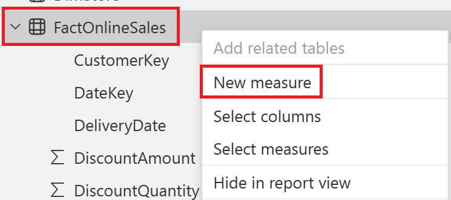

1. In the formula bar we'll write the following DAX function and using the **CALCULATE** function, we'll change our current filtering context - with the **USERELATIONSHIP** function. Either copy and paste or type the following measure and select the **check mark** to commit.

    ```dax
    Total Sales By Delivery Date =
    CALCULATE (
        [Total Sales Amount],
        USERELATIONSHIP ( DimDate[DateKey], FactOnlineSales[DeliveryDate] )
    )
    ```

    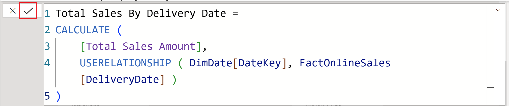

---

# Model properties

An important aspect of data modeling is usability and extending our semantic model with rich metadata for its contents.

---

## Row label

The Row label property is a field that identifies the column that represents a single row in a table. As an example, the Row label property can be used to ensure that two users with the same name are not aggregated into a single record. By setting the Row label property to a field in your data that uniquely identifies each user, such as an ID number, you can keep their records separate.

1. From the **Data** pane select the **DimEmployee** table and within the **Properties** pane set the **Row label** to the **FullName** field.

    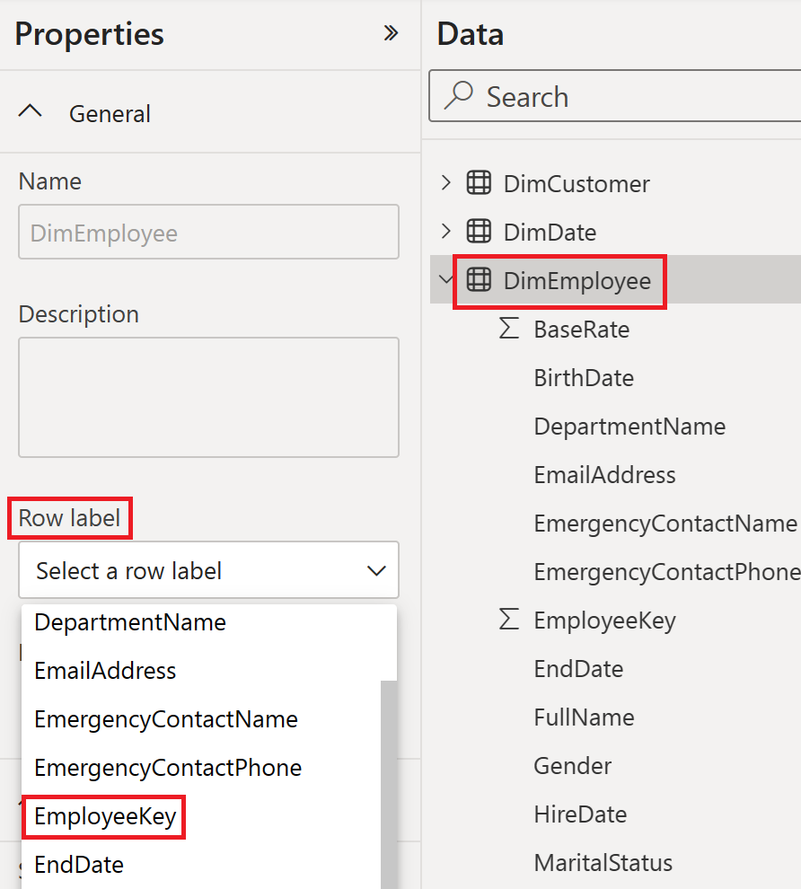

---

## Sort by

1. In the **Data** pane, select the **MonthName** column in the **DimDate** table, navigate to the **Properties** pane and expand the **Advanced** section.

    | Table | Column |
    | :---- | :----- |
    | DimDate | MonthName |  

    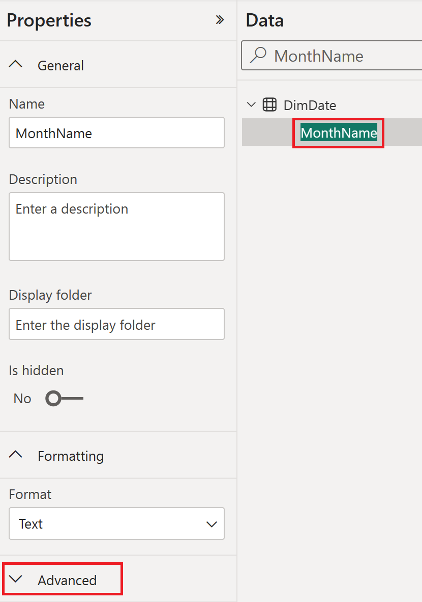

1. Locate the **Sort by Column** option and select the **Month** (which is an integer number) column from the available fields. This will update the sort order of fields in your dataset using the integer values from smallest to largest.

    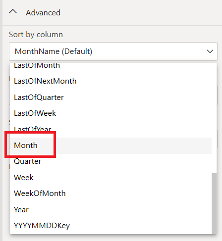

    > [!IMPORTANT]
    > Even if your organization’s calendar does not start in January, you can still utilize this feature to sort order data. You would simply want to start the name (text) along with the sort by (number) in the appropriate order.
    > **Ex.** (1 = June, 2 = July, etc.)

Learn more about [Sort by column](https://learn.microsoft.com/power-bi/create-reports/desktop-sort-by-column)

---

## Data category

Data categorization is a feature in Power BI that allows you to specify the data category for a column so that Power BI knows how to treat its values when creating a visualization. For example, when a column is categroized as containing geographic values, Power BI Desktop assumes you’ll probably use it to visualize locations and instantly selects a map when creating a new visualization.

---

1. From the **Data** pane we'll select the field name from the **DimCustomer** table and within the **Properties** expand the **Advanced** section, to update the **Data category** value from the options below:

    | Field | Data category |
    | :--- |  :--- |
    | RegionCountryName | Country/Region |
    | StateProvinceName | State of Province |

    

Learn more about [data categorization](https://learn.microsoft.com/power-bi/transform-model/desktop-data-categorization)

---

## Default summarization

Default summarization is a feature that automatically assigns a default summarization to numeric columns in a dataset. By default, Power BI assigns a sum operation as the default summarization for numeric columns. Columns that have been assigned a default summarization are denoted by Power BI with a Sigma symbol (**∑**).

It’s important to note that if the default summarization settings in your data model are not correct, it can result in incorrect or missing data being displayed in your report. Therefore, it’s recommended to set the summarization property for each column in your dataset or to write explicit measures to ensure that your data is being displayed accurately.

---

1. From the **Data** pane select the following aggregate fields from the table below.

    > [!NOTE]
    > To bulk select fields/measures, hold and select **Shift** on the keyboard for adjacent fields, or hold **Ctrl** to select individual fields.

    | Table | Field |
    | :-- | :-- |
    | FactOnineSales | DiscountAmount |
    | FactOnineSales | DiscountQuantity |
    | FactOnineSales | ReturnAmount |
    | FactOnineSales | ReturnQuantity |
    | FactOnineSales | SalesAmount |
    | FactOnineSales | SalesQuantity |

    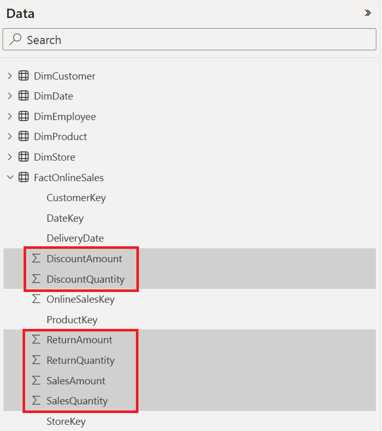

1. In the **Properties** pane we'll now expand the "**Advanced**" section, to update the **Summarize by** value to **None**:

    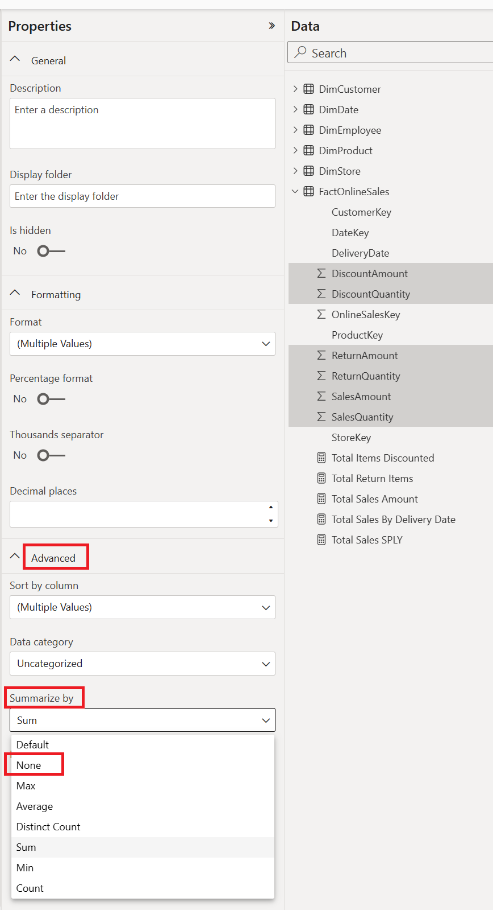

Learn more about [aggreates](https://learn.microsoft.com/power-bi/create-reports/service-aggregates)

## Display folder

You can also organize measures in a table into display folders to assist in organization.

- You can create subfolders by using a backslash character. For example, Finance\Currencies creates a Finance folder and within it, a Currencies folder.

- You can make a field appear in multiple folders by using a semicolon to separate the folder names. For example, Products\Names;Departments results in the field appearing in a Departments folder and a Names folder inside a Products folder.

---

1. From the **Data** pane select the following measures from the table below and within the **Properties** pane add the text **Measures** into the **Display folder** field.
    > [!NOTE]
    > To bulk select fields/measures, hold and select **Shift** on the keyboard for adjacent fields, or hold **Ctrl** to select individual fields.

    | Table | Field |
    | :-- | :-- |
    | FactOnlineSales | Total Items Discounted |
    | FactOnlineSales | Total Returned Items |
    | FactOnlineSales | Total Sales Amount |

    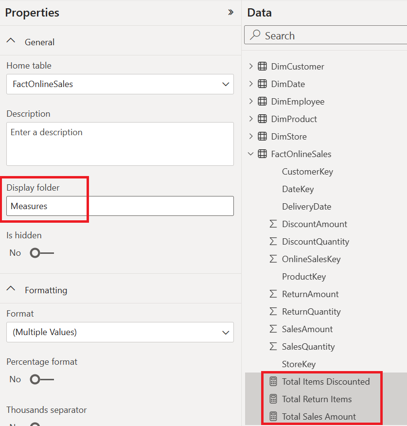

1. Within our **Data** pane, our measures are now displayed within a folder - this will help with managing like items in our tables and also when users connect to our semantic model this ensure a seamless experience in which to locate calculations.

    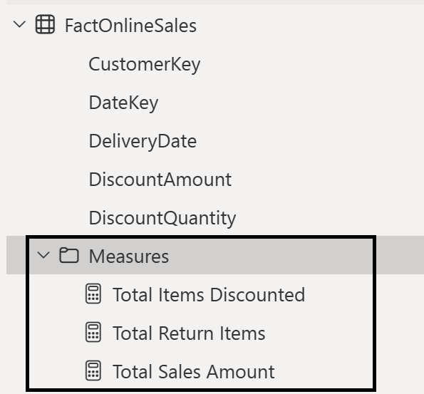

Learn more about [organizing your measures](https://learn.microsoft.com/power-bi/transform-model/desktop-measures#organizing-your-measures)

---

# Dataset settings

By default, OneLake automatically updates Direct Lake datasets with any data changes. However, you may want to disable this feature if you need to complete data preparation jobs before exposing new data to consumers of the dataset. To disable this feature, follow the steps below:

---

1. From the side-rail, select the name of your workspace to return to the workspace item list.

    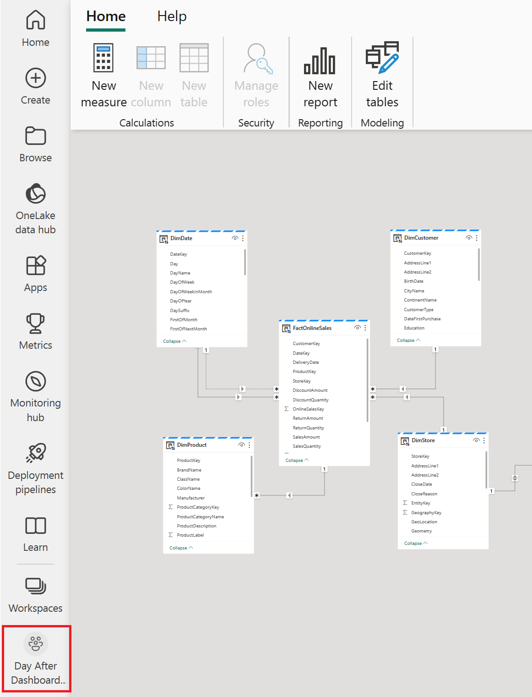

1. Select the ellipses **(...)** next to **SalesDirectLakeModel** and click **Settings**.

    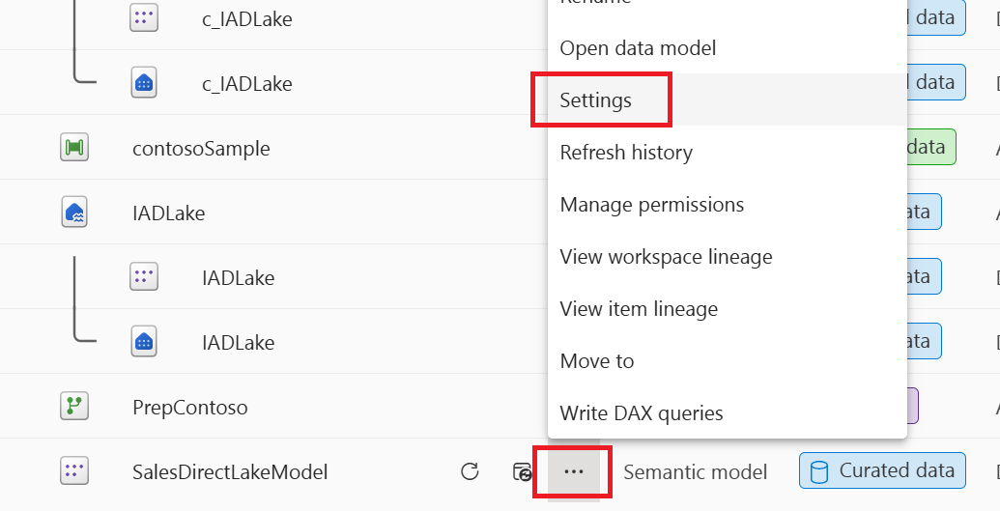

1. Expand the **Refresh** settings and update the **Keep your Direct Lake data up to date** setting from the default **On** to **Off** and select **Apply** within the group once complete.

    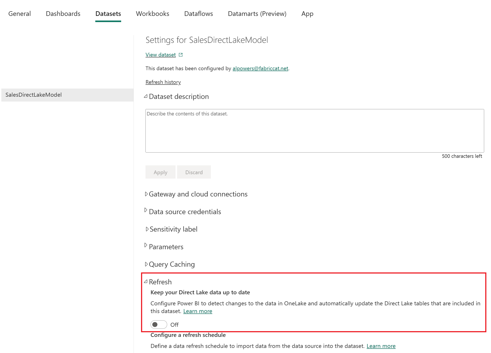

    > [!IMPORTANT]
    > Once your data preparation activities have successfully completed, add an activity to refresh the Power BI dataset to ensure that it is up-to-date.

1. Expand the **Q&A** settings and update the **Turn on Q&A to ask natrual language questions about your data** setting to **On**.

    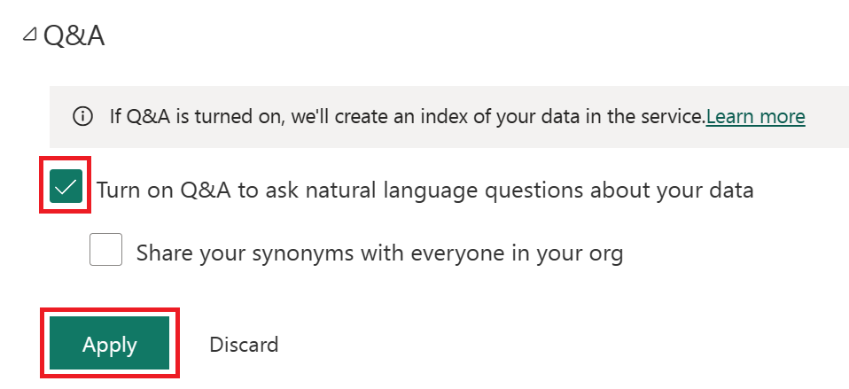
---

# Next steps
We hope this portion of the lab has shown how editing data models in the cloud service can offer a flexible and optimized experience to building enterprise scalable solutions.

- Continue to the [Data Visualization](./DataVisualization.md) lab
- Return to the [Day After Dashboard in a Day](./README.md) homepage
