# Data Modeling

✏️ Lab scenario
---

In this part of the lab, our goal is to create a dataset that can access our data quickly and efficiently for our report users in **near-real time**. To achieve this, we’ll need to compare Power BI’s storage mode options and measure our performance to find the best solution.

# Storage modes and data modeling

Microsoft Power BI Desktop lets us choose the storage mode for each table in our model, learning the benefits of each storage mode can help us with the following:

- Faster query responses
- Developing bigger datasets
- Quicker dataset refreshes
- Showing near real time data

[Learn more about storage modes](https://docs.microsoft.com/power-bi/transform-model/desktop-storage-mode)

---

## DirectQuery

DirectQuery mode models do not import data. They only contain metadata that defines the model structure. When the model receives a query, it uses native queries to get data from the original data source.

DirectQuery mode models are suitable for two scenarios:

- When data volumes are too big to load into a model or refresh regularly, even after applying data reduction methods
- When reports and dashboards need to show “up-to-date” data, beyond the frequency of scheduled refreshes. (Scheduled refreshes are limited to eight times a day for shared capacity, and 48 times a day for a Premium capacity.)

Learn more about [DirectQuery mode](https://docs.microsoft.com/power-bi/connect-data/service-dataset-modes-understand#directquery-mode) and [DirectQuery model guidance](https://docs.microsoft.com/power-bi/guidance/directquery-model-guidance)

---

1. After connecting to our dataflow, we can see that the **Data** view on the left side-rail is gone and the text **Storage Mode: DirectQuery** appears on the bottom right corner of Power BI Desktop.

    

1. To check that our connection to our dataflow works, we’ll add the following fields to a **Table** visual on a report page.

    | Table | field |
    |:----- | :------ |
    | DimCustomer_raw | EmailAddress|
    | DimCustomer_raw | Gender |

    

1. To verify that the data is coming from our source through a **Direct query**, we’ll go to the View tab and click **Performance analyzer**.


1. To use the **Performance analyzer**, we’ll open the pane and click **Start recording**.

    

1. While the **Performance analyzer** is recording, we’ll hover over the **Table** visual and choose the **Analyze this visual** option to refresh only that visual. After that, we’ll click the expand/collapse box next to the **Table** visual in our list to see that a **Direct query** value is there. We can also click the Copy query option and paste our query into any text editor.

    

1. The pasted query shows us the **DAX Query** that the analysis services database engine received.

    ```dax
    // DAX Query
    DEFINE
      VAR __DS0Core = 
        SUMMARIZE('DimCustomer_raw', 'DimCustomer_raw'[Gender], 'DimCustomer_raw'[EmailAddress])
    
      VAR __DS0PrimaryWindowed = 
        TOPN(501, __DS0Core, 'DimCustomer_raw'[Gender], 1, 'DimCustomer_raw'[EmailAddress], 1)
    
    EVALUATE
      __DS0PrimaryWindowed
    
    ORDER BY
      'DimCustomer_raw'[Gender], 'DimCustomer_raw'[EmailAddress]
    ```
---

<br>
<font size="6">Optional: Event traces</font>

One important item that was missing from our above query is the [Transact-SQL](https://docs.microsoft.com/learn/modules/introduction-to-transact-sql/) statement for the **Direct query** value. In order to trace this event we'll leverage [SQL Server Profiler](https://docs.microsoft.com/sql/tools/sql-server-profiler/sql-server-profiler) to view our event traces.

We can also leverage the [external tools in Power BI Desktop](https://docs.microsoft.com/power-bi/transform-model/desktop-external-tools) integration to easily view the event traces against our underlying Analysis Services instance.

<br>
<font size="4">Register SQL Server Profiler external tool</font>


1. Download and install [SQL Server Management Studio](https://docs.microsoft.com/en-us/sql/ssms/download-sql-server-management-studio-ssms).

1. Download the registered external tool [SQL Server Profiler External Tools](https://raw.githubusercontent.com/microsoft/pbiworkshops/main/Day%20After%20Dashboard%20in%20a%20Day/Source_Files/SQLProfiler.pbitool.json) (json) file. (Courtesy of Microsoft MVP [Steve Campbell](https://mvp.microsoft.com/PublicProfile/5004099))

1. After the above is downloaded add the local file (SQLProfiler.pbitool.json) to the below file path location. Once complete close and restart your Power BI Desktop application.

    ```
    C:\Program Files (x86)\Common Files\Microsoft Shared\Power BI Desktop\External Tools
    ```
[Learn more about external tools](https://docs.microsoft.com/power-bi/transform-model/desktop-external-tools)

<br>
<font size="4">DirectQuery events</font>

1. From the **Trace Properties** window select the **Events Selection** tab. Within the **Events** section, expand the **Query Processing** group and then select the **DirectQuery End** event. Once complete select the **Run** option in the bottom right to start tracing events.

    

1. We'll now return to the Power BI Desktop application and select the **Analyze this visual** option again to send a query to our source.

    

1. Returning to the **SQL Server Profiler** application, a **DirectQuery end** event is now displayed including the **Text data** of the SQL query generated by Power BI, the total time it took to return a result with the **Duration** and more.

    

    ```sql
    SELECT
        TOP (501) [t1].[EmailAddress],
        [t1].[Gender]
    FROM
        [DimCustomer_raw] AS [t1]
    GROUP BY
        [t1].[EmailAddress],
        [t1].[Gender]
    ORDER BY
        [t1].[Gender] ASC,
        [t1].[EmailAddress] ASC
    ```

<font size="6">✅ Lab check</font>

We've been able to confirm that as our Power BI visuals are being rendered our query will be instantly sent to our data source to retrieve new insights. With this initial requirement met, let's continue and start connecting our tables to create a dimensional model.

---

## Relationships

If you use more than one table, you’ll probably need data from all of them for your analysis. You need to create relationships between the tables to get the right results and show the right information in your reports.

Learn more about [creating and managing relationships](https://docs.microsoft.com/power-bi/transform-model/desktop-create-and-manage-relationships)

---

1. Go to the model view on the side-rail

    

1. To link two of our tables, we’ll drag-and-drop the fields below from the table they belong to.
    1. If we hover over our table’s headers, we’ll see more details about the **Storage mode**, **Data source type**, **Server name** and a symbol in the top left that shows the **Storage mode**, which is DirectQuery in this example.
  
    | Table | field |
    |:----- | :------ |
    | DimCustomer_raw | CustomerKey|
    | FactOnlineSales | CustomerKey |

    

1. In the **Create relationship** window, we can check that the **CustomerKey** field is selected within each table (as noted by the darker shade). Then, we can click **OK** to continue.

    

1. Back to the report page view, we'll do the following steps.
    1. From the **FactOnlineSales** table, add the **SalesAmount** field.
    1. Click **Clear** in the **Performance analyzer** pane to remove previous events.
    1. Click **Analyze this visual** to test the performance of the added field.
    
    

1. **Optional:** Back to the **SQL Server Profiler** application, we can find the **DirectQuery end** event with the **Text data** that shows the SQL query generated when we needed data from more than one table. In this example a [**LEFT OUTER JOIN**](https://docs.microsoft.com/sql/relational-databases/performance/joins?view=sql-server-ver15#fundamentals) is used.

    

    ```sql
    SELECT
        TOP (1000001) *
    FROM (
        SELECT
            [t1].[EmailAddress],
            [t1].[Gender],
            SUM([t0].[SalesAmount]) AS [a0]
        FROM (
            [FactOnlineSales] AS [t0]
            LEFT OUTER JOIN [DimCustomer_raw] AS [t1]
            ON ([t0].[CustomerKey] = [t1].[CustomerKey])
        )
        GROUP BY
            [t1].[EmailAddress],
            [t1].[Gender]
    ) [MainTable]
    WHERE (NOT( ([a0] IS NULL)))
    ```

1. To improve our performance, we can change the default join because all of our sales have a customer key. We’ll go to the **Modeling** tab and click **Manage relationships**.

    

1. In the **Manage relationships** dialog window, click **Edit...**
    1. You can also double click to go to the relationship view.

    

1. In the **Edit relationship** dialog window, check the box next to the [**Assume referential integrity**](https://docs.microsoft.com/power-bi/connect-data/desktop-assume-referential-integrity) property. Then click **OK** and close the **Manage relationships** window to go back to the report page.

    

1. Back to the report page view, we'll do the following steps.
    1. Click **Clear** in the **Performance analyzer** pane to remove previous events.
    1. Click **Analyze this visual** to test the performance of the added field.

    

1. **Optional:** Back to the **SQL Server Profiler** application, we can find the **DirectQuery end** event with the **Text data** that shows the SQL query generated when we needed data from more than one table. In this example a [**INNER JOIN**](https://docs.microsoft.com/sql/relational-databases/performance/joins?view=sql-server-ver15#fundamentals) is used.

    

    ```sql
    SELECT
        TOP (1000001) *
    FROM (
        SELECT
            [t1].[EmailAddress],
            [t1].[Gender],
            SUM([t0].[SalesAmount]) AS [a0]
        FROM (
            [FactOnlineSales] AS [t0]
            INNER JOIN [DimCustomer_raw] AS [t1]
            ON ([t0].[CustomerKey] = [t1].[CustomerKey])
        )
        GROUP BY
            [t1].[EmailAddress],
            [t1].[Gender]
    ) [MainTable]
    WHERE (NOT( ([a0] IS NULL)))
    ```

1. Back to the **Model** view, we'll link the tables below by dragging and dropping our fields and choosing the right settings in the **Edit relationship** window.
    1. We can also make relationships between tables by clicking the **Manage relationships** button on the **Home** tab and then **New...** option in the bottom left.

    | Active | From: Table (field) | field | Cardinality | Assume referential integrity | Cross filter direction | 
    | :----- |:----- | :------ | :----- | :----- | :----- |
    | ☑ | DimCustomer_raw (GeographyKey) | DimGeography_raw (GeographyKey) | Many to one (*:1) | ☑ | Single |
    | ☑ | DimEmployee (StoreKey) | DimStore (StoreKey) | Many to one (*:1) | ☑ | Both |
    | ☑ | DimProduct_raw (ProductSubcategoryKey) | DimProductSubcategory_raw (ProductSubcategoryKey) | Many to one (*:1) |  | Single |
    | ☑ | DimProductSubcategory_raw (ProductCategoryKey) | DimProductCategory_raw (ProductCategoryKey) | Many to one (*:1) | ☑ | Single |
    | ☑ | FactOnlineSales (CustomerKey) | DimCustomer_raw (CustomerKey) | Many to one (*:1) | ☑ | Single |
    | ☑ | FactOnlineSales (ProductKey) | DimProduct_raw (ProductKey) | Many to one (*:1) | ☑ | Single |
    | ☑ | FactOnlineSales (StoreKey) | DimStore (StoreKey) | Many to one (*:1) | ☑ | Single |
    | ☑ | FactOnlineSales (DateKey) | DimDate (DateKey) | Many to one (*:1) | ☑ | Single |
    |  | FactOnlineSales (DeliveryDate) | DimDate (DateKey) | Many to one (*:1) | ☑ | Single |


1. In the **Properties** pane of the Modeling view, change both the **Show the database in the header when applicable** and **Pin related fields to top of card** options to **Yes**.

    

<font size="6">✅ Lab check</font>

We have linked all of our data source’s tables, but now we need our data model to be **near-real time** and **very fast**.

To do this, we’ll need to change the design of our model.

---

## Dimensional modeling

A good model design should have tables that are either dimension-type or fact-type, and not mix both types in one table.

**Dimension tables** describe the things you model, such as products, people, places, and concepts like time.

- The most common table in a star schema is a date dimension table.
- A dimension table has a key column (or columns) that is a unique identifier, and descriptive columns.

**Fact tables** store data about events or observations, such as sales orders, stock balances, exchange rates, temperatures, etc.

- A fact table has dimension key columns that link to dimension tables, and numeric measure columns.
- The dimension key columns show the dimensions of a fact table, while the dimension key values show the level of detail of a fact table. For example, think of a fact table that stores sales targets with two dimension key columns Date and ProductKey.
- You can see that the table has two dimensions. But to know the level of detail, you need to look at the dimension key values. In this example, the Date column has the first day of each month. So, the level of detail is at month-product level.

You should also try to have the right number of tables with the right relationships between them.

Learn more about the [importance of the star schema for Power BI](https://docs.microsoft.com/power-bi/guidance/star-schema)

---

1. Go to the model view on the side-rail.

    

1. In our model view, we have [snowflaked dimensions](https://www.kimballgroup.com/data-warehouse-business-intelligence-resources/kimball-techniques/dimensional-modeling-techniques/snowflake-dimension/) between these tables:
    1. **DimCustomer_raw** and **DimGeography_raw**
    1. **DimProductCategory_raw** and **DimProductSubcategory_raw** and **DimProductCategory_raw**

    

    This kind of model design can make our dataset queries take longer and hurt our performance. To make our model better, let’s use the tables from our dataflow where we’ve already combined our tables into a right view of our data.

1. In the model view, we’ll click the vertical ellipses ( ⋮ ) at the top right of the **DimProduct_raw** table and then the **Edit query** option to go back to the Power Query Editor.
    1. You can also right click the table header instead of clicking the ellipses.

    

1. In the Power Query Editor - **Queries** pane, we'll change the following queries to our merged table from the previous [**Data Preparation**](https://github.com/microsoft/pbiworkshops/blob/main/Day%20After%20Dashboard%20in%20a%20Day/DataPreparation.md#joining-tables-using-the-diagram-view) lab instructions.
    
    1. We'll start with the **DimProduct_raw** query and do the following.
        1. Next to the **Navigation** step in the **APPLIED STEPS** section, click the settings icon.
        1. In the **Navigation** window, we'll choose **Workspaces** to see our dataflows stored within the Power BI service.
            1. The Environments option shows dataflows created with Power Apps.
        1. We can now go to the workspace location where we made and saved our dataflows from the data preparation lab instructions. When we find it, we'll then expand our dataflow to see all the tables and choose the **DimProduct** table.
        1. In the **Query Settings** pane, update the **Name** value to just **DimProduct**.

        

    1. Then choose the **DimCustomer_raw** table where we'll use a different approach by using our formula bar. In the **APPLIED STEPS** section of the **Query Settings** pane, choose the **Navigation** step and do the following before and after below to remove the **"_raw"** suffix.

    | Before | After |
    | :-- | :-- |
    |= #"Dataflow Id"{[entity="**DimCustomer_raw**",version=""]}[Data] | = #"Dataflow Id"{[entity="**DimCustomer**",version=""]}[Data] |

    

1. In the **Queries** pane, right click the **DimCustomer_raw** table and click the **Rename** option to change the table name to just **DimCustomer**.

    

1. In the **Queries** pane, hold ctrl on your keyboard (or shift if they are next to each other), and click the tables below. Then right click to select the **Delete** option to remove the tables from our dataset.
    1. DimGeography_raw
    1. DimProductCategory_raw
    1. DimProductSubcategory_raw

    

1. To go back to our model view, go to the **Home** tab and click the **Close & Apply** option.

    

1. In the **Model** view, our tables look like a star with our fact table, which has all our sales records and our dimension tables, which filter our results by our relationships.

    

<font size="6">✅ Lab check</font>

We have modeled our dataset into a star schema, but now we need our data model to be **near-real time** and **very fast**. To do this, we’ll need to check our storage mode options and see if each of our tables are set up properly.

---
## Mixed (Composite) mode

With mixed (composite) mode, we can use both Import and DirectQuery modes in one model. In composite mode, we can set the storage mode as Import, DirectQuery, or Dual for each table.

A table with dual storage mode is both Import and DirectQuery, depending on the query. This lets Power BI choose the best mode to use for each query.

[Learn more about composite mode](https://docs.microsoft.com/power-bi/connect-data/service-dataset-modes-understand#composite-mode)

---

1. In the **Model** view, we’ll hold ctrl on our keyboard and choose the tables below. Then, we’ll go to the **Properties** pane and open the **Advanced** options. For the **Storage mode** option, we’ll click the drop down and change the selection to **Import**.
    1. DimDate
    1. DimProduct
    1. DimStore
    1. DimEmployee

    

1. In the **Storage mode** window, there is some important text that says changing our tables from DirectQuery cannot be undone and the suggestion that we should use the **Dual** storage mode instead of **Import**. This way, our values can be either **Import** or **DirectQuery** mode depending on the queries we use.

    

1. Back in the **Model** view, we have new icons in our tables showing **Dual** storage mode for our **DimProduct**, **DimDate** and **DimStore** tables. Our **DimEmployee** table also has an icon indicating that it is an **Import** only storage mode.

    

1. On the side-rail we now have three options - **Report view**, **Data view** and **Model view**. With the Data view we can see imported and cached data in our Power BI file. For now, let's go to the **Report view** to continue.

    

1. On the report canvas we'll make a new table and add the columns below to check the performance of our **Dual** and **Import** tables.

    | Table | Column | Storage Mode |
    | :---- | :----- | :----- |
    | DimStore | StoreName| Dual |
    | DimEmployee | EmailAddress | Import |

    

1. With results coming back very fast, we want to know if our query is going to our source with **Direct query** or if it’s done with an imported cache. To find out, we’ll go to the **View** tab and click **Performance analyzer**.

    

1. When the **Performance analyzer** pane shows up, we'll click **Start recording**.

    

1. Click the **Analyze this visual** button above the table visual and when it's done, open the **Table** object in the **Performance analyzer** pane. We can now see our results, and notice that there is no **Direct query** entry.

    This means that Power BI knew that we had the data we needed in-memory and that we didn’t have to go back to our data source to get our results directly.

    

1. On the report canvas, we’ll make another new table and add the columns below from the tables to check how **Dual** and **DirectQuery** tables work. 

    | Table | Column | Storage Mode |
    | :---- | :----- | :----- |
    | DimStore | StoreName| Dual | 
    | FactOnlineSales | SalesAmount | DirectQuery |

    

1. Click the **Analyze this visual** button above the table visual and when it’s done, open the new **Table** object in the **Performance analyzer** pane. We can now see our results, and notice that a **Direct query** entry is there again.

    This means that Power BI knew that we didn’t have all the data we needed in-memory from our DimStore table and that it had to use a DirectQuery method to get our results.

    

1. **Optional:** Going back to the **SQL Server Profiler** application, we can find the **DirectQuery end** event and look at the SQL query that was sent to our data source.

    

    ```sql
    SELECT 
      TOP (1000001) * 
    FROM 
      (
        SELECT 
          [t4].[StoreName], 
          SUM([t0].[SalesAmount]) AS [a0] 
        FROM 
          (
            [FactOnlineSales] AS [t0] 
            INNER JOIN [DimStore] AS [t4] on (
              [t0].[StoreKey] = [t4].[StoreKey]
            )
          ) 
        GROUP BY 
          [t4].[StoreName]
      ) AS [MainTable] 
    WHERE 
      (
        NOT(
          ([a0] IS NULL)
        )
      )
    ```

<font size="6">✅ Lab check</font>

We have made a good data model and tried different storage modes. After talking to our end users, we found out they want **very fast** performance as the reports help them with their business day and they need to quickly explore their insights.

We also found out that new data only comes in at night and as long as this data is ready before they start their morning. The need for **near real-time** meant as soon as it’s ready, not like the previous wait time in their previous solution.

---

## Import mode

Import mode is the most popular mode for making datasets. This mode gives very fast performance because of in-memory querying. It also lets modelers design flexibly, and use some Power BI service features (Q&A, Quick Insights, etc.). Because of these advantages, it’s the default mode when making a new Power BI Desktop solution.

It’s important to know that imported data is always saved to disk. When it’s queried or refreshed, the data has to be fully loaded into the memory of the Power BI capacity. Once in memory, Import models can get very fast query results. It’s also important to know that there’s no way for an Import model to be partly loaded into memory.

When refreshed, data is compressed and optimized and then saved to disk by the VertiPaq storage engine. When loaded from disk into memory, it can be 10x smaller. So, it’s possible that 10 GB of source data can be about 1 GB in size. Storage size on disk can be 20% smaller than the compressed size. (The difference in size can be seen by comparing the Power BI Desktop file size with the Task Manager memory use of the file.)

Design flexibility can be done in three ways. Data modelers can:

- Integrate data by caching data from dataflows, and external data sources, whatever the data source type or format
- Leverage the entire set of Power Query Formula Language (informally referred to as M) functions when creating data preparation queries
- Leverage the entire set of Data Analysis Expressions (DAX) functions when enhancing the model with business logic. There's support for calculated columns, calculated tables, and measures.

Learn more about [import mode](https://docs.microsoft.com/power-bi/connect-data/service-dataset-modes-understand#import-mode)

---

1. Go to the **Model view** on the side-rail.

    

1. In the model diagram view, press **Ctrl+A** on the keyboard to choose all tables (or hold ctrl and click to choose them one by one). In the **Properties** pane, open the **Advanced** options and in the **Storage mode** option, select **Import** to change all of our tables.

     

1. In the **Storage mode** window is a warning letting us know that **Setting our storage mode to Import is an irreversible operation. You will not be able to switch it back to DirectQuery.** - click **OK** to proceed.

    Now that we know our business needs well, we realize that **Import** will give us the fast performance to make a good experience for our end users as they explore information and we can keep the data fresh by refreshing our results every day.

    

1. Click **Report view** to go back to the report canvas.

    

1. From our previous sales by store table visual, click the **Analyze this visual** button above the table visual again and when it's done, open the new **Table** object in the **Performance analyzer** pane. We can now see our results, and notice there is only a **DAX query** entry.

    This means that Power BI knew that we had all the data we needed in-memory to meet our queries needs now.

    

<font size="6">✅ Lab check</font>

At this point in our project, we have seen some possible benefits of each storage mode, but the most important thing we learned was that we should have talked to our business users and understood their needs first so we could pick the right solution for them.

Important questions we should ask next time:
- How often is the data updated?

---

## Incremental Refresh

Incremental refresh is a feature in Power BI that allows you to keep the existing data in your dataset and add new data to it using a policy that you define. This can make your refreshes faster and reduce the load on your data source. Incremental refresh is supported for Power BI Pro, Premium per user, Power BI Premium, and Power BI Embedded.

To use incremental refresh, you need to have a **date/time** column in your table, and set the import and refresh ranges in the incremental refresh settings.

Learn more about [incremental refresh](https://learn.microsoft.com/power-bi/connect-data/incremental-refresh-overview)

---

1. To re-enter the Power Query editor, Go to the **Home** tab and select **Transform data**.

    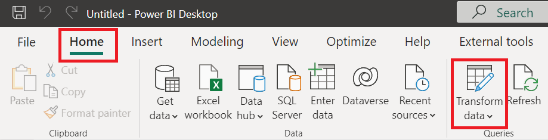

1. On the **Home** tab of the **Power Query Editor**, click the **Manage Parameters** and then the **New Parameter** option.

    

1. In the **Manage Parameters** window, click the **New** button and make the below two values.
    
    **Important Note**: these are **case sensitive**, **reserved keywords** and they have to match exactly for incremental refresh to work.

    | Name | Type | Current Value |
    |:----- | :------ | :------ |
    | RangeStart | Date/Time | 1/1/2020 |
    | RangeEnd | Date/Time | 12/31/2022 |

    

1. In the **FactOnlineSales** table, select the **DateKey** field's drop down in the top right corner, the **Number Filters** option and then the **Between** value.

    

1. Within the **Filter Rows** menu, set the following values below.

    Keep rows where 'DateKey'
    | Keep Rows | |
    |:- | :- |
    | is after than or equal to | 1/1/2020 |
    | is before | 12/31/2022 |

    

⚠️ **Important** ⚠️

1. Because our **DateKey** is a **Date** and our parameters are of datetime, we'll update the formula using the [Date.From](https://learn.microsoft.com/powerquery-m/date-from) function, to cast our RangeStart and RangeEnd values to date only.

    ```powerquery-m
    = Table.SelectRows(#"Entity Name", each [DateKey] >= Date.From(RangeStart) and [DateKey] < Date.From(RangeEnd))
    ```
    
    

1. Now that we're ready to go back to our modeling view, go to the **Home** tab and click the **Close & Apply** option.

    

1. Go to the **Model** view on the side-rail of Power BI Desktop, where we'll now setup our incremental refresh policy on the **FactOnlineSales** table.

    

1. Either select the vertical ellipses ( ⋮ ) in the top right corner of the **FactOnlineSales** table or right click the table title and then click the **Incremental refresh** option.

    

1. In the **Incremental refresh and real-time data** menu, make the following settings below and click **Apply** when done.
    1. ☑️Incrementally refresh this table
    1. Archive data starting **2 Years** before refresh date
    1. Incrementally refresh data starting **1 year** before refresh date

    

    ⚠️ **Important** ⚠️
    At the top of the Incremental refresh and real-time data window, there is a message that says, **you won't be able to download it back to Power BI Desktop** after an incremental refresh policy has been set. For this reason, we should make sure that our dataset is finished before publishing, otherwise we will need to refresh the whole dataset for any new publishing.

---

# Model properties

With the model properties pane in Power BI, you can see and change the properties of your data model items, such as tables, columns, and measures. You can use the model properties pane to rename, format, type, group, describe, and adjust your data model items. The model properties pane helps you to arrange and explain your data model, and to make it look and work better.

Learn more about [model properties](https://learn.microsoft.com/power-bi/transform-model/desktop-modeling-view)

---

## Descriptions

1. Go to the **Model view** and change the following table properties according to the instructions below for each:
    1. In the **Data** pane, click the Previous Table Name from the list.
    1. In the **Properties** pane, change the **Name**, **Description** and **Key column** fields.

    | Previous Table Name | Name | Description | Key column |
    | :---- | :---- | :---- | :---- |
    | DimCustomer | Customers | Contains customer information including address and contact details.  | CustomerKey |
    | DimDate | Calendar | Contains the organizational calendar including any custom days, weeks, months and years. | DateKey |
    | DimEmployee | Employees | Contains all employee information including address and contact details. | EmployeeKey |
    | DimStore | Stores | Contains all store information including address and contact details. | StoreKey |
    | DimProduct | Products | Contains all product information including descriptions and categorization. | ProductKey | 
    | FactOnlineSales | Online Sales | Contains all online sales transactions including quantities and amounts.  | OnlineSalesKey |
    
    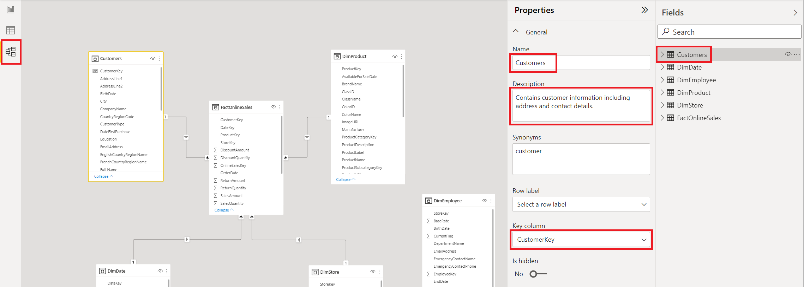

1. If we move cursor over the **Table** properties in the **Report view**, **Data view** or **Model view**, we will see the description field in a tooltip.
    1. The **Description** value can also be filled for columns/fields and measures when they are selected.
    1. For end users, the **Description** field will show up in different client applications and experiences to help them understand the property better.

    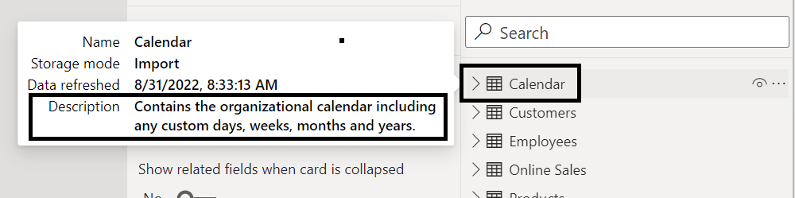

---

## Row label

Row labels in Power BI are a way to specify which field should be used to display the name of each row in a table. For example, you can choose a product name field as the row label for a table that contains product sales data.

1. To go back to the report canvas, click the **Report view**.

    

1. On the report canvas, create a new **Table** visual and add the **Full Name** column from the **Customers** table and the **Total Sales Amount** measure from the Online Sales table.

    You might notice that two customers have the same name "Abigail Barnes". This can cause problems when you aggregate your results because they are grouped into one user.

    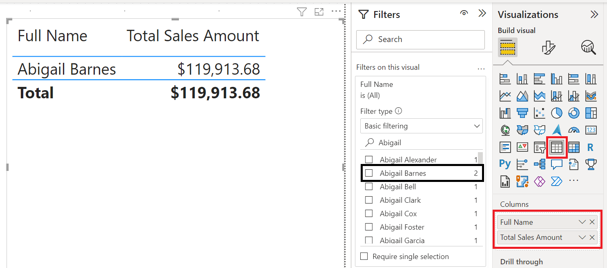

1. To fix this issue, go to the **Model view** on the side-rail.

    

1. In the **Data** pane, select the **Customers** table and then set the **Row label** to the **Full Name** field in the **Properties** pane.

    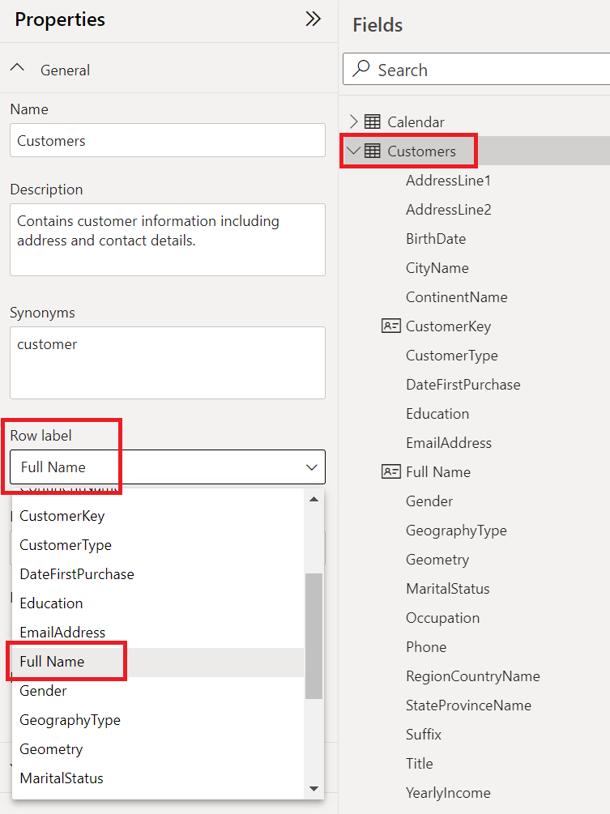

1. Go back to the **Report** view again.

    

1. In our **Table** visual, remove and add back the **Full Name** field to the **Columns** values. Now you should see both Abigail Barnes names separately in the data.

    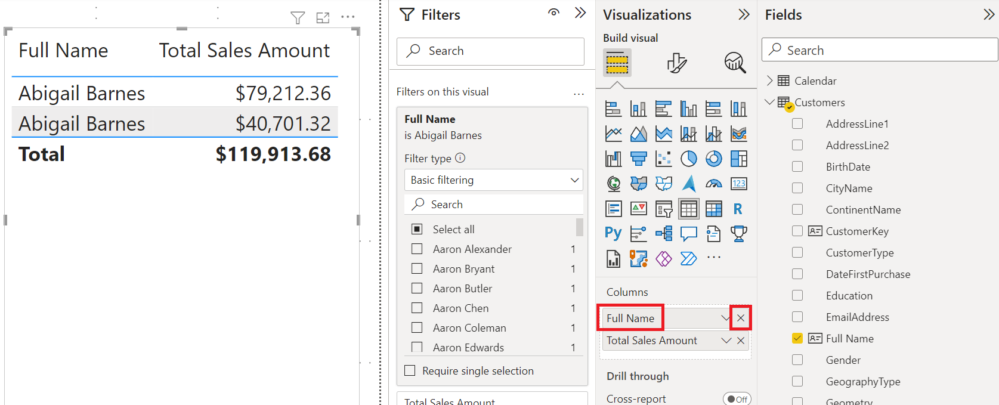

---

## Sort by

Sort by in Power BI is a feature that allows you to change the order of data in your charts or tables based on a field or a measure. For example, you can sort a bar chart by sales amount or by product name.

1. To create a new **Table** visual on the report canvas, add the following column from the table below. We notice that the **MonthName** field is sorted in ascending (A to Z) order. To change this order, select the **MonthName** column from the **Calendar** table and go to the **Column tools** tab. Then click the **Sort by column** button.

    | Table | Column | 
    | :---- | :----- |
    | Calendar | MonthName |  
    
    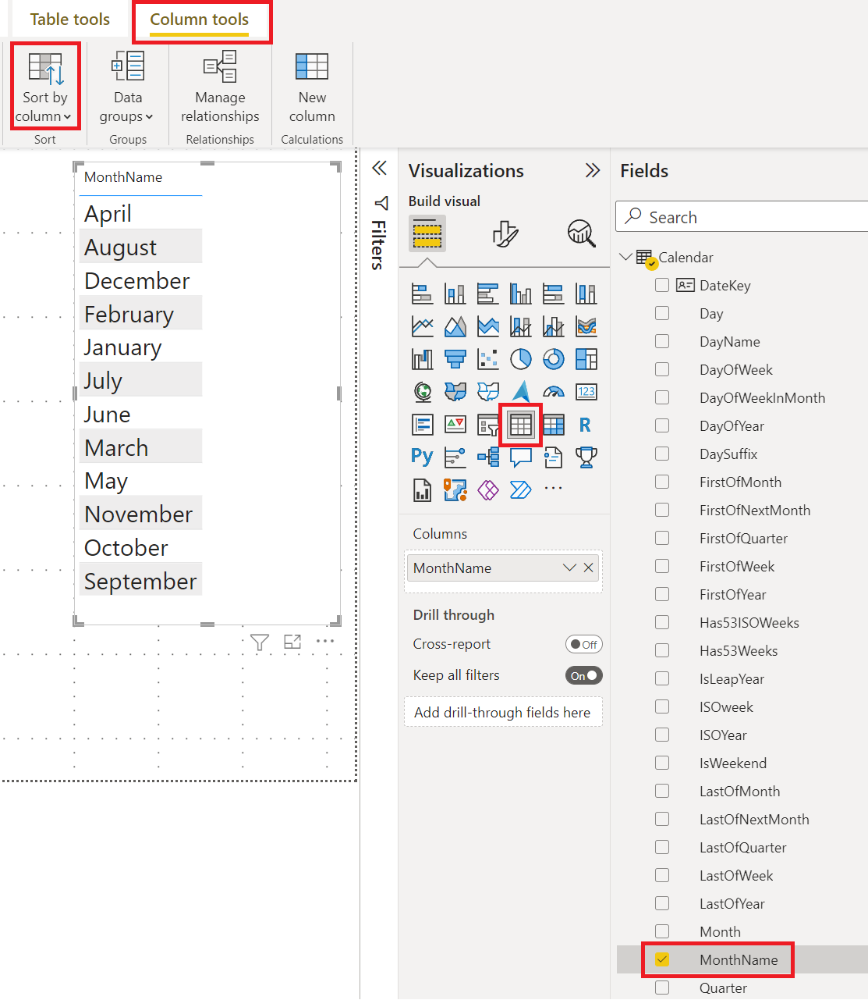

1. In the **Calendar** table, choose the **Month** column (which is a number).

    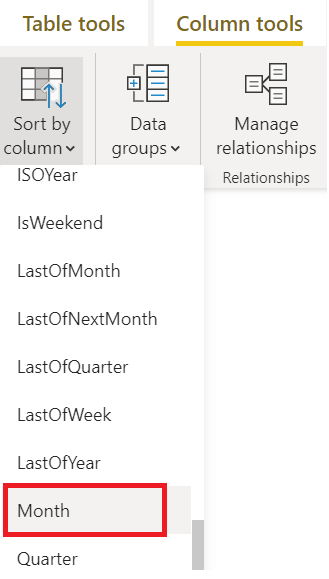

1. Now our **Table** visual has the months sorted correctly.
    
    **Ex.** (1 = January, 2 = February, etc.)

    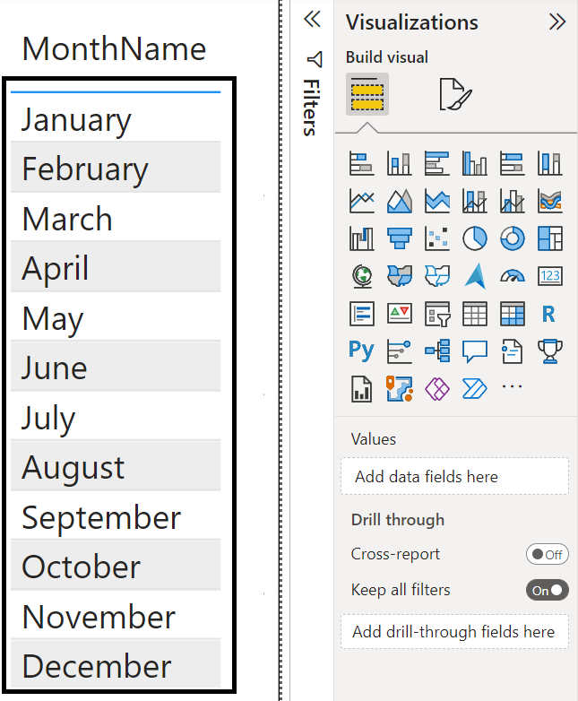

    ⚠️ **Important** ⚠️

    We can use this feature to sort our data even if our calendar does not start in January. Just make sure that the name (text) and the sort by (number) match the calendar order.

    **Ex.** (1 = June, 2 = July, etc.)

Learn more about [Sort by column](https://learn.microsoft.com/power-bi/create-reports/desktop-sort-by-column)

---

## Data category

Data categories in Power BI are a way to specify how a column should be treated when it is used in a visualization. For example, you can choose a geographic data category for a column that contains country names, so that Power BI can display them on a map.

1. Go to the **Model view** on the side-rail.

    

1. In the **Data** pane, select the field name from the table below. Then expand the **Advanced** section in the **Properties** pane and choose a **Data category** value from the options below:

    | Table | Field | Data category |
    | :--- | :--- |  :--- |
    | Customers | RegionCountryName | Country/Region |
    | Customers | StateProvinceName | State of Province |1

    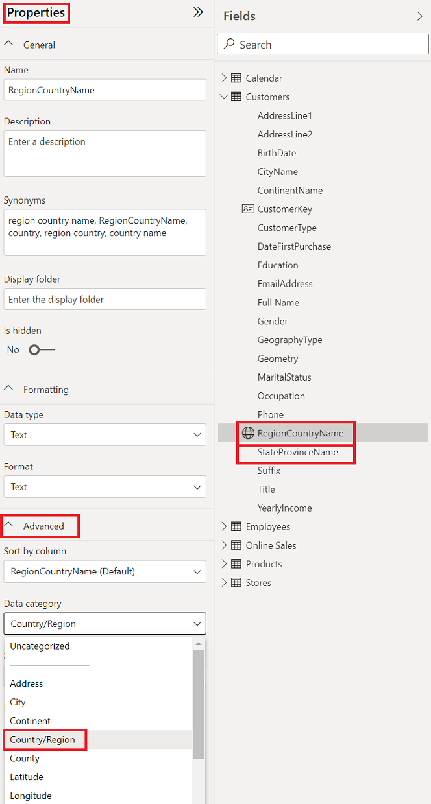

Learn more about [data categorization](https://learn.microsoft.com/power-bi/transform-model/desktop-data-categorization)

---

## Default summarization

1. In the **Model view** and the **Data** pane, select the aggregate fields from the table below.

    To select multiple fields/measures, use **Shift** for adjacent fields or **Ctrl** for individual fields.

    | Table | Field |
    | :-- | :-- |
    | Onine Sales | DiscountAmount |
    | Onine Sales | DiscountQuantity |
    | Onine Sales | ReturnAmount |
    | Onine Sales | ReturnQuantity |
    | Onine Sales | SalesAmount |
    | Onine Sales | SalesQuantity |

    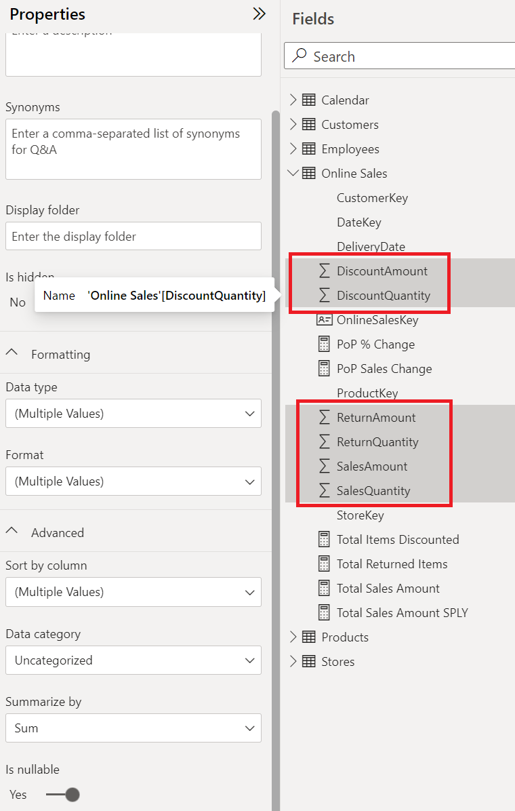

1. In the **Properties** pane, expand the **Advanced** section and change the **Summarize by** value to **None**:

    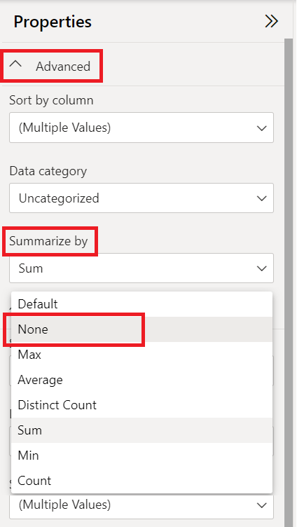

Learn more about [aggregate](https://learn.microsoft.com/power-bi/create-reports/service-aggregates) fields

## Display folder

1. In the **Model view** and the **Data** pane, select the measures from the table below and enter **Measures** in the **Display folder** field in the **Properties** pane.

    To select multiple fields/measures, use **Shift** for adjacent fields or **Ctrl** for individual fields.

    | Table | Field |
    | :-- | :-- |
    | Onine Sales | Total Items Discounted |
    | Onine Sales | Total Returned Items |
    | Onine Sales | Total Sales Amount |

    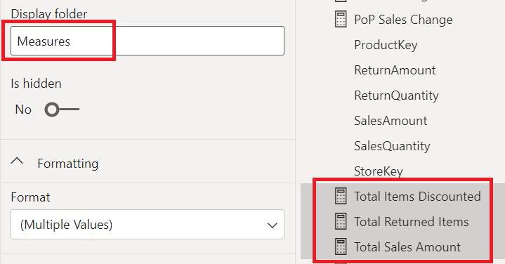

1. Now our measures are in a folder in the **Data** pane. This can help us organize our items and promote discovery when other users connect to our model.

    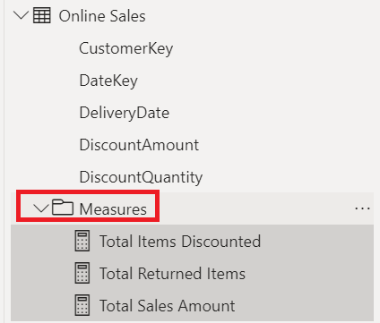

## Synonyms

1. Go back to the **Report view**.

    

1. Double-click on the report page and add the **Q&A** visual. Type **"salary by customer name"** as the question. The result is not what we want, so click on **Add synonyms now** to use more business terms in our dataset.

    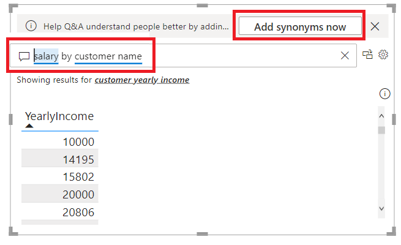

1. In the **Field synonyms** window, find the **Customers** table and add these synonyms to the fields below. Use the **"Add+"** button and enter the text. To close window select the **X** in the top right corner.

    | Table | Field | Synonym |
    | :--- | :--- | :--- |
    | Customers | Full Name | customer |
    | Customers | YearlyIncome | salary |

    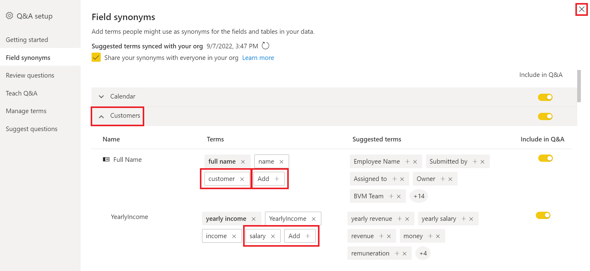

1. On the report page, we should see a with the right fields for our synonyms **salary** and **customer name**.

    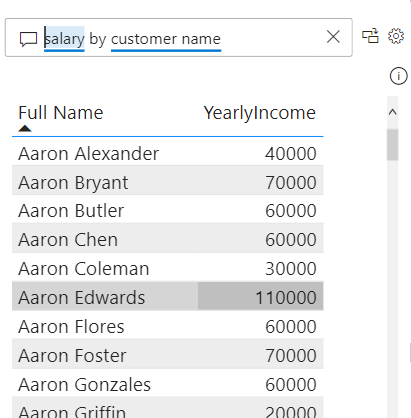

---

# Data Analysis Expressions

## SAMEPERIODLASTYEAR

1. To finish our **[Total Sales SPLY]** measure, we need our **Calendar** table and our **DateKey** column.

    In our **CALCULATE**, we want to change our filtering context, by the current period and then previous year.

    ```
    CALCULATE([Total Sales Amount], SAMEPERIODLASTYEAR(Calendar[DateKey]))
    ```

    Completed formula below:

    ```
    Total Sales SPLY = 
    VAR _hassalesdata =
        NOT ( ISBLANK ( [Total Sales Amount] ) )
    RETURN
        IF (
            _hassalesdata,
            CALCULATE ( [Total Sales Amount], SAMEPERIODLASTYEAR (Calendar[DateKey] ) ),
            BLANK ()
        )
    ```

Learn more about [SAMEPERIODLASTYEAR](https://learn.microsoft.com/dax/sameperiodlastyear-function-dax)


## USERELATIONSHIP

To filter by the order date and the delivery date from our **Online Sales** table, we need to use the USERELATIONSHIP function in DAX. This will activate the relationship between **DateKey** in **Calendar** table and **DeliveryDate** in **Online Sales** table with this formula.

1. Right click the **Online Sales** table in the **Fields** pane and select **New measure**.

    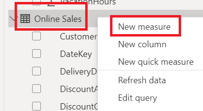

1. In the formula bar, write this DAX formula with the **CALCULATE** and **USERELATIONSHIP** functions.

    ```
    Total Sales By Delivery Date =
    CALCULATE (
        [Total Sales Amount],
        USERELATIONSHIP ( DimDate[DateKey], FactOnlineSales[DeliveryDate] )
    )

    ```

Learn more about [USERELATIONSHIP](https://docs.microsoft.com/dax/userelationship-function-dax)

---

# Security

Row level security (RLS) in Power BI is a feature that allows you to restrict data access for certain users based on filters that you define within roles. For example, you can limit sales data to specific regions or departments.

1. Make a new **Table** visual on the report canvas and add these columns from the table below.

    | Table | Column / Measure | 
    | :---- | :----- |
    | Employees | EmailAddress |
    | Stores | StoreName |
    | Online Sales | Total Sales Amount |  
    
    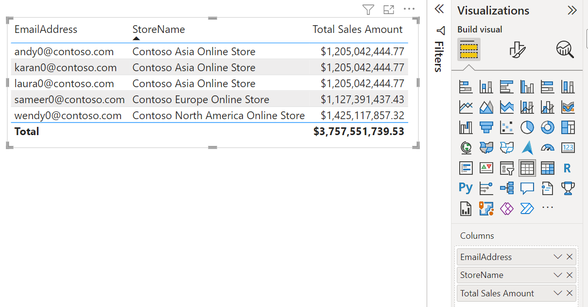

1. Go to the **Modeling** tab on the ribbon and click on **Manage roles** in the security group.

    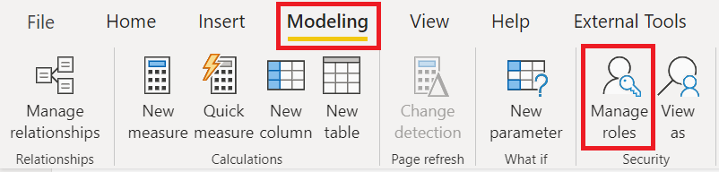

1. In the **Manage roles** window, click on **Create** and name our role **Employee Store**. Then choose the ellipses next to the **Employeess** table and pick the **[EmailAddress]** field.

    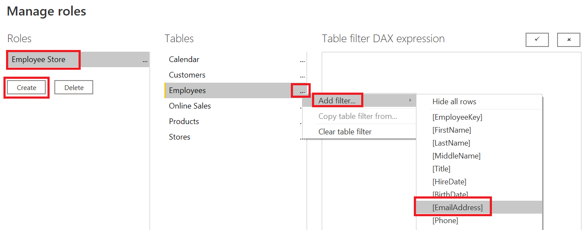

1. In the **Table filter DAX expression**, write this DAX expression below to get the user’s email when they access Power BI content. Click on the checkmark and then on **Save**.

    ```
    [EmailAddress] = USERPRINCIPALNAME()
    ```

    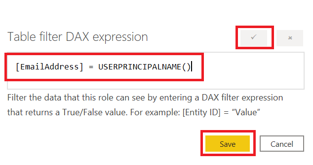

1. Go to the **Modeling** tab on the ribbon and click on **View as** in the security group.

    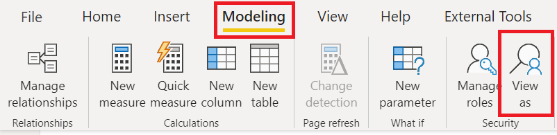

1. In the **View as roles** window, select **Other user** and enter a test value - for example, **"andy0@contoso.com"** - and choose the **Employee Store** role. Click on **OK** and check that only Andy’s results are shown. Then click on **Stop viewing** to return.

    

Learn more about [row level security](https://learn.microsoft.com/power-bi/enterprise/service-admin-rls)

---

# Publish to Power BI

1. On the **Home** tab, click on **Publish** and choose a non-production workspace. Click on **Select** button when done.
    1. <i>We can use the same workspace as in the data preparation lab for simplicity’s sake.</i>

    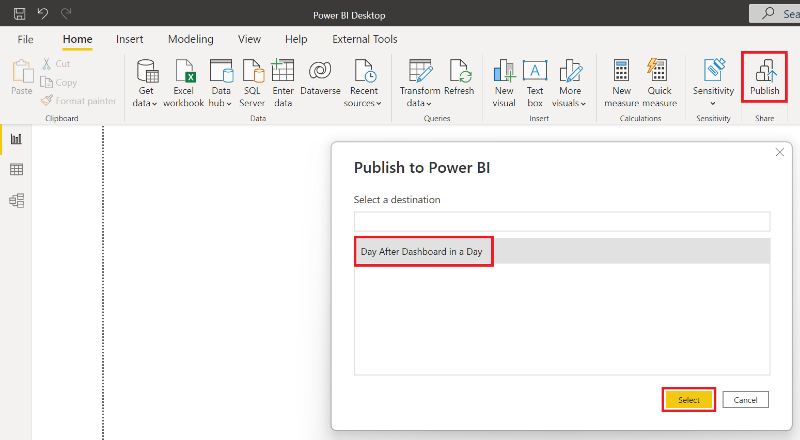

    ⚠️ **Important** ⚠️

    For enterprise scenarios, you may want to use different workspaces for dataflows, datasets and reports. For this workshop, we've used one workspace to keep it simple.
    
    Learn more about [managed self-service BI](https://learn.microsoft.com/power-bi/guidance/powerbi-implementation-planning-usage-scenario-managed-self-service-bi) and for a complete overview [Power BI implementation planning](https://learn.microsoft.com/power-bi/guidance/powerbi-implementation-planning-introduction)

---

# Next steps
This part of the lab showed you how to use storage modes and modeling options in Power BI Desktop for scalable solutions.

- Continue to the [Data Visualization](./DataVisualization.md) lab
- Return to the [Day After Dashboard in a Day](./README.md) homepage