# Data Modeling

For this portion of the lab, our task is to create a semantic model that queries data directly from the lake for our report consumers.

The data we've loaded is nearly ready for analytical reporting. We'll start by exploring the SQL endpoint, where we can write SQL statements to create views in our lakehouse. This will also include explorations where we can easily visualize results and share them with others.

Finally, we'll create a semantic model, which is a metadata model that abstracts and modifies physical database objects into logical objects. This model is designed to present data for analysis in a way that aligns with the structure of the business.

---

## SQL analytics endpoint

With the SQL endpoint, you can run ad-hoc SQL queries on your tables and visualize the results using explorations or build a complete Power BI reports, all within a browser across any operating system.

### Query lakehouse tables with SQL

1. While in the lakehouse explorer for the **c_IADLake** item, select the **Lakehouse** button in the top right and choose the **SQL analytics endpoint** option to switch editors.

    

1. In the **Explorer** pane, click the ellipses **(...)** next to the **DimCustomer** table, then **New SQL query** and **Select Top 100**.

    

1. In the query editor, a SELECT TOP (100) query will be generated for you. You can either save this as a view within your warehouse or modify the statement. For now, highlight the entire query text and select the **Explore this data** option.

    

    > [!NOTE]
    > Your queries will be saved in the My queries group. If you want to share these queries with collaborators in your workspace, right-click them and select the option Move to shared queries to move them to the Shared queries section.

1. You can now drag and drop fields from your ad-hoc query and design an exploration with Power BI visuals. For example, add **CityName** to the y-axis and **YearlyIncome** to the x-axis. Then, select the caret next to **YearlyIncome** to change the **Summarization** to **Average** to answer the question, "What is the average yearly income by city?" (based ont the TOP 100 results from our query).

    Once complete, select the **X** in the top right to exit.

    

    > [!IMPORTANT]
    > If you save this visual, it will result in a new exploration item being added to your workspace. Explorations can be useful when addressing a single question or monitoring a single item, as opposed to creating a full report.

1. Finally, switch from the **SQL analytics endpoint** view back to the **Lakehouse** view by selecting the toggle in the top right corner. In the next section, we will focus on modeling our data and preparing it for analysis.

    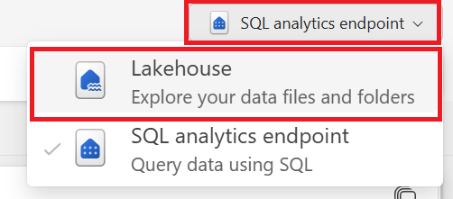

## Create a semantic model

A semantic model, is a metadata model that contains physical objects that are abstracted and modified into logical dimensions. It's designed to present data for analysis according to the structure of the business.

### Create relationships

In this section of the lab, we will create a star schema model, which is commonly used in data warehousing. In this model, the center of the star is a **Fact** table, and the surrounding tables are called **Dimension** tables, which are related to the **Fact** table through relationships.

It is recommended to strive for the **right number of tables** with the **right relationships** in place.

[Learn more about the star schema and the importance for Power BI](https://docs.microsoft.com/power-bi/guidance/star-schema)

---

1. From the **Home** tab, select **New semantic model**.

    

1. In the New semantic model window, update the **Name** to **SalesDirectLakeModel**. From the object explorer, start by expanding the chevron next to the schema dbo and then select the check mark next to **Tables** to ensure all the tables listed below are included. Click **Confirm**.

    **Note:** You can also select individual tables instead of the full schema.

    | Object Name |
    | :-- |
    | DimCustomer |
    | DimDate |
    | DimEmployee |
    | DimProduct |
    | DimStore |
    | FactOnlineSales |

    

    > [!NOTE]
    >A new browser window will open with the created semantic model. If you have pop-ups disabled, return to your workspace and open the semantic model by selecting its name and then the ellipses **(...)** and **Open data model**.

1. Once in the model view, create a relationship between the **FactOnlineSales** table and the **DimCustomer** table by dragging and dropping the column **CustomerKey** from the **FactOnlineSales** table to the **CustomerKey** on the **DimCustomer** table.

    

1. From the **Create Relationship** window, ensure that you have selected the correct tables, columns, and settings as shown in the following table. Click **Confirm** to continue.

    | Make this relationship active | From: Table 1 (column) | To: Table 2 (column) | Cardinality | Assume referential integrity | Cross filter direction |
    | :----- |:----- | :------ | :----- | :----- |  :----- | 
    | ☑ | FactOnlineSales (CustomerKey) | DimCustomer (CustomerKey) | Many to one (*:1) | ☑ | Single |

    

    > [!IMPORTANT]
    > The **Assume referential integrity** selection enables running more efficient queries by using INNER JOIN statements rather than OUTER JOIN. This feature is only available when using Direct Lake and DirectQuery connectivity modes.

    Learn more about [Referential integrity](https://docs.microsoft.com/power-bi/connect-data/desktop-assume-referential-integrity)

1. From the **Home** tab, select the **Manage relationships** option. For each of the items listed below, select **New relationship** and configure the relationships for each of the remaining tables and columns. Once complete, select **Close**.

    

    | Make this relationship active | From: Table 1 (column) | To: Table 2 (column) | Cardinality | Assume referential integrity | Cross filter direction |
    | :----- |:----- | :------ | :----- | :----- | :----- |
    | ☑ | FactOnlineSales (ProductKey) | DimProduct (ProductKey) | Many to one (*:1) | ☑ | Single |
    | ☑ | FactOnlineSales (StoreKey) | DimStore (StoreKey) | Many to one (*:1) | ☑ | Single |
    | ☑ | FactOnlineSales (DateKey) | DimDate (DateKey) | Many to one (*:1) | ☑ | Single |
    |  | FactOnlineSales (DeliveryDate) | DimDate (DateKey) | Many to one (*:1) | ☑ | Single |
    | ☑ | DimEmployee (StoreKey) | DimStore (StoreKey) | Many to one (*:1) | ☑ | Both |

     The following image shows a finished view of the semantic model with all the created relationships included.

    

    > [!NOTE]
    > The DimDate table is a "role-playing dimension," which is a dimension that can filter related facts differently. At query time, the "role" of the dimension is established by which fact column you use to join the tables.

    Learn more about [role-playing dimensions](https://learn.microsoft.com/power-bi/guidance/star-schema#role-playing-dimensions)

1. In the **Properties** pane, locate the **Pin related fields to top of card** option and set it to **Yes**. This will display the relationship keys at the top of each table, making it easier to visually inspect them.

    

    We've successfully modeled our semantic model into a proper star schema using Direct Lake connectivity mode within Microsoft Fabric. This approach offers several benefits, including direct data access to lakehouse tables and blazing-fast query performance.

    By leveraging Direct Lake, we can ensure that our data is always readily available for analysis, providing a seamless and efficient experience for our report consumers.

## DAX (Data Analysis Expresssion) formulas

Data Analysis Expressions (DAX) is a library of functions and operators that can be combined to build formulas and expressions in Microsoft Fabric, Power BI, Analysis Services, and Power Pivot in Excel data models.

Learn more about [DAX](https://learn.microsoft.com/dax/)

---

1. To create a new measure in the FactOnlineSales table, follow these steps:

    - Select the **FactOnlineSales** table in the **Tables** list.
    - On the **Home** tab, select **New measure**.

    

    > [!NOTE]
    > You can also right click the table name and select **Create measure** from the options menu.

1. In the formula editor, copy and paste or type the following measure to calculate the total sales amount. Select the **check mark** to commit.

    ```dax
    Total Sales Amount = SUM(FactOnlineSales[SalesAmount])
    ```

    

1. Perform these same steps for each of the formulas below. Once complete, all three measures will now be located in the **FactOnlineSales** table.

    ```dax
    Total Items Discounted = SUM(FactOnlineSales[DiscountQuantity])
    ```

    ```dax
    Total Return Items = SUM(FactOnlineSales[ReturnQuantity])
    ```

    

### SAMEPERIODLASTYEAR

Data Analysis Expressions (DAX) includes time-intelligence functions that enable you to manipulate data using time periods, including days, months, quarters, and years, and then build and compare calculations over those periods.

Learn more about [time intelligence functions](https://learn.microsoft.com/dax/time-intelligence-functions-dax)

---

1. To add a **[Total Sales SPLY]** measure, leveraging our **DimDate** table and our DateKey column, select the **FactOnlineSales** table in the Tables list. On the Home tab, select **New measure** and in the formula editor, copy and paste or type the following measure to calculate the total sales amount. Select the **check mark** to commit.

    ```dax
    Total Sales SPLY = CALCULATE([Total Sales Amount], SAMEPERIODLASTYEAR(DimDate[DateKey]))
    ```

    > [!NOTE]
    > We want to change our filtering context by using **CALCULATE**, and looking at the values within the current period and comparing them with the previous year.

1. To account for incomplete data where no sales occurred, include variables to determine values that are not blank and an **IF** condition for the applicable TRUE/FALSE branches. 

    - Select the measure created in the previous step in the **Data** pane and update the formula in the formula editor by either copy and paste or typing the following measure updates. Select the **check mark** to commit.:

    ```dax
    Total Sales SPLY = 
    VAR _hassalesdata =
        NOT ( ISBLANK ( [Total Sales Amount] ) )
    RETURN
        IF (
            _hassalesdata,
            CALCULATE ( [Total Sales Amount], SAMEPERIODLASTYEAR (DimDate[DateKey] ) ),
            BLANK ()
        )
    ```

Learn more about [SAMEPERIODLASTYEAR](https://learn.microsoft.com/dax/sameperiodlastyear-function-dax)

### USERELATIONSHIP

To filter by the order date and the delivery date from our **FactOnlineSales** table, we need to control the active relationship in our measure. For this, we’ll leverage the **[USERELATIONSHIP](https://docs.microsoft.com/dax/userelationship-function-dax)** function within DAX to enable the relationship between our **DimDate** table’s **DateKey** and the **FactOnlineSales** table’s **DeliveryDate** with the below formula.

1. From the **Date** pane, right-click the **FactOnlineSales** table and select **New measure**.

    

1. In the formula bar we'll write the following DAX function and using the **CALCULATE** function, we'll change our current filtering context - with the **USERELATIONSHIP** function. Either copy and paste or type the following measure and select the **check mark** to commit.

    ```dax
    Total Sales By Delivery Date =
    CALCULATE (
        [Total Sales Amount],
        USERELATIONSHIP ( DimDate[DateKey], FactOnlineSales[DeliveryDate] )
    )
    ```

    

### Time intelligence calculation group

In this section of the lab, we will focus on creating a Time Intelligence Calculation group. Calculation groups are a powerful feature that allows you to define reusable calculations, such as time-based aggregations, which can be applied across multiple measures in your semantic model. This reduces redundancy and ensures consistency in your calculations.

By the end of this lab, you will have created a calculation group that includes measures for Total, Month to Date (MTD), Quarter to Date (QTD), and Year to Date (YTD). These measures will enable you to perform time-based analysis on your data, providing valuable insights into trends and patterns over different time periods.

---

1. To begin, from the **Home** tab, select **Calculation group**.

    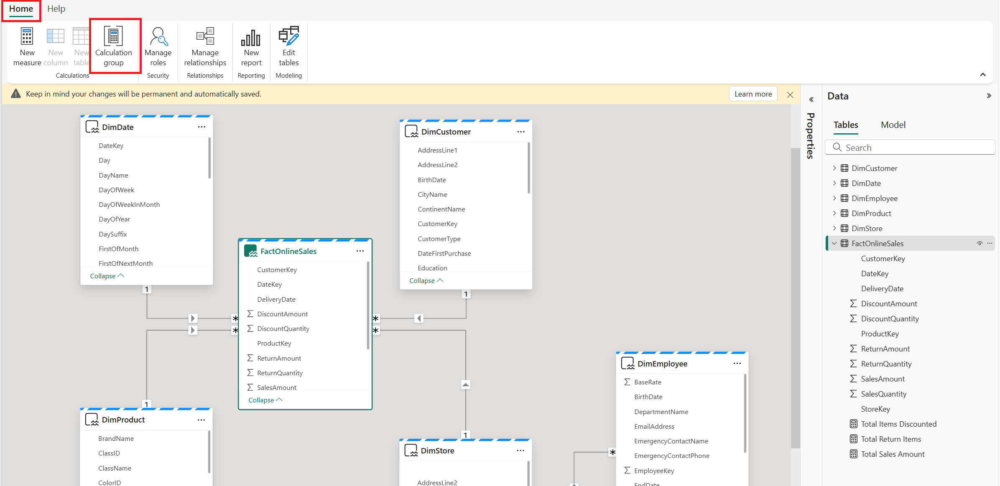

1. A window will pop up notifying you that implicit measures will be disabled, and you will need to create explicit DAX measures for aggregations. Select **Yes** to continue. 

    **Note:** Any field with the sigma symbol will be disabled and will no longer be automatically aggregated if you drag and drop it onto the canvas.

    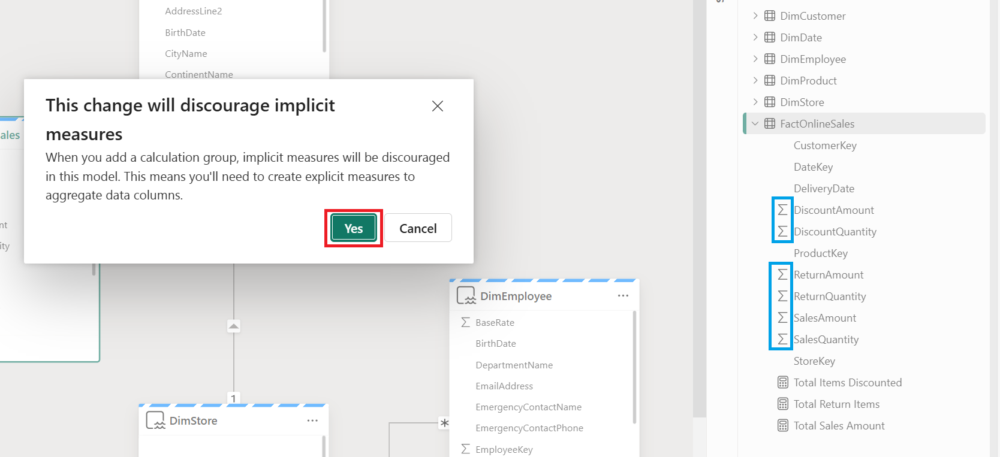

1. A new calculation group will be created for you, and the new Model object explorer will be displayed. From the formula bar, update the name of the measure from **Calculation item** to **Total** and then select the check mark to continue.

    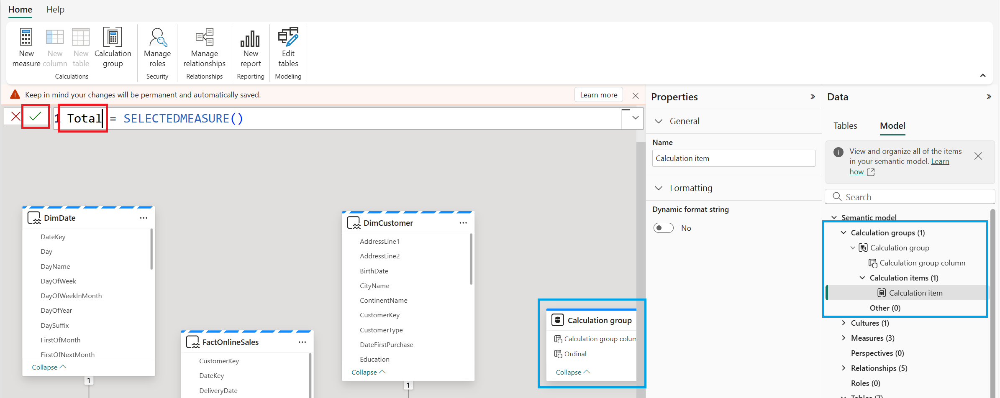

1. Next, right-click the **Calculation items** group and select **New calculation** item.

    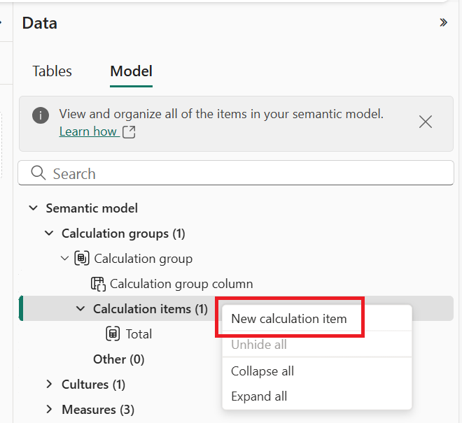

1. WWithin the new formula bar, enter the following DAX formula for Month to Date (MTD):

    ```dax
    MTD = TOTALMTD(SELECTEDMEASURE(), DimDate[DateKey])
    ```

    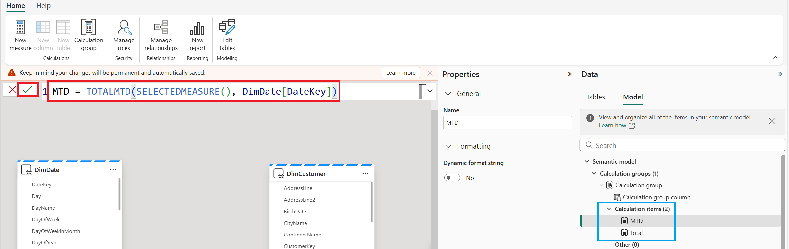

1. Repeat the previous steps to create new calculation group items for the following DAX formulas:

    **Quarter to date**

    ```dax
    QTD = TOTALQTD(SELECTEDMEASURE(), DimDate[DateKey])
    ```

    **Year to date**
    ```dax
    YTD = TOTALYTD(SELECTEDMEASURE(), DimDate[DateKey])
    ```

1. Select the **Calculation group** item and, within the properties pane, reorder the **Calculation item order** to Total, MTD, QTD, and YTD.

    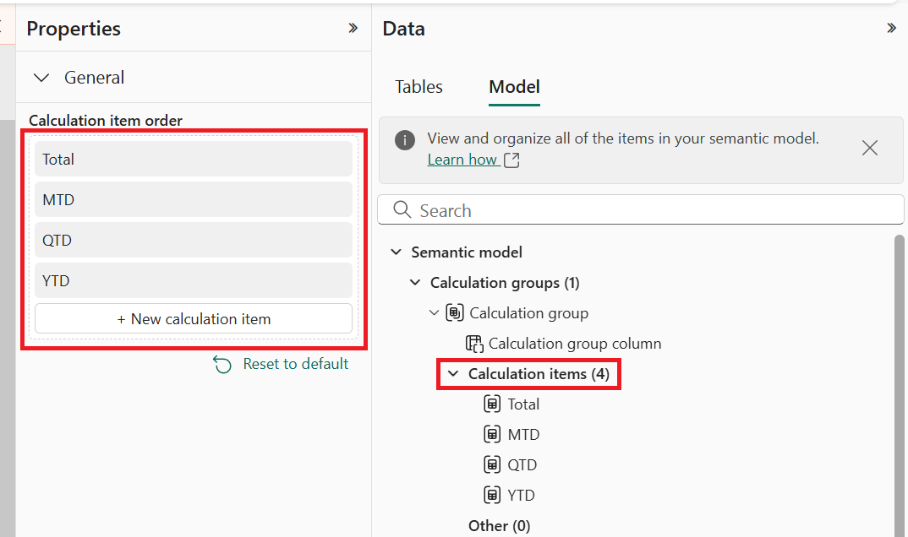

1. Finally, select the Calculation group within the Model explorer and, within the Properties pane, update the name to **Total by period**.

    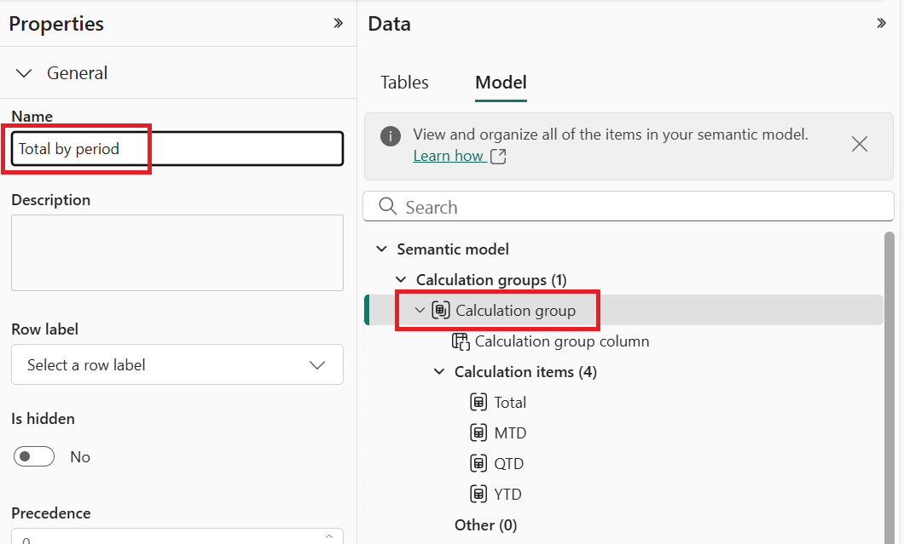

---

## Semantic model properties

An important aspect of data modeling is usability, which involves extending our semantic model with rich metadata for its contents. Documenting your model and applying properties ensures consistency and prepares your semantic model to serve business users with meaningful details without having to delve into the technical details.

---

### Row label

The Row label property is a field that identifies the column that represents a single row in a table. As an example, the Row label property can be used to ensure that two users with the same name are not aggregated into a single record. By setting the Row label property to a field in your data that uniquely identifies each user, such as an ID number, you can keep their records separate.

1. From the **Data** pane select the **DimEmployee** table and within the **Properties** pane set the **Row label** to the **EmployeeKey** field.

    

---

### Sort by

1. In the **Data** pane, select the **MonthName** column in the **DimDate** table, navigate to the **Properties** pane and expand the **Advanced** section.

    | Table | Column |
    | :---- | :----- |
    | DimDate | MonthName |  

    

1. Locate the **Sort by Column** option and select the **Month** (which is an integer number) column from the available fields. This will update the sort order of fields in your dataset using the integer values from smallest to largest.

    

    > [!IMPORTANT]
    > Even if your organization’s calendar does not start in January, you can still utilize this feature to sort order data. You would simply want to start the name (text) along with the sort by (number) in the appropriate order.
    > **Ex.** (1 = June, 2 = July, etc.)

Learn more about [Sort by column](https://learn.microsoft.com/power-bi/create-reports/desktop-sort-by-column)

---

### Data category

Data categorization is a feature in Power BI that allows you to specify the data category for a column so that Power BI knows how to treat its values when creating a visualization. For example, when a column is categorized as containing geographic values, Power BI Desktop assumes you’ll probably use it to visualize locations and instantly selects a map when creating a new visualization.

---

1. From the **Data** pane we'll select the field name from the **DimCustomer** table and within the **Properties** expand the **Advanced** section, to update the **Data category** value from the options below:

    | Field | Data category |
    | :--- |  :--- |
    | RegionCountryName | Country/Region |
    | StateProvinceName | State or Province |

    

Learn more about [data categorization](https://learn.microsoft.com/power-bi/transform-model/desktop-data-categorization)

---

### Display folder

You can also organize measures in a table into display folders to assist in organization.

- You can create subfolders by using a backslash character. For example, Finance\Currencies creates a Finance folder and within it, a Currencies folder.

- You can make a field appear in multiple folders by using a semicolon to separate the folder names. For example, Products\Names;Departments results in the field appearing in a Departments folder and a Names folder inside a Products folder.

---

1. From the **Data** pane select the following measures from the table below and within the **Properties** pane add the text **Measures** into the **Display folder** field.
    > [!NOTE]
    > To bulk select fields/measures, hold and select **Shift** on the keyboard for adjacent fields, or hold **Ctrl** to select individual fields.

    | Table | Field |
    | :-- | :-- |
    | FactOnlineSales | Total Items Discounted |
    | FactOnlineSales | Total Returned Items |
    | FactOnlineSales | Total Sales Amount |

    

1. Within our **Data** pane, our measures are now displayed within a folder - this will help with managing like items in our tables and also when users connect to our semantic model this ensure a seamless experience in which to locate calculations.

    

Learn more about [organizing your measures](https://learn.microsoft.com/power-bi/transform-model/desktop-measures#organizing-your-measures)

---

## Semantic model settings

By default, OneLake automatically updates Direct Lake semantic models with any data changes. However, you may want to disable this feature if you need to complete data preparation jobs before exposing new data to consumers of the dataset. To disable this feature, follow the steps below:

---

1. From the side-rail, select the name of your workspace to return to the workspace item list.

    

attach-semantic-model-to-task

assign-model-to-curated-item


1. Select the ellipses **(...)** next to **SalesDirectLakeModel** and click **Settings**.

    

1. Expand the **Refresh** settings and update the **Keep your Direct Lake data up to date** setting from the default **On** to **Off** and select **Apply** within the group once complete.

    

1. Expand the **Q&A** settings and update the **Turn on Q&A to ask natrual language questions about your data** setting to **On**.

    

1. Return to the workspace view by selecting it on the left side rail.

    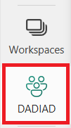

### Add semantic model refresh activity to data pipeline

1. First, select the **Collect data** task to filter the workspace list to only the attached items, and then choose the **contosoSample** data pipeline.

    

1. From the **Activities** tab, select the **Semantic model refresh** activity to add it to the authoring canvas.

    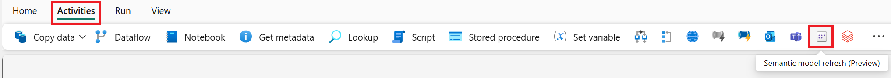

1. Next, create a connection using the **On success** conditional path between the **Refresh PrepContoso** activity and the newly added semantic model refresh activity. Once complete, select the semantic model refresh activity to make it the active selection. Then, within the **General** settings, update the **Name** property to **Refresh SalesDirectLakeModel**.

    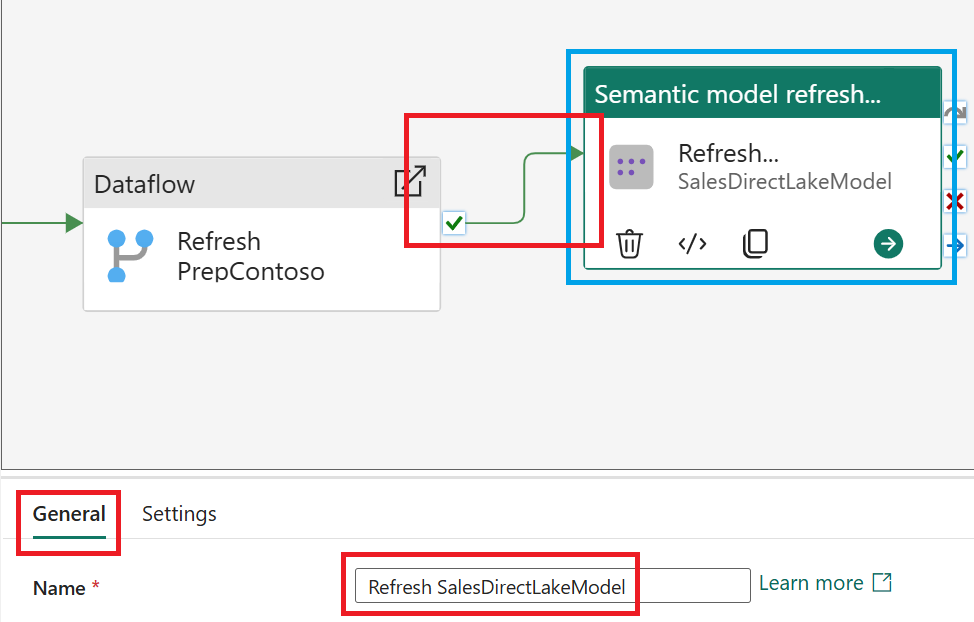

1. With the semantic model refresh activity still selected, navigate to the **Settings** tab. If necessary create a new connection to return all semantic models that you have access to within the tenant, update the workspace and then set the Semantic model to **SalesDirectLakeModel**.

    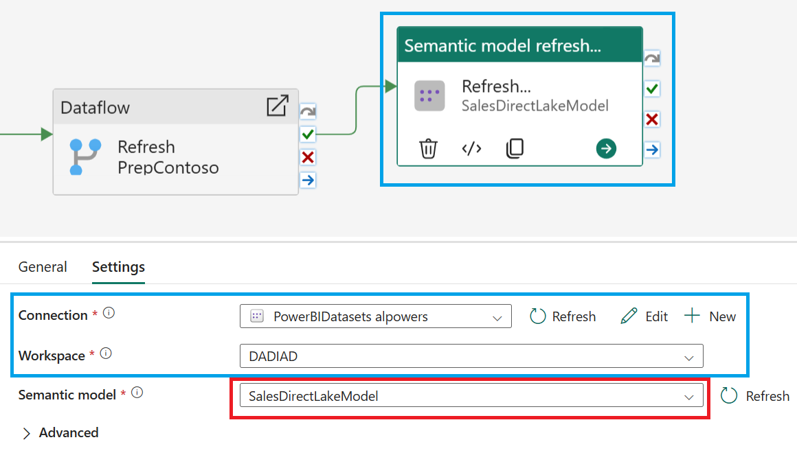

1. Once you have completed the previous steps, select the **Save** option from the **Home** tab. Then, click on the workspace name on the left side rail to continue with the lab instructions.

    **Note:** You can also hover over the items on the left side rail and select the **X** to close the multitasking items.

    

---

# Next steps
We hope this portion of the lab has shown how editing data models in Microsoft Fabric can offer a flexible and optimized experience for building scalable enterprise solutions.

- Continue to the [Data Visualization](./DataVisualization.md) lab
- Return to the [Day After Dashboard in a Day](./README.md) homepage
