# Data Preparation

✏️ Lab scenario
---

For this portion of the lab, we've been tasked with collecting and combining daily files that are being shared with us in a cloud directory. The total number of files that will be added to this location will continue to grow over time, which we will need to account for when developing a [future proofed](https://docs.microsoft.com/power-query/best-practices#future-proofing-queries) data preparation solution.

### Premium license mode

Before we begin, we'll want to navigate to a new, empty or non-production workspace and confirm that a capacity has been assigned, if not we'll use this opportunity to enable the option by selecting one of the below values.

1. In the top right corner of the workspace, select the **Settings** option.
1. In the **Settings** pane, select the **Premium** tab and verify one of the following licensing modes listed below has been enabled.

    **License mode:**
    - [Premium per user](https://docs.microsoft.com/power-bi/admin/service-premium-per-user-faq)
    - [Premium per capacity](https://docs.microsoft.com/power-bi/admin/service-premium-gen2-faq)
    - [Embedded](https://docs.microsoft.com/power-bi/developer/embedded/embedded-capacity)

    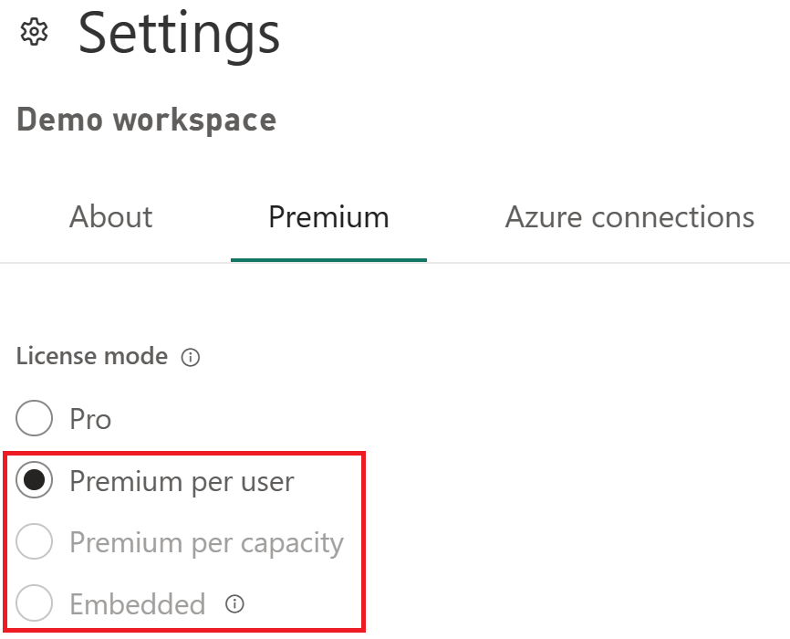

# Dataflows

Using dataflows and self-service data prep supports the following scenarios by:

1. Promoting a single source of the truth, with greater control over which data is accessed and exposed to creators.

1. Preventing others from having direct access to the underlying data sources and reducing the load to the underlying systems. Giving administrators finer control of when the systems get loaded from refreshes.

1. Enabling the ability to create reusable transformation logic and curated views of your cloud or on-premise data sources, which can then be seamlessly shared and integrated with other Microsoft services and products (Power BI, Power Apps, and Dynamics 365 Customer Insights).

[Learn more about dataflows and self-service data prep](https://docs.microsoft.com/power-bi/transform-model/dataflows/dataflows-introduction-self-service)

---

## Import dataflow model

For this portion of the lab, we'll use an existing dataflow model as our starting point to skip over the more familiar steps of **Get data** > from **CSV** to focus on more advanced transformation patterns.

Once our dataflow model has been imported and refreshed it will enable discovery across other Microsoft products and services. This semantic information includes the table names, column names, metadata descriptions and much more as part of a [metadata file (model.json)](https://docs.microsoft.com/common-data-model/model-json) format.

1. In the top left of the workspace select **New** and then the **Dataflow** option.

    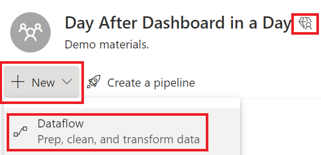

1. From the **Start creating your dataflow** screen, select the **Import Model** option and import an the dataflow json file using the url below.

    ```
    https://raw.githubusercontent.com/microsoft/pbiworkshops/main/Day%20After%20Dashboard%20in%20a%20Day/Source_Files/Dataflow%20demo.json
    ```

    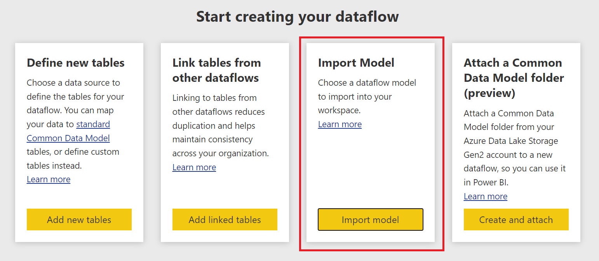

## Edit dataflow credentials

Because the lab files are stored in a publicly accessible [GitHub repository](./Source_Files/), we will authenticate anonymously and skip our test connection to ensure that we can successfully connect to and ingest the lab data.

1. Once the import has successfully completed, we can now select the **Edit credentials** button from the toast notification in the top right.
    1. Alternatively within the workspace we can select the vertical ellipses ( ⋮ ) adjacent to the dataflow name and the **Settings** option to configure.

    

1. Within the Settings page for the dataflow, expand the **Data source credentials** section and select the **Edit credentials** link next to the **Web** source. Once in the **Configure...** dialog window we can set the following values below and **Sign in** once complete:
    1. Authentication method | **Anonymous**
    1. Privacy level setting for this data source | **Public**
        1. To learn more, see [Power Query privacy level settings](https://docs.microsoft.com/power-bi/admin/desktop-privacy-levels#configure-a-privacy-level)
    1. ☑️ **Skip test connection**

    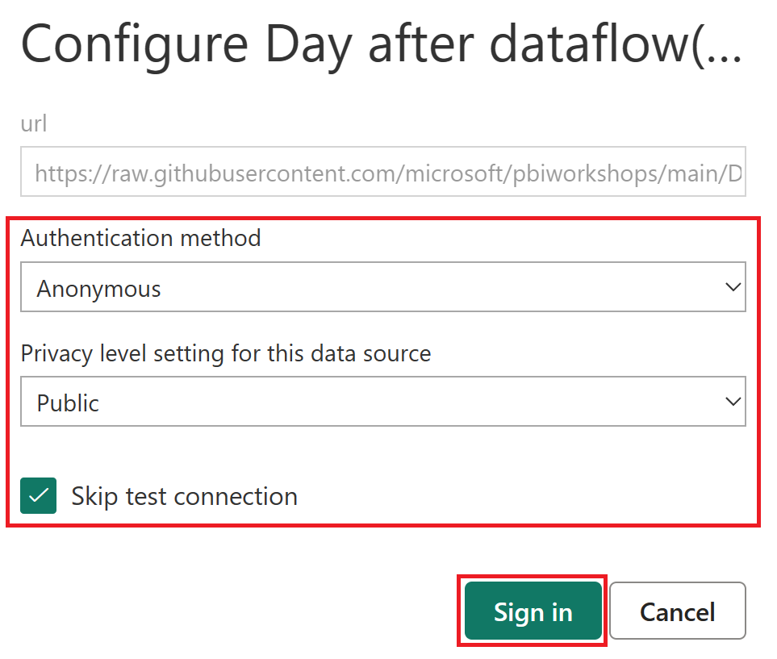

## Enhanced compute engine settings

The enhanced compute engine in Power BI enables Power BI Premium subscribers to use their capacity to optimize the use of dataflows.

Using the enhanced compute engine provides the following advantages:

1. Drastically reduces the refresh time required for long-running ETL steps over computed tables, such as performing joins, distinct, filters, and group by.
1. Performs DirectQuery queries over tables.

[Learn more about the enhanced compute engine](https://docs.microsoft.com/power-bi/transform-model/dataflows/dataflows-premium-features?tabs=gen2)

1. Within the **Enhanced compute engine settings** change the setting to **On** and select the **Apply** button once complete.

    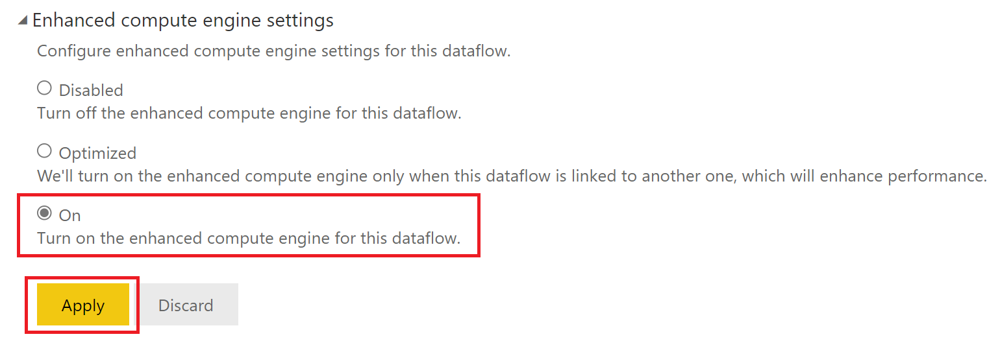

1. Within the workspace select the **Refresh now** option of the dataflow for the change to take effect.

    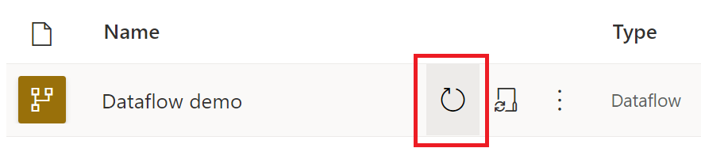

---
# Power Query Online

## Global options

With our dataflow successfully imported and credentials set, we'll now configure some settings for authoring in the Power Query Online interface which will also persist the next time we need to author new content.

---

1. From the group workspace, select the ellipses (...) adjacent to the dataflow name and then the **Edit** option.

    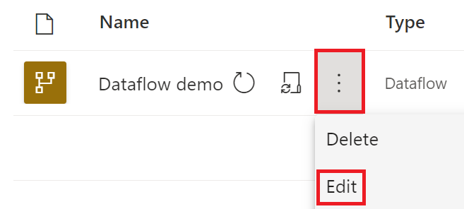

1. To update the dataflow model in the top right we'll select the **Edit tables** option to navigate into the Power Query Online experience.

    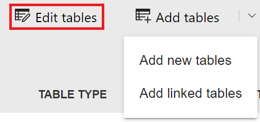

1. From the **Home** tab, select the **Options** > **Global options** property.

    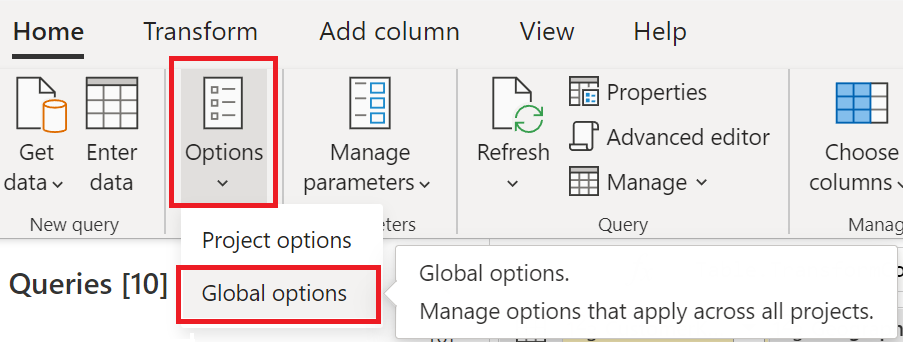

1. Within the **Global options** window ensure the following settings are enabled and select **OK** once complete.

    **Steps**
    1. Enable step cost indicators
    1. Show script in step callout

    **Column profile**
    1. Enable column profile
    1. Show column value distribution in data preview
    1. Show column value distribution in data preview
    1. Show column profile in details pane

    **Type detection**
    1. Never detect column types and headers for unstructured sources

    **Parameters**
    1. Always allow parameterization in data source and transformation dialogs

    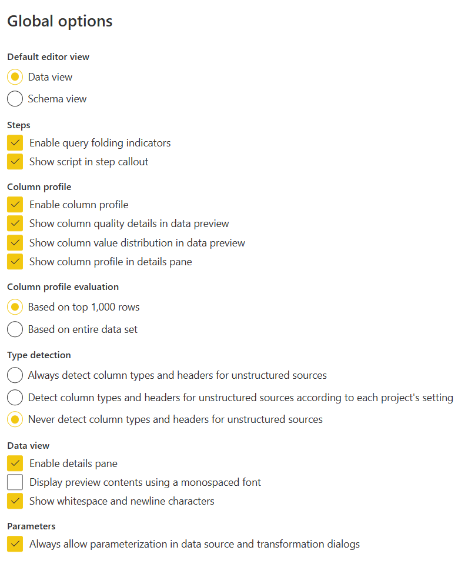

---

## Data view

WRITE UP FOR DATA VIEW

---

1. From the **Queries** pane, right click the **DimCustomer_raw** query and select **Reference** from the menu.
    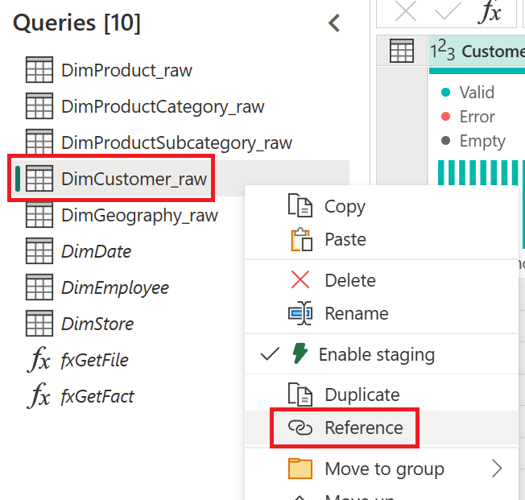

1. Inspect the **Queries** pane again and notice that a new query titled **DimCustomer_raw (2)** has now been created, with a lightning bolt icon (⚡) indicating that this is a computed table. 
    
    This query will leverage the enhanced compute engine which can drastically reduces refresh time required for long-running data preparation steps - such as performing joins between tables.
    
    

1. With the **DimCustomer_raw (2)** query selected, navigate to the **Home** tab and select the **Merge queries** option.

    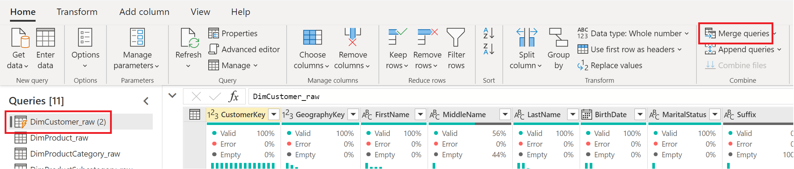

1. In the **Merge** window complete the following steps and then select **OK** when complete.

    | Merge | Table | Column |
    | :--- | :---- | :--- | 
    | Left table for merge | DimCustomer_raw (2) | GeographyKey |
    | Right table for merge | DimGeography_raw | GeographyKey |

    1. Set the **Join kind** to **Inner**

    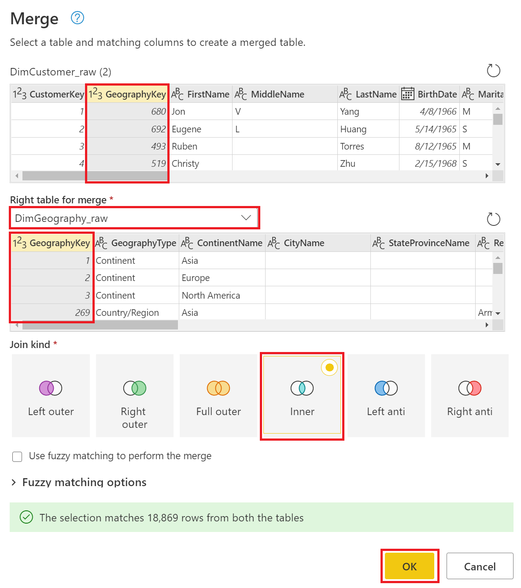

1. Within the data view, navigate to the **DimGeography_raw** column and select the **Expand** icon. Deselect the **GeographyKey** since we this column already exists in our original query and then select **OK**.

    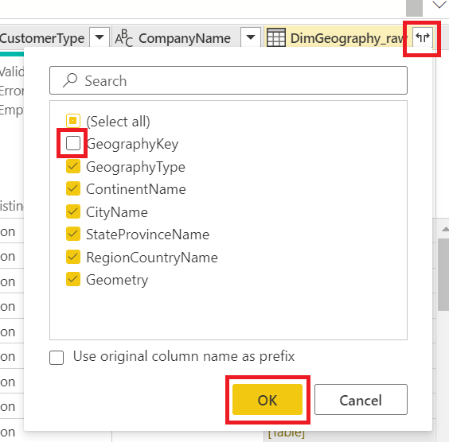

1. From the **Home** tab select the drop down next to **Choose columns** and then the **Go to column** option (Shorcut: Ctrl+G). 

    Within the search dialog type the column name **GeographyKey** until a result has been returned, you can then either double click the name or press **OK** to continue.

    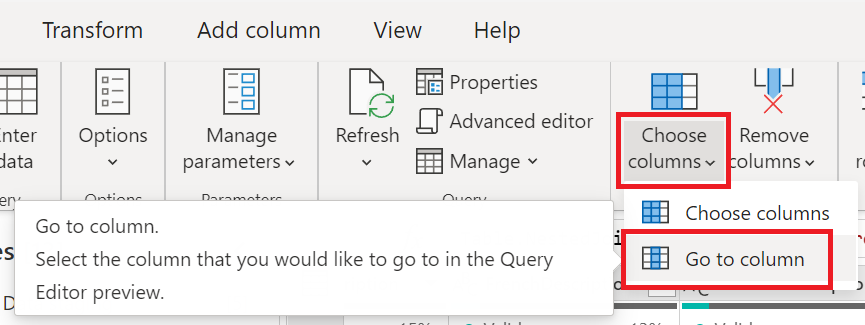

1. With the **GeographyKey** selected (highlighted) in the data view, right click the column and select **Remove columns**.

    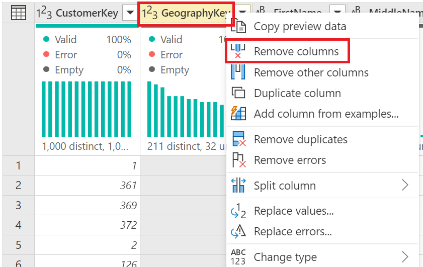

1. Within the **Query settings** pane, update the name of our query from **DimCustomer_raw (2)** to the name **DimCustomer**.

    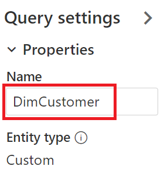

Now that our data is being ingested and stored in our dataflow's [Azure Data Lake Storage Gen2](https://docs.microsoft.com/azure/storage/blobs/data-lake-storage-introduction), we'll leverage [computed tables](https://docs.microsoft.com/power-query/dataflows/computed-entities-scenarios) to apply transformation logic via the enhanced compute engine.

[Learn more about the benefits of loading data without transformation for Text/CSV files](https://docs.microsoft.com/power-query/dataflows/computed-entities-scenarios#load-data-without-transformation-for-textcsv-files)

---
## Diagram view

The diagram view in Power Query Online offers a visual way to prepare data in the Power Query editor. With this interface it simplifies the experience of data preparation by helping users quickly understand the flow of data, both in the "big picture view" of how their queries are related and in the "detailed view" of the specific data preparation steps in a query.

Learn more about [diagram view](https://docs.microsoft.com/power-query/diagram-view).

---

1. In the bottom right of the **Power Query** editor, select the **Diagram view** option.

    

1. Select the **Actions** option ( ⋮ ) at the top right of the **DimProduct_raw** table and select the **Merge queries as new** option.

    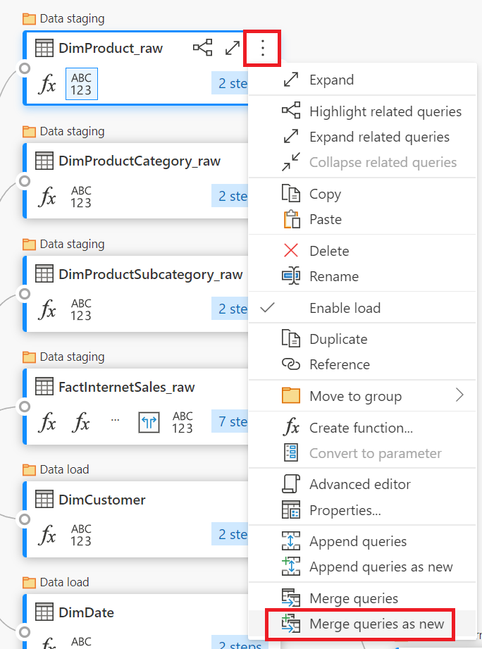

1. In the **Merge** window complete the following steps and then select **OK** when complete.

    | Merge | Table | Column |
    | :--- | :---- | :--- | 
    | Left table for merge | DimProduct_raw | ProductSubcategoryKey |
    | Right table for merge | DimProductSubcategory_raw | ProductSubcategoryKey |

    1. Set the **Join kind** to **Inner**

    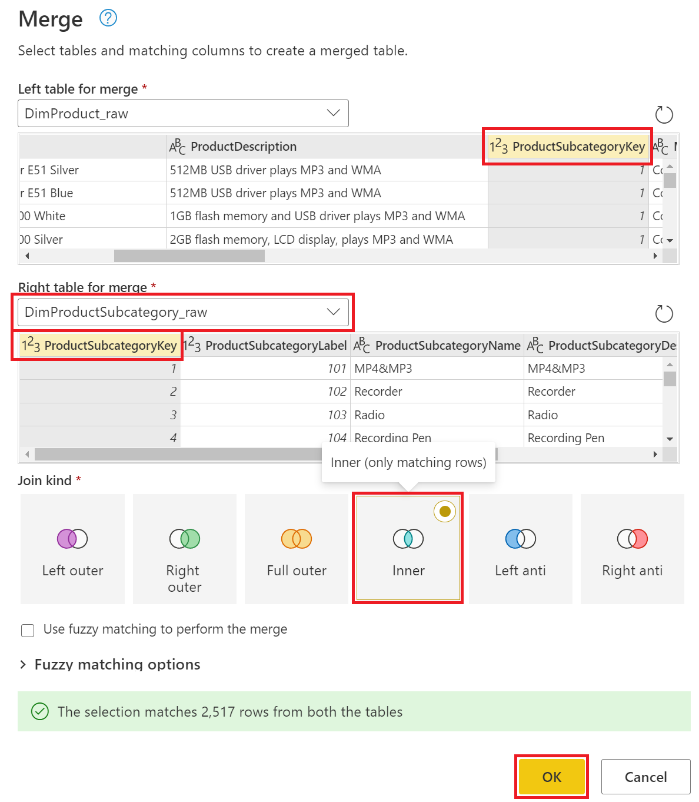

1. From the **Home** tab select the drop down next to **Choose columns** and then the **Go to column** option (Shorcut: Ctrl+G). 

    Within the search dialog type the column name **DimProductSubcategory_raw** until a result has been returned, you can then either double click the name or press **OK** to continue.

    

1. In the top right of the **DimProductSubcategory_raw** column - we'll select the expand columns icon and complete the following steps below:
    1. Disable the **ProductSubcategoryKey** column since this column already exists in our original **DimProduct_raw** table.
    1. Select only the **ProductSubcategoryName** and **ProductCategoryKey** columns.
    1. Disable the **Use original column name as prefix** option (if enabled).
    1. Select **OK** once complete.
    
    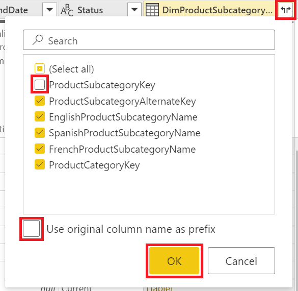

1. After the **Expanded DimProduct** step, select the **"+"** icon to insert a new step and complete the following steps below.
    1. Within the transformations search, type **Merge**.
    1. Select the **Merge queries** option from the list.

    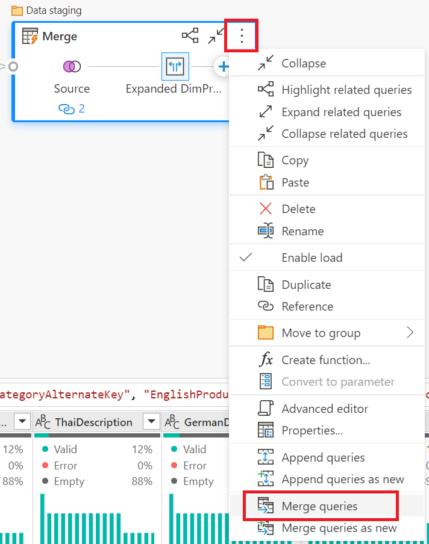
    
1. In the **Merge** window complete the following steps and then select **OK** when complete.

    | Merge | Table | Column |
    | :--- | :---- | :--- | 
    | Left table for merge | (Current) | ProductCategoryKey |
    | Right table for merge | DimProductCategory_raw | ProductCategoryKey |

    1. Set the **Join kind** to **Inner**

    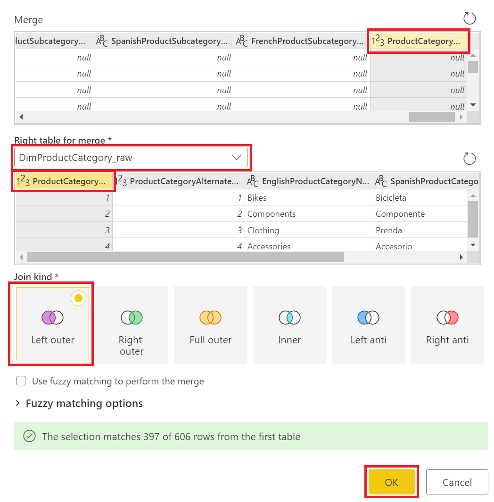

1. In the top right of the **DimProductCategory_raw** column - we'll select the expand columns icon and disable the **ProductCategoryKey** column since this column already exists in our **DimProductSubcategory_raw** table, disable the **Use original column name as prefix** option and then select **OK** when complete.

1. In the top right of the **DimProductCategory_raw** column - we'll select the expand columns icon and complete the following steps below:
    1. Deselect all columns except **ProductCategoryName**.
    1. Disable the **Use original column name as prefix** option (if enabled).
    1. Select **OK** once complete.

    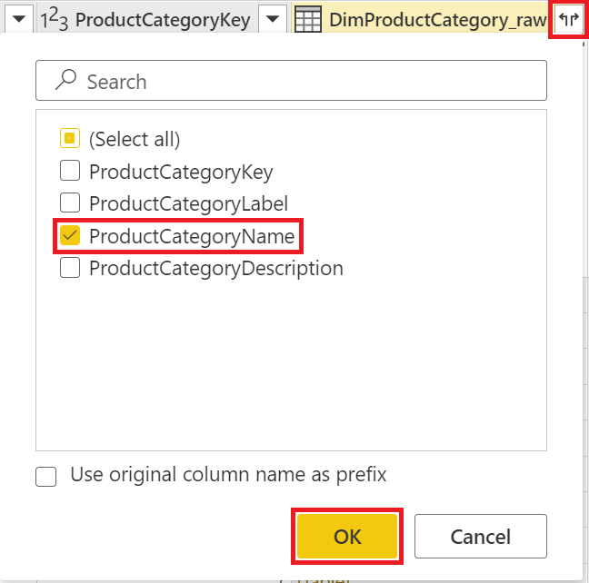

## Schema view

Schema view is designed to optimize your flow when working on schema level operations by putting your query's column information front and center. Schema view provides contextual interactions to shape your data structure, and lower latency operations as it only requires the column metadata to be computed and not the complete data results.

Learn more about [Schema view](https://docs.microsoft.com/power-query/schema-view)

---

1. In the bottom right of the **Power Query** editor, select the **Show schema view** option.

    

1. Select the **Merge** query and complete the following steps below:
    1. Select the **ProductSubcategoryKey** and **ProductCategoryKey** column names from the schema list.
    1. Navigate to the **Schema tools** tab and select the **Remove columns** option.
    
        **Note:** You can maximize or minimize the view by selecting the chevrons next to the formula bar.
    
    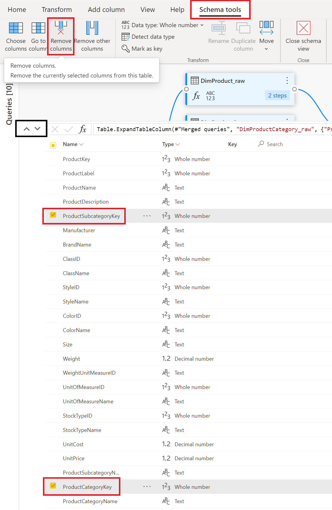

1. Select the **DimProductCategory_raw** query and complete the following steps below:
    1. Select the **ProductCategoryKey** column name from the schema list.
    1. Navigate to the **Schema tools** tab and select the **Mark as key** option.

    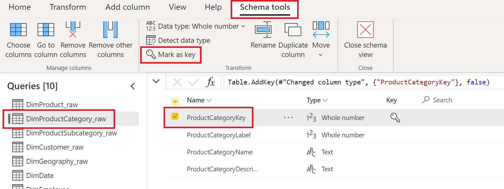

    1. Within the formula bar, update the [Table.AddKey()](https://docs.microsoft.com/powerquery-m/table-addkey) **isPrimary** value from **false** to **true**.
    
    ``` powerquery-m
        Table.AddKey(#"Changed column type", {"ProductCategoryKey"}, true)
    ```

    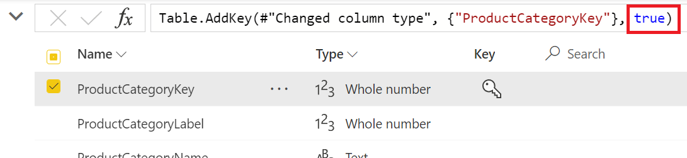

1. Select the **DimProductSubcategory_raw** query and complete the following steps below:
    1. Select the **ProductSubcategoryKey** column name from the schema list.
    1. Navigate to the **Schema tools** tab and select the **Mark as key** option.

    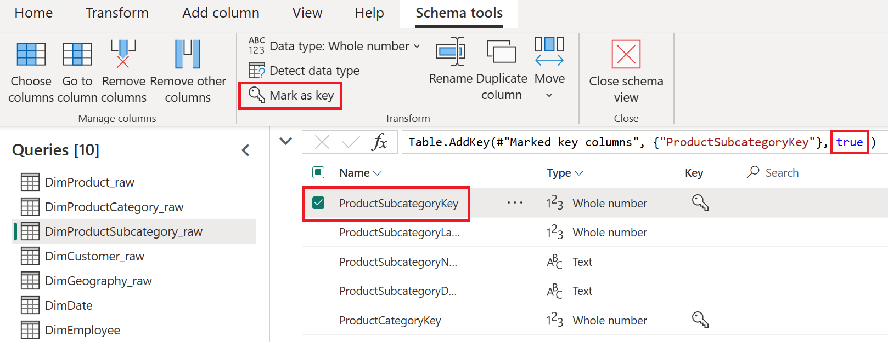

    1. Within the formula bar, update the [Table.AddKey()](https://docs.microsoft.com/powerquery-m/table-addkey) **isPrimary** value from **false** to **true**.

    ``` powerquery-m
        Table.AddKey(#"Changed column type", {"ProductSubcategoryKey"}, true)
    ```

    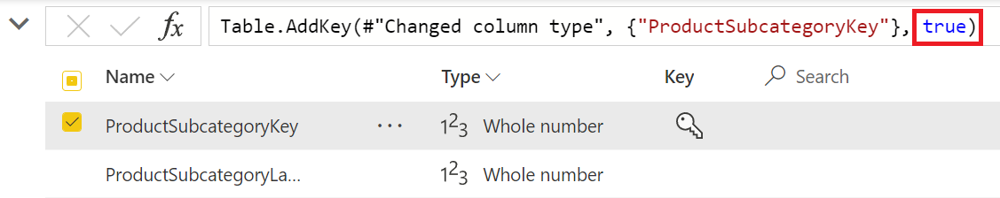

1. Select the **DimGeography_raw** query and complete the following steps below:
    1. Select the **GeographyKey** column name from the schema list.
    1. Navigate to the **Schema tools** tab and select the **Mark as key** option.

    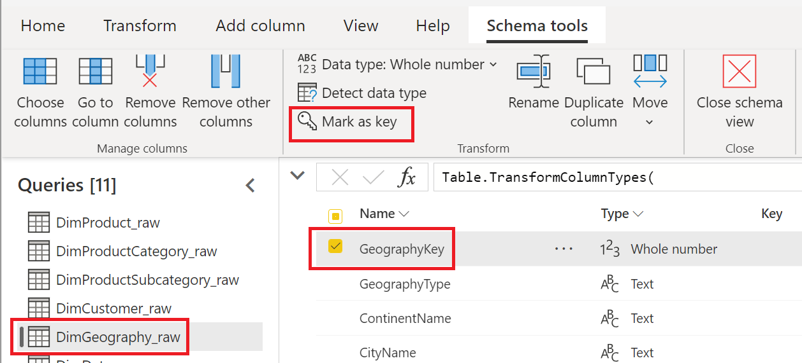

    1. Within the formula bar, update the [Table.AddKey()](https://docs.microsoft.com/powerquery-m/table-addkey) **isPrimary** value from **false** to **true**.

    ``` powerquery-m
        Table.AddKey(#"Changed column type", {"GeographyKey"}, true)
    ```

    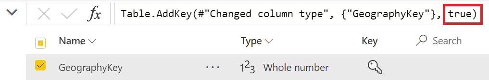

---

## Step identifiers

Something about variables

---

1. Return to the query titled **Merge** and select the **Fx** button next to the formula bar to **Insert step**.

    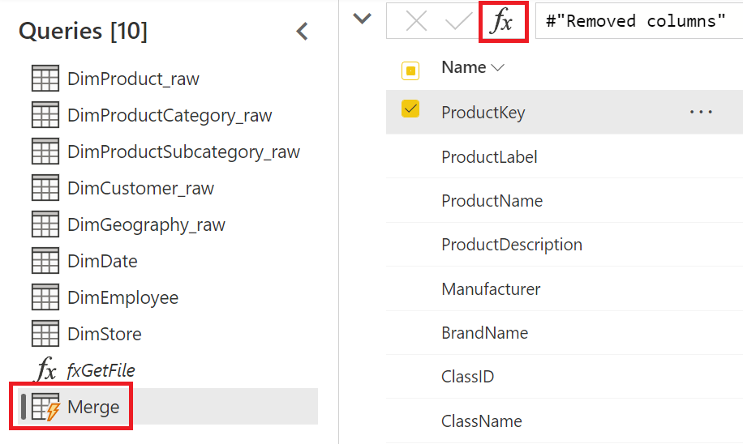

1. To return a list of the column names in our table, we'll complete the following steps below.
    1.  In the formula bar wrap the current #"Removed columns"" value with the [Table.ColumnNames()](https://docs.microsoft.com/powerquery-m/table-columnnames) function as displayed below.
    1. Upon pressing **Enter** to complete the formula, select the **Switch to data preview** to view our results.

    ``` powerquery-m
        Table.ColumnNames(#"Removed columns")
    ```

    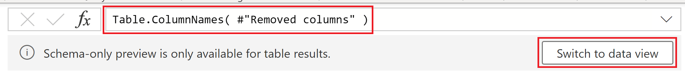

1. We'll now want to remove any value from our list where the column name contains the text **"ID"**, to get started select the **Fx** button next to the formula bar to **Insert step** and complete the following formula below using the [List.Select()](https://docs.microsoft.com/powerquery-m/list-select) and [Text.Contains()](https://docs.microsoft.com/powerquery-m/text-contains) functions and the **not** [keyword](https://docs.microsoft.com/powerquery-m/m-spec-lexical-structure#keywords).

    ``` powerquery-m
        List.Select( Custom , each not Text.Contains( _ , "ID", Comparer.Ordinal ) )
    ```

    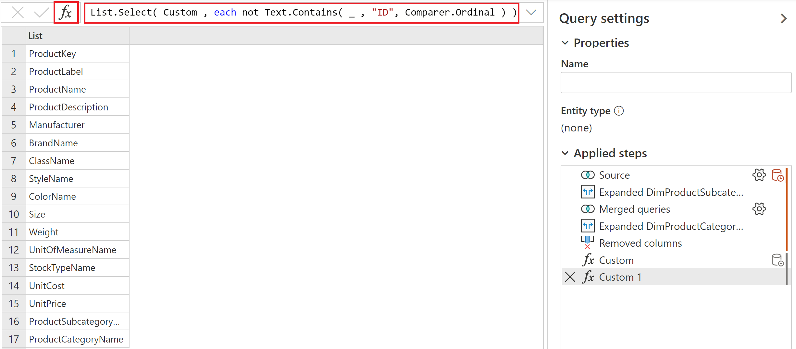

1. From the **Query settings** pane **Applied steps**, right click the **Custom** step and select **Rename**.

    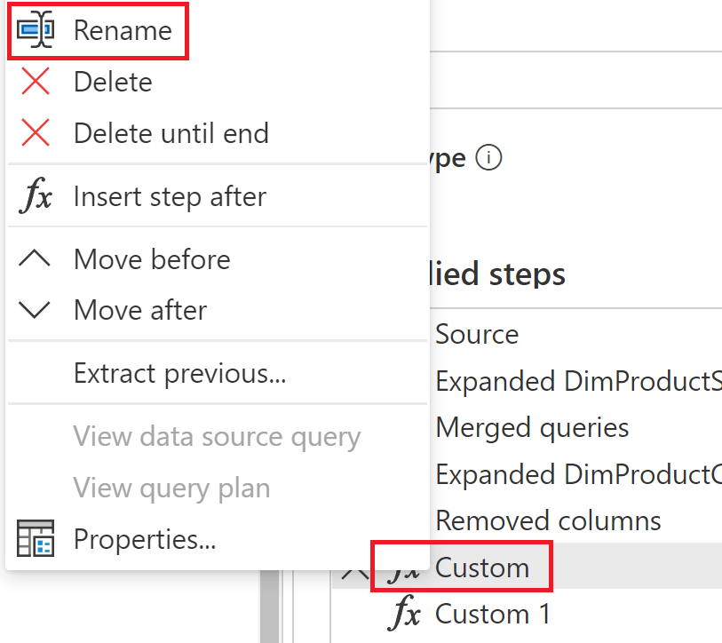

    1. Change the current value from **Custom** to **Get column names**.

        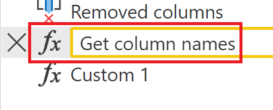

1. From the **Query settings** pane **Applied steps**, right click the **Custom 1** step and select **Properties**.

    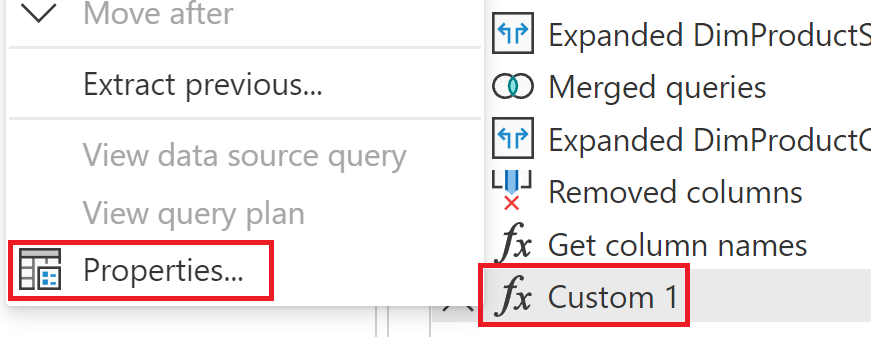

    1. Update the following values below and select **OK** when complete.
        1. **Name:** Select non-ID columns
        1. **Description:** Select only columns where the text ID does not exist.

        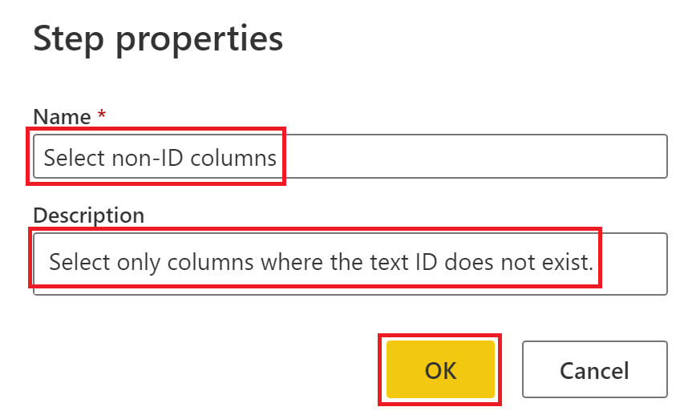

1. Within the **Applied steps** list, we may notice an information icon now present, if we were to hover above this value our step description is now available for an at-a-glance understanding of the transformation we performed and also our step formula is available within the **Script** field. 

    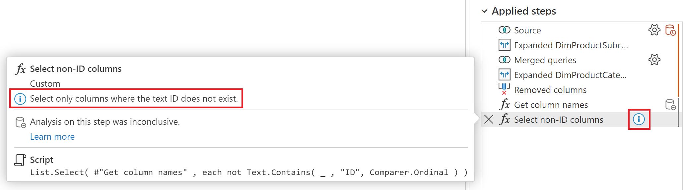

1. Select the **Fx** button next to the formula bar to **Insert step** and complete the following formula below to select the non-ID table columns.

    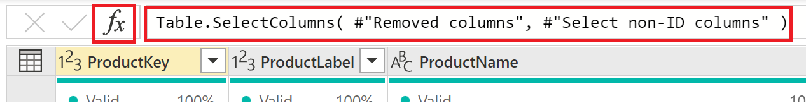

    ``` powerquery-m
        Table.SelectColumns( #"Removed columns", #"Select non-ID columns" )
    ```

1. From the **Applied steps** list, right click **Custom** and update the title to **Select columns**.

    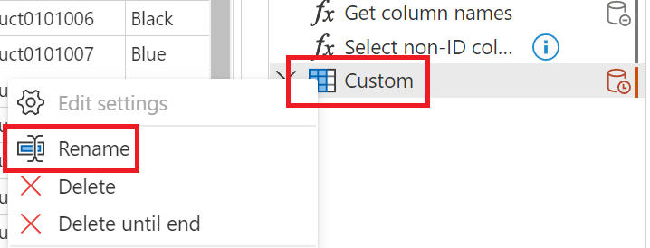

1. From the **Query settings** pane, update the current table name from **Merge** to **DimProduct**.

    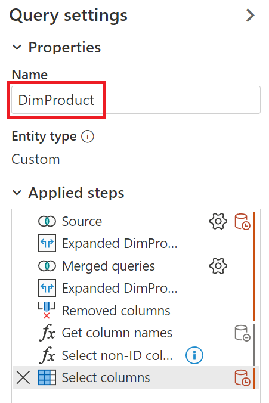

1. Return to the **Diagram view** and select the **Expand** option in the top right of the **DimProduct** query. It's here where we can review the visual flow of our queries and steps.
    1. The **DimProductCategory_raw** and **DimProductSubcategory_raw** tables both display that **Key** columns exist within the tables.
    1. For the **DimProduct** table our **Removed columns** step identifier, is split into two separate branches.

        2. One branch being used for the **Get column names** and **Select non-ID columns** steps.
        3. The other branch to take the original **Removed columns** and combine this with the **Select non-ID columns** to return our final table result.

        Because step identifiers are like variables they can be utilized throughout our queries steps to create more advanced and custom solutions that may differ from the linear top-to-bottom presentation of the **Applied steps** list.

    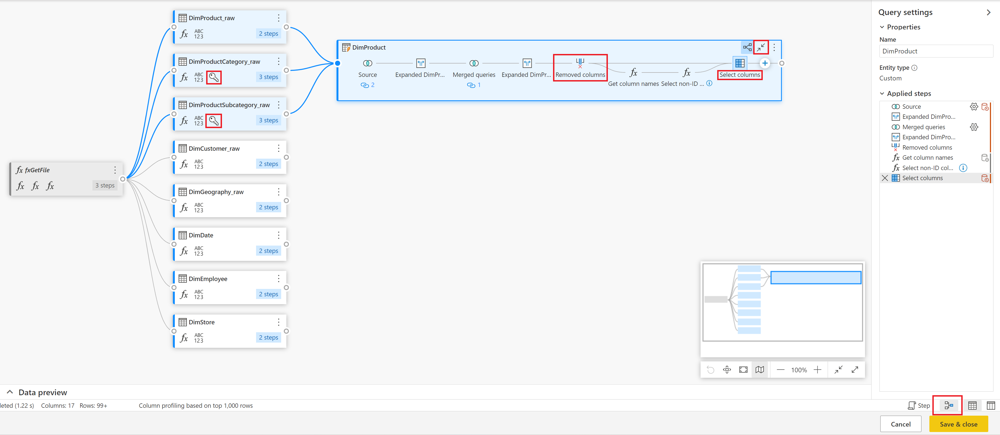

---

## Query plan

[Learn more about the query plan](https://docs.microsoft.com/power-query/query-plan)

---

1. In the **Query settings** pane on the right, navigate to the **Expanded DimProductCategory_raw** step, right click and select the **View query plan** option.

    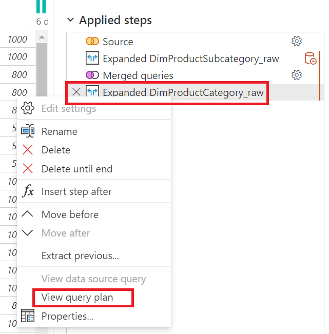

1. In the **Query plan** window, navigate to the inner joined **Table.Join** Full scan and select the **View details** to determine what join algorithm is being used. Press **Close** when complete.

    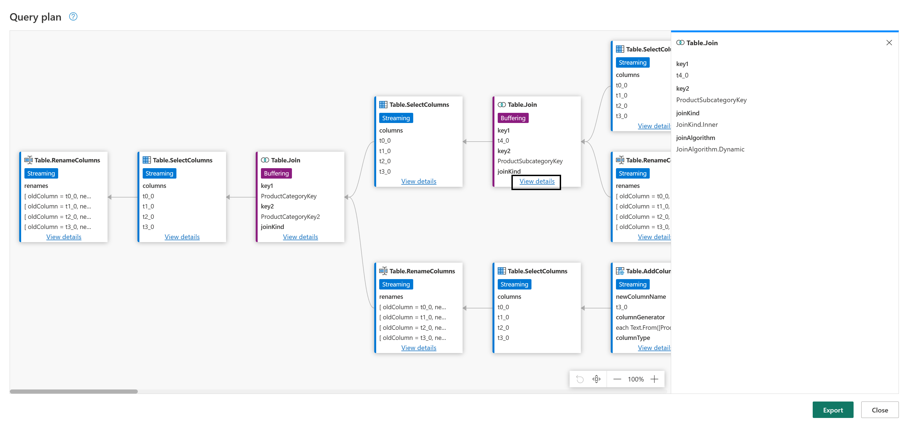

## Custom functions

1. From the **Home** tab select the drop-down for **Get data** and the **Blank query** option to create a new query.
    1. Keyboard shortcut: **Ctrl + M**

    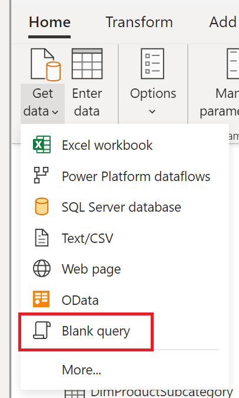

1. Within the **Advanced editor** window, we'll create a custom function for our file name that [combines text](https://docs.microsoft.com/powerquery-m/text-combine) for our prefix, file number and file extension and converts the [text from](https://docs.microsoft.com/powerquery-m/text-from) a value. Select **Ok** when complete.
    1. You can test the return value of the function by supplying a numeric value and then selecting the **Invoke** option.

    ```fsharp
    let
      // A function that accept a file number value and concatenates text
      fxFileName = (#"File number" as number) as text =>
                    Text.Combine(
                        {
                            "FactOnlineSales_",
                            Text.From(#"File number"),
                            ".parquet"
                        }
                    )
    in
      fxFileName
    ```

## Structured values

1. We'll open the **Advanced Editor** once again and complete the following:
    1. Add a comma to end of the **fXFileName** step.
    1. On a new line we'll create a step with the identifier name of **Source** which equals a [**Record**](https://docs.microsoft.com/powerquery-m/expressions-values-and-let-expression#record) type, containing the following name/value pairing as displayed below and update the return value to **Source** after the text **in**.
    
    | Name | Value |
    | :--- | :---- |
    | fileCount | 1 |
    | fileName | fxFileName(fileCount) |
    | data | fxGetFile(fileName) |

    ```fsharp
    let
      // A function that accept a file number value and concatenates text
      fxFileName = (#"File number" as number) as text =>
                    Text.Combine(
                        {
                            "FactOnlineSales_",
                            Text.From(#"File number"),
                            ".parquet"
                        }
                    ),
      Source = [
                fileCount = 1,
                fileName = fxFileName(fileCount),
                data = fxGetFile(fileName)
            ]
    in
      Source
    ```

1. Enable the **Query script** view, to view the full script on your screen.
    1. **Optional:** To validate the results are updating, we can change the **fileCount** value to **2** and review the data preview's **fileName** and **data** values. If a change was made, return the **fileCount** value to **1** before proceeding.

    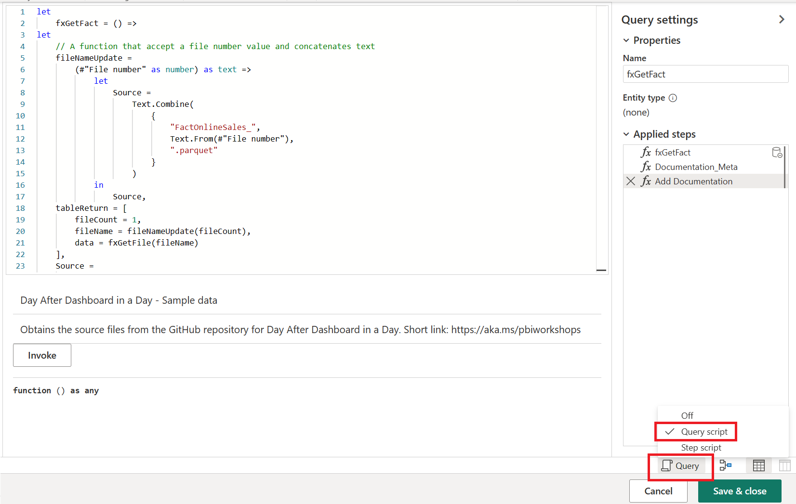

## Generating a list of values

1. Within the expanded **Query script** view, add a comma to the end of the **Source** step and add a new step with the step identifier name of **fileList** with the [**List.Generate**](https://docs.microsoft.com/powerquery-m/list-generate) function, and update the text after the **in** statement to **fileList** to review the functions documentation.
    1. Typing any function name without the open and closed parenthesis proceeding will return the function's documentation.

    ```fsharp
    let
      // A function that accept a file number value and concatenates text
      fxFileName = (#"File number" as number) as text =>
                    Text.Combine(
                        {
                            "FactOnlineSales_",
                            Text.From(#"File number"),
                            ".parquet"
                        }
                    ),
      Source = [
                fileCount = 1,
                fileName = fxFileName(fileCount),
                data = fxGetFile(fileName)
            ],
      fileList = List.Generate
    in
      fileList
    ```

1. Now that we've reviewed the documentation, update the **Query script** view to the below.
    1. For the **initial** parameter include the goes-to "**=>**" symbol and then the **Source** step.
    1. For the **condition** parameter, we'll use square brackets to reference the initialized **Source** value's **[data]** to logically test that the returned value is **not** empty, when using the **[Table.IsEmpty()](https://docs.microsoft.com//powerquery-m/table-isempty)** function.
    1. For the **next** parameter, create a record that matches the **Source** step's **fileCount**, **fileName** and **data** fields and increment the **fileCount** by it's current integer value plus **one**.

    ```fsharp
    let
      // A function that accept a file number value and concatenates text
      fxFileName = (#"File number" as number) as text =>
                    Text.Combine(
                        {
                            "FactOnlineSales_",
                            Text.From(#"File number"),
                            ".parquet"
                        }
                ),
        Source = [
            fileCount = 1,
            fileName = fxFileName(fileCount),
            data = fxGetFile(fileName)
        ],
        fileList =
            List.Generate(
            () => tableReturn,
            each try not Table.IsEmpty([data]) otherwise false,
            each
                [
                    fileCount = [fileCount] + 1,
                    fileName = fileNameUpdate(fileCount),
                    data =
                        try fxGetFile(fileName)
                        otherwise
                            #table(
                                {},
                                {}
                            )
                ]
        )
    in
        fileList
    ```

1. To convert out returned list to a table, navigate to the **List tools** tab in the ribbon and select the **To table** option.

    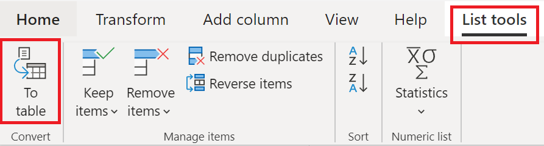

1. In the top right of the **Column1** column - we'll select the expand columns icon, and disable the **Use original column name as prefix** option and select **OK** when complete.

    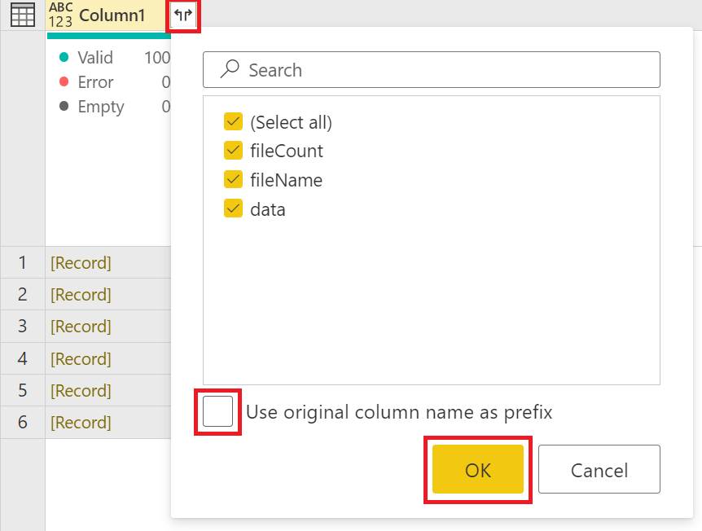

1. Right click the **data** column and select the **Remove other columns** option to remove all other columns from the current table. 

    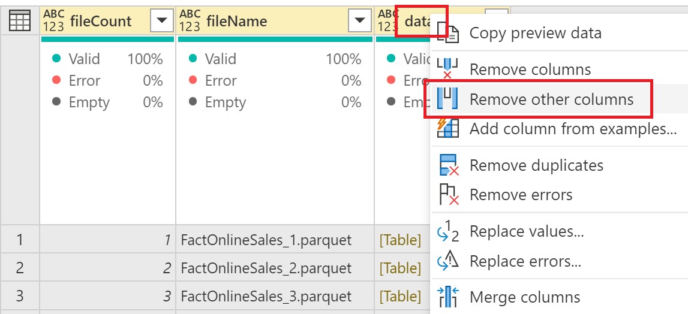

1. In the top right of the **data** column - select the expand columns icon, disable the **Use original column name as prefix** option and select **OK** when complete.

    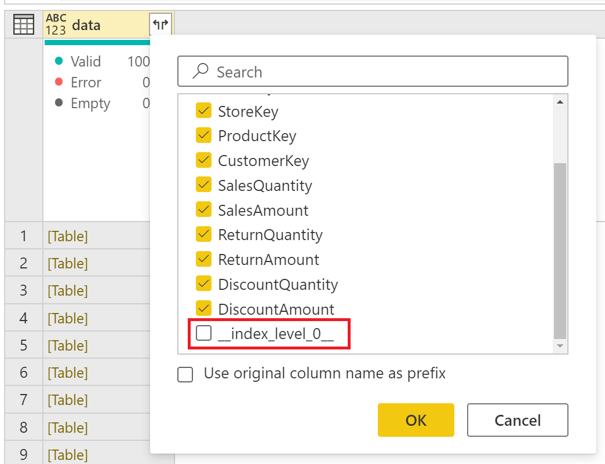

1. While holding the **shift** key on our keyboard, select the **ProductKey** column and then **Freight** column to highlight all columns in our table. Navigate to the **Transform** tab and then select **Detect data type** to change the current columns [any value](https://docs.microsoft.com/power-query/data-types) (ABC123) to a more appropriate data type automatically.
    1. We can also select any cell in our table and press **Ctrl+A** to select all cells and columns.

    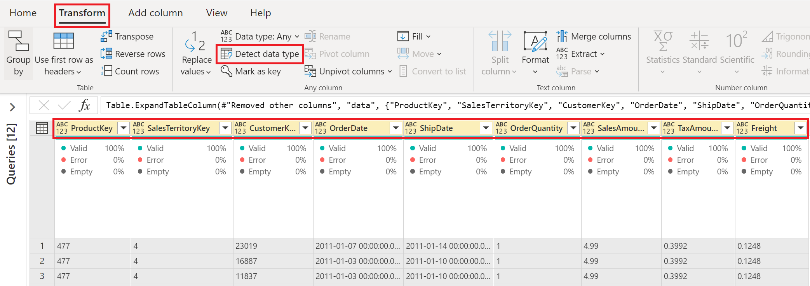

1. Within the **Query settings** pane, change the **Name** of the completed query to **FactOnlineSales_raw**.

    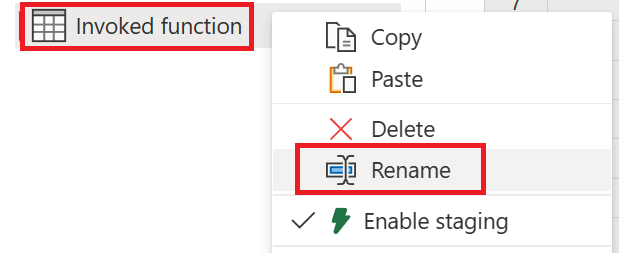


---

<b>Optional: Power Query M function reference</b>

To view a complete list of Power Query function documentation, from the **Home** tab select **Get data** and **Blank query**, update the **Source** step's value to **#shared** and select **Next** to proceed. A record value will be returned including the [Power Query M function reference](https://docs.microsoft.com/powerquery-m/power-query-m-function-reference) documentation.

```powerquery-m
let
    Source = #shared
in
    Source
```


# Grouping queries

As we add more tables to our solutions it can often be challenging to remember which-queries-do-what. For this reason we'll create groups for our queries that share similar design patterns.

1. In the **Queries** pane, while holding **ctrl**, select the following tables from the list below, once complete right click and select the **Move to group** > **New group...** option.

    1. DimCustomer_raw
    1. DimGeography_raw
    1. DimProduct_raw
    1. DimProductCategory_raw
    1. DimProductSubcategory_raw
    1. FactOnlineSales_raw

    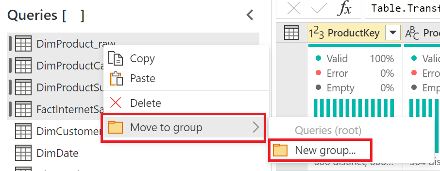

    1. In the **New group** window set the name to **Data staging** and the **Description** to the following text below and select **Ok** once complete.

        ```
        Data that will be ingested from the source and referenced in computed tables for transformations via the enhanced compute engine.
        ```
    
        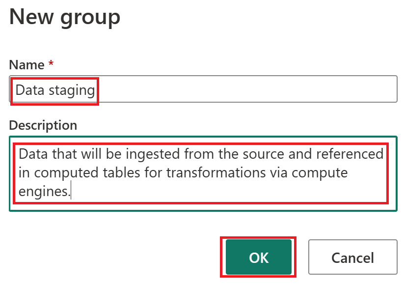

1. In the **Queries** pane, while holding **ctrl**, select the following tables from the list below, once complete right click and select the **Move to group** > **New group...** option.

    
    1. DimDate
    1. DimEmployee
    1. DimStore

    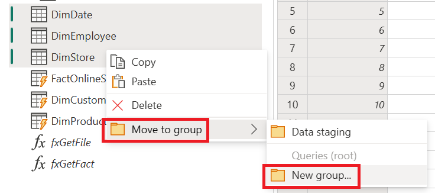

    1. In the **New group** window set the name to **Data load** and the **Description** to the following text below and select **Ok** once complete.

        ```
        Data that will be ingested from the source without transformations.
        ```

        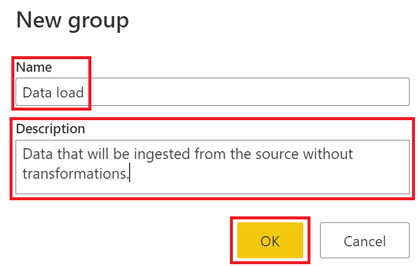

1. Our **Queries** pane now contains two groups to help make managing and distinguishing our queries intent more effective at a glance. For more detail we can also hover above the group's folder icon where the **description** value of each will be visible.

    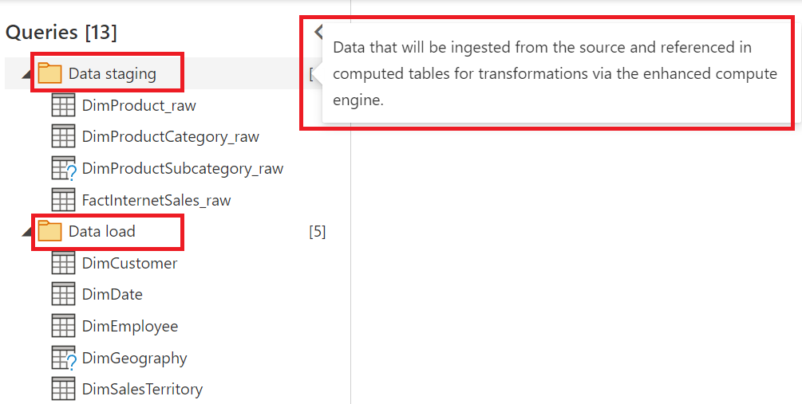

1. From the diagram view complete the following steps using the **Actions** options ( ⋮ ) for the **Merge** table.
    1. Select the **Rename** action and update the query title to **DimProduct**.
    1. Select the **Move to group...** action and select the **Data transformation** group.

    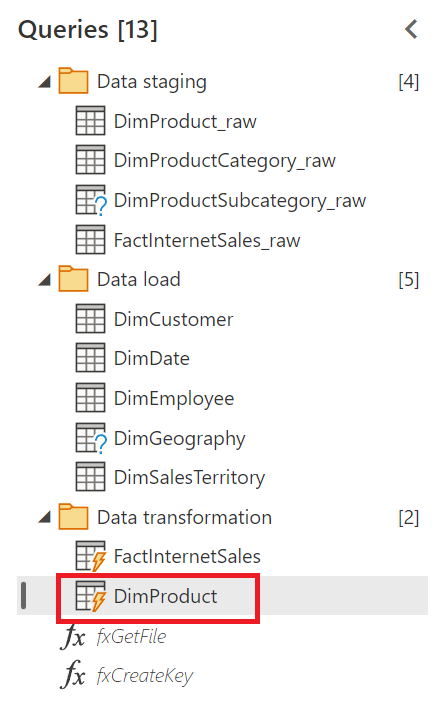

---

Transforming data at scale

Now that our data is being ingested and stored in our dataflow's [Azure Data Lake Storage Gen2](https://docs.microsoft.com/azure/storage/blobs/data-lake-storage-introduction), we'll leverage [computed tables](https://docs.microsoft.com/power-query/dataflows/computed-entities-scenarios) to apply transformation logic via the enhanced compute engine.

[Learn more about the benefits of loading data without transformation for Text/CSV files](https://docs.microsoft.com/power-query/dataflows/computed-entities-scenarios#load-data-without-transformation-for-textcsv-files)

---


## Saving and refreshing the dataflow

1. Select the **Save & close** option in the bottom right to exit the Power Query editor.

    

1. Select the **Close** option in the top right to exit the current dataflow.

    

1. Within the workspace select the **Refresh now** option of the dataflow to ingest the labs data and apply transformation logic.

    

---

# Power Query Desktop

## Query folding

Query folding is the ability for a Power Query query to generate a single query statement to retrieve and transform source data. The Power Query mashup engine strives to achieve query folding whenever possible for reasons of efficiency.

[Learn more about query folding](https://docs.microsoft.com/power-query/power-query-folding)

---

1. Open **Power BI Desktop** and from the **Home** tab select the **Get data** button. Within the **Get dialog** window select the **Power Platform** section and then **Dataflows** connector. Select **Connect** to continue to the **Dataflows** navigator window.

    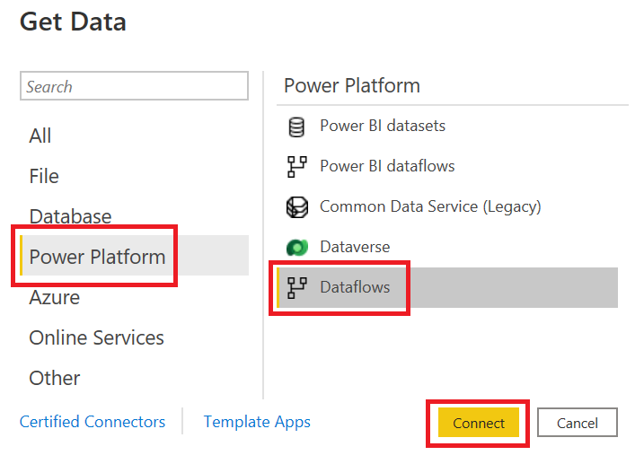

1. Within the **Navigator** window, navigate to the group Workspace where the dataflow is located and select all of the tables listed below within the dataflow, once complete select the **Transform Data** option to continue.

    | Table |
    | :---- |
    | DimDate |
    | DimEmployee |
    | DimStore |
    | DimCustomer_raw |
    | DimGeography_raw |
    | DimProduct_raw |
    | DimProductCategory_raw |
    | DimProductSubcategory_raw |
    | FactOnlineSales |

    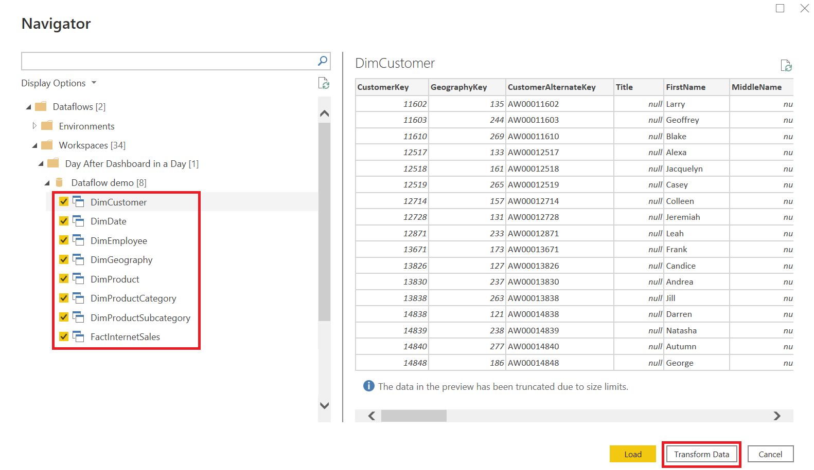

1. Navigate to the **DimCustomer_raw** table, holding the **shift** key select the **FirstName**, **MiddleName** and **LastName** columns, right click one of the selected columns and choose the **Merge Columns** option.

    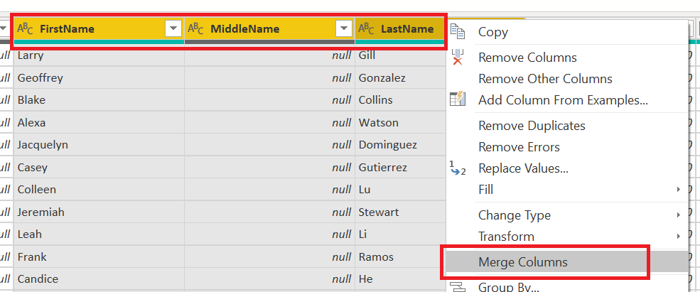

1. Within the **Merge columns** window change the **Separator** option to **Space**, set the **New column name (optional)** option to **Full Name** and select **OK** when complete.

    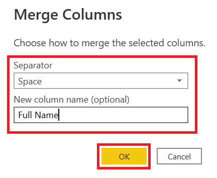

1. In the **Query settings** pane on the right, navigate to the **Merge Columns** step, right click and select the **View Native Query** option.

    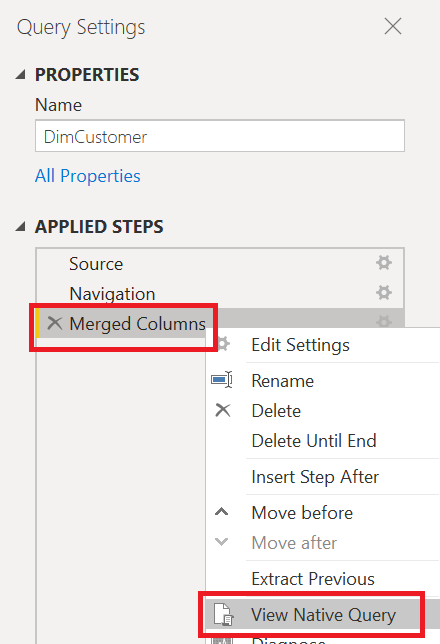

1. Navigate to the **Add Column** tab and select the **Conditional Column** option. Within the **Add Conditional Column** dialog complete the following and select **OK** when complete:
    1. New column name: **Gender**
    1. Match the following conditions to the table below.
        1. Use the **Add Clause** to add new conditions.

    |  | Column Name | Operator | Value | Output | 
    | :------- | :-------| :-------| :-------| :-------|
    | If | Title | equals | Mr. | Male |
    | If | Title | equals | Sr. | Male |
    | If | Title | equals | Ms. | Female |
    | If | Title | equals | Mrs. | Female |
    | If | Title | equals | Sra. | Female |
    | else | Not Provided | | |

    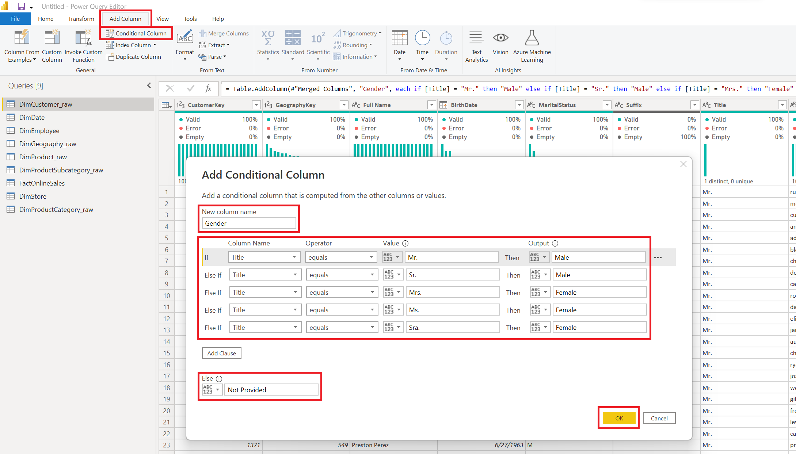

1. In the **Query settings** pane on the right, navigate to the **Add Conditional Column** step, right click and select the **View Native Query** option.

    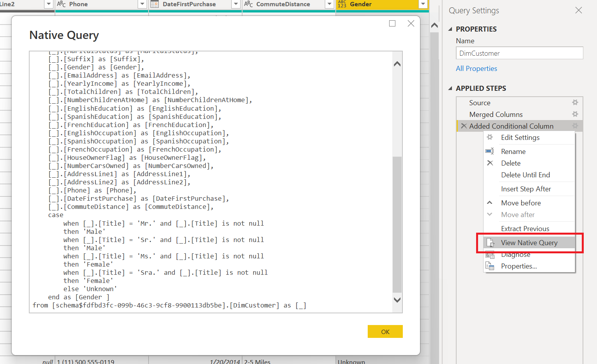

1. From the **Formula bar** select the **Add Step** button and type in the following formula below.
    1. If the **Formula Bar** is not enabled navigate to the **View** tab and select the **Formula Bar** checkbox.

    

    ```fsharp
    = Table.AddColumn(
                #"Merged Columns",
                "Gender",
                each
                    if
                        List.Contains(
                            {
                                "Mr.",
                                "Sr."
                            },
                            [Title]
                        )
                    then
                        "Male"
                    else if
                        List.Contains(
                            {
                                "Ms.",
                                "Sra."
                            },
                            [Title]
                        )
                    then
                        "Female"
                    else
                        "Not Provided",
                type text
            )
    ```

1. In the **Query settings** pane on the right, navigate to the **Custom1** step, right click and select the **View Native Query** option to review the difference in the generated query which now uses the [IN (Transact-SQL)](https://docs.microsoft.com/sql/t-sql/language-elements/in-transact-sql?view=sql-server-ver15) clause.

    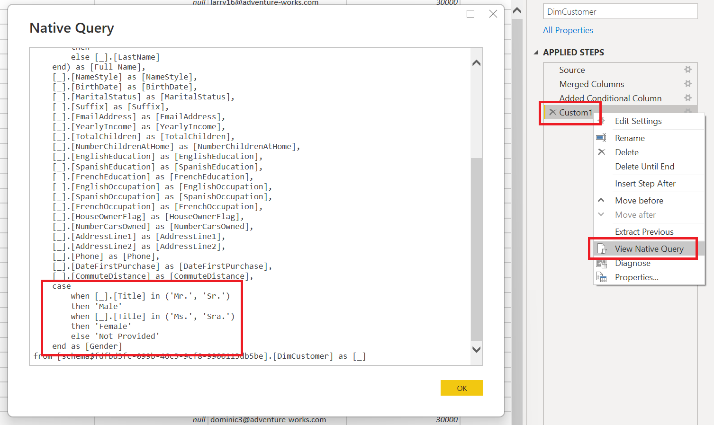

1. Right click the **Applied Steps** step named **Custom1** and select **Properties...** to open the **Step Properties** dialog box. Once the **Step Properties** is visible update the **Name** property to **Custom: Gender** and the **Description** field to the below text. Once complete select **OK** to complete.

    ```bash
    If value is Mr. or Sr. replace with Male.
    If value is Ms. , Mrs. , or Sra. replace with Female.
    Otherwise replace with Not Provided.
    ```

    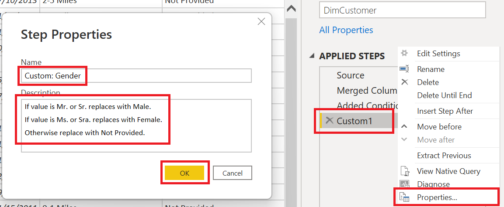

1. Review the new **Custom: Gender** step's properties by hovering above the step name to view the documentation.

    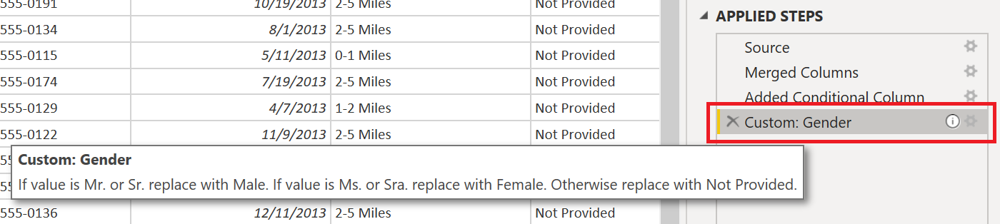

1. Right click the original **Added Conditional Column** step and select the **Delete** option to remove.
    1. Selecting the adjacent **X** to the left of the step name is also an option.

    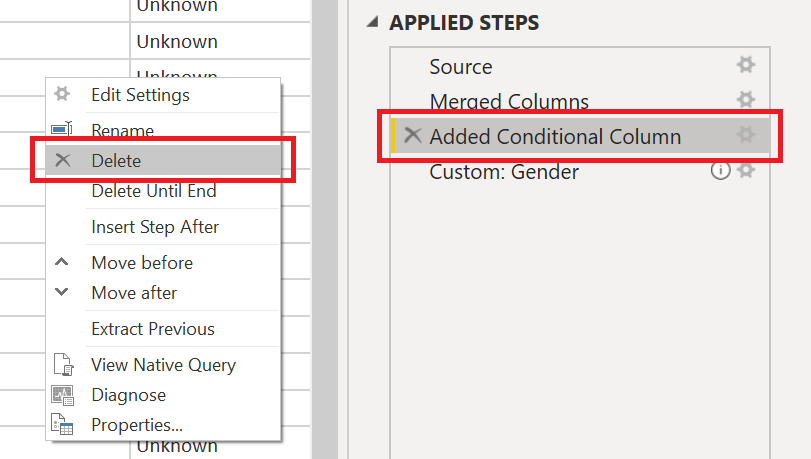

## Set the storage mode

Now that we have completed all of the data preparation activities in this lab we need to create the connection between our queries and the Power BI dataset.

1. From the **Home** tab select **Close & apply**.

    

1. Within the **Set the storage mode** window, select the **DirectQuery** storage mode for each of the tables and then select **OK** once complete.

    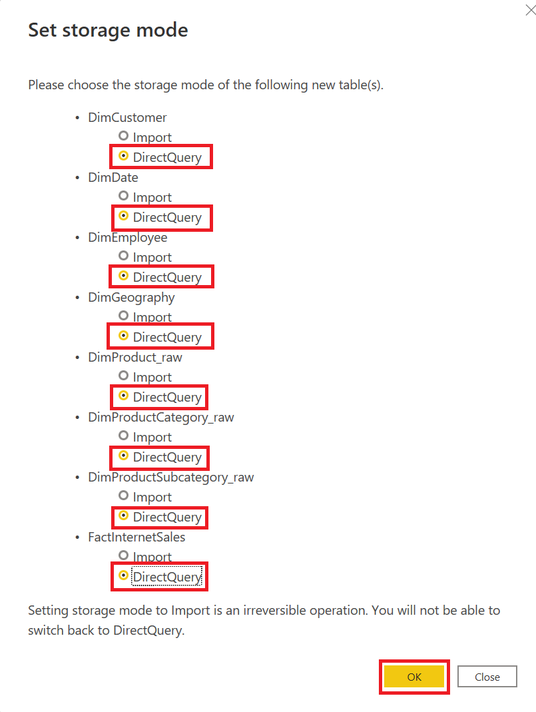

# Next steps
We hope this portion of the lab has shown how dataflows can provide a self-service, cloud-based, data preparation technology that can be easily consumed in Power BI.

- Continue to the [Data Modeling](./DataModeling.md) lab
- Return to the [Day After Dashboard in a Day](./README.md) homepage

---

# Completed files

To download the completed files from the lab instructions:

- [Dataflow model](https://raw.githubusercontent.com/microsoft/pbiworkshops/main/Day%20After%20Dashboard%20in%20a%20Day/Source_Files/Dataflow%20demo%20(final).json)
- [Power BI Desktop template file (PBIT)](https://github.com/microsoft/pbiworkshops/blob/main/Day%20After%20Dashboard%20in%20a%20Day/Source_Files/Data%20modeling%20start.pbit)
    - You will need to update the WorkspaceId and DataflowId to those within your environment