# Data Preparation

✏️ Lab scenario
---

In this part of the lab, our goal is to collect and combine daily files from a cloud directory. The number of files in this directory will increase over time, so we need to create a [future proofed](https://docs.microsoft.com/power-query/best-practices#future-proofing-queries) data preparation solution that can handle this growth.

### Premium license mode

First, we need to go to a new, empty or non-production workspace and check if it has a capacity assigned. If not, we can enable it by choosing one of these options below.

1. To access the settings, we’ll click the **Settings** option in the top right corner of the workspace.
    

1. To check the licensing mode, within the **Settings** pane click the **Premium** tab. Then we’ll make sure one of the following modes is enabled before selecting our capacity within the **License capacity** drop down list and then **Apply** to save before selecting **X** to close the window.

    **License mode:**
    - [Premium capacity](https://docs.microsoft.com/power-bi/admin/service-premium-gen2-faq)
    - [Fabric capacity](https://learn.microsoft.com/fabric/enterprise/buy-subscription#buy-an-azure-sku)
    - [Trial](https://learn.microsoft.com/fabric/get-started/fabric-trial)

    1. Select your capacity within the **License capacity** drop down list.
    1. Select **Apply** to continue and then the **X** in the top right corner of the window to close.

    

## Lakehouse storage

We'll start by creating a lakehouse, which is a data architecture platform for storing, managing, and analyzing structured and unstructured data in a single location. It is a flexible and scalable solution that allows organizations to handle large volumes of data using a variety of tools and frameworks to process and analyze that data.

Learn more about [lakehouses in Microsoft Fabric](https://learn.microsoft.com/fabric/data-engineering/lakehouse-overview)

---

1. With our workspace, select **New** and then **Show all**.

    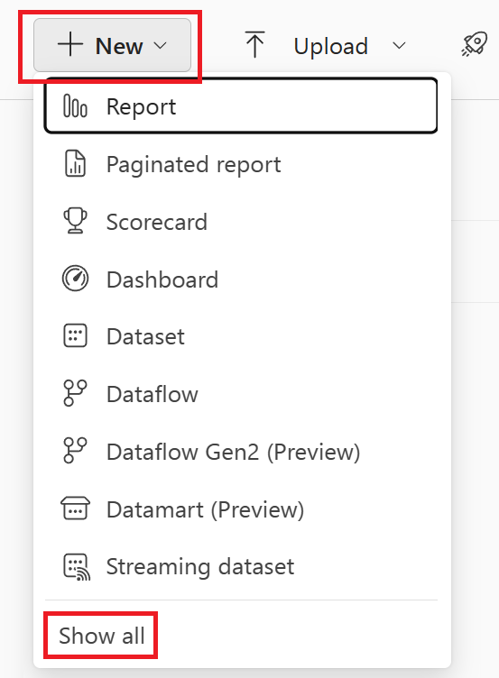

2. In the **New** item creation screen, select **Lakehouse** under the Data Engineering category.

    

3. Set the Lakehouse name to **SalesLakehouse**. Then select **Create**.

    

4. Once you're in the Lakehouse editor, select **New Dataflow Gen2**.

    - **Important Note**: You can also select *Get data* from the ribbon and then New Dataflow Gen2.

    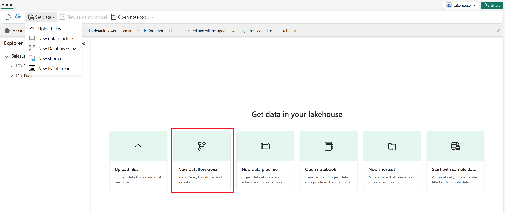

# Dataflow Gen2

With dataflows, we can connect, clean, transform and store data from various sources in a self-service way. Dataflows help by:

1. Sharing reusable transformation logic with others as a single source of truth.
1. Protecting the underlying data sources from direct access and reduce the load on the underlying systems.
1. Connecting other Azure services to the raw or transformed data by exposing it in OneLake or other data destination outputs.

[Learn more about dataflows and self-service data prep](https://docs.microsoft.com/power-bi/transform-model/dataflows/dataflows-introduction-self-service)

---

## Import a Power Query template

In this part of the lab, we'll use an existing [Power Query template](https://learn.microsoft.com/power-query/power-query-template) file and skip the basic steps of getting data from a CSV file. Instead, we’ll focus on more advanced capabilities.

Once our Power Query template file has been imported and refreshed it will enable discovery across other Microsoft products and services (Excel and Power Apps).

1. In the Power Query Online editor for Dataflows Gen2, select **Import from a Power Query template**

    

1. Paste the file path below in the **File name** filed and select **Open** to continue.

    ```text
    https://github.com/microsoft/FabricCAT/raw/main/Day%20After%20Dashboard%20in%20a%20Day/Source_Files/OnlineSalesDataflow.pqt
    ```

    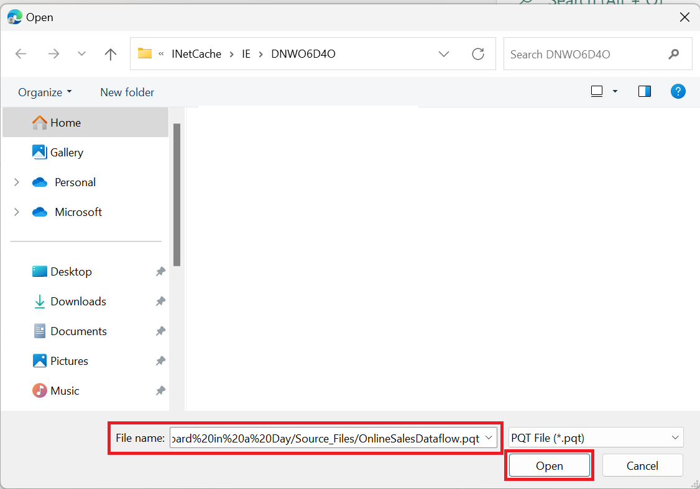

1. In the top left corner, select the Dataflow name (this title may differ) and update the **Name** field to **OnlineSalesDataflow**.
    - **Important note:** You can also set the Sensitvity label on this screen if you have Microsoft Information Protection in your organization.

    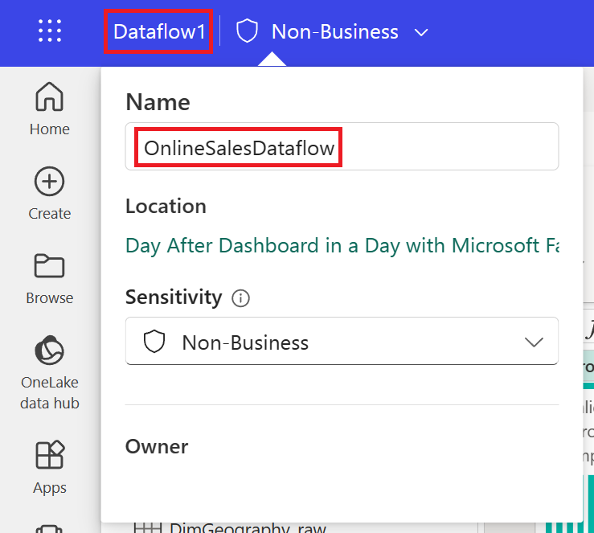

<font size="6">✅ Lab check</font>

By leveraging an existing Power Query template, we can easily import and export our Power Query queries and their associated metadata.

## Disable query staging

There are various components of the Dataflow Gen2 architecture, including the Lakehouse item used to stage data being ingested, and Warehouse item used as a compute engine and means to write back results to staging or supported output destinations faster. When warehouse compute cannot be used, or when staging is disabled for a query, the mashup engine will extract, transform, or load the data to staging or a destination.

Learn more about the [Dataflow Gen2 engine](https://blog.fabric.microsoft.com/blog/data-factory-spotlight-dataflows-gen2/#:~:text=The%20Dataflow%20Gen2%20Engine)

---

Because the lab files are stored in a publicly accessible [GitHub repository](./Source_Files/), we will authenticate anonymously and ensure that we can successfully connect to and ingest the lab data.

1. Click the **Configure connection** button from the yellow banner.

    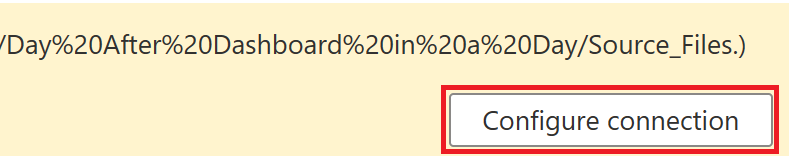

1. In the **Connect to data source** window, select **Anonymous** from the **Authentication kind** drop down and then click **Connect**.

    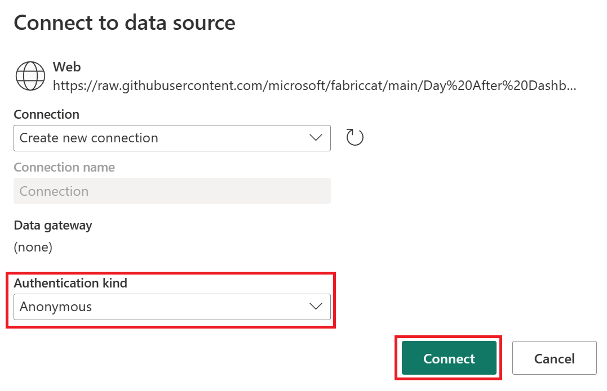

1. In the **Queries** pane, right-click each of the queries listed below and deselect the **Enable staging** option.

    | Table |
    | :---- |
    | DimEmployee |
    | DimDate |
    | DimStore |

    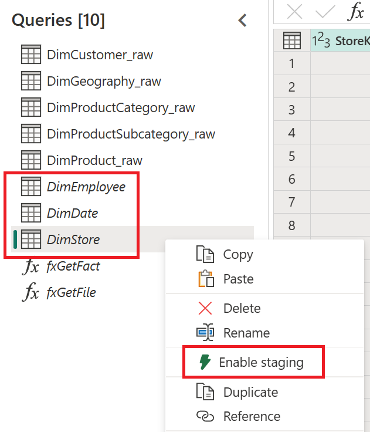

1. In the bottom right corner click the chevron next to **Publish**. The **Publish** or **Publish now** options are the default behavior that will publish and refresh your dataflow. Alternatively, the **Publish later** to only publish the metadata and underlying formula logic of your dataflow. Select the **Publish** option to save and close your dataflow and start the refresh.

    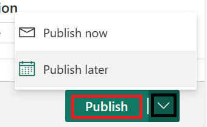

1. After publishing the dataflow and the refresh has completed, select the ellipses **(…)** next to the OnlineSalesDataflow item within the workspace. Then select **Refresh history**.

    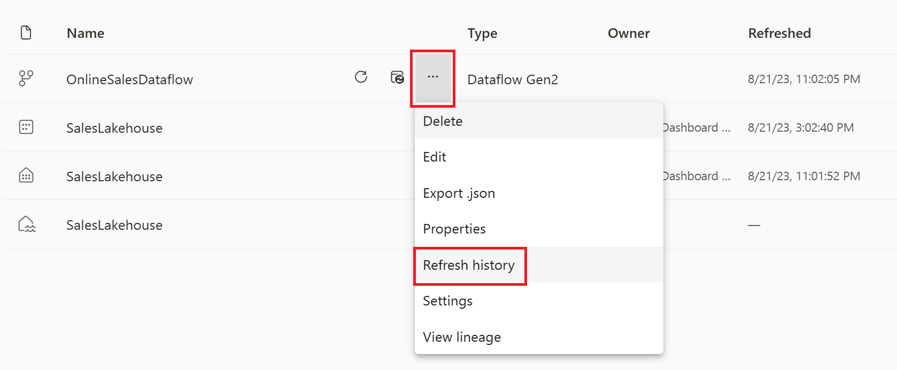

1. Within the Refresh history window, select the refresh under the **Start time** to drill into the refresh details.

    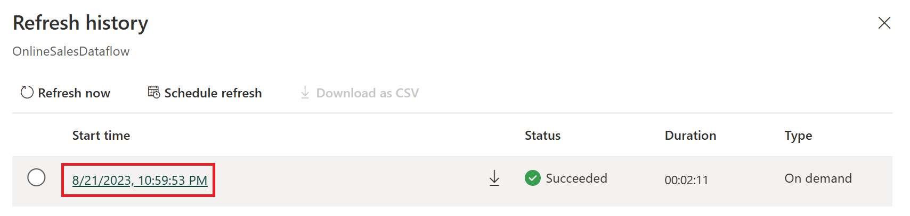

1. In the Details page we can wiew the Tables and Activities that occurred within our dataflow. Once done, select the **X** in the top right corner to close.
    - **Important note:** Selecting the text will drill into more details including timings, endpoints, the engine used and more.

    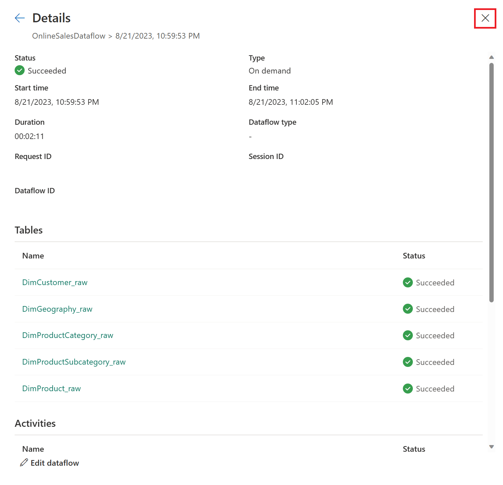

## View lakehouse tables

1. In the Workspace select the eppises **(...)** next to the **Lakehouse** item called **SalesLakehouse** and choose the **View details** option.
    
    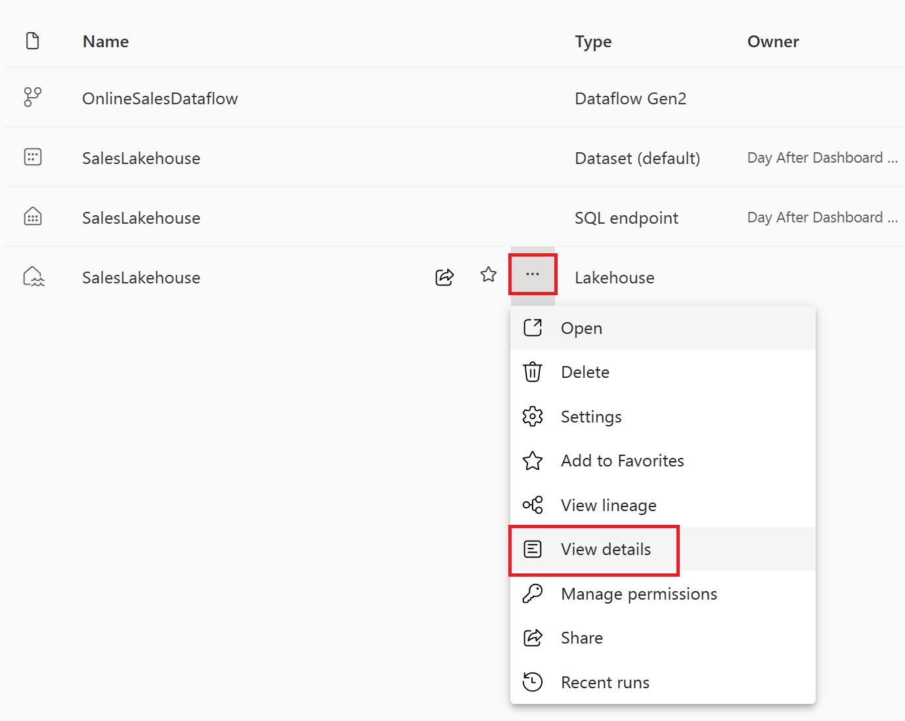

1. In the **Lakehouse** details page we can view the SQL connection string which allows us to use external tools like [Azure Data Studio](https://azure.microsoft.com/products/data-studio/) or [SQL Server Management Studio](https://learn.microsoft.com/sql/ssms/download-sql-server-management-studio-ssms?view=sql-server-ver16) to explore lakehouses and query the data. Additional information like downstream items and their Relation to the lakehouse for lineage are also include. Let's select **Open** to continue.

    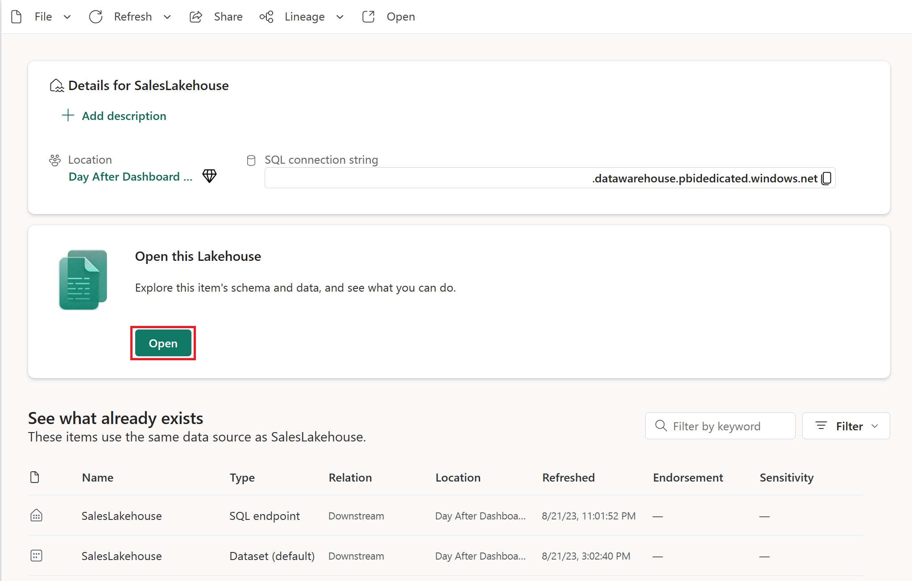

1. To view the **Tables** created from our Datalfow Gen2 in the object explorer, select any of the tables from the list (ex. select DimDate). These tables are created using the Delta Lake format (a parquet file format) which are optimized for analytics and have been optimized using [V-Order](https://learn.microsoft.com/fabric/data-engineering/delta-optimization-and-v-order?tabs=sparksql) that enables lightning-fast reads under the Microsoft Fabric compute engines, such as Power BI, SQL, Spark and others. 

    Once done, we’ll return to the Workspace view by selecting our workspace from the side-rail on the left.
    - **Important note:** If you do not see your tables or they are undefined, select the **Refresh** option in the top left of the Lakehouse explorer.

    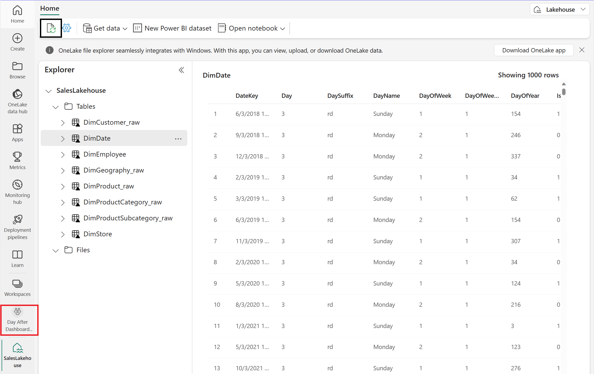

1. In the Workspace select the eppises **(...)** next to the **Dataflow Gen2** item called **OnlineSalesDataflow** and choose the **Edit** option.

    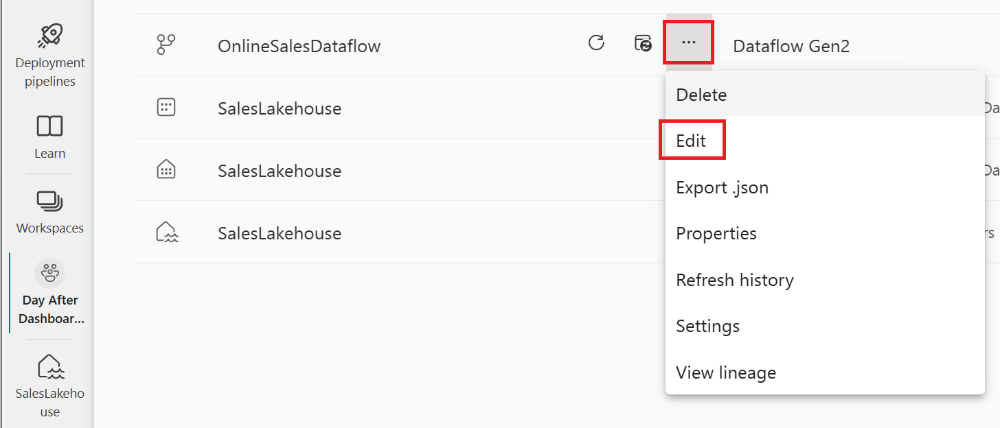

---
# Power Query Online

## Global options

Now that we have imported our dataflow and set our credentials, we’ll adjust some settings for authoring in Power Query Online. These settings will stay the same when we author new content later.

---

1. From the **Home** tab, select the **Options** > **Global options** property.

    

1. Within the **Global options** windows **General** section ensure the following settings are enabled.

    **Steps**
    - Enable step cost indicators
    - Show script in step callout

    **Column profile**
    - Enable column profile
    - Show column value distribution in data preview
    - Show column value distribution in data preview
    - Show column profile in details pane

    **Column profile evaluation**
    - Based on top 1,000 rows
    
    **Data view**
    - Enable details pane
    - Show whitespace and newline characters

    **Parameters**
    - Always allow parameterization in data source and transformation dialogs

    


1. Now select the **Data load** group and from the **Type detection** select **Never detect column types and headers for unstructured sources**. Select **OK** once complete.

    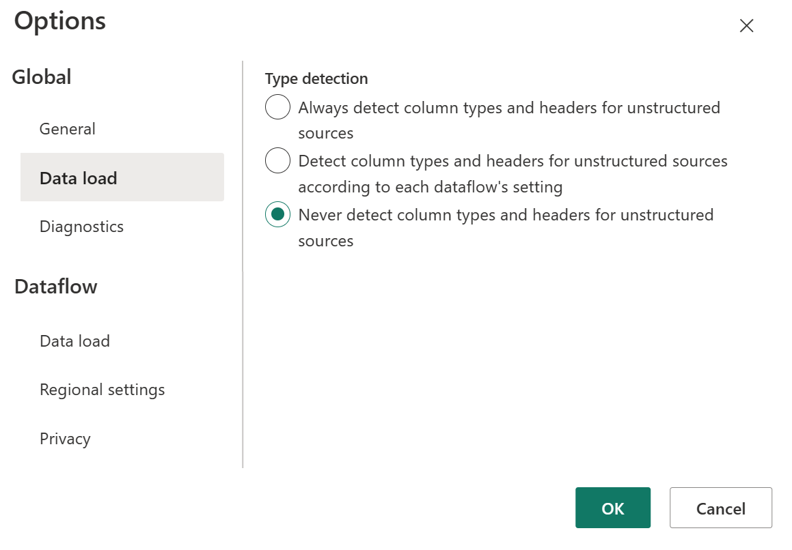

<font size="6">✅ Lab check</font>

By configuring the Power Query Online environment, you can ensure that your development experience has rich capabilities to assist with auditing, data profiling, and visual cue indicators such as folding indicators and step scripts in the UI menus.

---

## Data view

The Power Query Online editor is a user interface that allows us to create and edit queries, organize queries by grouping them or adding descriptions to each step, and view our queries and their structure in different ways.

Learn more about the [Power Query editor](https://docs.microsoft.com/power-query/power-query-ui#the-power-query-editor-user-experience)

---

1. To view all of our queries with the text "Dim" in their name, we’ll type **Dim** in the **global search bar** at the center of the Power Query Online editor. Then we’ll select the **DimCustomer_raw** query to proceed.
    1. Shortcut: **Alt+Q**
    1. We can use the up/down arrow keys to browse the results and press **Enter** to confirm our choices.

    

1. From the **Queries** pane, we'll right click the **DimCustomer_raw** query and select **Reference** from the menu.

    

1. If we inspect the **Queries** pane again we'll now notice that a new query titled **DimCustomer_raw (2)** has now been created, with a lightning bolt icon (⚡) indicating that this is a computed table.

    This query will leverage the Dataflow Gen2 compute engine which can drastically reduces refresh time required for long-running data preparation steps - such as performing joins between tables.

    

1. With the **DimCustomer_raw (2)** query selected, we'll leverage the global search bar to type the text **merge** and select the **Merge queries** action.

    

1. In the **Merge** window complete the following instructions below and then select **OK** when complete.

    | Merge | Table |
    | :--- | :---- |
    | Left table for merge | DimCustomer_raw (2) |
    | Right table for merge | DimGeography_raw |

    1. In the top right a light bulb indicator suggests that a match exists based on the shared columns from each table. Select light bulb and choose the option for the **GeographyKey** match.
    1. Set the **Join kind** to **Inner**

    

1. Within the data view, navigate to the **DimGeography_raw** column and select the **Expand** icon. Deselect the **GeographyKey** since we this column already exists in our original query and then select **OK**.

    

1. Within the **Query settings** pane, update the name of our query from **DimCustomer_raw (2)** to the name **DimCustomer**.

    

<font size="6">✅ Lab check</font>

Now that our data is being ingested and stored in our Lakehouse, we'll leverage [computed tables](https://docs.microsoft.com/power-query/dataflows/computed-entities-scenarios) to apply transformation logic via the enhanced compute engine.

Learn more about the [Global search box](https://learn.microsoft.com/power-query/search-box)

Learn more about the [benefits of loading data without transformation for Text/CSV files](https://docs.microsoft.com/power-query/dataflows/computed-entities-scenarios#load-data-without-transformation-for-textcsv-files)

---
---
## Diagram view

Power Query Online lets us prepare data visually in the diagram view of the Power Query editor.

---

To merge queries as a new query, we’ll do the following:

1. In the bottom right of the **Power Query** editor, click the **Diagram view** option.

    

1. In the top right of the **DimProduct_raw** table, click the Actions option ( ⋮ ) and choose the **Merge queries as new** option.

    

1. In the Merge window, follow these steps and then click **OK** to confirm.

    | Merge | Table |
    | :--- | :---- |
    | Left table for merge | DimProduct_raw |
    | Right table for merge | DimProductSubcategory_raw |

    1. In the top right a light bulb indicator suggests that a match exists based on the shared columns from each table. Select light bulb and choose the option for the **ProductSubcategoryKey** match.
    1. Set the **Join kind** to **Inner**

    

1. On the **Home** tab, click the drop-down arrow next to **Choose columns** and choose the **Go to column** option (Shortcut: Ctrl+G).

    In the search dialog, type the column name **DimProductSubcategory_raw** until it shows up. Then either double-click the name or select the column name and click OK to go to the column.

    

1. In the top right of the **DimProductSubcategory_raw** column, click the expand columns icon and follow these steps:
    1. Uncheck the **ProductSubcategoryKey** column since we already have this column in our original DimProduct_raw table.
    1. Check only the **ProductSubcategoryName** and **ProductCategoryKey** columns.
    1. Uncheck the **Use original column name** as prefix option (if checked).
    1. Click **OK** to confirm.
   
    

1. After the **Expanded DimProduct** step, click the **"+"** icon to insert a new step and follow steps:
    1. In the transformations search, type **Merge**.
    1. Click the **Merge queries** option from the list.

    

1. In the **Merge** window, follow these steps and then click **OK** to confirm.

    | Merge | Table |
    | :--- | :---- | 
    | Left table for merge | (Current) |
    | Right table for merge | DimProductCategory_raw |

    1. In the top right a light bulb indicator suggests that a match exists based on the shared columns from each table. Select light bulb and choose the option for the **ProductSubcategoryKey** match.
    1. Set the **Join kind** to **Inner**

    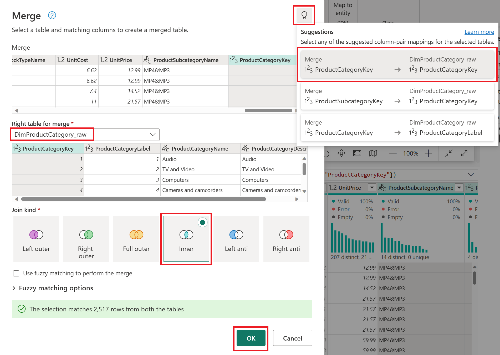

1. In the top right of the **DimProductCategory_raw** column - we'll select the expand columns icon and complete the following steps below:
    1. Deselect all columns except **ProductCategoryName**.
    1. Disable the **Use original column name as prefix** option (if enabled).
    1. Select **OK** once complete.

    

1. In the top left of our merged queries, double click the **Merge** query text and update the table name to **DimProduct**.

    

---

<font size="6">✅ Lab check</font>

The diagram view helps us easily view the flow of data, both at the query level and at the step level to better determine how our queries are connected and what data preparation steps we have applied to each query.

Learn more about [diagram view](https://docs.microsoft.com/power-query/diagram-view).

---

## Schema view

Schema view helps us work on schema level operations by showing only our query’s column information in the editor.

---

To use the schema view and mark some columns as keys, we’ll do the following:

1. In the bottom right of the Power Query editor, click the **Show schema view** option.

    

1. Click the **DimProduct** query and follow these steps:

    1. In the schema list, click the following column names listed below and either select the ellipses **(...)** or right click the **Remove columns** option for any any step selected.

    **Important note:** We can maximize or minimize the view by clicking the chevrons next to the formula bar.

    | Column |
    | :--- |
    | ClassID |
    | StyleID |
    | ColorID |
    | WeightUnitMeasurementID |
    | UnitOfMeasureID |
    | StockTypeID |
    | ProductCategoryKey |

    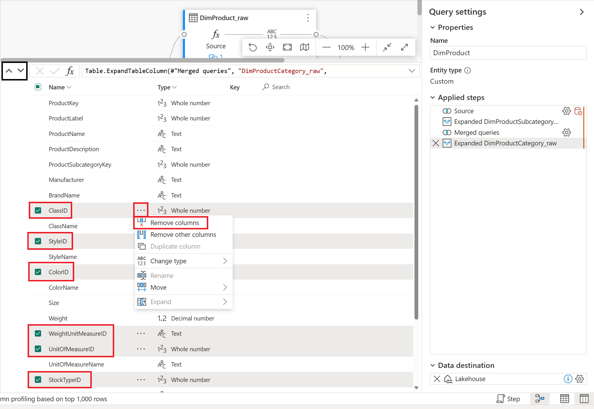

1. Now that we're finished adjusting our queries schema navigate to **Schema tools** tab and select **Close schema view** to return to the data view.

    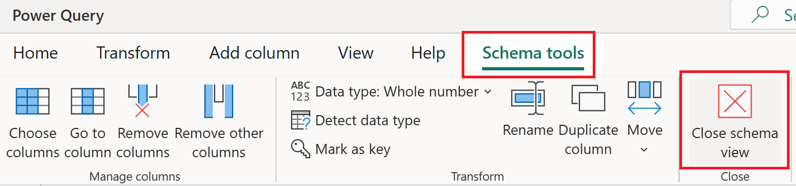

---

<font size="6">✅ Lab check</font>

Schema view lets us shape our data structure with contextual interactions, and speed up our operations as it only needs the column metadata and not the full data results.

Learn more about [Schema view](https://docs.microsoft.com/power-query/schema-view)

---

## Applied step icons

Identifiers are names given to elements in a program like variables, functions etc. Identifiers can either be regular identifiers or quoted identifiers.

Learn more about [Environments and variables](https://docs.microsoft.com/powerquery-m/m-spec-basic-concepts#environments-and-variables)

---

1. In the Query settingspane Applied steps, right click the **Removed columns** step and click **Properties**.

    

1. In the **Step properties** window, enter the following text below into the **Description** field and select **OK** once complete.
    - **Important note:** A **(ℹ️)** icon will be displayed next to the step indicating a description has been added.

    ```text
    Removed ProductCategoryKey and all ID columns.
    ```

    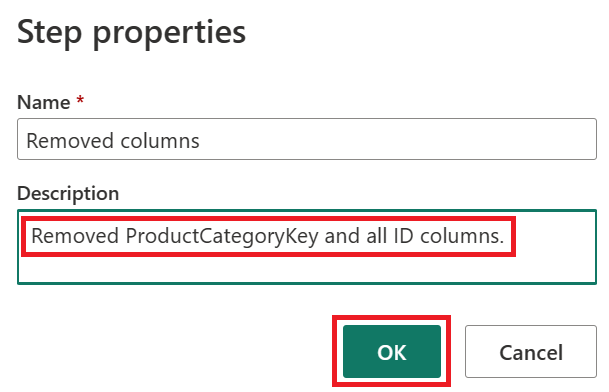

1. Hover above the **Removed columns** step to view details like the step name, transformation type, description, step folding indicator and formula script.

    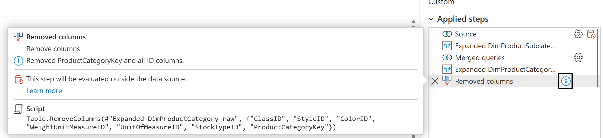

---

## Query plan

The query plan in Power Query Online provides a view of how your query is evaluated. It can help you understand what is happening under the hood of your query and why a particular query might not fold at a particular step as well as the performance and cost of each step.

Learn more about [query plan](https://docs.microsoft.com/power-query/query-plan)

---

To view the query plan for the Removed columns step, we’ll do the following:

1. In the **Query settings** pane on the right, we’ll right click the **Removed columns** step and click the **View query plan** option.

    

1. In the **Query plan** window, we can click any of the **Table.Join** and the **View details** to understand what join algorithm is being used. We’ll click **Close** when we are done.

    

---

## Advanced Editor

The advanced editor in Power Query is a tool that lets you see and edit the code that Power Query Editor is creating with each step. The code is written in M language, which is a powerful and flexible language that allows you to create custom transformations that are not easily achievable through the Power Query user interface.

---

1. Select the **fxGetFact** query in the **Queries** pane.

    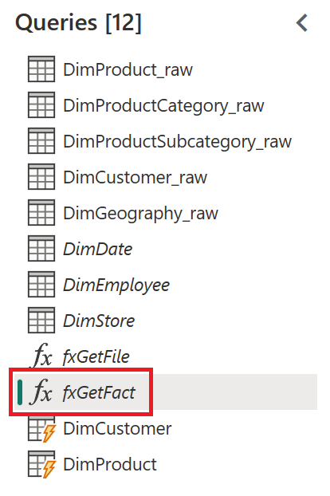

1. Before invoking our custom function, we can enable the **Query script** view to see the full M script by selecting **Query** and then **Query script** from the ribbon in the bottom right corner.
    
    

1. Select **Invoke** to create a new query.
    - **Important note:** To adjust the code block you can drag up or down on the bottom of the editor.

    

1. In the **Query settings** pane, right click the **Invoked function** query and select **Rename**.

    

1. Update the name of the query to **FactOnlineSales**.

    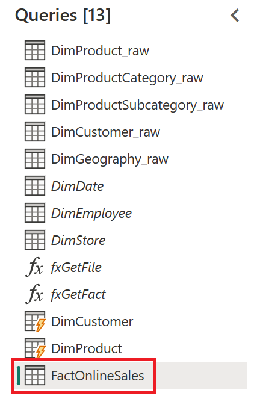

---

## Query groups

When we have many tables in our solutions, it can be hard to keep track of their use. To make it easier, we can organize our queries into groups based on their design patterns.

1. In the **Queries** pane, hold **ctrl** and select the tables from the list below that you want to group together. Then, right click and choose **Move to group** > **New group…**.

    1. DimCustomer_raw
    1. DimGeography_raw
    1. DimProduct_raw
    1. DimProductCategory_raw
    1. DimProductSubcategory_raw

    

    1. In the **New group** window, type **Data staging** as the Name and the text below as the Description. Then, click **Ok**.

        ```text
        Data that will be ingested from the source and referenced in computed tables for transformations via compute engines.
        ```
    
        

1. In the **Queries** pane, hold **ctrl** and select the tables from the list below that you want to group together. Then, right click and choose **Move to group** > **New group…**.
    
    1. DimDate
    1. DimEmployee
    1. DimStore

    

    1. In the **New group** window, type **Data load** as the Name and the text below as the Description. Then, click **Ok**.

        ```text
        Data that will be ingested from the source without transformations.
        ```

        

1. In the **Queries** pane, hold **ctrl** and select the tables from the list below that you want to group together. Then, right click and choose **Move to group** > **New group…**.

    1. DimCustomer
    1. DimProduct
    1. FactOnlineSales

    

    1. In the **New group** window, enter **Data transformation** as the name and the following text as the Description. Then, click **Ok**.

        ```text
        Data that will be ingested from the lake storage for transformations via compute engines.
        ```

     

1. We have created three groups in our **Queries** pane to help us manage and identify our queries more easily. To see more information about each group, we can hover over the group’s folder icon and read the description value.
    1. You can also hover over a query to see its description value, if it has one and to add a description for a query, right click on the query name in the Queries pane and select **Properties**.

    

---

Transforming data at scale

[Learn more about the benefits of loading data without transformation for Text/CSV files](https://docs.microsoft.com/power-query/dataflows/computed-entities-scenarios#load-data-without-transformation-for-textcsv-files)

---
## Saving and refreshing a dataflow

1. In the bottom right corner click **Publish** to save and refresh the final dataflow.
    - Reminder: **Publish later** will only publish the metadata and underlying formula logic of your dataflow. **Publish** will save and close your dataflow and start the refresh.

    

---

# Pipelines

## Activities


---


# Next steps

This part of the lab has demonstrated how dataflows can help you prepare data in the cloud and use it in Power BI easily.

- Continue to the [Data Modeling](./DataModeling.md) lab
- Return to the [Day After Dashboard in a Day](./README.md) homepage

---

# Completed files

To download the completed files from the lab instructions: