# Data Preparation

In this lab, you will learn how to create a comprehensive data ingestion solution using a data pipeline and Dataflow Gen2 in Microsoft Fabric. We will begin by setting up the copy activity to transfer data from a sample source to a dynamic destination within a lakehouse. This process includes using the expression builder to create a dynamic folder structure based on the current date of execution.

Throughout the lab, you will validate and run the pipeline to ensure that the data ingestion process is successful and that the data is organized correctly in the lakehouse. 

By the end of this lab, you will have a solid understanding of how to efficiently manage a data ingestion workflow.

## Data pipelines

### Creating a data pipeline and data connection

1. Select **New item** from the **Collect data** task. This task is for ingesting data, ensuring that your processes are scalable and robust.

    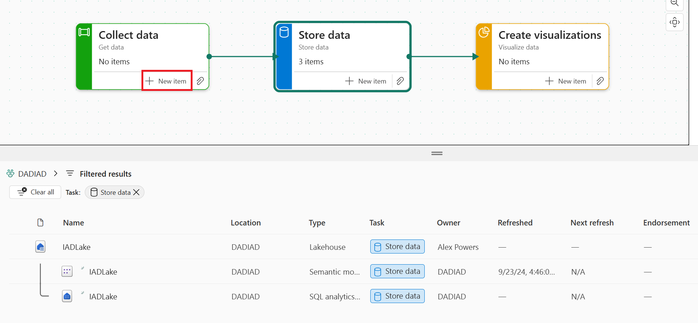

1. Within the Create an item window, the available options within Microsoft Fabric have been filtered down to **Recommended items** only again. Select the **Data pipeline** item which is essential for automating the movement and transformation of data from various sources to destinations.

    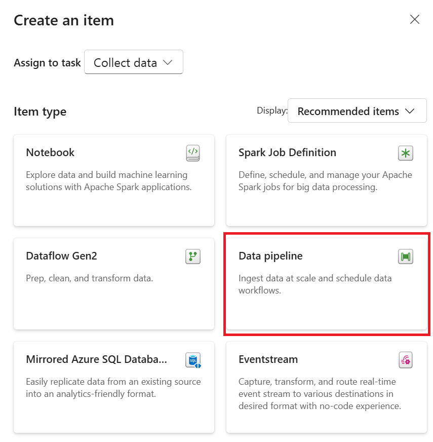

1. In the New pipeline window, set the data pipeline name to "**getContosoSample**" and then select **Create**.

    

1. From the new and empty data pipeline, select the **Pipeline activity** watermark option and then choose **Copy data** to add this activity to the authoring canvas.

    

1. With the **Copy data** activity selected, navigate to the **Source** tab. Within the **Connection** drop-down menu, select the **More** option to launch the Get data navigator. This navigator provides a comprehensive interface for connecting to various data sources, ensuring that you can easily integrate different data streams into your pipeline.

    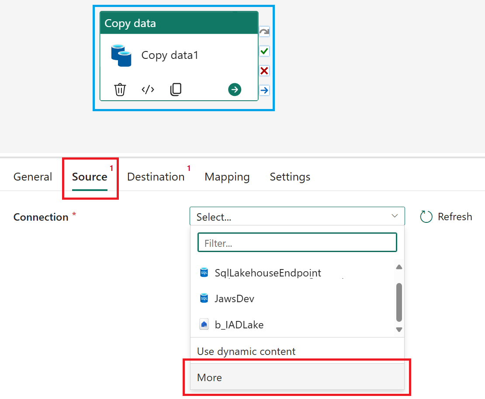

1. From the Get data navigator, select **New** from the left side-rail and then choose the **Http** connector. The Http connector allows you to connect to web-based data sources, providing flexibility in accessing data from various online resources.

    

1. Paste the following sample Zip file address from GitHub into the **Url** path. Also set the **Connection name** property to something more discoverable for future use, such as your initials and then "ContosoSample." Naming your connections helps in easily identifying and managing different data sources within your project. Once complete, select **Connect** to establish the connection.

    ```text
    https://github.com/microsoft/pbiworkshops/raw/main/Day%20After%20Dashboard%20in%20a%20Day/Source_Files/ContosoSales.zip
    ```

    

### Copy activity settings

1. With the **Copy data** activity selected and the **Source** tab displayed, select the **Settings** option next to the File format field. Within the **Compression type** setting, choose **ZipDeflate (.zip)** and select **OK** to complete.

    

1. Next, with the Copy data activity still selected and the Source tab displayed, expand the **Advanced** section. Deselect the option to **Preserve zip file name as folder**. This allows you to customize the folder name for your zip contents, providing more flexibility in organizing your data.

    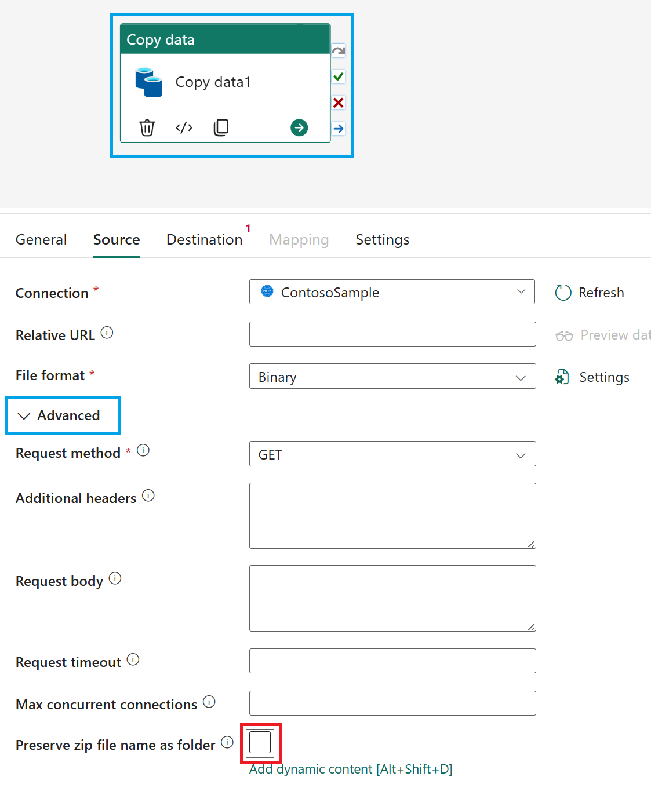

1. With the Copy data activity still selected, navigate to the **Destination** tab. From the list of connections, select the previously configured lakehouse **IADLake**. This step ensures that the data is being copied to the correct destination, which is essential for maintaining data integrity and organization.

    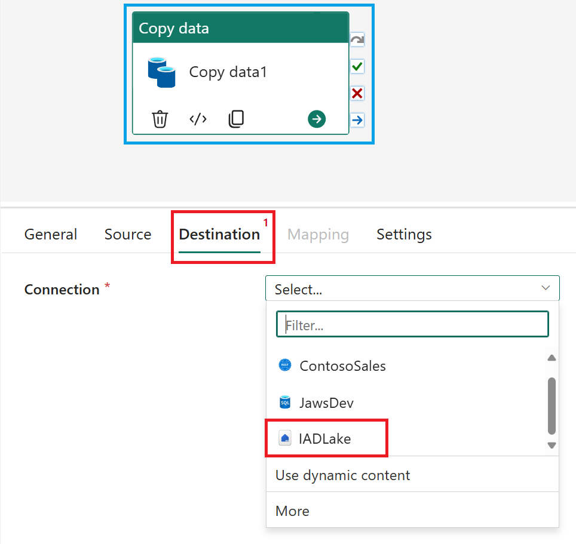

1. Within the Destination settings, select the **Files** option and then the **Directory** file path text input box. This will display the **Add dynamic content [Alt+Shift+D]** property. Select this text to open the pipeline expression builder. The expression builder allows us to create dynamic file paths, which can be customized based on various dynamic parameters such as date and time or static text values.

    

1. In the Pipeline expression builder window, select the **Functions** tab. Here, you can explore various functions that exist within the expression library, in this example we'll use both date and string functions to create a dynamic folder path. When you're ready, copy and paste the code block below into the expression input box. Press **Ok** when complete.

    ```text
    @concat(
        formatDateTime(
            convertFromUtc(
                utcnow(), 'Central Standard Time'
            ),
            'yyyy/MM/dd'
        ),
        '/ContosoSales'
    )
    ```

    

1. With the Copy data activity and Destination settings still selected, expand the **Advanced** section and in the drop-down for the **Copy behavior** choose the **Preserve hierarchy** option. This option maintains the original file names as they are within the zip file, ensuring that the file structure is preserved during the copy process.

    

1. Navigate to the General tab with the Copy data activity selected. Update the **Name** and **Description** fields with the appropriate text. This step helps in identifying and managing the activity within your pipeline, making it easier to understand its purpose and functionality.

    | Property | Text |
    | :-- | :-- |
    | Name | Get and Unzip files |
    | Description | Copies sample data from GitHub and stores raw content in lakehouse files |

    

1. From the **Home** tab, select the **Validate** option to first confirm that there are no issues with your pipeline. This validation step helps in identifying any errors to be fixed before running the pipeline. Once validated, select the **Save** option and then **Run** to start the ingestion from the data pipeline. Running the pipeline initiates the data transfer, allowing you to see the results of your configuration in action within the output window.

    

1. Deselect any previously selected activities within the authoring canvas. This action will make the global properties and **Output** view visible. After starting the run of your pipeline, both the Pipeline status and any individual Activity statuses should show a **Succeeded** status. This indicates that everything ran as intended, confirming that your data ingestion process was successful.

    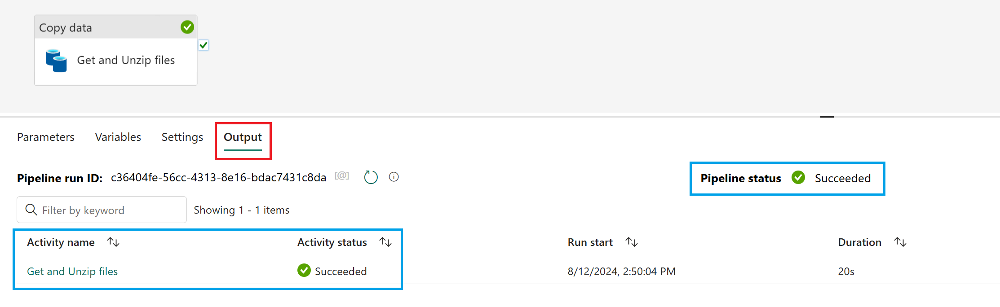

1. If we return to our previously created **IADLake** lakehouse item (either by selecting it on the left side rail if still open or by returning to the workspace item list to open), we can confirm that the zip file's content has now been added to the Files section. The files should be organized with a nested folder structure based on the year, month, date, and data source title for the pipeline run.

    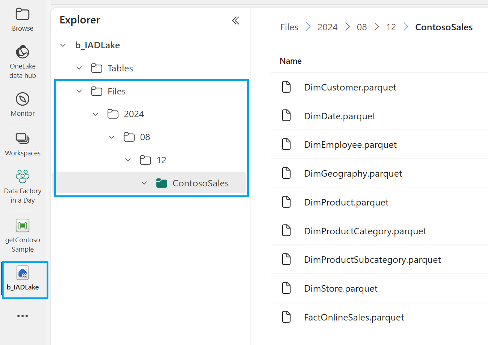

### Creating and applying variables

1. To avoid recreating the same expression throughout our solution, we'll create a variable to store our folder path. First, navigate to the **Activities** tab and select the **Set variable** activity. Once added to the canvas, move the activity card to the left of the copy data activity.

    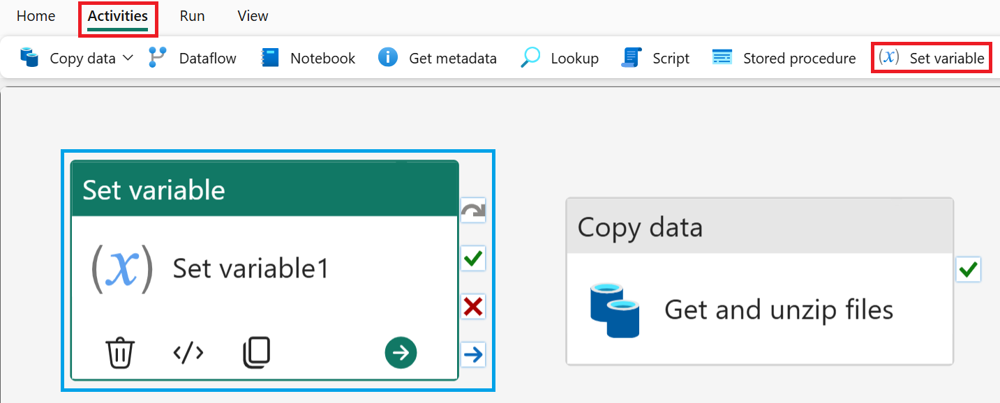

1. With the **Set variable** activity selected, navigate to the **Settings** tab. Next to the **Name** property, select **New**. This step allows you to create a new variable that will be used in your pipeline.

    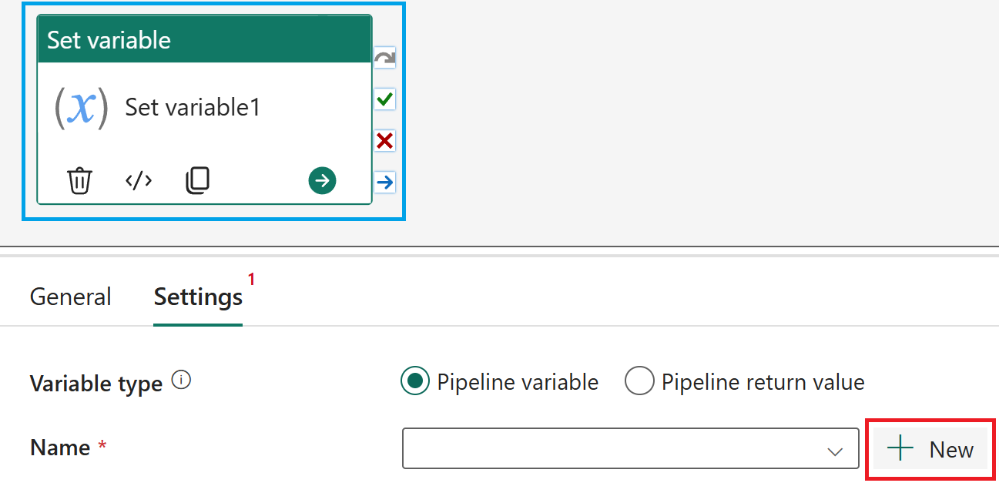

1. In the Add new variable window, set the **Name** value to **fileDirectory** and ensure the **Type** remains as a string before selecting **Confirm**. Naming your variable helps in identifying its purpose and ensures that it is correctly referenced in subsequent steps.

    

1. With the set variable activity still active, select the **Value** text input box. This will display the **Add dynamic content [Alt+Shift+D]** property. Select this text to open the pipeline expression builder.

    In the Pipeline expression builder window copy and paste the code block below into the expression input box. Press **Ok** when complete.

    ```text
    @concat(
        formatDateTime(
            convertFromUtc(
                utcnow(), 'Central Standard Time'
            ),
            'yyyy/MM/dd'
        ),
        '/ContosoSales'
    )
    ```

    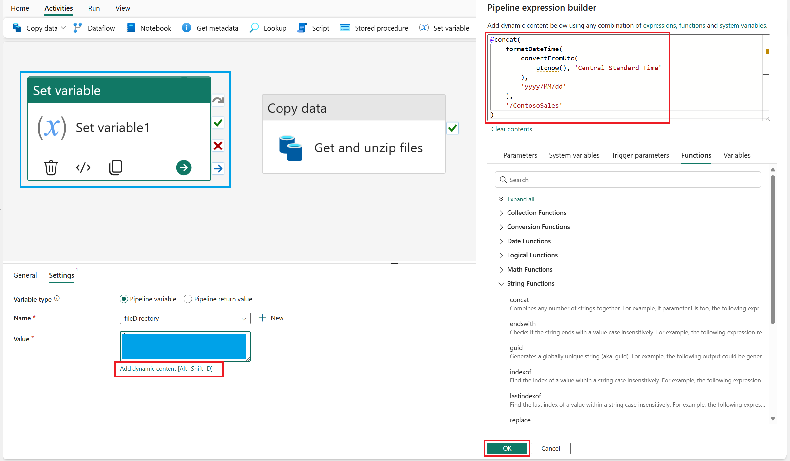

1. First, navigate to the **General** tab with the **Set variable** activity selected. Update the **Name** field with the text "**Set file directory**" This step helps in identifying and managing the activity within your pipeline in subsequent steps, making it easier to understand its purpose and functionality.

    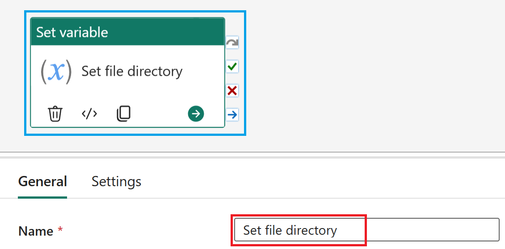

1. Next, drag and drop the **On completion** conditional path between the **Set file directory** activity and the **Get and unzip files** activity.

    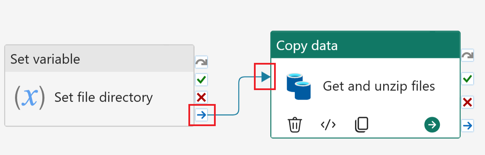

1. Then, select the **Get and unzip files** activity and navigate to the **Destination** settings. Select the directory from the **File path** to open the expression builder. With the expression builder open, select **Clear contents** to clear the previous expression and navigate to the **Variables** tab. Select the **fileDirectory** variable and then click **OK**.

    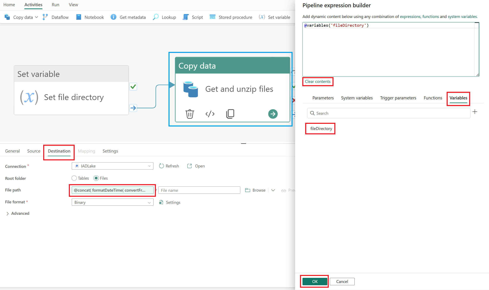

1. Finally, with the **Get and unzip files** activity still selected, navigate to the **General** tab and select **Deactivated**. Since we've already run this activity earlier, we can avoid running it again but still provide activity states during our pipeline creation, such as Skipped, Succeeded, or Failed branches, which can be helpful for testing.

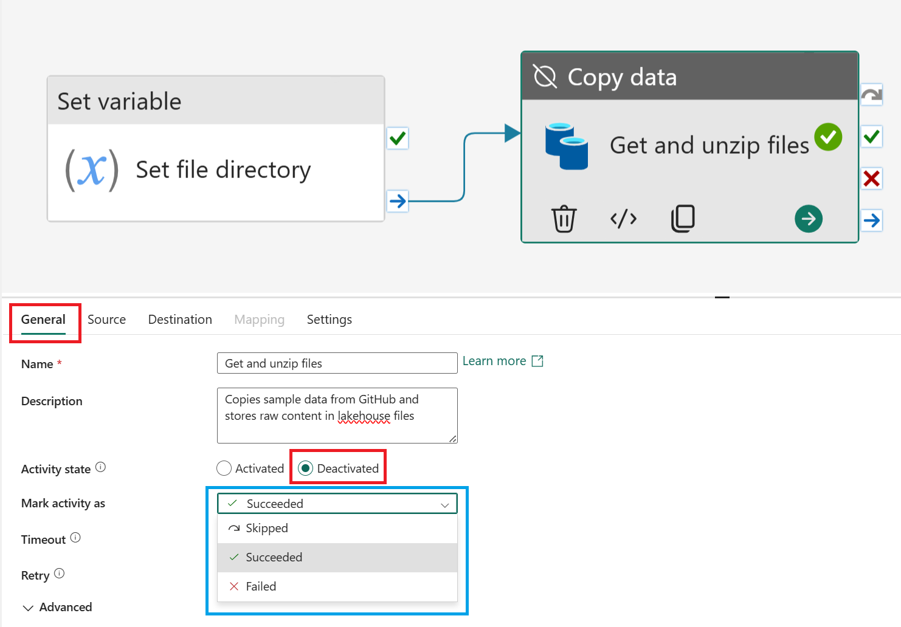

### Metadata contents

1. First, navigate to the **Activities** tab and select the **Get metadata** activity to add it to your canvas. Make sure it is your active selection.

    Next, within the **Settings** options, set the **Connection** to **IADLake** from the available connection options. 

    Choose the **Files** option and then click on the **Directory** file path text input box. This will display the Add dynamic content [Alt+Shift+D] property. Click on this text to open the pipeline expression builder.

    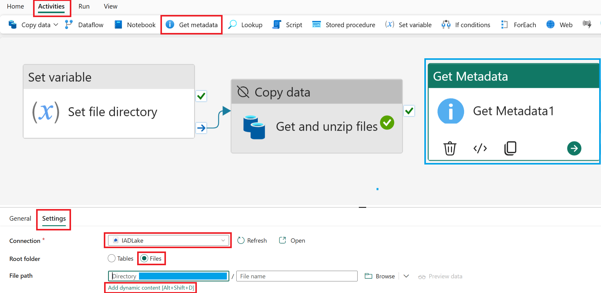

1. In the Pipeline expression builder window, select the **Variables** option. Within the available variable list, select **fileDirectory** and then OK. This step ensures that the file path for the metadata retrieval is dynamically set based on the value of the fileDirectory variable.

    

1. With the Get metadata activity still selected, navigate to the **Settings** tab. Add new Field list values by selecting **New** twice. Within each of the drop-downs, configure the values as **Child items**. This ensures that the metadata activity retrieves information about the child items and their names within the specified directory.

    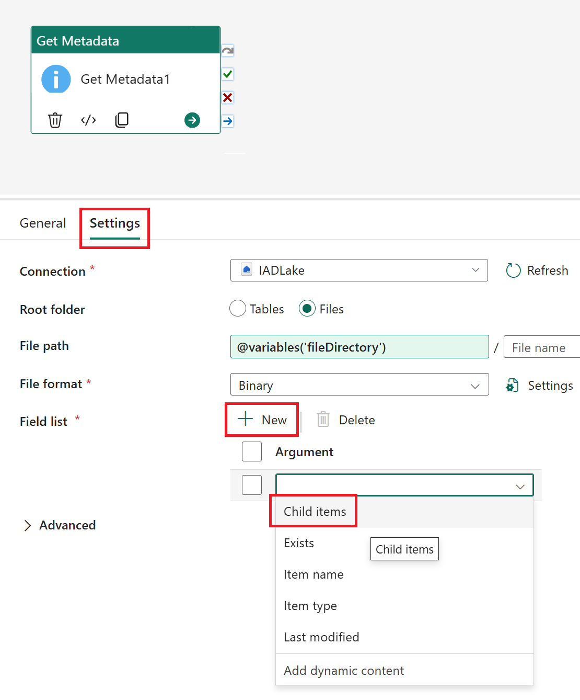

1. Next, navigate to the General tab with the Get metadata activity selected. Update the **Name** field with the text "**Get items in folder**". This step helps in identifying and managing the activity within your pipeline, making it easier to understand its purpose and functionality.

    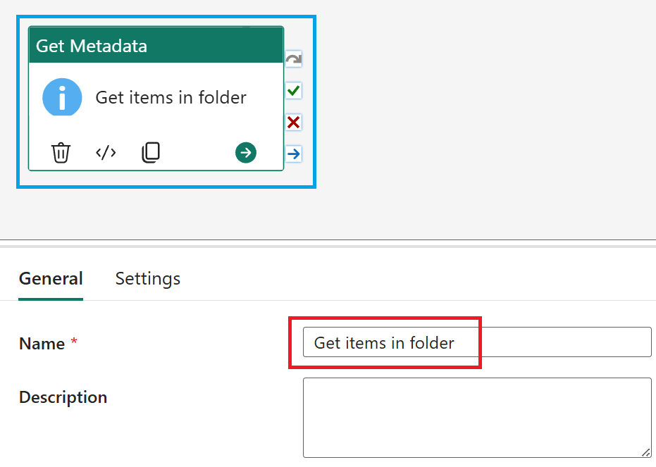

1. Create a conditional path by dragging and dropping the **On success** option between the **Get and unzip files** activity and the **Get items in folder** activity. This step establishes a logical flow in your pipeline, ensuring that the metadata retrieval occurs only after the file directory has been set.

    **Note:** Our activity Get and unzip files is currently deactivated but its activity state is marked as **On success** during testing and building. Before releasing to production you would want to reset the property back to **Activate**.

    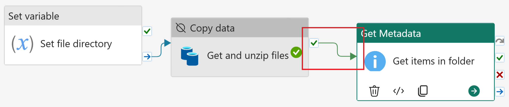

1. Once complete, select **Validate** on the **Home** tab to ensure there are no errors within the pipeline. After validation, select **Run** to start the pipeline.

    A new window will prompt you as unsaved changes have been detected. Select **Save and run** to continue.

    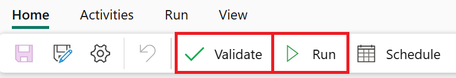

1. Deselect any previously selected activities within the authoring canvas and navigate to the **Output** view. This view allows you to monitor the current status of your pipeline both during and after its run. In this example, both the Pipeline status and the individual activity statuses should show a **Succeeded** status. This indicates that everything ran as intended, confirming that your data ingestion process was successful.

    From the **Get items in folder** activity, select the last column called **Output** to review the contents of the activity. This step allows you to verify that the filenames from your directory have been correctly retrieved and included in the output.

    Of note, the output contains two keys one for **name** and another for **type** which we will access in the next portion of the tutorial.

    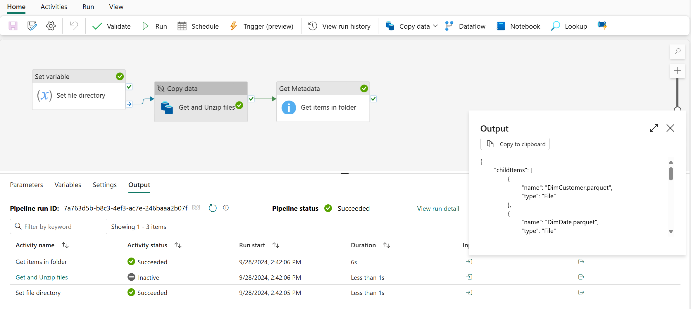

#### ForEach loop and conditional branches

1. Select the **Activities** tab and then the **ForEach** activity to add this to your canvas. This activity allows you to iterate over a collection of items, performing a set of actions for each item in the collection.

    With the **ForEach** activity selected, navigate to the General tab and update the **Name** field with the text **For each file**. Naming your activities helps in identifying their purpose and makes it easier to manage your pipeline.

    Next, create a conditional path by dragging and dropping the **On success** option between the **Get items in folder activity** and the **For each file activity**. This step establishes a logical flow in your pipeline, ensuring that the ForEach retrieval occurs only after the file directory has been successfully completed.

    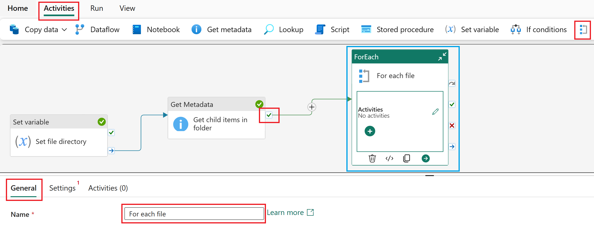

1. With the For each file activity still active, navigate to the **Settings** tab. Select the **Items** text input box. This will display the **Add dynamic content [Alt+Shift+D]** property. Select this text to open the pipeline expression builder. The sequential order ensures that the items are processed one after another, maintaining the order of execution.

    

1. Within the Pipeline expression builder window, select the **Activity outputs** section. Then, choose the **Get items in folder** output of **childItems**. The full option title is **Get items in folder childItems**. This step ensures that the ForEach activity iterates over the child items retrieved from the specified directory.

    

1. Selct the add option on the For each activity and then select **Copy data**. This step will allow us to repeatedly execute the copy data activity for each item in the array.

    

1. Select the **Edit** option on the For each activity to drill into the nested authoring canvas. This step allows you to configure the activities that will be executed for each item in the collection.

    

1. Navigate to the General tab with the Copy data activity selected. Update the **Name** field with the text "**Copy tables**". This step helps in identifying and managing the activity within your pipeline, making it easier to understand its purpose and functionality.

    

1. With the **Copy data** activity still selected, configure the following options in the **Source** tab. Once complete select the **Directory** text input box. This will display the **Add dynamic content [Alt+Shift+D]** property. Select this text to open the pipeline expression builder. :

    | Property | Value |
    | :-- | :-- |
    | Source | Select the **IADLake** lakehouse. |
    | Root folder | Files |
    | File path | File path |
    | File format | Parquet |

    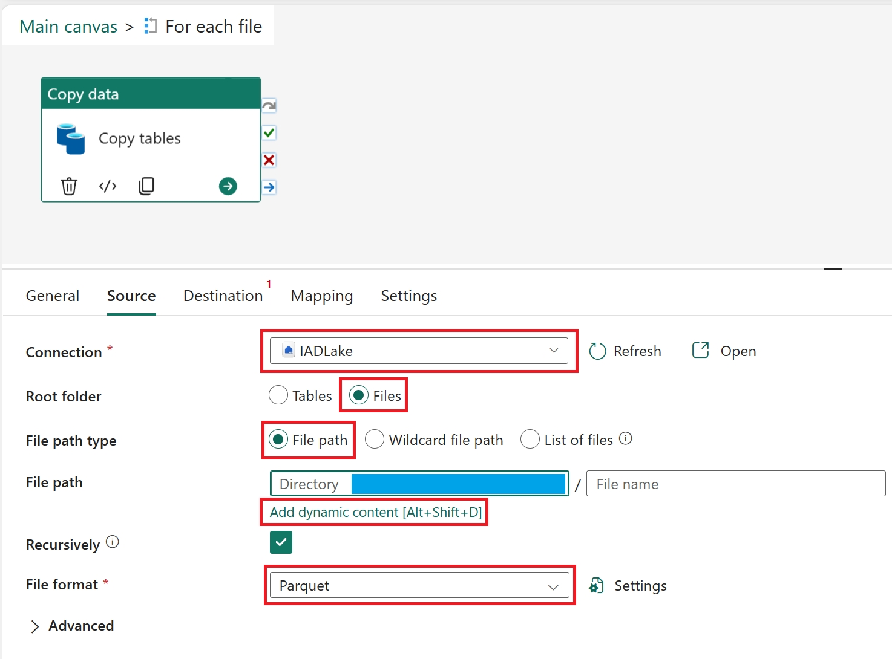

1. Select the variable **fileDirectory** within the expression builder's Variables section and **OK** to continue.

    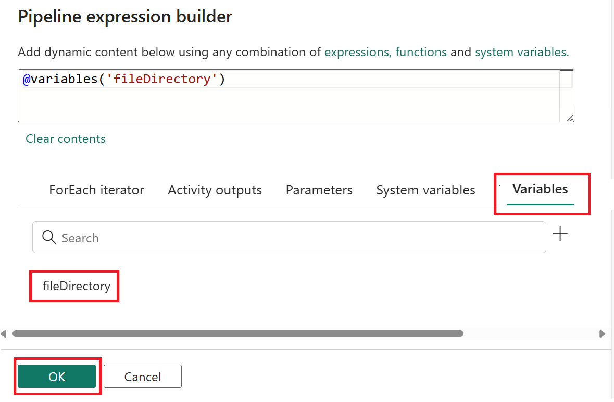

1. Select the **File name** text input box. This will display the **Add dynamic content [Alt+Shift+D]** property. Select this text to open the pipeline expression builder.

    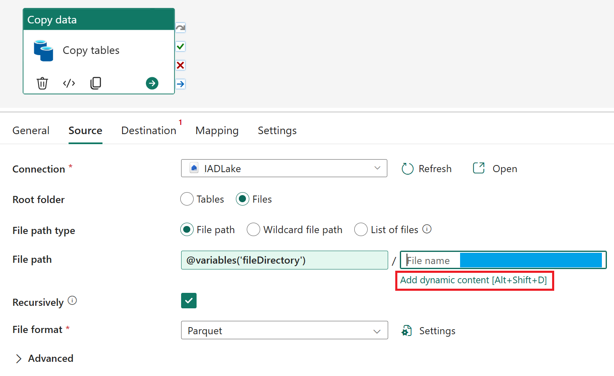

1. Select the item **For each file** within the expression builder's ForEach iterator section. Within the expression builder, add the suffix ".name" to access the name property of the current items array and then **OK** to continue once complete.

    Copy and paste the code block below into the expression input box.

    ```text
    @item().name
    ```

    

1. With the **Copy data** activity selected, configure the following options in the **Destination** tab. Once complete select the **Table** text input box. This will display the **Add dynamic content [Alt+Shift+D]** property. Select this text to open the pipeline expression builder.

    | Property | Value |
    | :-- | :-- |
    | Source | Select the **IADLake** lakehouse. |
    | Destination | Tables |

    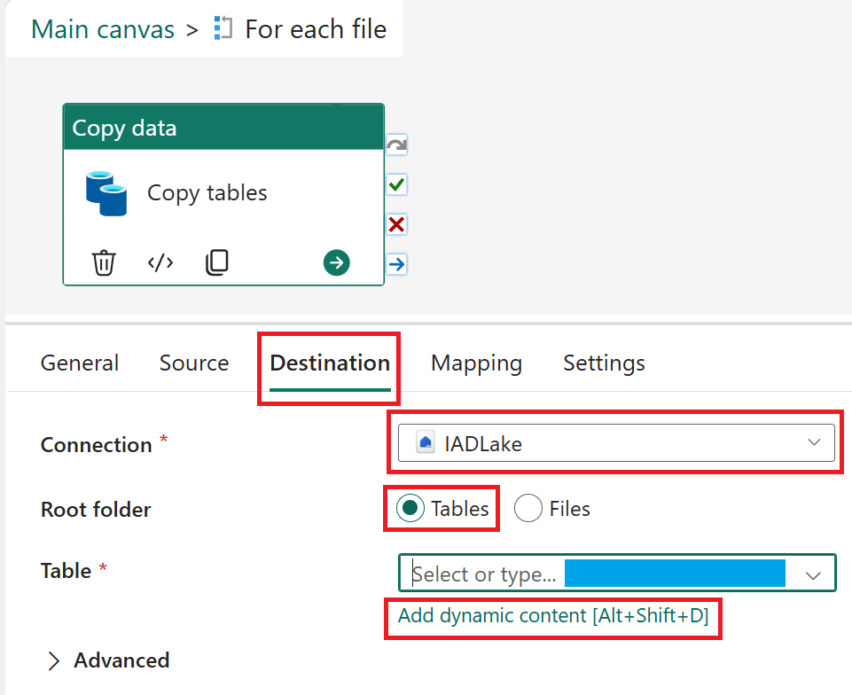

1. Within the expression builder, we'll use the split function from the string functions group to split each item name based on the period delimiter "**.**" and then select the first item from the created array. Once complete select **OK** to continue.

    Copy and paste the code block below into the expression input box.

    ```text
    @split(item().name, '.')[0]
    ```

    

    **Note:** As an example DimCustomer.parquet would become ['DimCustomer','Parquet'] with two items in the returned array. To select the first item we use a zero based index to select the value DimCustomer.

1. Next, with the Copy data activity still selected and the Source tab displayed, expand the **Advanced** section. Hover above either of the **Table action** values to display the **Add dynamic content [Alt+Shift+D]** property. Select this text to open the pipeline expression builder.

    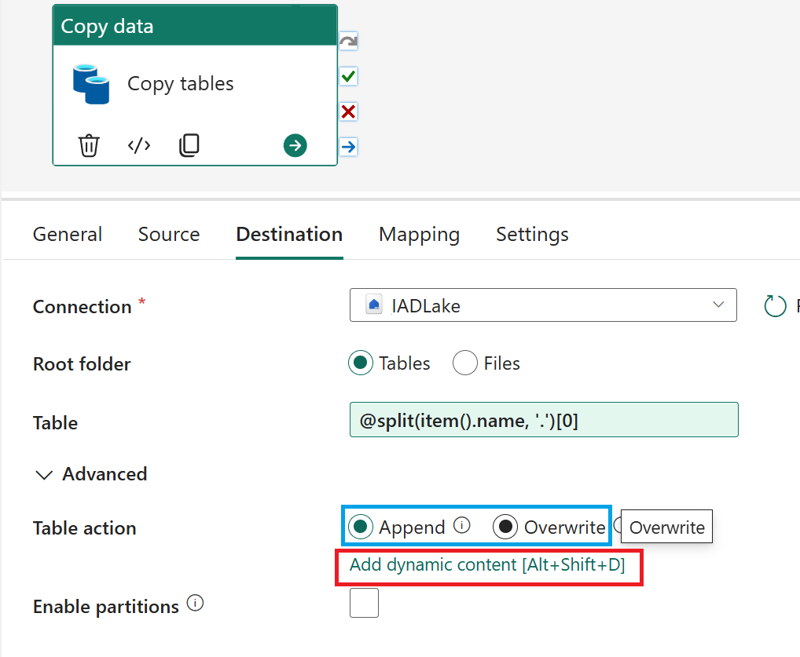

1. Within the expression builder, we'll use the if condition from the logical functions group and the startswith function from the string functions group to determine if the string starts with the prefix of **Dim** for our dimension tables. If true, we'll set the value to **Overwrite**, if false **Append**. Once complete select **OK** to continue.

    Copy and paste the code block below into the expression input box.

    ```text
    @if(
        startswith(item().name, 'Dim'),
        'Overwrite',
        'Append'
    )
    ```

    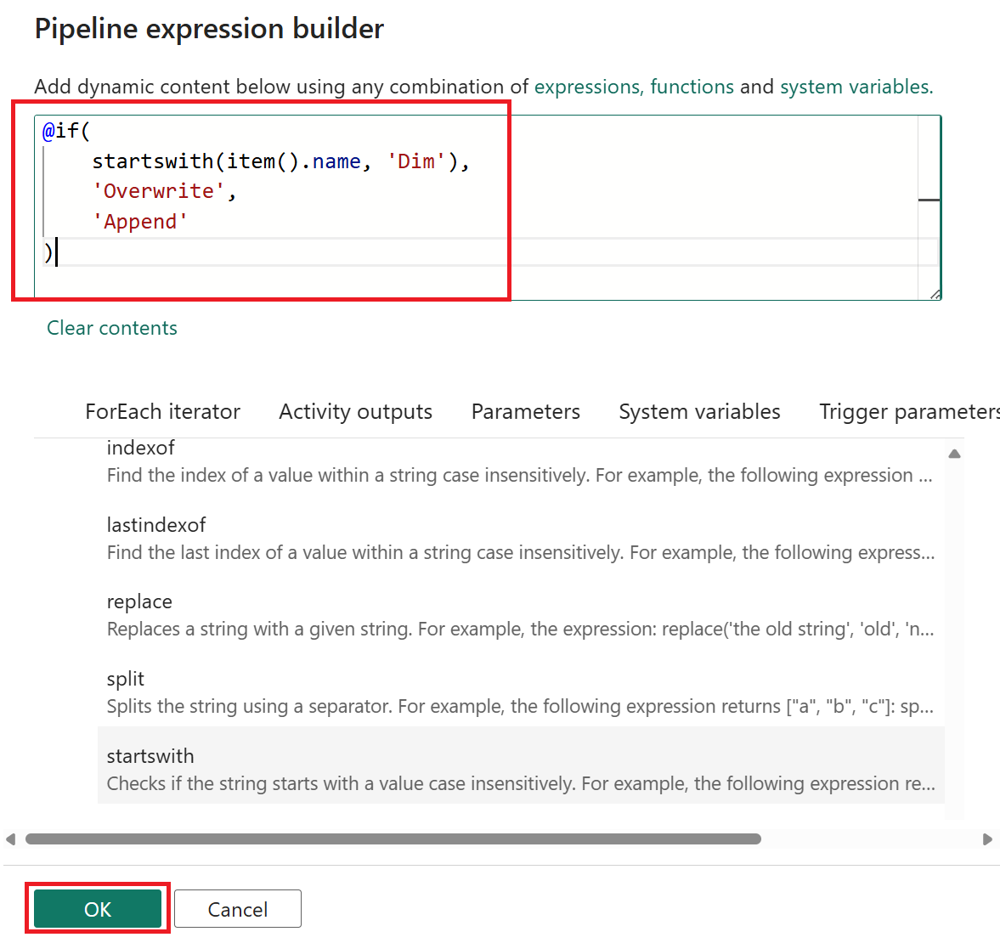

1. Select the **Main canvas** option from the breadcrumb trail to return to the top level of your pipeline.

    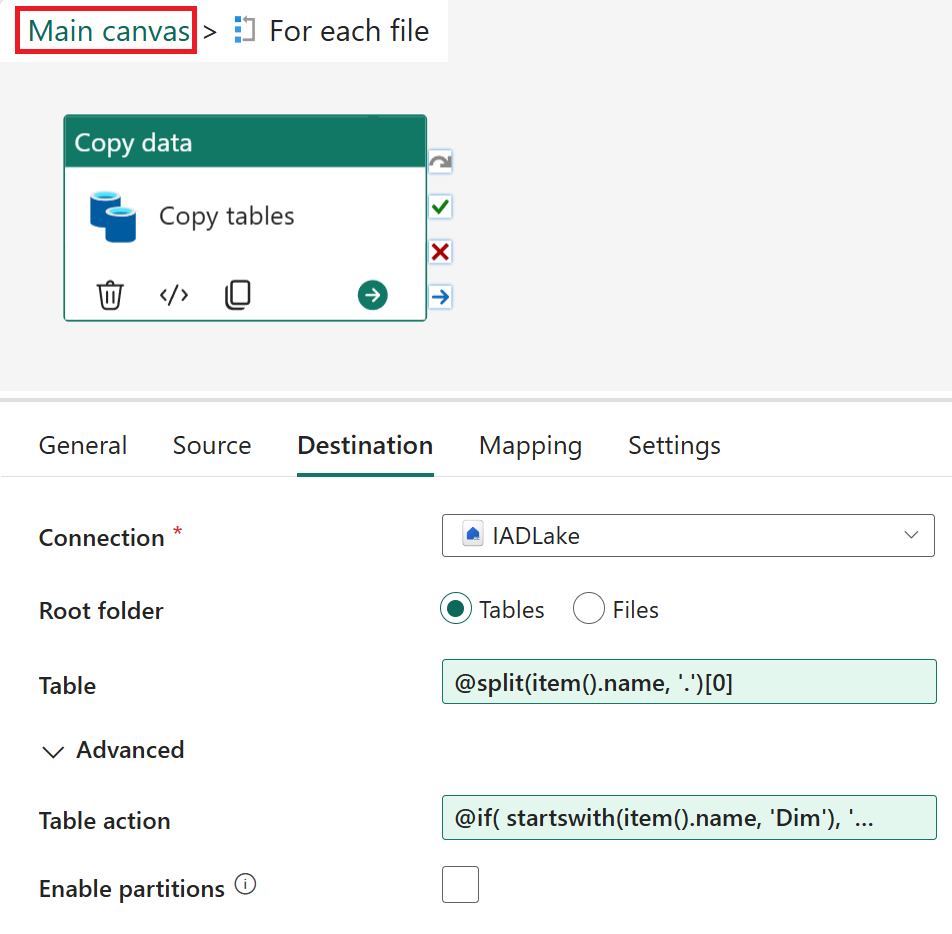

1. From the **Home** tab, select the **Validate** option to first confirm that there are no issues with your pipeline. This validation step helps in identifying any errors to be fixed before running the pipeline.

    Once validated, select the **Save** option and then **Run** to start the ingestion from the data pipeline. If a save window is prompted, confirm by selecting **Save and run**. Running the pipeline initiates the data transfer, allowing you to see the results of your configuration in action within the output window.

    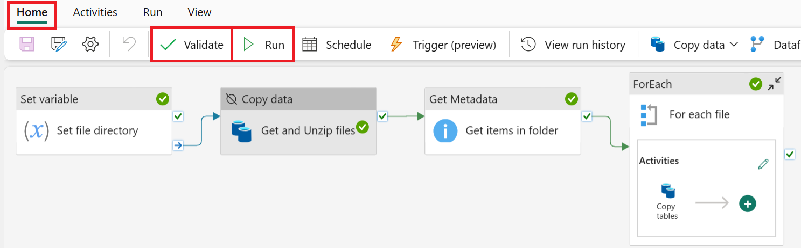

1. The data pipeline is now running multiple activities in a sequential order and writing these to the Silver data layers lakehouse as delta parquet tables. These tables are optimized for analysis, providing several benefits for data processing and querying.

    v-Order optimized tables are crucial for analysis in Microsoft Fabric because they enhance performance and efficiency. By organizing data in a columnar format, v-Order tables allow for faster data retrieval and reduced storage costs. This optimization is particularly beneficial for analytical workloads, where large volumes of data need to be processed and queried quickly. Additionally, delta parquet tables support efficient data updates and versioning, making it easier to manage and analyze evolving datasets.

    By leveraging v-Order optimized tables, you can ensure that your data is stored in a way that maximizes performance and scalability, enabling more effective and timely analysis. This approach helps in making informed decisions based on up-to-date and well-organized data.

    

---

# Next steps

This part of the lab has demonstrated how data pipelines can efficiently ingest data at scale into your lakehouse and how to process raw files into highly optimized tables.

- To continue your learning journey, proceed to the next portion of the [Data preparation](./DataPreparationContinued.md) lab, where we will create a Dataflow Gen2 to shape and transform our tables. 
- Alternatively, you can return to the [Day After Dashboard in a Day](./README.md) homepage.
