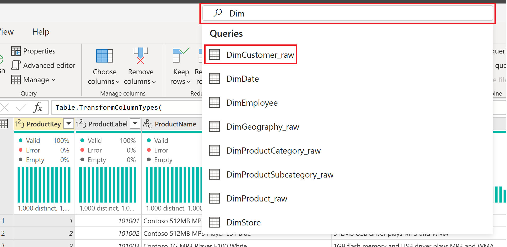
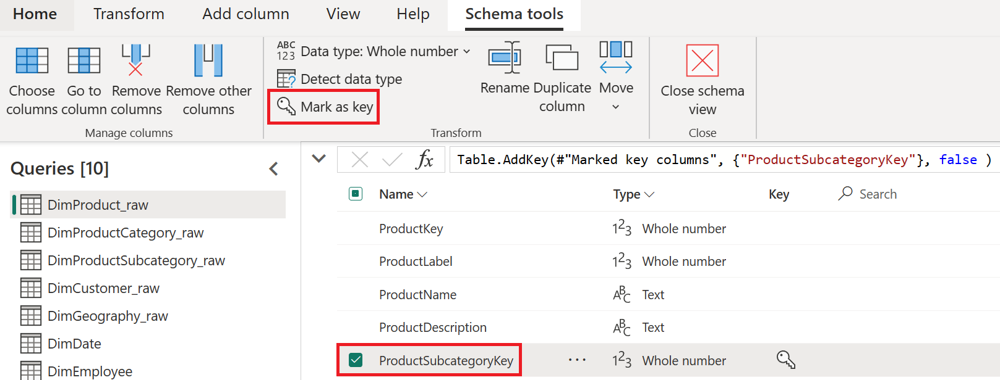
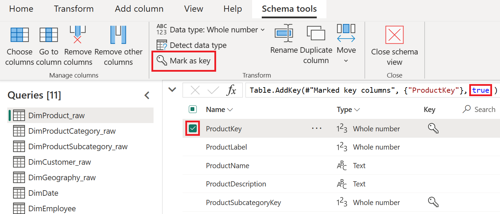
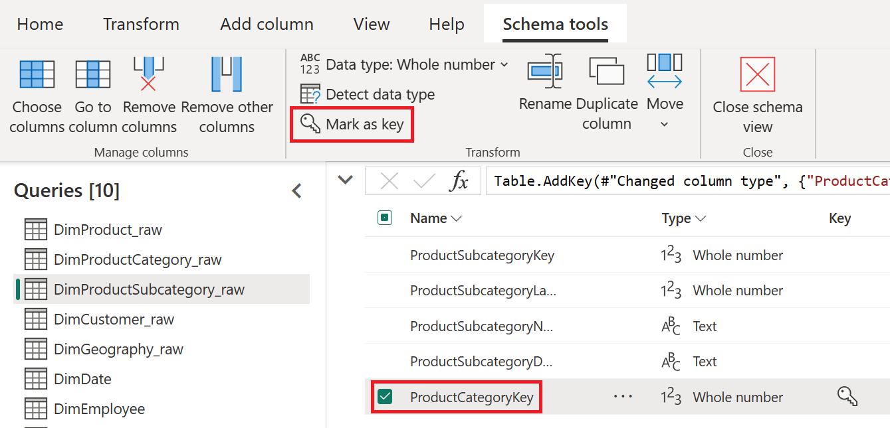
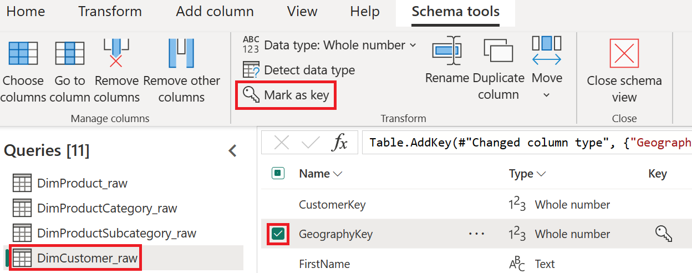
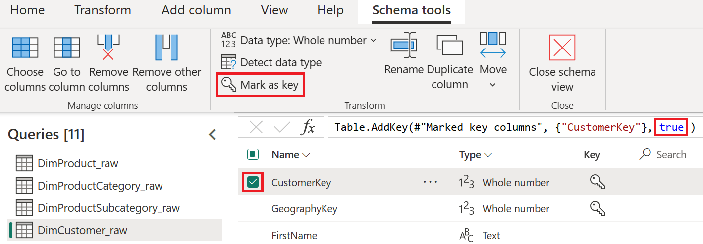
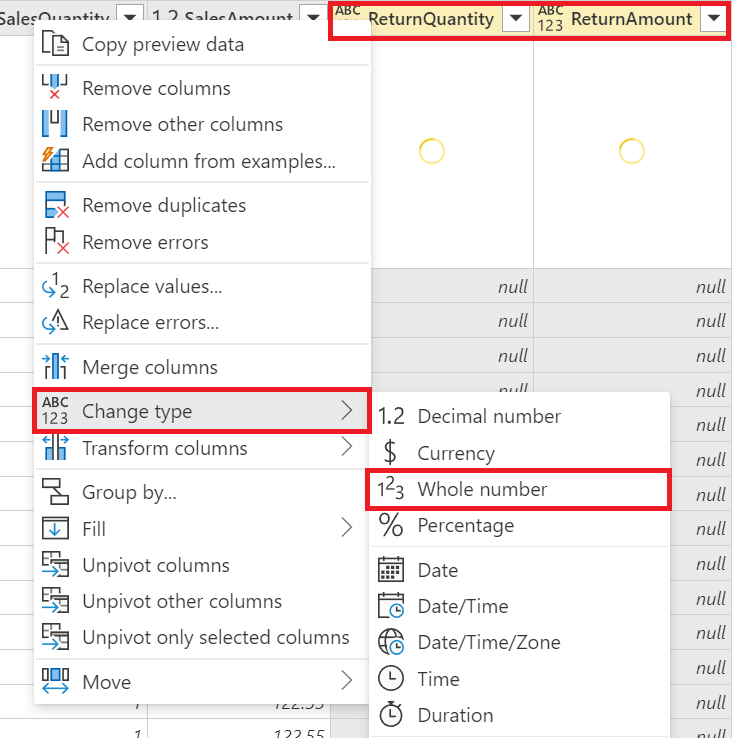
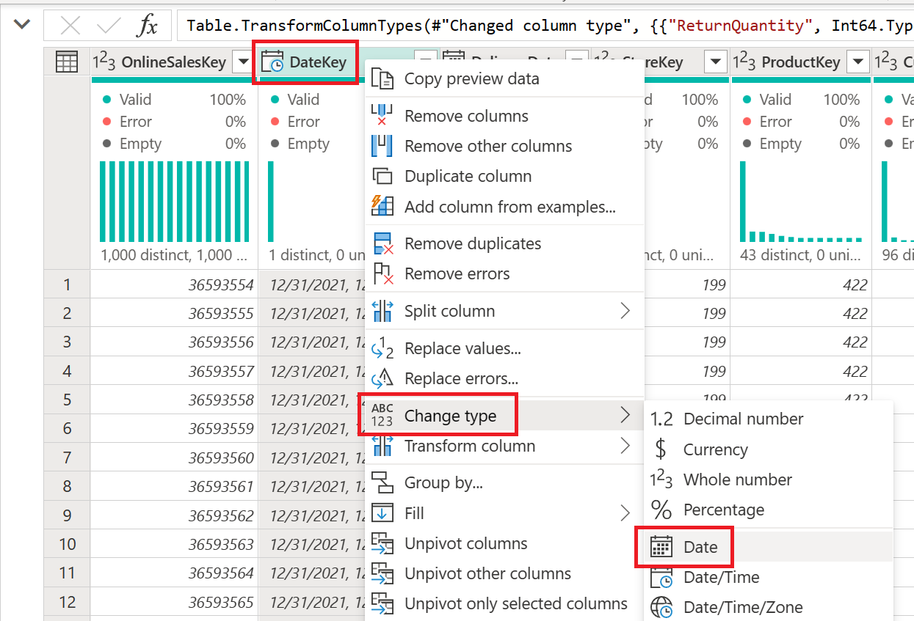
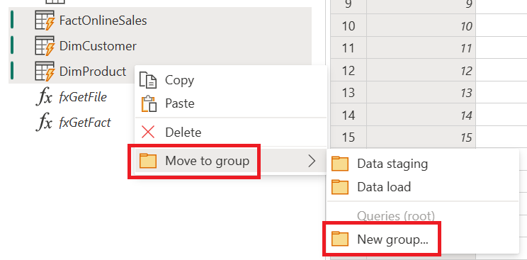
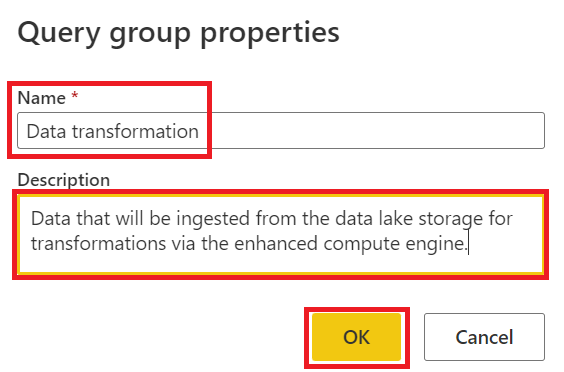

# Data Preparation

✏️ Lab scenario
---

In this part of the lab, our goal is to collect and combine daily files from a cloud directory. The number of files in this directory will increase over time, so we need to create a [future proofed](https://docs.microsoft.com/power-query/best-practices#future-proofing-queries) data preparation solution that can handle this growth.

### Premium license mode

First, we need to go to a new, empty or non-production workspace and check if it has a capacity assigned. If not, we can enable it by choosing one of these options below.

1. To access the settings, we’ll click the **Settings** option in the top right corner of the workspace.

    

1. To check the licensing mode, within the **Settings** pane click the **Premium** tab. Then we’ll make sure one of the following modes is enabled.

    **License mode:**
    - [Premium per user](https://docs.microsoft.com/power-bi/admin/service-premium-per-user-faq)
    - [Premium per capacity](https://docs.microsoft.com/power-bi/admin/service-premium-gen2-faq)
    - [Embedded](https://docs.microsoft.com/power-bi/developer/embedded/embedded-capacity)

    

# Dataflows

With dataflows, you can connect, clean, transform and store data from various sources in a self-service way. Dataflows help you to:

1. Share reusable transformation logic with others as a single source of truth.
1. Protect the underlying data sources from direct access and reduce the load on the underlying systems.
1. Connect other Azure services to the raw or transformed data by exposing it in your own Azure Data Lake Gen 2 storage (BYODL).

[Learn more about dataflows and self-service data prep](https://docs.microsoft.com/power-bi/transform-model/dataflows/dataflows-introduction-self-service)

---

## Import dataflow model

In this part of the lab, we’ll start with an existing dataflow model and skip the basic steps of getting data from a CSV file. Instead, we’ll focus on more advanced transformation patterns.

After we import and refresh our dataflow model, we can use it across other Microsoft products and services. The dataflow model has semantic information such as table names, column names, metadata descriptions and more in a [metadata file (model.json)](https://docs.microsoft.com/common-data-model/model-json) format.


To create a new dataflow from an existing model, we’ll follow these steps:

1. Click **New** in the top left corner of the workspace and choose the Dataflow option.
    
     

1. On the Start creating your dataflow screen, select the **Import Model** option.
    
    

1. Enter the url of the dataflow json file that we want to import into the pop-up window.

    ```
    https://raw.githubusercontent.com/microsoft/pbiworkshops/main/Day%20After%20Dashboard%20in%20a%20Day/Source_Files/Dataflow%20demo.json
    ```

## Edit dataflow credentials

Because the lab files are stored in a publicly accessible [GitHub repository](./Source_Files/), we will authenticate anonymously and skip our test connection to ensure that we can successfully connect to and ingest the lab data.

To configure the data source credentials for the imported dataflow, we’ll do the following after the import is done:

1. Click the **Edit credentials** button in the toast notification at the top right.
    1. Or, in the workspace, click the vertical ellipses ( ⋮ ) next to the dataflow name and choose the **Settings** option.

    

1. On the Settings page for the dataflow, expand the **Data source credentials** section and click the **Edit credentials** link next to the Web source.

    1. In the **Configure…** dialog window, enter the following values and click **Sign in** once complete:
        1. Authentication method | **Anonymous**
        1. Privacy level setting for this data source | **Public**
            1. For more information, see [Power Query privacy level settings](https://docs.microsoft.com/power-bi/admin/desktop-privacy-levels#configure-a-privacy-level)
        1. ☑️ Skip test connection

    

## Enhanced compute engine settings

Power BI Premium users can use the enhanced compute engine in Power BI to optimize dataflows with their capacity.

The enhanced compute engine helps you to:

1. Save refresh time for long-running ETL steps over computed tables, such as joins, distinct, filters, and group by.
1. Run DirectQuery queries over tables.

[Learn more about the enhanced compute engine](https://docs.microsoft.com/power-bi/transform-model/dataflows/dataflows-premium-features?tabs=gen2)

To enable the enhanced compute engine for the dataflow, we’ll follow these steps:

1. On the **Settings** page for the dataflow, go to the **Enhanced compute engine settings** section and switch the setting to **On**. Then click the **Apply** button to save the change.

    

1. In the workspace, click the **Refresh now** option next to the dataflow to apply the change and refresh the data.

    

---

<font size="6">✅ Lab check</font>

To use DirectQuery with our dataflows in the Data Modeling lab, we need to do these steps:

- Turn **On** the enhanced compute engine in dataflow settings
- **Refresh** the dataflow before using it in DirectQuery mode

Learn more about [Using DirectQuery with dataflows](https://docs.microsoft.com/power-bi/transform-model/dataflows/dataflows-directquery#configuration)

---
# Power Query Online

## Global options

Now that we have imported our dataflow and set our credentials, we’ll adjust some settings for authoring in Power Query Online. These settings will stay the same when we author new content later.

---

To edit the dataflow model and enable some global options, we’ll do the following:

1. In the group workspace, click the ellipses (…) next to the dataflow name and choose the **Edit** option.

    

1. In the top right, click the **Edit tables** option to go to the Power Query Online experience.

    

1. On the **Home** tab, click the **Options** > **Global options** property.

    
 
1. In the **Global options** window, make sure the following settings are enabled and click **OK** to confirm.

    **Steps**
    1. Enable step cost indicators
    1. Show script in step callout

    **Column profile**
    1. Enable column profile
    1. Show column value distribution in data preview
    1. Show column value distribution in data preview
    1. Show column profile in details pane

    **Type detection**
    1. Never detect column types and headers for unstructured sources

    **Parameters**
    1. Always allow parameterization in data source and transformation dialogs

    

---

## Data view

The Power Query Online editor is a user interface that allows us to create and edit queries, organize queries by grouping them or adding descriptions to each step, and view our queries and their structure in different ways.

Learn more about the [Power Query editor](https://docs.microsoft.com/power-query/power-query-ui#the-power-query-editor-user-experience)

---

1. To view all of our queries with the text "Dim" in their name, we’ll type **Dim** in the **global search bar** at the center of the Power Query Online editor. Then we’ll select the **DimCustomer_raw** query to proceed.
    1. Shortcut: **Alt+Q**
    1. We can use the up/down arrow keys to browse the results and press **Enter** to confirm our choices.

    

1. From the **Queries** pane, we'll right click the **DimCustomer_raw** query and select **Reference** from the menu.

    

1. If we inspect the **Queries** pane again we'll now notice that a new query titled **DimCustomer_raw (2)** has now been created, with a lightning bolt icon (⚡) indicating that this is a computed table.
    
    This query will leverage the enhanced compute engine which can drastically reduces refresh time required for long-running data preparation steps - such as performing joins between tables.
    
    

1. With the **DimCustomer_raw (2)** query selected, we'll leverage the global search bar to type the text **merge** and select the **Merge queries** action.

    

1. In the **Merge** window complete the following steps and then select **OK** when complete.

    | Merge | Table | Column |
    | :--- | :---- | :--- | 
    | Left table for merge | DimCustomer_raw (2) | GeographyKey |
    | Right table for merge | DimGeography_raw | GeographyKey |

    1. Set the **Join kind** to **Inner**

    

1. Within the data view, navigate to the **DimGeography_raw** column and select the **Expand** icon. Deselect the **GeographyKey** since we this column already exists in our original query and then select **OK**.

    

1. From the **Home** tab select the drop down next to **Choose columns** and then the **Go to column** option (Shorcut: Ctrl+G). 

    Within the search dialog type the column name **GeographyKey** until a result has been returned, you can then either double click the name or press **OK** to continue.

    

1. With the **GeographyKey** selected (highlighted) in the data view, right click the column and select **Remove columns**.

    

1. Within the **Query settings** pane, update the name of our query from **DimCustomer_raw (2)** to the name **DimCustomer**.

    

Now that our data is being ingested and stored in our dataflow's [Azure Data Lake Storage Gen2](https://docs.microsoft.com/azure/storage/blobs/data-lake-storage-introduction), we'll leverage [computed tables](https://docs.microsoft.com/power-query/dataflows/computed-entities-scenarios) to apply transformation logic via the enhanced compute engine.

Learn more about the [Global search box](https://learn.microsoft.com/power-query/search-box)

Learn more about the [benefits of loading data without transformation for Text/CSV files](https://docs.microsoft.com/power-query/dataflows/computed-entities-scenarios#load-data-without-transformation-for-textcsv-files)

---
## Diagram view

Power Query Online lets us prepare data visually in the diagram view of the Power Query editor. This interface helps us easily view the flow of data, both at the query level and at the step level to better determine how our queries are connected and what data preparation steps we have applied to each query.

Learn more about [diagram view](https://docs.microsoft.com/power-query/diagram-view).

---

To merge queries as a new query, we’ll do the following:

1. In the bottom right of the **Power Query** editor, click the **Diagram view** option.

    

1. In the top right of the **DimProduct_raw** table, click the Actions option ( ⋮ ) and choose the **Merge queries as new** option.

    

1. In the Merge window, follow these steps and then click **OK** to confirm.

    | Merge | Table | Column |
    | :--- | :---- | :--- | 
    | Left table for merge | DimProduct_raw | ProductSubcategoryKey |
    | Right table for merge | DimProductSubcategory_raw | ProductSubcategoryKey |

    1. Set the **Join kind** to **Inner**

    

1. On the **Home** tab, click the drop-down arrow next to **Choose columns** and choose the **Go to column** option (Shortcut: Ctrl+G).

    In the search dialog, type the column name **DimProductSubcategory_raw** until it shows up. Then either double-click the name or select the column name and click OK to go to the column.

    

1. In the top right of the **DimProductSubcategory_raw** column, click the expand columns icon and follow these steps:
    1. Uncheck the **ProductSubcategoryKey** column since we already have this column in our original DimProduct_raw table.
    1. Check only the **ProductSubcategoryName** and **ProductCategoryKey** columns.
    1. Uncheck the **Use original column name** as prefix option (if checked).
    1. Click **OK** to confirm.
   
    

1. After the **Expanded DimProduct** step, click the **"+"** icon to insert a new step and follow steps:
    1. In the transformations search, type **Merge**.
    1. Click the **Merge queries** option from the list.

    

1. In the **Merge** window, follow these steps and then click **OK** to confirm.

    | Merge | Table | Column |
    | :--- | :---- | :--- | 
    | Left table for merge | (Current) | ProductCategoryKey |
    | Right table for merge | DimProductCategory_raw | ProductCategoryKey |

    1. Set the **Join kind** to **Inner**

    

1. In the top right of the **DimProductCategory_raw** column - we'll select the expand columns icon and complete the following steps below:
    1. Deselect all columns except **ProductCategoryName**.
    1. Disable the **Use original column name as prefix** option (if enabled).
    1. Select **OK** once complete.

    

1. In the top left of our merged queries, double click the **Merge** query text and update the table name to **DimProduct**.

    

## Schema view

Schema view helps us work on schema level operations by showing our query’s column information clearly. Schema view lets us shape our data structure with contextual interactions, and speed up our operations as it only needs the column metadata and not the full data results.

Learn more about [Schema view](https://docs.microsoft.com/power-query/schema-view)

---

To use the schema view and mark some columns as keys, we’ll do the following:

1. In the bottom right of the Power Query editor, click the **Show schema view** option.

    

1. Click the **DimProduct** query and follow these steps:

    1. In the schema list, click the **ProductSubcategoryKey** and **ProductCategoryKey** column names and on the **Schema tools** tab, click the **Remove columns** option.
    
    **Note:** We can maximize or minimize the view by clicking the chevrons next to the formula bar.

    

1. Click the **DimProduct_raw** query and follow these steps:
    1. In the schema list, click the **ProductSubcategoryKey** column name and on the **Schema tools** tab, click the **Mark as key** option.
    
    
    
    2. In the schema list, click the **ProductKey** column name and on the **Schema tools** tab, click the **Mark as key** option.

    1. In the formula bar, change the [Table.AddKey()](https://docs.microsoft.com/powerquery-m/table-addkey) isPrimary value from false to **true**.
    
    ``` powerquery-m
    Table.AddKey(#"Marked key columns", {"ProductKey"}, true)
    ```

    

1. Click the **DimProductSubcategory_raw** query and follow these steps:
    1. In the schema list, click the **ProductCategoryKey** column name and navigate to the **Schema tools** tab and select the **Mark as key** option.

    

    2. In the schema list, click the **ProductSubcategoryKey** column name and on the **Schema tools** tab, click the **Mark as key** option.
    3. In the formula bar, change the Table.AddKey() isPrimary value from false to **true**.

    ``` powerquery-m
    Table.AddKey(#"Marked key columns", {"ProductSubcategoryKey"}, true )
    ```

    

1. Click the **DimProductCategory_raw** query and follow these steps:
    1. In the schema list, click the **ProductCategoryKey** column name and navigate to the **Schema tools** tab and select the **Mark as key** option.
    1. Within the formula bar, update the [Table.AddKey()](https://docs.microsoft.com/powerquery-m/table-addkey) **isPrimary** value from **false** to **true**.
    
    ``` powerquery-m
    Table.AddKey(#"Changed column type", {"ProductCategoryKey"}, true)
    ```

    

1. Click the **DimGeography_raw** query and follow these steps:
    1. In the schema list, click the **GeographyKey** column name and navigate to the **Schema tools** tab and select the **Mark as key** option.
    1. Within the formula bar, update the [Table.AddKey()](https://docs.microsoft.com/powerquery-m/table-addkey) **isPrimary** value from **false** to **true**.

    ``` powerquery-m
    Table.AddKey(#"Changed column type", {"GeographyKey"}, true)
    ```
    
    

1. Click the **DimCustomer_raw** query and follow these steps:
    1. In the schema list, click the **GeographyKey** column name and navigate to the **Schema tools** tab and select the **Mark as key** option.

    

    1. In the schema list, click the **CustomerKey** column name and navigate to the **Schema tools** tab and select the **Mark as key** option.
    1. Within the formula bar, update the [Table.AddKey()](https://docs.microsoft.com/powerquery-m/table-addkey) **isPrimary** value from **false** to **true**.

    ``` powerquery-m
    Table.AddKey(#"Marked key columns", {"CustomerKey"}, true )
    ```

    

---

## Applied step identifiers

Identifiers are names given to elements in a program like variables, functions etc. Identifiers can either be regular identifiers or quoted identifiers.

Learn more about [Environments and variables](https://docs.microsoft.com/powerquery-m/m-spec-basic-concepts#environments-and-variables)

---

To insert a step and get a list of the column names to be filtered out in our table, we’ll do the following:

1. Go back to the query titled **DimProduct** and click the **Fx** button next to the formula bar to **Insert step**

    

To get a list of the column names in our table, we’ll follow these steps:

1. In the formula bar, put the current **#“Removed columns”"** identifier value inside the [Table.ColumnNames()](https://docs.microsoft.com/powerquery-m/table-columnnames) function as shown below.
1. Press **Enter** to finish the formula, and then click the Switch to data preview to see our results.

    ``` powerquery-m
    Table.ColumnNames(#"Removed columns")
    ```

    

To filter out any value from our list that has the text “ID” in the column name, we’ll do the following:

1. Click the **Fx** button next to the formula bar to **Insert step** and write the following formula below using the [List.Select()](https://docs.microsoft.com/powerquery-m/list-select) and [Text.Contains()](https://docs.microsoft.com/powerquery-m/text-contains) functions and the **not** [keyword](https://docs.microsoft.com/powerquery-m/m-spec-lexical-structure#keywords).

    ``` powerquery-m
    List.Select( Custom , each not Text.Contains( _ , "ID", Comparer.Ordinal ) )
    ```

    

1. In the **Query settings** pane **Applied steps**, right click the **Custom** step and click **Rename** and change the current value from **Custom** to **Get column names**.

    

1. In the **Query settings** pane **Applied steps**, right click the **Custom 1** step, click **Properties** and change the following values: **Name:** Select non-ID columns - and - **Description:** Select only columns where the text ID does not exist. Click **OK** once complete.

    

1. In the **Applied steps** list, we notice an information icon now. If we hover over this icon we can see our step description and our step formula in the **Script** field. This helps us understand the transformation we did at a glance.

    

1. To select the non-ID table columns, we'll click the **Fx** button next to the formula bar to **Insert step** and write the following formula.

    ``` powerquery-m
    Table.SelectColumns( #"Removed columns", #"Select non-ID columns" )
    ```

    

1. In the **Applied steps** list, right click **Custom** and update the title to **Select columns**.

    

To review the visual flow of our queries and steps, we’ll go back to the **Diagram view** and do the following:

1. Click the **Expand** option in the top right of the **DimProduct** query. Here we can see the following:
    1. The **DimProductCategory_raw** and **DimProductSubcategory_raw** tables both have Key columns in them.
    1. The **DimProduct** table has two separate branches starting from the **Removed columns** step identifier.
        1. One branch is for the **Get column names** and **Select non-ID columns** steps.
        1. The other branch is to combine the original **Removed columns** with the **Select non-ID columns** to get our final query result.

Step identifiers are like variables that we can use throughout our query steps to create more advanced and custom solutions that may not follow the linear order of the **Applied steps** list.

 

---

## Query plan

The query plan in Power Query Online provides a view of how your query is evaluated. It can help you understand what is happening under the hood of your query and why a particular query might not fold at a particular step as well as the performance and cost of each step.

Learn more about [query plan](https://docs.microsoft.com/power-query/query-plan)

---

To view the query plan for the Expanded DimProductCategory_raw step, we’ll do the following:

1. In the **Query settings** pane on the right, we’ll right click the **Select columns** step and click the **View query plan** option.

    

1. In the **Query plan** window, we’ll click the inner joined **Table.Join** Full scan and then click the View details to see what join algorithm is being used. We’ll click **Close** when we are done.

    

---

## Advanced Editor

The advanced editor in Power Query is a tool that lets you see and edit the code that Power Query Editor is creating with each step. The code is written in M language, which is a powerful and flexible language that allows you to create custom transformations that are not easily achievable through the Power Query user interface.

---

1. To create a new query from the Home tab, select the drop-down for **Get data** and choose the **Blank query** option.
    1. We can also use the keyboard shortcut **Ctrl + M**

    

1. We can now write or paste the below function in the **Advanced editor** window, and select **OK** to proceed.
    1. To test the return value of the function, supply a numeric value and then select **Invoke**.
  
    ```fsharp
    let
    // A function that accept a number value to create a concatenated file name.
    fileNameUpdate =
    (#"File number" as number) as text =>
        Source =
            Text.Combine(
                {
                    "FactOnlineSales_",
                    Text.From(#"File number"),
                    ".parquet"
                }
            )
    in
        Source
    ```

    The function we have written [combines](https://docs.microsoft.com/powerquery-m/text-combine) the file prefix, file number and file extension to create a custom function for the full file name. We have also converted your #"File number" value to text to avoid any errors with joining non-text values.

1. Open the **Advanced editor** and add a coma to the end of the **fXFileName** step. Now create a new step with the identifier name of **Source** and a [**record**](https://docs.microsoft.com/powerquery-m/expressions-values-and-let-expression#record) value. Assign the key/value pairing as displayed below and update the return value to **Source** after the text **in**.

    | | Key  |  | Value |
    | :--- | :--- | :---- | :--- |
    | [ | | | |
    | | fileCount  | =  | 1, |
    | | fileName | = | fxFileName(fileCount), |
    | | data | =  | fxGetFile(fileName) |
    | ] | |  |

    ```fsharp
    let
      // A function that accept a file number value and concatenates text
        fileNameUpdate =
            (#"File number" as number) as text =>
                let
                    Source =
                        Text.Combine(
                            {
                                "FactOnlineSales_",
                                Text.From(#"File number"),
                                ".parquet"
                            }
                        )
                in
                    Source,
        tableReturn = [
            fileCount = 1,
            fileName = fileNameUpdate(fileCount),
            data = fxGetFile(fileName)
        ]
    in
      tableReturn
    ```

1. To enable the **Query script** view and see the full script on our screen, navigate to **View** and then **Query script** from the ribbon.
    1. **Optional:** To validate that the results are updating, change the **fileCount** value to **2** and review the **fileName** and **data** values in the data preview. If a change was made, return the **fileCount** value to **1** before proceeding.

    

1. Within the expanded **Query script** view, add a comma to the end of the **tableReturn** step and add a new step with the step identifier name of **Source** with the [**List.Generate**](https://docs.microsoft.com/powerquery-m/list-generate) function, and update the text after the **in** statement to **fileList** to review the functions documentation.
    1. Typing any function name without the open and closed parenthesis proceeding will return the function's documentation.

    ```fsharp
    let
      // A function that accept a file number value and concatenates text
        fileNameUpdate =
            (#"File number" as number) as text =>
                let
                    Source =
                        Text.Combine(
                            {
                                "FactOnlineSales_",
                                Text.From(#"File number"),
                                ".parquet"
                            }
                        )
                in
                    Source,
        tableReturn = [
            fileCount = 1,
            fileName = fileNameUpdate(fileCount),
            data = fxGetFile(fileName)
        ],
        Source = List.Generate
    in
      Source
    ```

1. Now that we've reviewed the documentation, update the **Query script** view to the below.
    1. For the **initial** parameter include the goes-to "**=>**" symbol and then the **tableReturn** step.
    1. For the **condition** parameter, we'll use square brackets to reference the initialized **tableReturn** value's **[data]** to logically test that the returned value is **not** empty, when using the **[Table.IsEmpty()](https://docs.microsoft.com//powerquery-m/table-isempty)** function.
    1. For the **next** parameter, create a record that matches the **tableReturn** step's **fileCount**, **fileName** and **data** fields and increment the **fileCount** by it's current integer value plus **one**.

    ```fsharp
    let
      // A function that accept a file number value and concatenates text
        fileNameUpdate =
            (#"File number" as number) as text =>
                let
                    Source =
                        Text.Combine(
                            {
                                "FactOnlineSales_",
                                Text.From(#"File number"),
                                ".parquet"
                            }
                        )
                in
                    Source,
        tableReturn = [
            fileCount = 1,
            fileName = fileNameUpdate(fileCount),
            data = fxGetFile(fileName)
        ],
        Source =
            List.Generate(
                () => tableReturn,
                each try not Table.IsEmpty([data]) otherwise false,
                each
                    [
                        fileCount = [fileCount] + 1,
                        fileName = fileNameUpdate(fileCount),
                        data =
                            try fxGetFile(fileName)
                            otherwise
                                #table(
                                    {},
                                    {}
                                )
                    ]
            )
    in
      Source
    ```

1. To convert the returned list to a table, go to the **List tools** tab and click **To table**.

    

1. Click the expand columns icon in the top right of **Column1**. Uncheck **Use original column name as prefix** and click **OK**.

    

1. Right-click **data** and choose **Remove other columns** to delete all other columns from the table.

    

1. Click the expand columns icon in the top right of **data**. Uncheck "**index_level_0_**" and **Use original column name** as prefix if checked. Click **OK**.

    

1. Press **Ctrl+A** to select all columns. Go to the **Transform** tab and click **Detect data type** to change the current columns [any](https://docs.microsoft.com/power-query/data-types) value (ABC123) automatically. Some columns may not have the appropriate type, so follow these steps:

    

    1. Shift-select **ReturnAmount** and **ReturnQuantity**. Right-click and go to **Change type** > **Whole number**.

    

    1. Shift-select the **DateKey** and **DeliveryDate**. Right-click and go to **Change type** > **Date**.

    

1. In the **Query settings** pane, rename the query as **FactOnlineSales**.

    

---

<b>Optional: Power Query M function reference</b>

To view a complete list of Power Query function documentation, from the **Home** tab select **Get data** and **Blank query**, update the **Source** step's value to **#shared** and select **Next** to proceed. A record value will be returned including the [Power Query M function reference](https://docs.microsoft.com/powerquery-m/power-query-m-function-reference) documentation.

If you want to see [Power Query functions](https://docs.microsoft.com/powerquery-m/power-query-m-function-reference) and their documentation in the editor, you can follow these steps:

- On the **Home** tab, click **Get data** and choose **Blank query**.
- In the formula bar, replace the Source step’s value with **#shared** and press Enter.
- Click next to a record value to view the function documentation.

```powerquery-m
let
    Source = #shared
in
    Source
```

## Query groups

When we have many tables in our solutions, it can be hard to keep track of their use. To make it easier, we can organize our queries into groups based on their design patterns.

1. In the **Queries** pane, hold **ctrl** and select the tables from the list below that you want to group together. Then, right click and choose **Move to group** > **New group…**.

    1. DimCustomer_raw
    1. DimGeography_raw
    1. DimProduct_raw
    1. DimProductCategory_raw
    1. DimProductSubcategory_raw

    

    1. In the **New group** window, enter **Data staging** as the name and the following text as the Description. Then, click **Ok**.

        ```
        Data that will be ingested from the source and referenced in computed tables for transformations via the enhanced compute engine.
        ```
    
        

1. In the **Queries** pane, hold **ctrl** and select the tables from the list below that you want to group together. Then, right click and choose **Move to group** > **New group…**.
    
    1. DimDate
    1. DimEmployee
    1. DimStore
    1. FactOnlineSales

    

    1. In the **New group** window, enter **Data load** as the name and the following text as the Description. Then, click **Ok**.

        ```
        Data that will be ingested from the source without transformations.
        ```

        

1. In the **Queries** pane, hold **ctrl** and select the tables from the list below that you want to group together. Then, right click and choose **Move to group** > **New group…**.

    1. DimCustomer
    1. DimProduct

    

    1. In the **New group** window, enter **Data transformation** as the name and the following text as the Description. Then, click **Ok**.

        ```
        Data that will be ingested from the data lake storage for transformations via the enhanced compute engine.
        ```

     

1. We have created three groups in our **Queries** pane to help us manage and identify our queries more easily. To see more information about each group, we can hover over the group’s folder icon and read the description value.
    1. You can also hover over a query to see its description value, if it has one and to add a description for a query, right click on the query name in the Queries pane and select **Properties**.

    

---

Transforming data at scale

Now that our data is being ingested and stored in a [Azure Data Lake Storage Gen2](https://docs.microsoft.com/azure/storage/blobs/data-lake-storage-introduction), we'll leverage [computed tables](https://docs.microsoft.com/power-query/dataflows/computed-entities-scenarios) to apply transformation logic via the enhanced compute engine.

[Learn more about the benefits of loading data without transformation for Text/CSV files](https://docs.microsoft.com/power-query/dataflows/computed-entities-scenarios#load-data-without-transformation-for-textcsv-files)

---
## Saving and refreshing a dataflow

1. Click **Save & close** in the bottom right corner to leave the Power Query editor.

    

1. Click **Close** in the top right corner to leave the current dataflow.

    

1. In the workspace, click **Refresh now** on the dataflow to load the labs data and apply the transformation logic.

    

---

# Power Query Desktop

## Query folding

Query folding is the ability for a Power Query query to generate a single query statement to retrieve and transform source data. The Power Query mashup engine strives to achieve query folding whenever possible for reasons of efficiency.

[Learn more about query folding](https://docs.microsoft.com/power-query/power-query-folding)

---

1. Open **Power BI Desktop** and click **Get data** on the **Home** tab. In the **Get dialog** window, go to the **Power Platform** section and choose the **Dataflows** connector. Click **Connect** to go to the Dataflows navigator window.

    

1. In the **Navigator** window, find the group Workspace where the dataflow is stored and select all the tables from the list below in the dataflow. Then, click **Transform Data** to proceed.

    | Table |
    | :---- |
    | DimDate |
    | DimEmployee |
    | DimStore |
    | DimCustomer_raw |
    | DimGeography_raw |
    | DimProduct_raw |
    | DimProductCategory_raw |
    | DimProductSubcategory_raw |
    | FactOnlineSales |

    

1. Go to the **DimCustomer_raw** table, hold the **shift** key and select the **FirstName**, **MiddleName** and **LastName** columns. Right click on any of the selected columns and choose **Merge Columns**.

    

1. In the **Merge columns** window, change the **Separator** option to **Space**, enter **Full Name** as the **New column name (optional)** option and click **OK**.

    

1. In the **Query settings** pane on the right, go to the **Merge Columns** step, right click and choose **View Native Query**.

    

1. Go to the **Add Column** tab and click **Conditional Column**. In the **Add Conditional Column** dialog, do the following and click **OK**:
    1. New column name: **Gender**
    1. Match the conditions in the table below.
        1. Use **Add Clause** to add new conditions.

    |  | Column Name | Operator | Value | Output | 
    | :------- | :-------| :-------| :-------| :-------|
    | If | Title | equals | Mr. | Male |
    | If | Title | equals | Sr. | Male |
    | If | Title | equals | Ms. | Female |
    | If | Title | equals | Mrs. | Female |
    | If | Title | equals | Sra. | Female |
    | else | Not Provided | | |

    

1. In the **Query settings** pane on the right, go to the **Add Conditional Column** step, right click and choose **View Native Query**.

    

1. In the **Formula bar** click the **Add Step** button and enter the following formula.
    1. If you don't see the **Formula Bar**, go to the **View** tab and click the **Formula Bar** box.

    

    ```fsharp
    = Table.AddColumn(
                #"Merged Columns",
                "Gender",
                each
                    if
                        List.Contains(
                            {
                                "Mr.",
                                "Sr."
                            },
                            [Title]
                        )
                    then
                        "Male"
                    else if
                        List.Contains(
                            {
                                "Ms.",
                                "Sra."
                            },
                            [Title]
                        )
                    then
                        "Female"
                    else
                        "Not Provided",
                type text
            )
    ```

You can also click the X on the left of the step name.

1. In the **Query settings** pane on the right, go to the **Custom1** step, right click and choose **View Native Query** to see how the query has changed and now uses the [IN (Transact-SQL)](https://docs.microsoft.com/sql/t-sql/language-elements/in-transact-sql?view=sql-server-ver15) clause.

    

1. Right click on the **Custom1** step and select **Properties...** to open the **Step Properties** dialog box. In the dialog box, change the **Name** property to **Custom: Gender** and the **Description** field to the below text. Then, click **OK**.

    ```bash
    If value is Mr. or Sr. replace with Male.
    If value is Ms. , Mrs. , or Sra. replace with Female.
    Otherwise replace with Not Provided.
    ```

    

1. Hover over the **Custom: Gender** step name to see the documentation.

    

1. Right click on the original **Added Conditional Column** step and select the **Delete** option to remove it.
    1. You can also click the **X** on the left of the step name.

    

## Setting the storage mode

We have finished all the data preparation steps in this lab and the only thing need to do is to connect our queries to the Power BI dataset.

1. Click **Close & apply** on the **Home** tab.

    

1. In the **Set the storage mode** window, choose the **DirectQuery** storage mode for each table and then click OK.

    

# Next steps

This part of the lab has demonstrated how dataflows can help you prepare data in the cloud and use it in Power BI easily.

- Continue to the [Data Modeling](./DataModeling.md) lab
- Return to the [Day After Dashboard in a Day](./README.md) homepage

---

# Completed files

To download the completed files from the lab instructions:

- [Dataflow model](https://raw.githubusercontent.com/microsoft/pbiworkshops/main/Day%20After%20Dashboard%20in%20a%20Day/Source_Files/Dataflow%20demo%20(final).json)
- [Power BI Desktop template file (PBIT)](https://github.com/microsoft/pbiworkshops/raw/main/Day%20After%20Dashboard%20in%20a%20Day/Source_Files/Data%20modeling%20start.pbit)
    - You will need to update the WorkspaceId and DataflowId to those within your environment