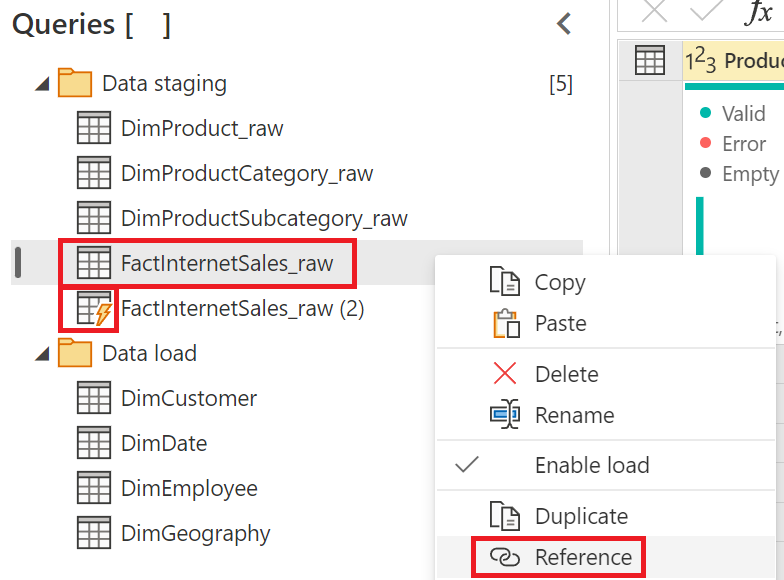
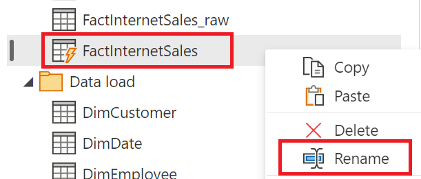
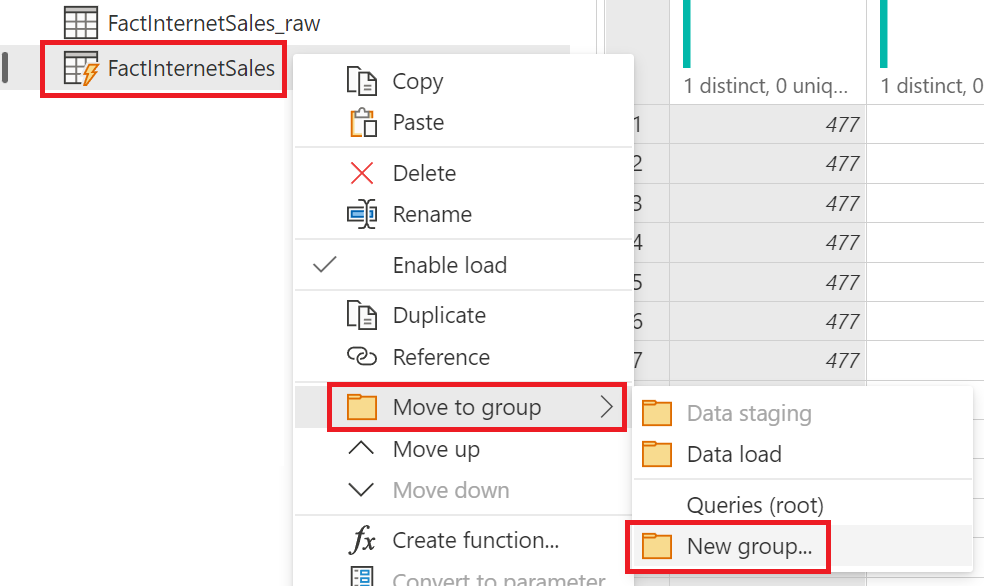
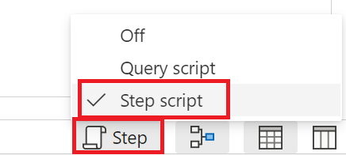
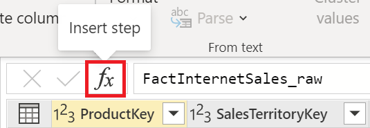
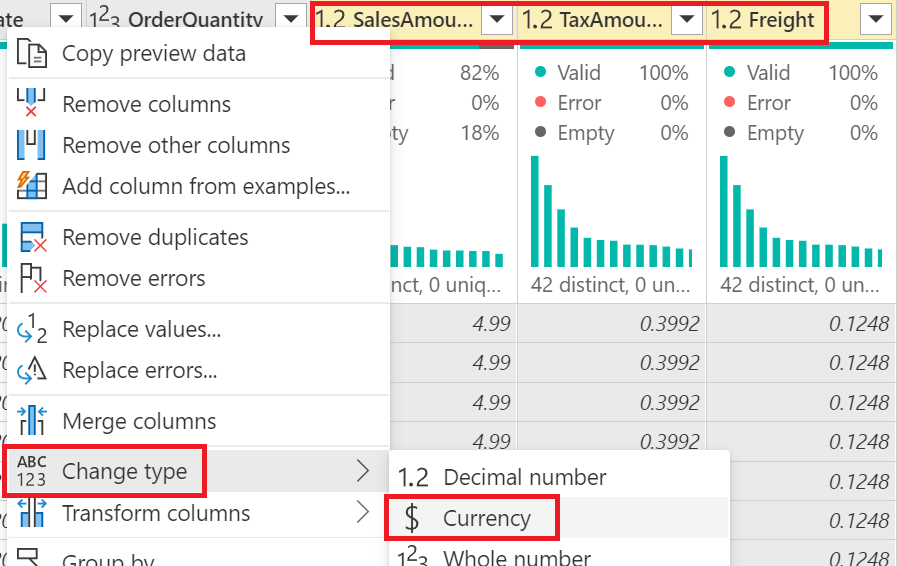

# Data Preparation

Using dataflows and self-service data prep supports the following scenarios by:

1. Promoting a single source of the truth, with greater control over which data is accessed and exposed to creators.

1. Preventing others from having direct access to the underlying data sources and reducing the load to the underlying systems. Giving administrators finer control of when the systems get loaded from refreshes.

1. Enabling the ability to create reusable transformation logic and curated views of your cloud or on-premise data sources, which can then be seamlessly shared and integrated with other Microsoft services and products (Power BI, Power Apps, and Dynamics 365 Customer Insights).

[Learn more about dataflows and self-service data prep](https://docs.microsoft.com/power-bi/transform-model/dataflows/dataflows-introduction-self-service)

### Sample data

The data for this lab is from the [AdventureWorks](https://docs.microsoft.com/sql/samples/adventureworks-install-configure) sample database, published by Microsoft to showcase how to design SQL Server databases and Analysis Services models.

---

# Premium license mode

Before we begin, we'll want to navigate to a new, empty or non-production workspace and confirm that a capacity has been assigned, if not we'll use this opportunity to enable the option by selecting one of the below values.

1. In the top right corner of the workspace, select the **Settings** option.
1. In the **Settings** pane, select the **Premium** tab and verify one of the following licensing modes listed below has been enabled.

    **License mode:**
    - [Premium per user](https://docs.microsoft.com/power-bi/admin/service-premium-per-user-faq)
    - [Premium per capacity](https://docs.microsoft.com/power-bi/admin/service-premium-gen2-faq)
    - [Embedded](https://docs.microsoft.com/power-bi/developer/embedded/embedded-capacity)

    

# Import a dataflow model and configure settings

We'll leverage an existing dataflow json file as our starting point for this lab. Once the dataflow model has been imported it will include additional standardized categories enabling discovery across other Microsoft products and services. This semantic information includes the table names, column names, metadata descriptions and much more as part of the [metadata file (model.json)](https://docs.microsoft.com/common-data-model/model-json) format.

1. In the top left of the workspace select **New** and then the **Dataflow** option.

    

1. From the **Start creating your dataflow** screen, select the **Import Model** option and import an the dataflow json file using the url below.

    ```
    https://raw.githubusercontent.com/microsoft/pbiworkshops/main/Day%20After%20Dashboard%20in%20a%20Day/Source_Files/Dataflow%20demo.json
    ```

    

## Edit the dataflow credentials

Because the lab files are stored in a publicly accessible [GitHub repository](./Source_Files/), we will authenticate anonymously and skip our test connection to ensure that we can successfully connect to and ingest the lab data.

1. Once the import has successfully completed, we can now select the **Edit credentials** button from the toast notification in the top right.
    1. Alternatively within the workspace we can select the vertical ellipses ( ⋮ ) adjacent to the dataflow name and the **Settings** option to configure.

    

1. Within the Settings page for the dataflow, expand the **Data source credentials** section and select the **Edit credentials** link next to the **Web** source. Once in the **Configure...** dialog window we can set the following values below and **Sign in** once complete:
    1. Authentication method | **Anonymous**
    1. Privacy level setting for this data source | **Public**
        1. To learn more, see [Power Query privacy level settings](https://docs.microsoft.com/power-bi/admin/desktop-privacy-levels#configure-a-privacy-level)
    1. ☑️ **Skip test connection**

    

## Configure enhanced compute engine settings

The enhanced compute engine in Power BI enables Power BI Premium subscribers to use their capacity to optimize the use of dataflows. 

Using the enhanced compute engine provides the following advantages:

1. Drastically reduces the refresh time required for long-running ETL steps over computed tables, such as performing joins, distinct, filters, and group by.
1. Performs DirectQuery queries over tables.

[Learn more about the enhanced compute engine](https://docs.microsoft.com/power-bi/transform-model/dataflows/dataflows-premium-features?tabs=gen2)

1. Within the **Enhanced compute engine settings** change the setting to **On** and select the **Apply** button once complete.

    

1. Within the workspace select the **Refresh now** option of the dataflow for the change to take effect.

    

---

# Configure Global options in the Power Query Online editor

With our dataflow successfully imported and credentials set, we can now configure our development environment for authoring in the Power Query Online editor.

---

1. From the group workspace, select the ellipses (...) adjacent to the dataflow name and then the **Edit** option.

    

1. To update the dataflow model in the top right we'll select the **Edit tables** option to navigate into the Power Query Online experience.

    

1. Before we begin using the Power Query Online interface we'll enable some additional authoring settings which will persist the next time we need to author new content. From the **Home** tab, select the **Options** > **Global options** property.

    

1. Within the **Global options** window ensure the following settings are enabled and select **OK** once complete.

    **Steps**
    1. Enable step cost indicators
    1. Show script in step callout

    **Column profile**
    1. Enable column profile
    1. Show column value distribution in data preview
    1. Show column value distribution in data preview
    1. Show column profile in details pane

    **Type detection**
    1. Never detect column types and headers for unstructured sources

    **Parameters**
    1. Always allow parameterization in data source and transformation dialogs

    

---

# Advanced Editor

For this labs section, we need to combine files which are being added to a (**Web page**) file location. The total number of files that will be added to this location is unknown but will continue to grow over time, which we'll need to account for with a [future proofed](https://docs.microsoft.com/power-query/best-practices#future-proofing-queries) solution. Fortunately for us, the files maintain a consistent column naming, data type and naming structure (**FactInternetSales_#.csv**) to make collecting and combining new data easier.

---

## Custom functions

1. From the **Home** tab select the drop-down for **Get data** and the **Blank query** option to create a new query.
    1. Keyboard shortcut: **Ctrl + M**

    

1. Within the **Advanced editor** window, we'll create a custom function for our file name that [combines text](https://docs.microsoft.com/powerquery-m/text-combine) for our prefix, file number and file extension and converts the [text from](https://docs.microsoft.com/powerquery-m/text-from) a value. Select **Ok** when complete.
    1. You can test the return value of the function by supplying a numeric value and then selecting the **Invoke** option.

    ```fsharp
    let
      // A function that accept a file number value and concatenates text
      fxFileName = (#"File number" as number) as text =>
                    Text.Combine(
                        {
                            "FactInternetSales_",
                            Text.From(#"File number"),
                            ".csv"
                        }
                    )
    in
      fxFileName
    ```

## Structured values

1. We'll open the **Advanced Editor** once again and complete the following:
    1. Add a comma to end of the **fXFileName** step.
    1. On a new line we'll create a step with the identifier name of **Source** which equals a [**Record**](https://docs.microsoft.com/powerquery-m/expressions-values-and-let-expression#record) type, containing the following name/value pairing as displayed below and update the return value to **Source** after the text **in**.
    
    | Name | Value |
    | :--- | :---- |
    | fileCount | 1 |
    | fileName | fxFileName(fileCount) |
    | data | fxGetFile(fileName) |

    ```fsharp
    let
      // A function that accept a file number value and concatenates text
      fxFileName = (#"File number" as number) as text =>
                    Text.Combine(
                        {
                            "FactInternetSales_",
                            Text.From(#"File number"),
                            ".csv"
                        }
                    ),
      Source = [
                fileCount = 1,
                fileName = fxFileName(fileCount),
                data = fxGetFile(fileName)
            ]
    in
      Source
    ```

1. Enable the **Query script** view, to view the full script on your screen.
    1. **Optional:** To validate the results are updating, we can change the **fileCount** value to **2** and review the data preview's **fileName** and **data** values. If a change was made, return the **fileCount** value to **1** before proceeding.

    

## Generating a list of values

1. Within the expanded **Query script** view, add a comma to the end of the **Source** step and add a new step with the step identifier name of **fileList** with the [**List.Generate**](https://docs.microsoft.com/powerquery-m/list-generate) function, and update the text after the **in** statement to **fileList** to review the functions documentation.
    1. Typing any function name without the open and closed parenthesis proceeding will return the function's documentation.

    ```fsharp
    let
      // A function that accept a file number value and concatenates text
      fxFileName = (#"File number" as number) as text =>
                    Text.Combine(
                        {
                            "FactInternetSales_",
                            Text.From(#"File number"),
                            ".csv"
                        }
                    ),
      Source = [
                fileCount = 1,
                fileName = fxFileName(fileCount),
                data = fxGetFile(fileName)
            ],
      fileList = List.Generate
    in
      fileList
    ```

6. Now that we've reviewed the documentation, update the **Query script** view to the below.
    1. For the **initial** parameter include the goes-to "**=>**" symbol and then the **Source** step.
    1. For the **condition** parameter, we'll use square brackets to reference the initialized **Source** value's **[data]** to logically test that the returned value is **not** empty, when using the **[Table.IsEmpty()](https://docs.microsoft.com//powerquery-m/table-isempty)** function.
    1. For the **next** parameter, create a record that matches the **Source** step's **fileCount**, **fileName** and **data** fields and increment the **fileCount** by it's current integer value plus **one**.

    ```fsharp
    let
      // A function that accept a file number value and concatenates text
      fxFileName = (#"File number" as number) as text =>
                    Text.Combine(
                        {
                            "FactInternetSales_",
                            Text.From(#"File number"),
                            ".csv"
                        }
                ),
        Source = [
            fileCount = 1,
            fileName = fxFileName(fileCount),
            data = fxGetFile(fileName)
        ],
        fileList =
            List.Generate(
                () => Source,
                each not Table.IsEmpty([data]),
                each
                    [
                        fileCount = [fileCount] + 1,
                        fileName = fxFileName(fileCount),
                        data = fxGetFile(fileName)
                    ]
            )
    in
        fileList
    ```

1. To convert out returned list to a table, navigate to the **List tools** tab in the ribbon and select the **To table** option.

    

1. In the top right of the **Column1** column - we'll select the expand columns icon, and disable the **Use original column name as prefix** option and select **OK** when complete.

    

1. Right click the **data** column and select the **Remove other columns** option to remove all other columns from the current table. 

    

1. In the top right of the **data** column - select the expand columns icon, disable the **Use original column name as prefix** option and select **OK** when complete.(#tab/step)

    

1. While holding the **shift** key on our keyboard, select the **ProductKey** column and then **Freight** column to highlight all columns in our table. Navigate to the **Transform** tab and then select **Detect data type** to change the current columns [any value](https://docs.microsoft.com/power-query/data-types) (ABC123) to a more appropriate data type automatically.
    1. We can also select any cell in our table and press **Ctrl+A** to select all cells and columns.

    

1. Within the **Query settings** pane, change the **Name** of the completed query to **FactInternetSales_raw**.

    

## Optional: Power Query M function reference

To view a complete list of Power Query function documentation, from the **Home** tab select **Get data** and **Blank query**, update the **Source** step's value to **#shared** and select **Next** to proceed. A record value will be returned including the [Power Query M function reference](https://docs.microsoft.com/powerquery-m/power-query-m-function-reference) documentation.

```fsharp
let
    Source = #shared
in
    Source
```

# Grouping queries

As we add more tables to our solutions it can often be challenging to remember which-queries-do-what. For this reason we'll create groups for our queries that share similar design patterns.

1. In the **Queries** pane, while holding **ctrl**, select the following tables from the list below, once complete right click and select the **Move to group** > **New group...** option.

    1. DimProduct_raw
    1. DimProductCategory_raw
    1. DimProductSubcategory_raw
    1. FactInternetSales_raw

    

    1. In the **New group** window set the name to **Data staging** and the **Description** to the following text below and select **Ok** once complete.

        ```
        Data that will be ingested from the source and referenced in computed tables for transformations via the enhanced compute engine.
        ```
    
        

1. In the **Queries** pane, while holding **ctrl**, select the following tables from the list below, once complete right click and select the **Move to group** > **New group...** option.

    1. DimCustomer
    1. DimDate
    1. DimEmployee
    1. DimGeography
    1. DimSalesTerritory

    

    1. In the **New group** window set the name to **Data load** and the **Description** to the following text below and select **Ok** once complete.

        ```
        Data that will be ingested from the source without transformations.
        ```

        

1. Our **Queries** pane now contains two groups to help make managing and distinguishing our queries intent more effective at a glance. For more detail we can also hover above the group's folder icon where the **description** value of each will be visible.

    

---

# Transforming data at scale

Not that our data is being ingested and stored in our dataflow's [Azure Data Lake Storage Gen2](https://docs.microsoft.com/azure/storage/blobs/data-lake-storage-introduction), we'll leverage [computed tables](https://docs.microsoft.com/power-query/dataflows/computed-entities-scenarios) to apply transformation logic via the enhanced compute engine.

[Learn more about the benefits of loading data without transformation for Text/CSV files](https://docs.microsoft.com/power-query/dataflows/computed-entities-scenarios#load-data-without-transformation-for-textcsv-files)

---

## Reference a query to create a computed table

1. In the **Queries** pane, right click the **FactInternetSales_raw** table we created earlier and select the **Reference** option to create a computed table. Once complete we will see a new query has been created with a lightning bolt icon (⚡) indicating that this is a computed table.

    

1. In the **Queries** pane - right click the **FactInternetSales_raw (2)** table, select **Rename** and update the query title to **FactInternetSales**.

    

1. In the **Queries** pane - right click the **FactInternetSales** computed table, select the **Move to group** > **New group...** option and complete the following.
    1. **Name:** Data transformation
    1. **Description:** Data that will be ingested from the data lake storage for transformations.

    

## Transform multiple columns simultaneously

1. Before we begin we'll change the current **Script** view to **Step script** in the bottom right hand corner of the screen.

    

1. While still in the **FactInternetSales** query, we'll select the **fx** icon to the left of the formula bar to insert a new step into the query.

    

1. Within the formula bar we'll utilize the [Table.TransformColumns](https://docs.microsoft.com/powerquery-m/table-transformcolumns) function to apply a [list](https://docs.microsoft.com/powerquery-m/expressions-values-and-let-expression#list) of transformation operations to multiple columns in a single step - in the order of { column name, transformation , *optional type* } from the table below -

    | Column name | Transformation | Type |
    | :--- | :--- | :--- |
    | OrderDate | fxCreateKey | Int64.Type |
    | ShipDate | fxCreateKey | Int64.Type |

    **Complete formula**

    ```fsharp
        Table.TransformColumns(
        Source,
        {
            {
                "OrderDate",
                fxCreateKey,
                Int64.Type
            },
            {
                "ShipDate",
                fxCreateKey,
                Int64.Type
            }
        }
    )
    ```

1. While holding the **shift** key select the **SalesAmount**, **TaxAmount** and **Freight** columns, right click any one of the selected columns and choose the **Change type** and then the **Currency** option.
    1. The [**Currency**](https://docs.microsoft.com/power-query/data-types) type is a fixed decimal number and always has four digits to its right.

    

## Joining tables using the diagram view

1. In the bottom right of the **Power Query** editor, select the **Diagram view** icon.

    

1. Select the **Actions** option ( ⋮ ) at the top right of the **DimProduct_raw** table and select the **Merge queries as new** option.

    

1. In the **Merge** window complete the following steps and then select **OK** when complete.

    | Merge | Table | Column |
    | :--- | :---- | :--- | 
    | Left table for merge | DimProduct_raw | ProductSubcategoryKey |
    | Right table for merge | DimProductSubcategory_raw | ProductSubcategoryKey |

    1. Set the **Join kind** to **Left outer**

    

1. From the **Home** tab select the drop down next to **Choose columns** and then the **Go to column** option. Within the search dialog type the column name **DimProductSubcategory_raw** until a result has been returned, you can then either double click the name or press **OK** to continue.

    

1. In the top right of the **DimProductSubcategory_raw** column - we'll select the expand columns icon and disable the **ProductSubcategoryKey** column since this column already exists in our **DimProduct_raw** table, disable the **Use original column name as prefix** option and then select **OK** when complete.
    
    

1. Select the **Actions** option ( ⋮ ) at the top right of the **Merge** table and select the **Merge queries** option.

    
    
1. In the **Merge** window complete the following steps and then select **OK** when complete.

    | Merge | Table | Column |
    | :--- | :---- | :--- | 
    | Left table for merge | (Current) | ProductCategoryKey |
    | Right table for merge | DimProductCategory_raw | ProductCategoryKey |

    1. Set the **Join kind** to **Left outer**

    

1. In the top right of the **DimProductSubcategory_raw** column - we'll select the expand columns icon and disable the **ProductCategoryKey** column since this column already exists in our **DimProductSubcategory_raw** table, disable the **Use original column name as prefix** option and then select **OK** when complete.

    

## View query plan

[Learn more about the query plan](https://docs.microsoft.com/power-query/query-plan)

1. In the **Query settings** pane on the right, navigate to the **Expanded DimProductCategory_raw** step, right click and select the **View query plan** option.

    

1. In the **Query plan** window, navigate to the inner joined **Table.Join** Full scan and select the **View details** to determine what join algorithm is being used. Press **Close** when complete.

    

1. From the diagram view complete the following steps using the **Actions** options ( ⋮ ) for the **Merge** table.
    1. Select the **Rename** action and update the query title to **DimProduct**.
    1. Select the **Move to group...** action and select the **Data transformation** group.

    

## Saving and refreshing the dataflow

1. Select the **Save & close** option in the bottom right to exit the Power Query editor.

    

1. Select the **Close** option in the top right to exit the current dataflow.

    

1. Within the workspace select the **Refresh now** option of the dataflow to ingest the labs data and apply transformation logic.

    

---

# Query folding

Query folding is the ability for a Power Query query to generate a single query statement to retrieve and transform source data. The Power Query mashup engine strives to achieve query folding whenever possible for reasons of efficiency.

[Learn more about query folding](https://docs.microsoft.com/power-query/power-query-folding)

---

1. Open **Power BI Desktop** and from the **Home** tab select the **Get data** button. Within the **Get dialog** window select the **Power Platform** section and then **Dataflows** connector. Select **Connect** to continue to the **Dataflows** navigator window.

    

1. Within the **Navigator** window, navigate to the group Workspace where the dataflow is located and select all of the tables listed below within the dataflow, once complete select the **Transform Data** option to continue.

    | Table |
    | :---- |
    | DimCustomer |
    | DimDate |
    | DimEmployee |
    | DimGeography |
    | DimSalesTerritory |
    | DimProduct_raw |
    | DimProductCategory_raw |
    | DimProductSubcategory_raw |
    | FactInternetSales |

    

1. Navigate to the **DimCustomer** table, holding the **shift** key select the **FirstName**, **MiddleName** and **LastName** columns, right click one of the selected columns and choose the **Merge Columns** option.

    

1. Within the **Merge columns** window change the **Separator** option to **Space**, set the **New column name (optional)** option to **Full Name** and select **OK** when complete.

    

1. In the **Query settings** pane on the right, navigate to the **Merge Columns** step, right click and select the **View Native Query** option.

    

1. Navigate to the **Add Column** tab and select the **Conditional Column** option. Within the **Add Conditional Column** dialog complete the following and select **OK** when complete:
    1. New column name: **Gender**
    1. Match the following conditions to the table below.
        1. Use the **Add Clause** to add new conditions.

    |  | Column Name | Operator | Value | Output | 
    | :------- | :-------| :-------| :-------| :-------|
    | If | Title | equals | Mr. | Male |
    | If | Title | equals | Sr. | Male |
    | If | Title | equals | Ms. | Female |
    | If | Title | equals | Sra. | Female |
    | else | Not Provided | | |

    

1. In the **Query settings** pane on the right, navigate to the **Add Conditional Column** step, right click and select the **View Native Query** option.

    

1. From the **Formula bar** select the **Add Step** button and type in the following formula below.
    1. If the **Formula Bar** is not enabled navigate to the **View** tab and select the **Formula Bar** checkbox.

    

    ```fsharp
    = Table.AddColumn(
                #"Merged Columns",
                "Gender",
                each
                    if
                        List.Contains(
                            {
                                "Mr.",
                                "Sr."
                            },
                            [Title]
                        )
                    then
                        "Male"
                    else if
                        List.Contains(
                            {
                                "Ms.",
                                "Sra."
                            },
                            [Title]
                        )
                    then
                        "Female"
                    else
                        "Not Provided",
                type text
            )
    ```

1. In the **Query settings** pane on the right, navigate to the **Custom1** step, right click and select the **View Native Query** option to review the difference in the generated query which now uses the [IN (Transact-SQL)](https://docs.microsoft.com/sql/t-sql/language-elements/in-transact-sql?view=sql-server-ver15) clause.

    

1. Right click the **Applied Steps** step named **Custom1** and select **Properties...** to open the **Step Properties** dialog box. Once the **Step Properties** is visible update the **Name** property to **Custom: Gender** and the **Description** field to the below text. Once complete select **OK** to complete.

    ```bash
    If value is Mr. or Sr. replace with Male.
    If value is Ms. or Sra. replace with Female.
    Otherwise replace with Not Provided.
    ```

    

1. Review the new **Custom: Gender** step's properties by hovering above the step name to view the documentation.

    

1. Right click the original **Added Conditional Column** step and select the **Delete** option to remove.
    1. Selecting the adjacent **X** to the left of the step name is also an option.

    

# Set the storage mode

Now that we have completed all of the data preparation activities in this lab we need to create the connection between our queries and the Power BI dataset.

1. From the **Home** tab select **Close & apply**.

    

1. Within the **Set the storage mode** window, select the **DirectQuery** storage mode for each of the tables and then select **OK** once complete.

    

# Next steps
We hope this portion of the lab has shown how dataflows can provide a self-service, cloud-based, data preparation technology that can be easily consumed in Power BI.

- Continue to the [Data Modeling](./DataModeling.md) lab
- Return to the [Day After Dashboard in a Day](./README.md) homepage

---

# Completed files

To download the completed files from the lab instructions:

- Dataflow model
- Power BI Desktop template file (PBIT)
    - You will need to update the WorkspaceId and DataflowId to those within your environment