# Data Preparation (continued)

## Task flow customization

1. First, return to the workspace by selecting its name on the left side rail. With the task view visible, select the **Add** option and then choose **Prepare data**. Hover above the bottom of the **Collect data** task until a rectangle connector box becomes visible, then drag and drop to connect the **Collect data** task to the **Prepare** task.

    

1. Next, select the connection between **Store data** and **Create visualization** and press **Delete** on your keyboard to remove it.

    

1. Then, select **Add** for a new task and choose **Store data**. Once on the canvas, create a new connection that attaches both **Prepare** and **Store data** to the new **Store** task.

    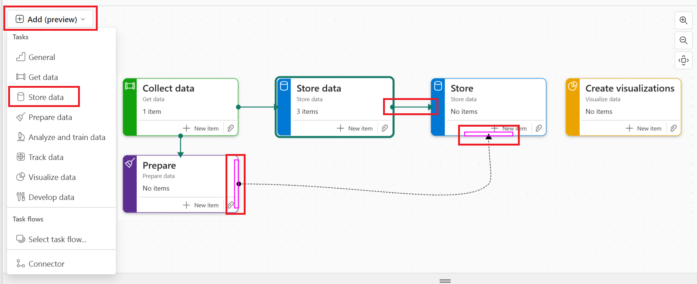

1. Select the **Store** task and then, on the right hand side, select the **Edit** option to customize the name field.

    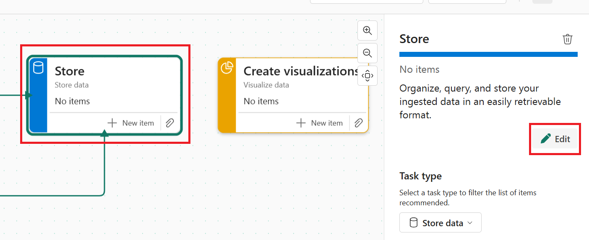

1. In the task edit menu, update the **Task name** field to **Curated data** and then select **Save** to continue.

    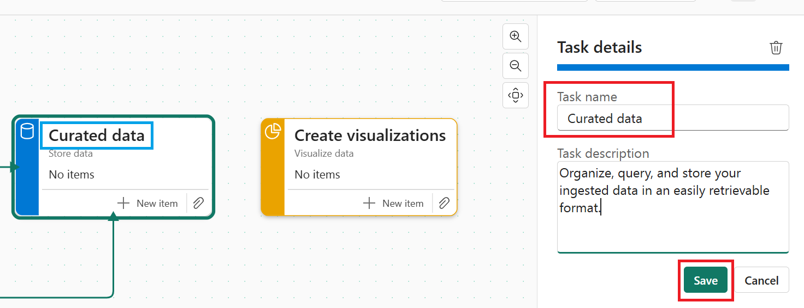

1. Create a new connection between the **Curate data** task and the **Create visualizations** task.

    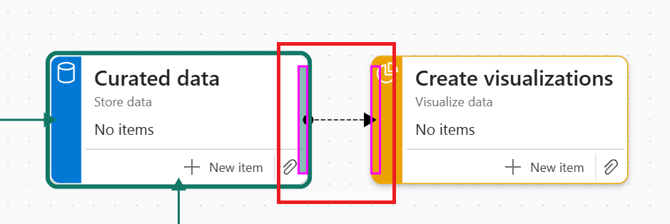

1. Select the **New item** option on the **Curated data** task and from the recommended items list, select **Lakehouse**.

    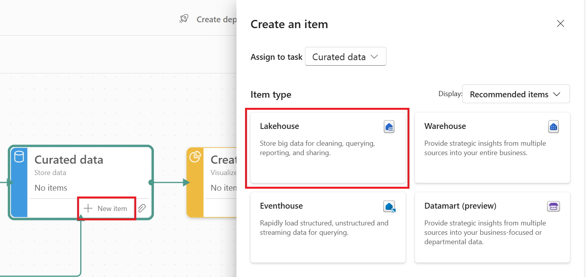

1. For the new lakehouse item name, type in **c_IADLake** (c is shorthand for curated) and then press **Create**.

    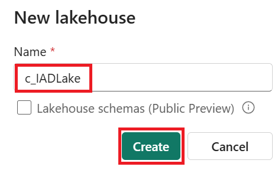

### Default destination entry point

1. Within the lakehouse item from the **Home** tab select **Get data** from **New Dataflow Gen2**.

    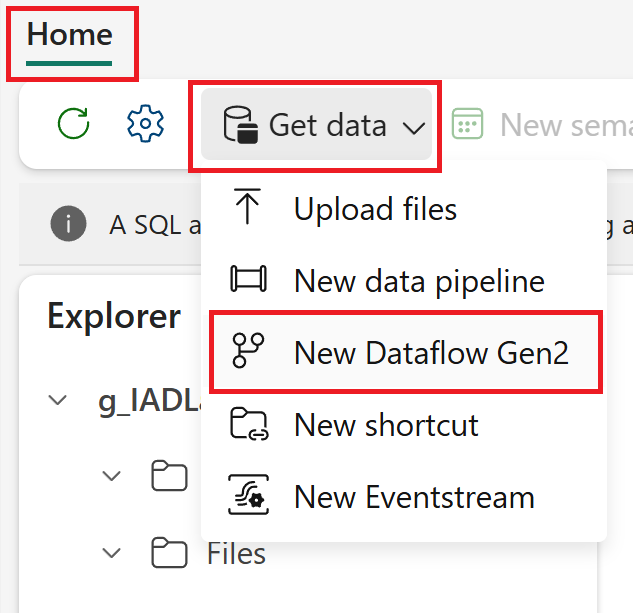

1. Select the current dataflow name in the top left corner and update the **Name** field to **PrepContoso**.

    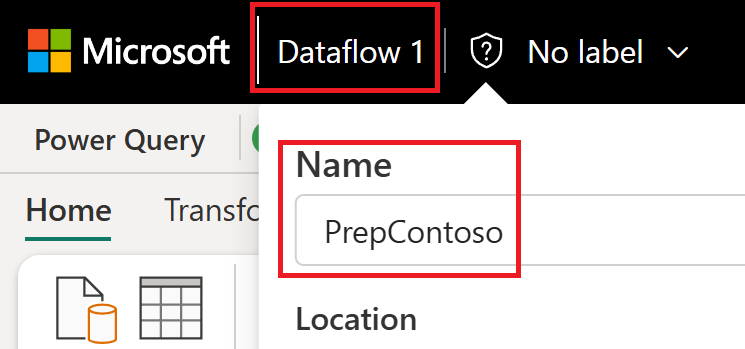

    **Important:** When using the lakehouse item to create a new Dataflow Gen2, any queries you create or connect to will automatically be configured to use the lakehouse as the default destination for new tables. If you prefer to write to a different location or modify certain configurations, such as the update method, these settings can be manually overwritten.

## Dataflow Gen2

### Connecting to lakehouse tables

1. From the **Home** tab, select **Get data** and then the **More...** option. This step allows you to access a wider range of data sources and connectors, providing flexibility in integrating different data streams into your project.

    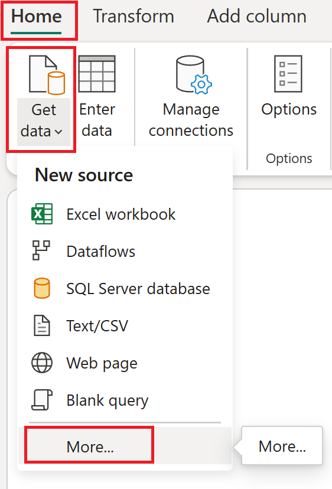

1. Within the Get data explorer's search bar, type **iad** to locate the lakehouse items that include those letters. Select the **IADLake** item within the OneLake data hub's returned results.

    You can also navigate to the OneLake data hub tab to view all items that you have access to in your tenant. This step ensures that you are connecting to the correct data source, which is essential for accurate data retrieval and analysis.

    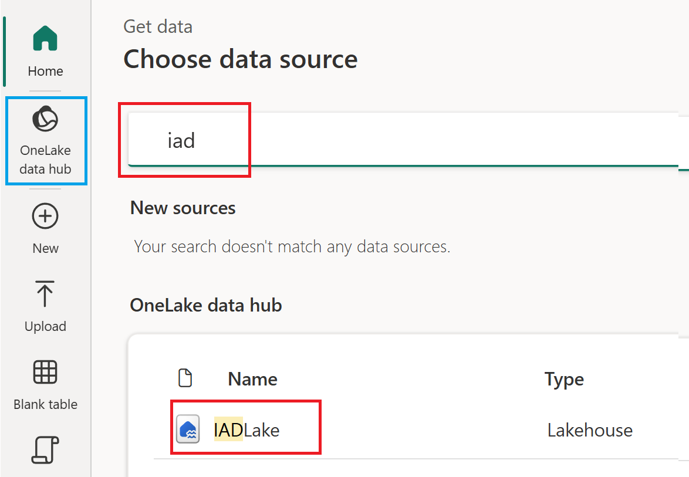

1. From the Get data table navigator, select the tables listed below to perform data transformation operations and merge the tables for our downstream business intelligence projects.

    | Table Name |
    | :--- |
    | DimCustomer |
    | DimGeography |
    | DimProduct |
    | DimProductCategory |
    | DimProductSubcategory |

    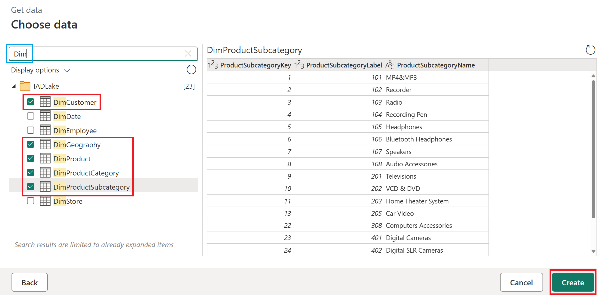

### Preparing data and writing to Lakehouse data destination

1. Select the **DimCustomer** table and from the Home tab, navigate to the **Merge queries** option and select **Merge queries**.

    Note that there are two options: Merge queries, which will merge a table with the existing query, or Merge queries as new, which will create a new query in your editor. This step allows you to combine data from different tables, enhancing the comprehensiveness of your dataset.

    

1. From the Merge query window, set the **Right table for merge** to **DimGeography**. In the top right corner, select the lightbulb which has detected a possible column match. In this example, both tables contain a column titled **GeographyKey**. Select this option to set the columns to be merged on. For the join kind, select **Inner** and then **OK** to proceed. This activity ensures that the data is accurately combined based on matching columns.

    

1. Navigate to the far right fo the **DimCustomer** table and select the joined **DimGeography** table column's top right corner to expand the table, from the avaialble column selections deselect **GeographyKey** since this column is what we used to merge on and already exists in the dataset before selecting **OK** to continue.

    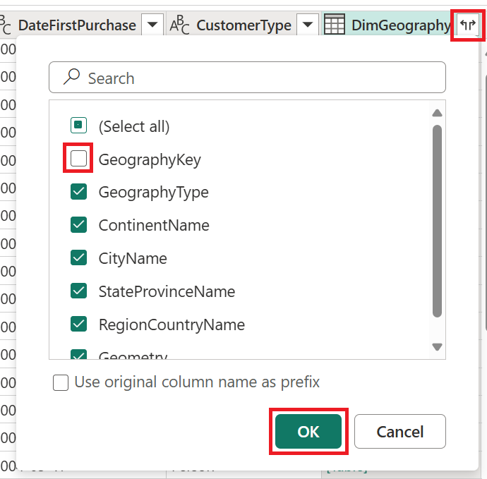

1. On the right-hand side, you can review the Applied steps list, which indicates that our queries are successfully folding back to the lakehouse's SQL endpoint. The options View data source query and View query plan also exist to review the SQL generated or the execution plan for the query. This step allows you to verify that the data transformations are being applied correctly and efficiently, ensuring the integrity and performance of your data pipeline.

    

1. Select the **DimGeography** table and in the bottom right corner for the **Data destination** setting, select the **X** to remove this item from being written to the gold lakehouse. Since we have already prepared our tables by merging data, we only want to surface the clean tables to our end users.

    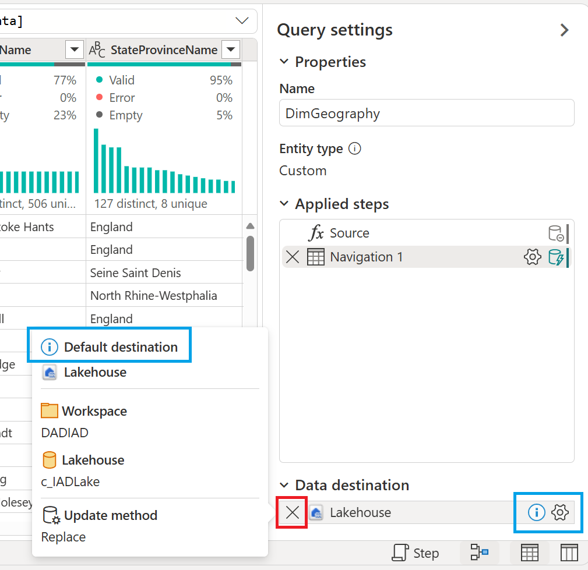

1. Next, select the **DimProduct** table and from the **Home** tab, navigate to the **Merge queries** group and select **Merge queries**.

1. Select the **DimProduct** table and from the **Home** tab navigate to the **Merge queries** group and select **Merge queries**.

    

1. From the Merge query window, set the **Right table for merge** to **DimProductSubcategory**. In the top right corner, select the lightbulb which has detected a possible column match. In this example, both tables contain a column titled **ProductSubcategoryKey**. Select this option to set the columns to be merged on. For the join kind, select **Inner** and then **OK** to proceed.

    

1. Navigate to the far right fo the **DimProduct** table and select the joined **DimProductSubcategory** table column's top right corner to expand the table, from the avaialble column selections deselect **ProductSubCategoryKey** since this column is what we used to merge on and already exists in the dataset before selecting **OK** to continue.

    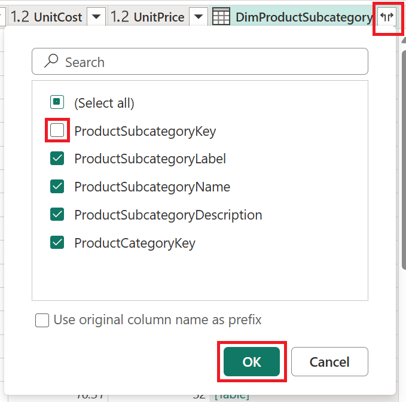

1. Select the **DimProduct** table again and from the **Home** tab, navigate to the **Merge queries** group and select **Merge queries**.

    

1. From the Merge query window, set the **Right table for merge** to **DimProductCategory**. In the top right corner, select the lightbulb which has detected a possible column match. In this example, both tables contain a column titled **ProductCategoryKey**. Select this option to set the columns to be merged on. For the join kind, select **Inner** and then **OK** to proceed.

    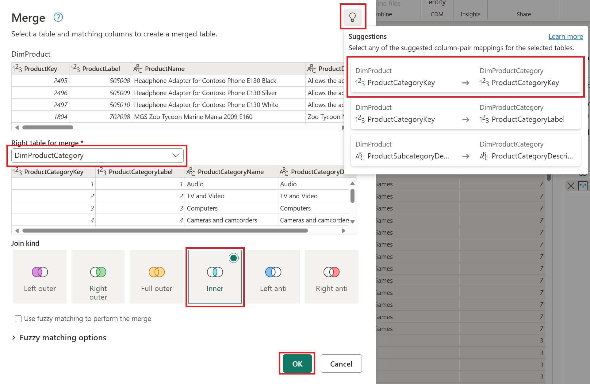

1. Navigate to the far right fo the **DimProduct** table and select the joined **DimProductCategory** table column's top right corner to expand the table, from the avaialble column selections deselect **ProductCategoryKey** since this column is what we used to merge on and already exists in the dataset before selecting **OK** to continue.

    

1. On the right-hand side, you can review the Applied steps list, which indicates that our queries are successfully folding back to the lakehouse's SQL endpoint.

    

1. Select the **DimProductCategory** table and in the bottom right corner for the **Data destination** setting, select the **X** to remove this item from being written to the gold lakehouse.

    

1. Select the **DimProductSubcategory** table and in the bottom right corner for the **Data destination** setting, select the **X** to remove this item from being written to the gold lakehouse.

    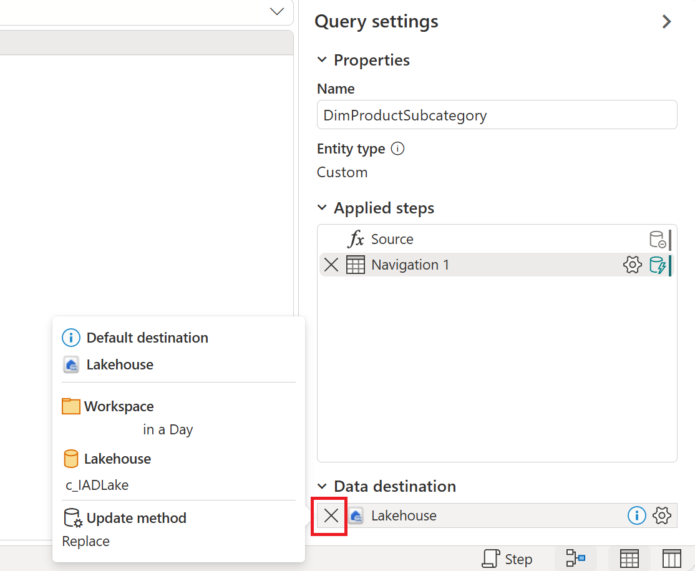

1. Select both the **DimCustomer** and **DimProduct** queries by holding the control key. Right-click and choose **Move group**, then select **New group**.

    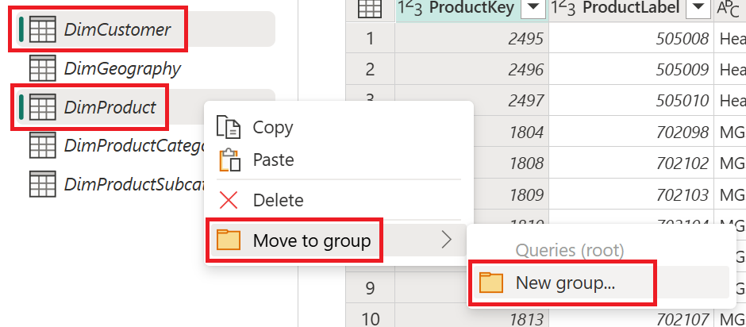

1. In the New group window, set the properties as needed below and select **OK**. This step helps in organizing your queries into logical groups, making it easier to manage and navigate your data.

    | Name | Description |
    | :-- | :-- |
    | Data load | Data loaded to the curated lakehouse |

    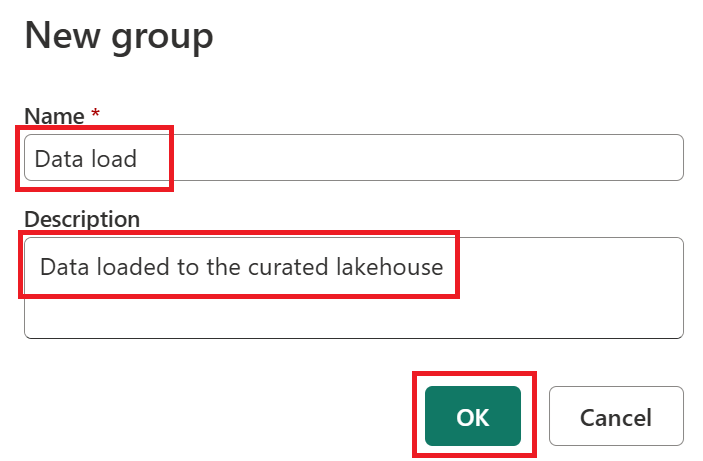

1. Select the **DimGeography**, **DimProductCategory** and **DimProductSubcategory** queries by holding the shift key, as they are all adjacent to each other. Right-click and select **Move group**, then select **New group**.

    

1. In the New group window, set the properties as needed below and select **OK**.

    | Name | Description |
    | :-- | :-- |
    | Data reference | Data used only as a source from the storage lakehouse |

    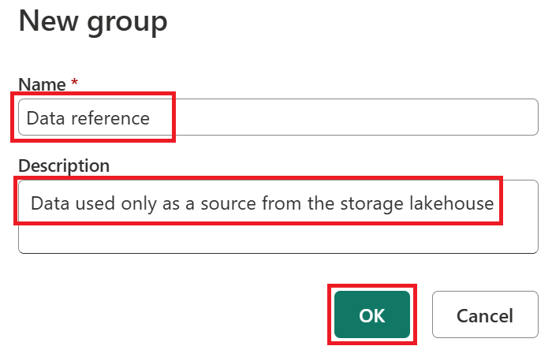

1. In the bottom right corner, click **Publish** to save and refresh the final dataflow.

    **Note:** Selecting Publish later will only save the metadata and underlying formula logic of your dataflow. Choosing Publish will save, close your dataflow, and initiate the refresh process.

    

1. Within the workspace, our dataflow is not yet attached to a task. Select the paperclip on the **Prepare** task.

    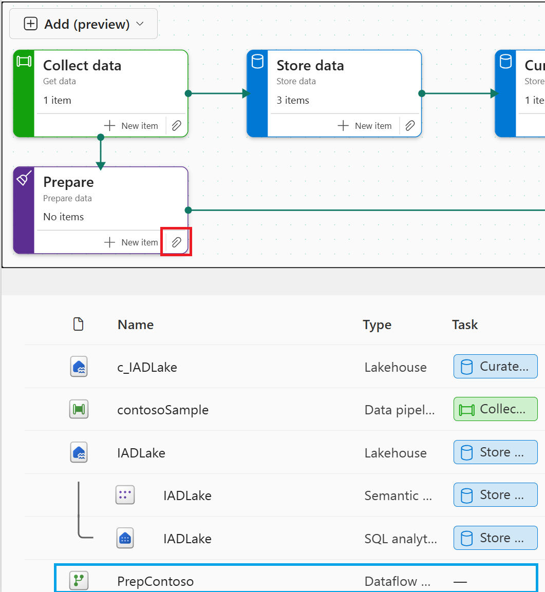

1. Within the Assign item window select the checkbox next to **PrepContoso** and then the **Select** option to complete.

    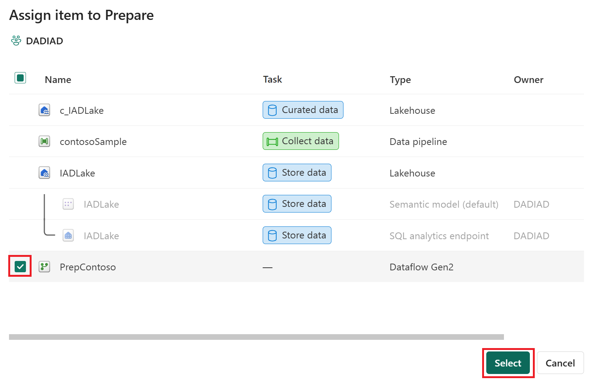

### Add dataflow activity to data pipeline

1. First, select the **Collect data** task to filter the workspace list to only the attached items, and then choose the **contosoSample** data pipeline.

    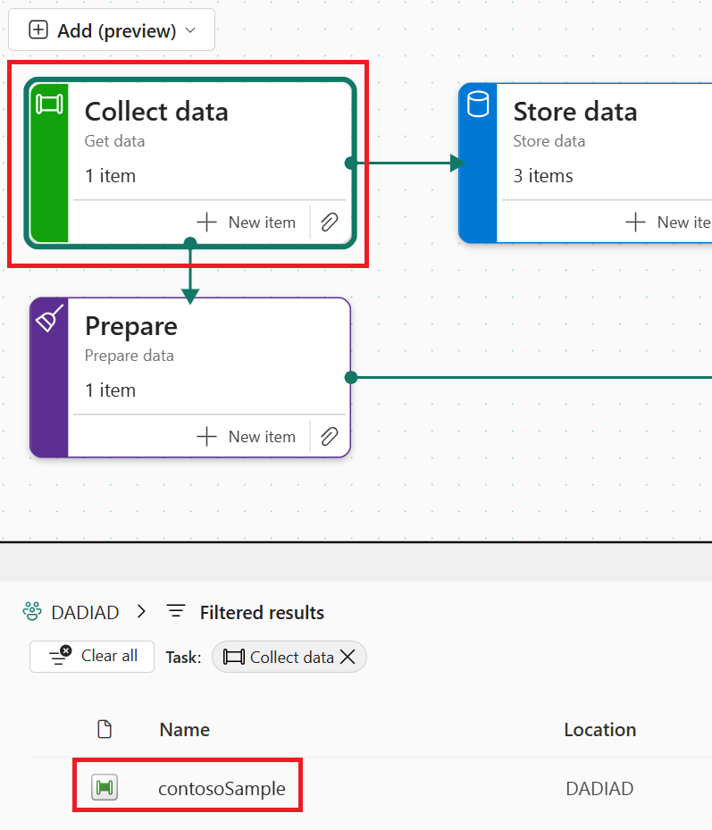

1. From the **Home** tab, select the **Dataflow** activity to add it to the authoring canvas.

    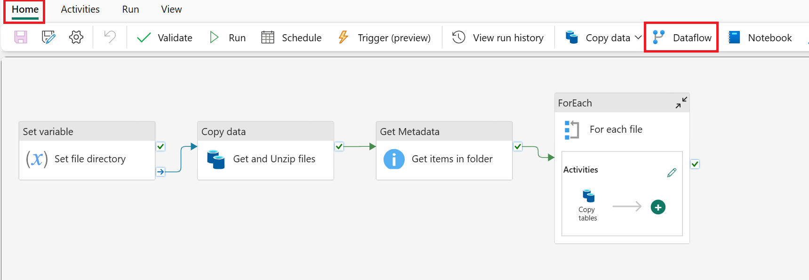

1. Next, create a connection using the **On success** conditional path between the **For each file** activity and the newly added dataflow activity. Once complete, select the dataflow activity to make it the active selection. Then, within the **General** settings, update the **Name** property to **Refresh PrepContoso**.

    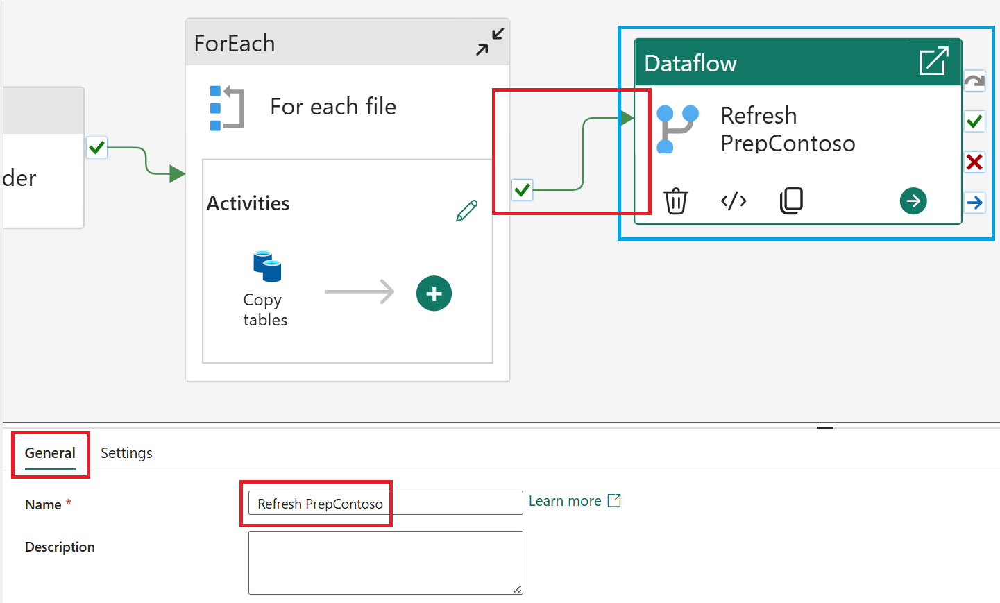

1. With the dataflow activity still selected, navigate to the **Settings** tab. If necessary, update the workspace and then set the Dataflow to **PrepContoso**.

    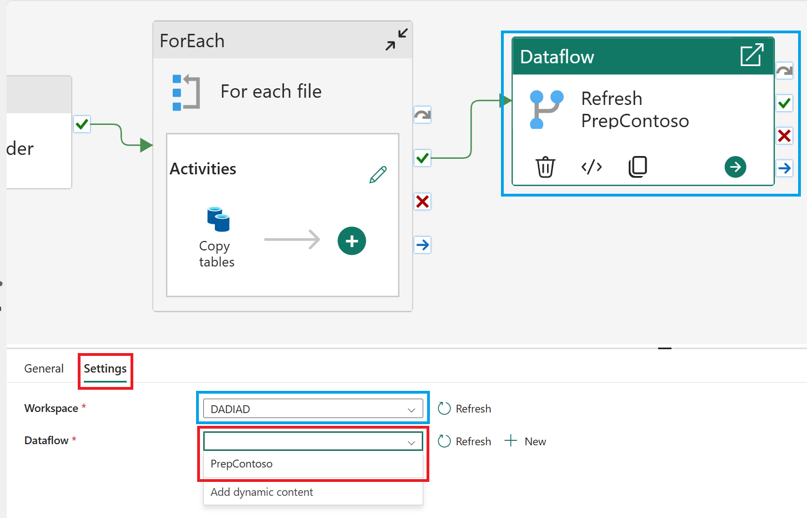

1. Once you have completed the previous steps, select the **Save** option from the **Home** tab. Then, click on the workspace name on the left side rail to continue with the lab instructions.

    **Note:** You can also hover over the items on the left side rail and select the **X** to close the multitasking items.

    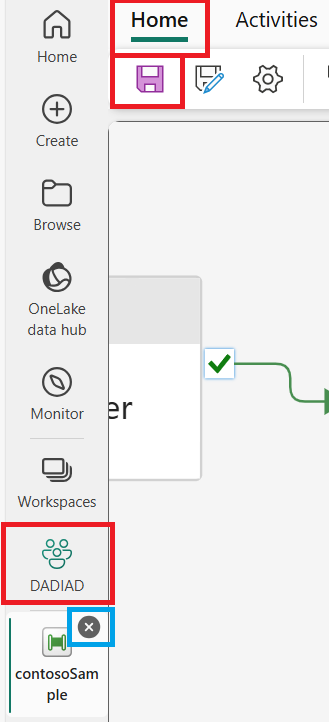

### Creating shortcuts to common tables

1. Next, select the **Curated data** task to filter all the items attached to this task in the workspace item list. Select the Lakehouse item titled **c_IADLake**.

    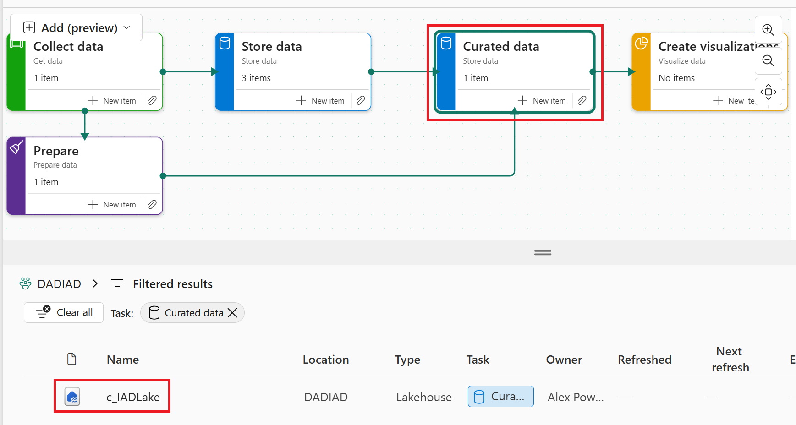

1. From the lakehouse explorer, right-click or hover above the **Tables** option and select the ellipses (**...**), then choose the New shortcut option. This feature allows you to create shortcuts to data sources, making it easier to access and manage your data.

    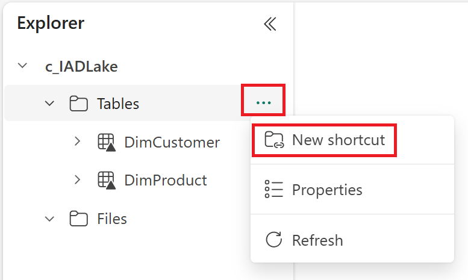

1. From the available options for shortcuts, select **Microsoft OneLake**.

    

1. In the Select a data source type window, select the **IADLake** lakehouse item before selecting **Next** in the bottom right corner.

    Note: If it's not currently visible, you can expand the Explorer tab on the left side-rail to navigate to the specific workspace or filter item types. This step ensures that you are connecting to the correct data source.

    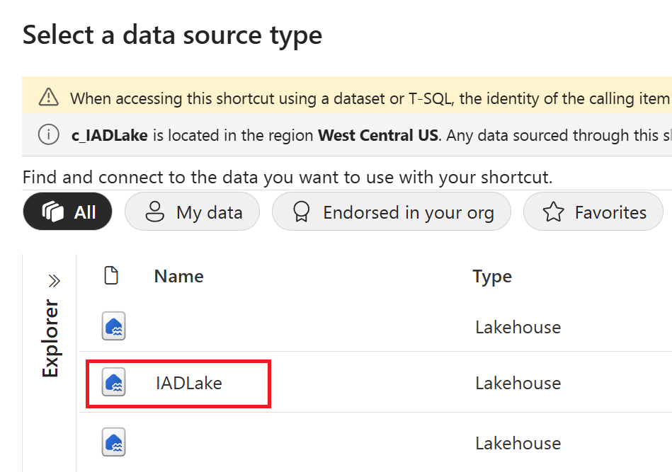

1. From the New shortcut window's **IADLake** explorer, select the tables listed below.

    | Table Name |
    | :-- |
    | DimDate |
    | DimEmployee |
    | DimStore |
    | FactOnlineSales |

    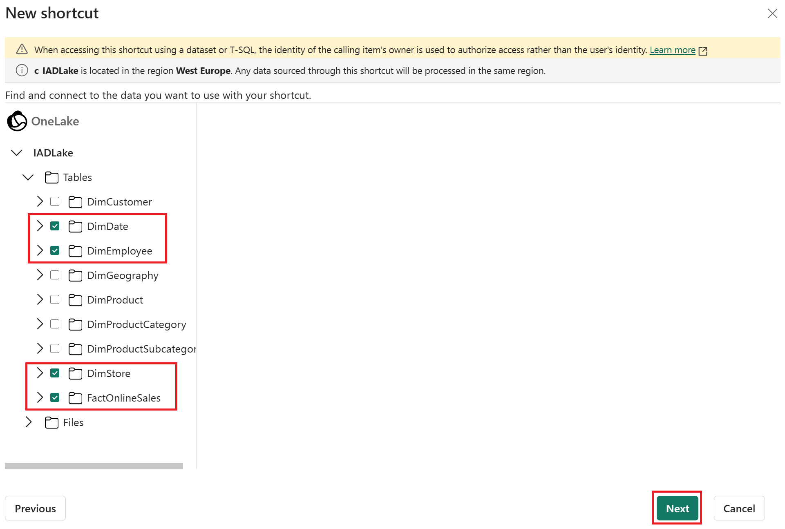

1. Review and confirm the correct tables have been selected and then select **Create** to continue. This step finalizes the creation of shortcuts, ensuring that the necessary data is accessible for further analysis.

    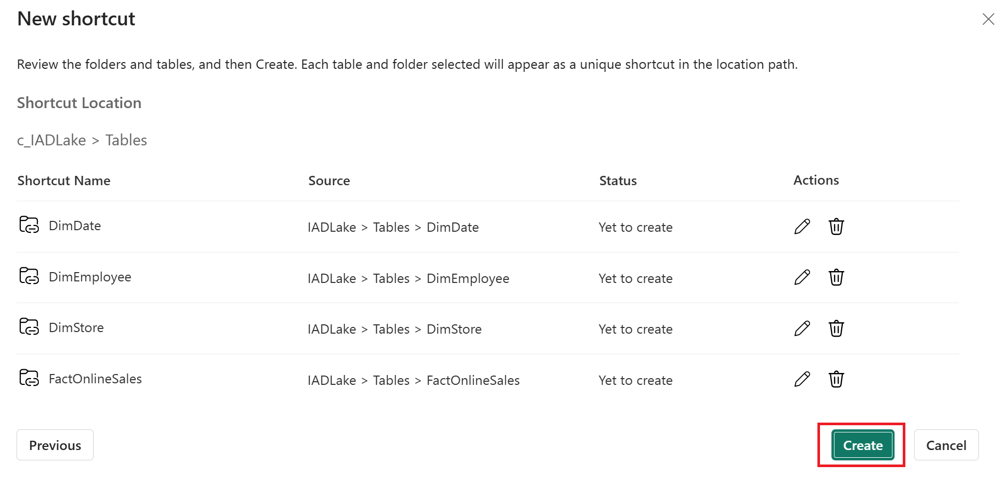

1. Review the lakehouse explorer where the tables have shortcuts created. This approach reduces the need for data duplication or performing further copying of the data, as the tables are already prepared and ready for analysis. 

    By using shortcuts, you ensure that your data is efficiently organized and easily accessible, streamlining the analysis process and improving overall productivity. This method not only saves storage space but also enhances the performance of your data workflows by minimizing unnecessary data movements.

    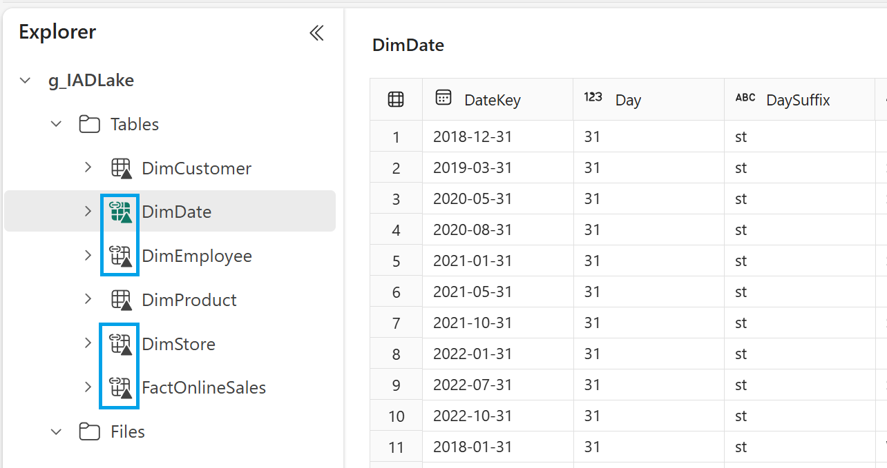

# Next steps

This part of the lab has demonstrated the importance of Dataflow Gen2 in transforming optimized lakehouse tables. Additionally, it has shown how shortcuts can effectively reduce data duplication and facilitate the sharing of tables or files across different storage locations.

- Continue to the [Data Modeling](./DataModeling.md) lab
- Return to the [Day After Dashboard in a Day](./README.md) homepage