# Data Visualization

---

For this portion of the lab, our task is to create a Power BI report that unlocks new insights for our users. The interactivity of our report should be both functional and fast to ensure a pleasant viewing experience, while also adhering to the professional look and brand standards of our company.

## Report design

Throughout this lab, we will utilize proven design processes created by leading report design experts. These processes encompass understanding the report users and their requirements, exploring aesthetically pleasing report designs, and developing reports all the way into production.

Learn more about [Designing effective Power BI reports](https://docs.microsoft.com/users/heyrob/collections/o4dhk4z8xpr8q) by visiting Microsoft Learn

### (Optional) Enable preview features

1. Start by launching Power BI Desktop.

1. Select the **Settings** icon in the bottom right corner of Power BI Desktop.

    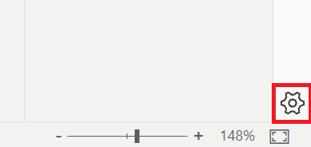

    > [!NOTE]
    > You can also navigate to File > Options and settings > options to get to the same menu.

1. From the **Options** window, select **Preview features** and ensure the **Sparklines** and **New card visual** are enabled for the lab.

    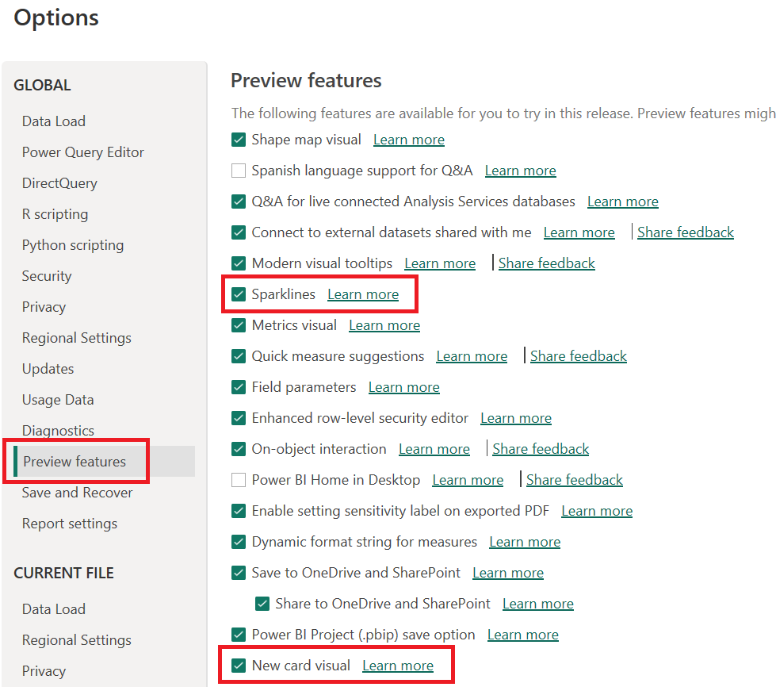

---

### Live Connection

For enterprise-scale deployments, it's recommended to separate semantic model development from report and dashboard development. This approach allows different creators to work independently on modeling and visualizations, ensuring consistency and efficiency. 

By creating separate PBIX files for semantic models and reports, and using live connections, you can streamline the development process and facilitate collaboration across workspaces.

Learn more about [connecting to Power BI datasets](https://learn.microsoft.com/power-bi/connect-data/desktop-report-lifecycle-datasets).

---

1. We'll start by creating a new Power BI file by selecting the **File** and **New** option (shortcut **Ctrl+N**) if Power BI Desktop is currently open.
    1. If Power BI Desktop is not currently open, a new fill will be automatically created upon opening.

    

1. From the **Home** tab, we'll select the **OneLake data hub** option and then **Power BI semantic models** to create a new live connection to an existing semantic model in the cloud.

    

1. From the **OneLake data hub** window, we'll select the published Direct Lake semantic model from the **Data modeling** lab and then the **Connect** button to create a new **Live connection** to our semantic model.

    

1. In the bottom right corner of our current file, the text **Connected live to the Power BI dataset** is now present, including the name of the semantic model and the workspace it's located within.

    

---

## Page canvas and elements

By leveraging PowerPoint design templates and shapes we are able to create a rich background that we could easily import into Power BI as the PowerPoint slide dimensions are the same as our report canvas. In leveraging this method we can lay out our design elements before hand to make Power BI as straight forward as sizing our visuals to the individual squares.

---

### Canvas background

1. In the bottom left of the current file select the "**+**" icon to create a new page.

    

1. Right click the following page names and select the **Rename Page** option to update to the following names in the table below.

    | Previous Page Name | Renamed Page Name |
    | :--- | :--- |
    | Page1 | Summary |
    | Page2 | Detail |

    

1. For each of the pages below, we'll navigate to the **Visualizations** pane, select the **Format your report page** button and update the following settings within the **Canvas background** section from the table below
    1. For the **Image** field select **Browse...** and then copy/paste the according url into the **File name:** field.

    

    | Page | Image fit | Transparency |
    | :--- |  :--- | :--- |
    | Summary | Fit | 0% |

    **Image (file)**
    ```text
    https://raw.githubusercontent.com/microsoft/pbiworkshops/main/Day%20After%20Dashboard%20in%20a%20Day/Media/ContosoSummary.svg
    ``` 

    | Page | Image fit | Transparency |
    | :--- |  :--- | :--- |
    | Detail | Fit | 0% |

    **Image (file)**
    ```text
    https://raw.githubusercontent.com/microsoft/pbiworkshops/main/Day%20After%20Dashboard%20in%20a%20Day/Media/ContosoDetail.svg
    ```

    

<font size="6">✅ Lab check</font>

This technique also reduces the rendering times on our report page by moving all elements to a single background shape as opposed to numerous items needing to be rendered on the Power BI report page.

Learn more about [themeable backgrounds](https://alluringbi.com/2020/05/05/themeable-backgrounds-for-power-bi/) from the community resource [AlluringBI.com](https://alluringbi.com)

---

### Elements

1. Navigate to the **Insert** tab, select the **Text box** element and complete the following steps below.
    1. Update the Font size to: **18**
    1. Update the Font color to: **White, 50% Darker**
    1. Type the text within the text box: **SALES REPORT**

    

1. With the text box still active, we'll navigate to the **Format** pane and in the search box type in **background**.

    From the matching options navigate to the **Effects** group and set the **Background** property to **Off**.

    

1. Navigate to the **Insert** tab, select the **Buttons** element and then **Navigator** option. From the available choices select the **Page navigator** option. 

    Reposition the buttons on the top right side of the canvas.

    

1. We'll now click the text page navigator elements on the **Summary** page. Once selected, we can navigate to the **Home** tab and select **Copy** or press the keyboard shortcut **Ctrl+C**

    > [!NOTE]
    > We can also select all elements by pressing CTRL+A or holding ctrl when clicking each item.

    

1. Navigate to the **Detail** page and from the **Home** tab select the **Paste** button or press the keyboard shortcut **Ctrl+V**. This will ensure our elements are perfectly aligned between both the **Summary** and **Detail** page.

    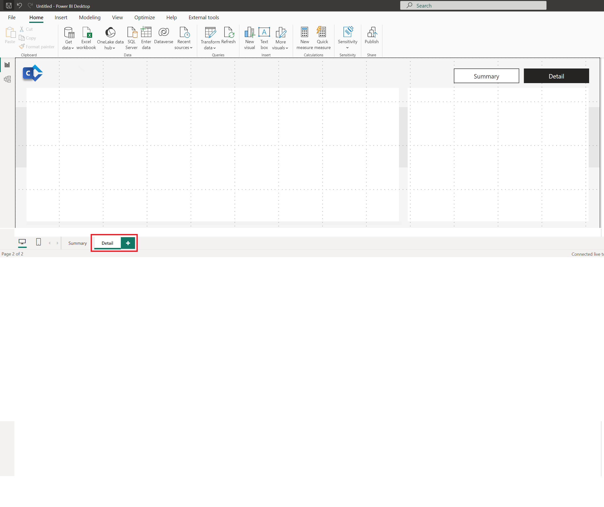

1. Navigate back to the **Summary** page of your report.

## Visualizations

---

### Consolidating visuals

We've been asked by our users to ensure the **Total Sales Amount**, **Total Items Discounted** and **Total Returned Items** measures are prominently displayed at the top of our report as these results will be the most common discussion points.

As more requirements continue to be added to our report design, we want to be cognizant of the number of visuals we are including on our canvas, so we'll leverage a technique below to consolidate a more common design pattern of three **Card** visuals into a more optimized approach with a single **Table** to optimize our report performance.

---

1. On the **Summary** page, select the **New Card** visual from the **Visualizations** pane to add to the canvas and add the below measures in the following order:

    1. **Total Sales Amount**
    1. **Total Items Discounts**
    1. **Total Return Items**

    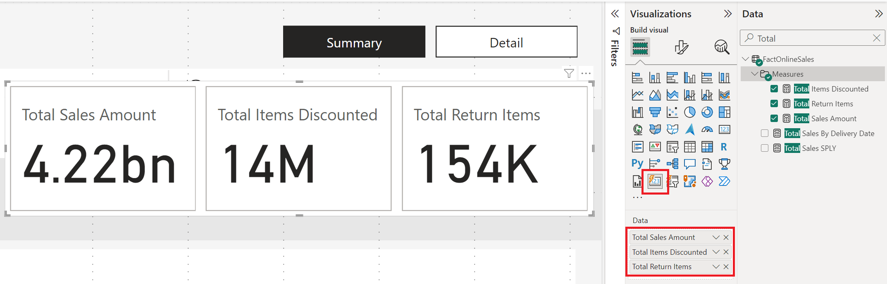

1. Utilizing the **Visualizations** pane's **Format your visual** section, we'll update the following configurations below.

    | | |
    | :- | :- |
    | 🔍 Search term | **Cards** |
    | Fill | **Off** |
    | Border | **Off** |

    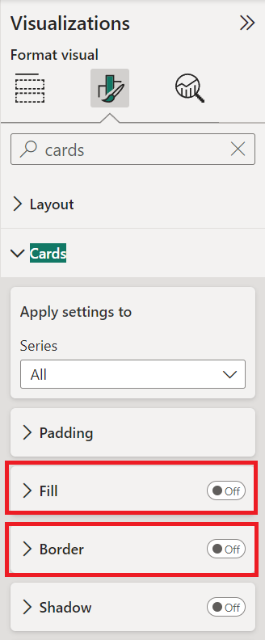

    | | |
    | :- | :- |
    | 🔍 Search term | **Effects** |
    | Effects > Background | **Off** |

    

1. Resize and position the new card visual to fit the top horizontal section of the report.

    

1. Utilizing the **Visualizations** pane's **Format your visual** section, we'll update the following configurations below.

    **Note**: Utilize the Search box, to easily discover configurable settings.

    | | |
    | :- | :- |
    | 🔍 Search term | **Callout** |
    | Callout > Values > Font  | **Segoe UI Semibold** |
    | Callout > Values > Font (size)  | **28** |
    | Callout > Values > Horizontal alignment | **Center** |

    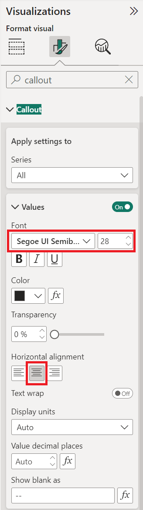

    | | |
    | :- | :- |
    | 🔍 Search term | **Label** |
    | Callout > Label > Font  | **Segoe UI Semibold** |
    | Callout > Label > Font (size)  | **12** |
    | Callout > Label > Color | **#118DFF** |

    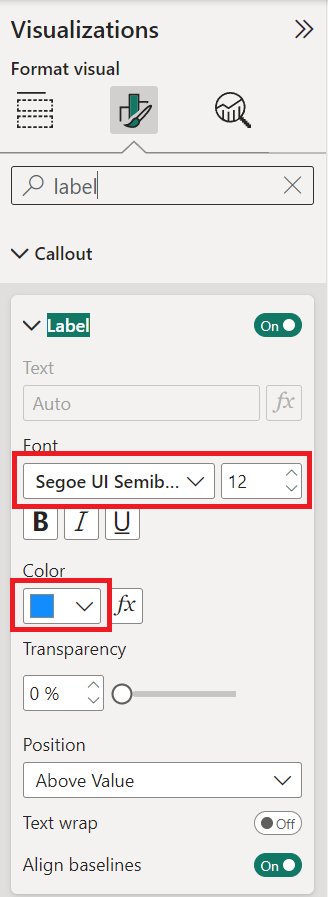

    <i>If the text color isn't within your default selection, select <b>More colors...</b> to enter the code manually.</i>

    

1. We'll now navigate to our **Optimize** tab and select the **Performance analyzer** option. Within the **Performance analyzer** pane we'll select **Start recording** and then **Refresh visuals** where we can review the results for our **Card (new)**. 
    1. To view the fused query, select the **Copy query** option and paste into a text editor.
    1. Once complete, select the **Stop** option and minimize the **Performance analyzer** pane.

    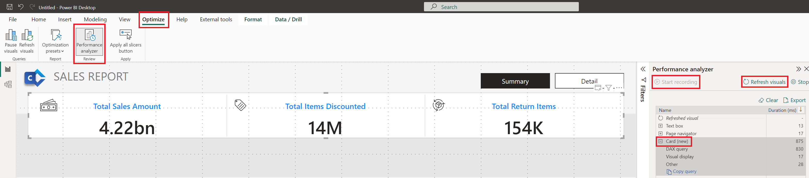

<font size="6">✅ Lab check</font>
    
Using the above technique we were able to emulate the presentation of three individual card visuals, in the form of a single table - while still preserving an aesthetically pleasing presentation for our users. In Power BI, its important to reduce the amount of queries sent to our dataset to improve our report performance.

Learn more about [DAX Fusion](https://dax.tips/2019/08/05/dax-fusion/) from the community resource [DAX.tips](https://dax.tips)

### Slicers

---

1. From the **Visualizations** pane, add a **Slicer** visual to the report page. From the **DimDate** table, insert the **DateKey** field into the **Field** value in the **Visualizations** pane or drop it directly on the slicer itself. Then, update the following configuration below.

    | | |
    | :- | :- |
    | 🔍 Search term | **Style** |
    | Options > Style | **Relative** |

    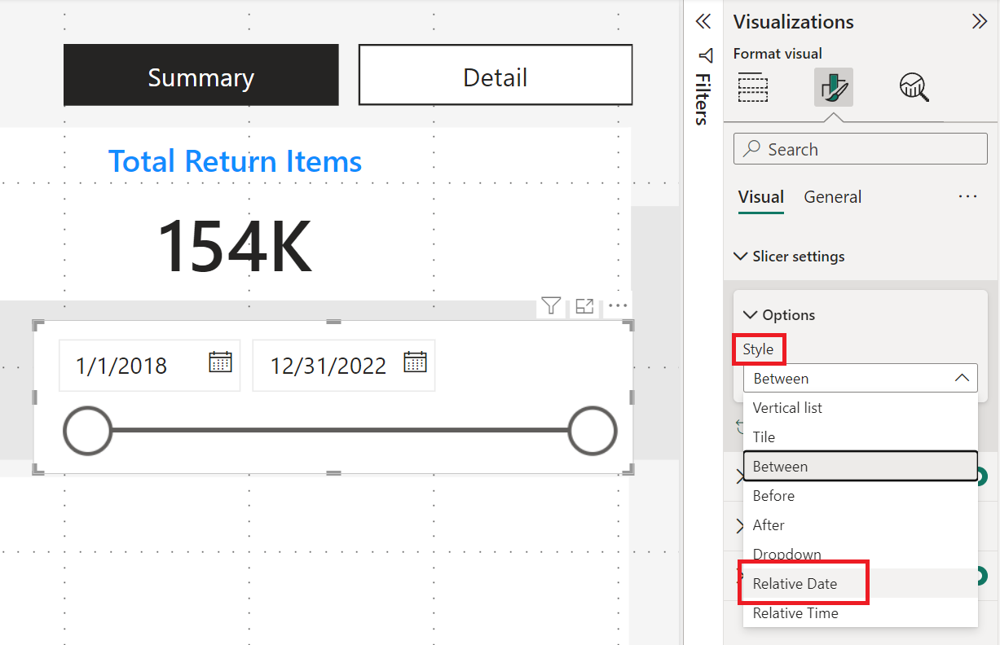

1. Update the slicer values to **Last 18 Months** to create a rolling 18 month selection and position it below the Total Sales Amount column. This filter now will automatically apply as each new day occurs.

    

1. Utilizing the **Visualizations** panes **Format your visual** section, update the following configurations below for the slicer.

    > [!NOTE]
    > Utilize the Search box to easily discover configurable settings.

    | | |
    | :- | :- |
    | 🔍 Search term | **Header** |
    | Slicer header > Title text | **Date** |
    | Slicer header > Font | **Segoe UI Semibold** |
    | Slicer header > Font size | **9** |
    | Slicer header > Background | **White, 10% darker** |

    

    | | |
    | :- | :- |
    | 🔍 Search term | **Background** |
    | Values > Background > Background color | **White** |
    | Effects > Background | **Off** |

    

1. From the **Visualizations** pane, add a **Slicer** visual below the **Total Items Discounted** column and complete the following configurations.
    - Insert the **ProductCategoryName** field first and the **ProductSubcategoryName** second from the **DimProduct** table either into the **Field** value in the **Visualizations** pane or drop directly on the slicer itself.

    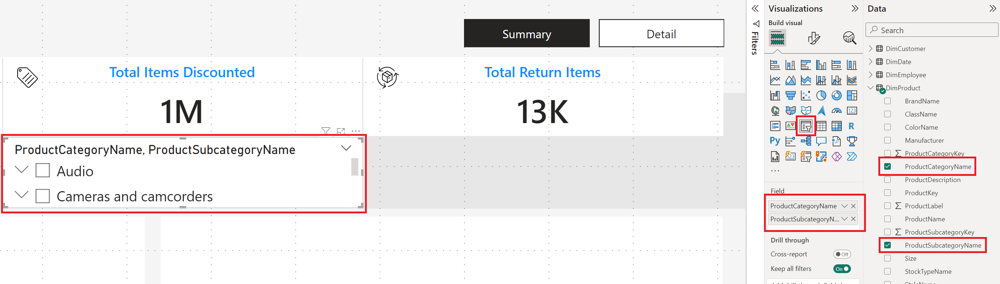

1. Navigate to the **View** tab and select the **Performance analyzer** option. Within the **Performance analyzer** pane, select **Start recording**. Hover above our current slicer and select the **Analyze this visual** button in the top right.

    Within our results, if we expand the **Slicer** name, a **DAX query** is present. This is because to render the current **List** configuration, it must send a query to display our values.

    

1. To increase our reports performance from the **Visualizations** pane's **Format your visual** section, update the following configuration below for the product slicer.

    | | |
    | :- | :- |
    | 🔍 Search term | **Style** |
    | Options > Style | **Dropdown** |

    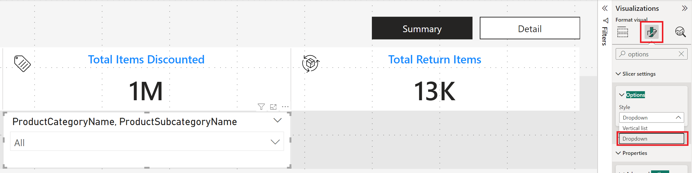

1. Hovering above our current slicer once again, select the **Analyze this visual** button in the top right. Review the updated results within the **Performance analyzer** pane where the **Slicer** no longer contains a **DAX query** when collapsed. It will only be when a user selects the slicer that it will then run a query to return our list of values.

    

1. Utilizing the **Visualizations** pane's **Format your visual** section, update the following configurations below for the slicer.

    | | |
    | :- | :- |
    | 🔍 Search term | **Background** |
    | Values > Background > Background color | **White** |
    | Effects > Background | **Off** |

    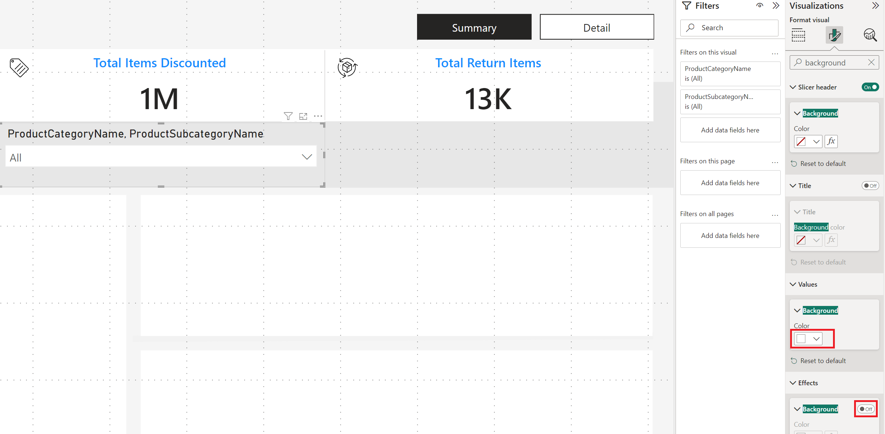

    | | |
    | :- | :- |
    | 🔍 Search term | **Title** |
    | Text > Title text | **Products** |

    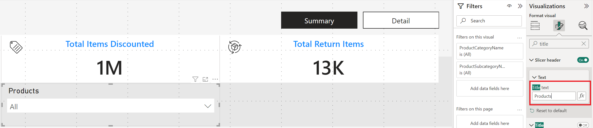

1. From the **Visualizations** pane, add a **Slicer** visual below the **Total Returned Items** column and complete the following configurations.
    1. Insert the **CustomerType** field from the **DimCustomer** table either into the **Field** value in the **Visualizations** pane or drop directly on the slicer itself.

    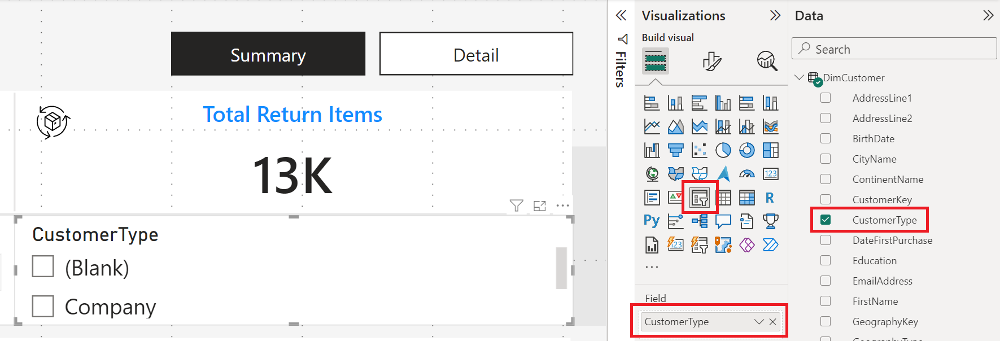

1. Select the Products slicer to make it our active object. Navigate to the **Home** tab, select the **Format painter** button, and select the **CustomerType** slicer to transfer the visual configurations.

    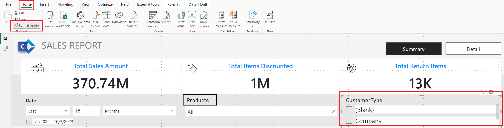

1. From the **Visualizations** pane's **Format your visual** section, update the following configuration below for the customer type slicer.

    | | |
    | :- | :- |
    | 🔍 Search term | **Style** |
    | Options > Style | **Tile** |

    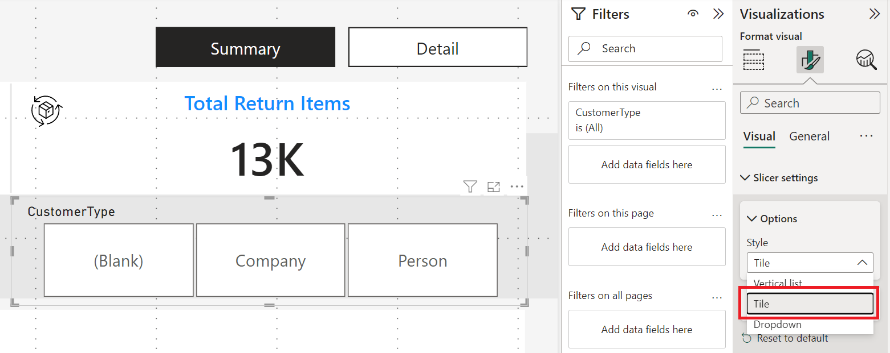

1. With the **CustomerType** slicer selected, navigate to the **Filters** pane. For the **Filters on this visual** configuration, update the **Filter type** to **Advanced filtering** and for **Show items when the value** setting is **Is not blank** before selecting **Apply filter**.

    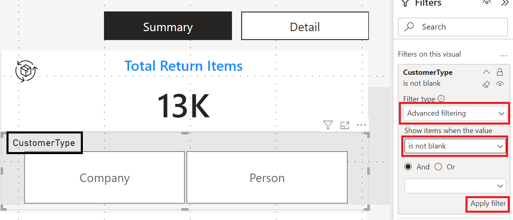

<font size="6">✅ Lab check</font>


Maintaining a consistent look and feel across our report elements ensures a professional and visually appealing experiences for our end users. Utilizing features like **Format painter** (found across other Office applications) or by bulk updating configurations is a quick and easy way to ensure our designs are consistent.

### Data storytelling

1. In the bottom left corner of the canvas, add a **Clustered bar chart** from the **Visualizations** pane and drag-and-drop the following fields onto the visual, and resize the visual to fit within the original **Background canvas** white square.

    | Table | Field |
    | :-- | :-- |
    | DimProduct | Manufacturer |
    | FactOnlineSales | Total Sales Amount |

    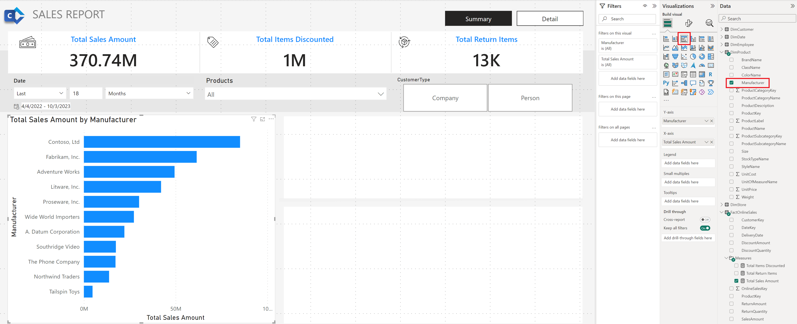

1. In the top right corner of the canvas, add a **Line chart** from the **Visualizations** pane and drag-and-drop the following fields onto the visual, and resize the visual to fit within the original **Background canvas** white square.

    | Table | Field |
    | :-- | :-- |
    | DimDate | Week |
    | FactOnlineSales | Total Sales Amount |

    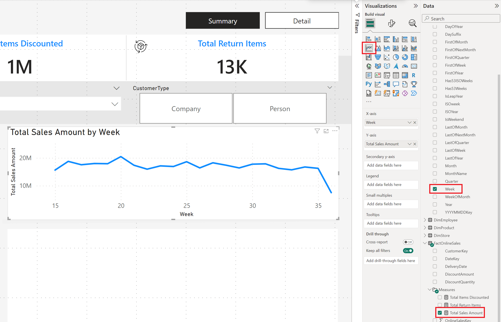

1. As opposed to creating a line chart for each **Occupation** we can utilize the **Small multiples** feature to create a series of line charts within a single visual. With our current line chart as the active selection, navigate to the the **Data** pane and add the **Occupation** field from the **DimCustomer** table into the **Small multiples** field in the **Visualizations** pane.

    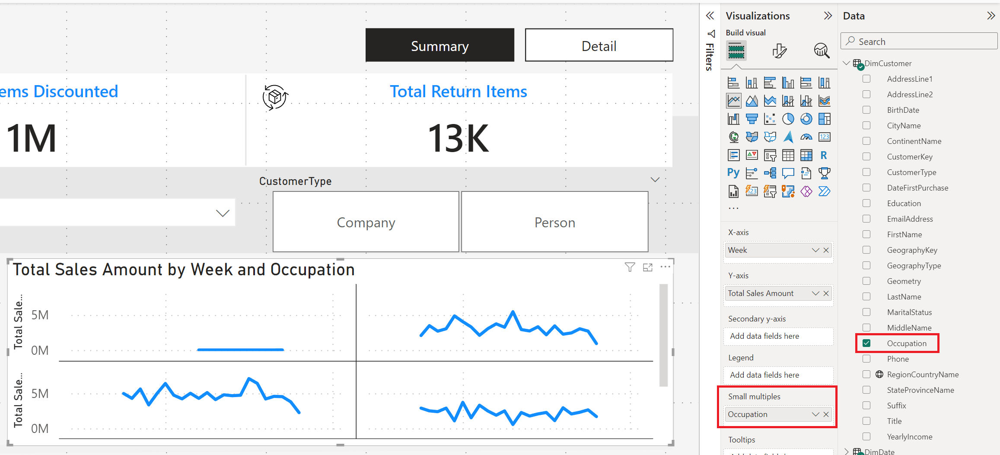

1. Utilizing the **Visualizations** pane's **Format your visual** section, we'll update the following configurations below for our line charts small multiple properties.

    > [!NOTE]
    > Utilize the Search box, to easily discover configurable settings.

    | | |
    | :- | :- |
    | 🔍 Search term | **Multiples** |
    | Small multiples > Layout > Rows | **1** |
    | Small multiples > Border > Gridlines | **Vertical only** |
    | Small multiples > Title > Position | **Bottom** |
    | Small multiples > Title > Font | **Segoe UI** |

    

1. Utilizing the **Visualizations** pane's **Add further analyses to your visual** section, we'll update the following configurations below for our line chart to infuse additional insights.

    > [!NOTE]
    > Utilize the Search box, to easily discover configurable settings.

    | | |
    | :- | :- |
    | 🔍 Search term | **Median** |
    | Median line > Apply settings to | select **Add line** |
    | Median line > Line > Color | **Black** |

    

1. With our current small multiples line chart as the active selection and complete the following instructions by first selecting the ellipses (**...**) in the top right corner.
    1. With the ellipses selected, navigate to the **Sort small multiples** option and select sort by **Total Sales Amount**
    1. With the ellipses selected again, navigate to **Sort small multiples** and select the **Sort descending** option.

    

1. From the **Visualizations** pane add the **Azure map** visual below the small multiples line chart in the bottom right corner of our page, and complete the following configurations.
    1. Insert the **StateProvinceName** field from the **DimCustomer** table either into the **Location** value in the **Visualizations** pane or drop directly on the map itself.
    1. Insert the **Total Sales Amount** measure from the **FactOnlineSales** table either into the **Size** value in the **Visualizations** pane or drop directly on the map itself.

    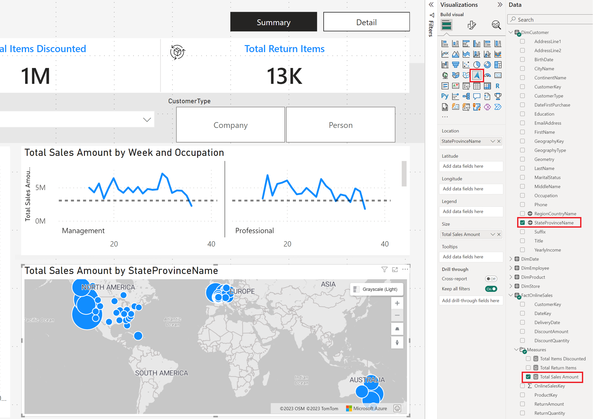

<font size="6">✅ Lab check</font>

Whether it be creating visuals out of the box, splitting them into multiple versions of the same visual with small multiples or incorporating rich mapping capabilities - there's numerous methods in which to visually tell your story with data in a clean and concise format.


---

### Drill-through

1. To make a drill-through selection that can stand out in our page title, we're going to create a report level measure to determine our selected **Manufacturer** value and display this in the top left. Report level measures are only accessible from our report and are not part of our live connected model.

    Complete the following steps below:

    1. From the **Data** pane, right click the **DimProduct** table and select **New measure**.

    

    1. Within the DAX formula bar, add the following DAX query below and select the ✔️ check mark to the left of the formula to commit.

    ```sql
    Selected Manufacturer = 
    VAR manufacturer = SELECTEDVALUE('DimProduct'[Manufacturer])
    RETURN
    UPPER(manufacturer)
    ```

    

1. Select the measure **Selected Manufacturer** and in the **Measure tools** tab, update the **Data type** to **Text**.

    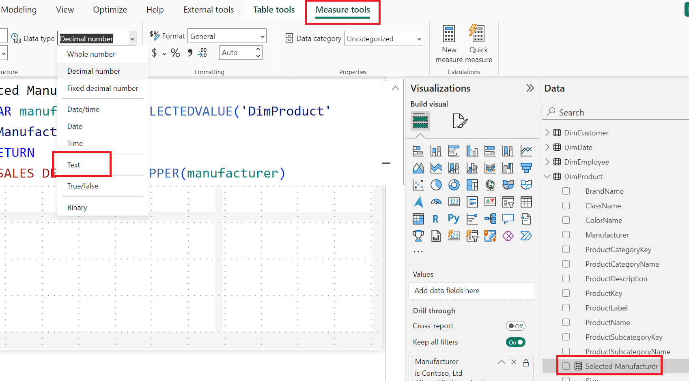

    > [!IMPORTANT]
    > The measure must be set as a **Text** data type in order to be added to the button text field in the next step of instructions.

1. From the ribbon select the **Insert** tab and in the **Buttons** options a **Blank** button, position this in the top left side of the page adjacent to the company logo.

    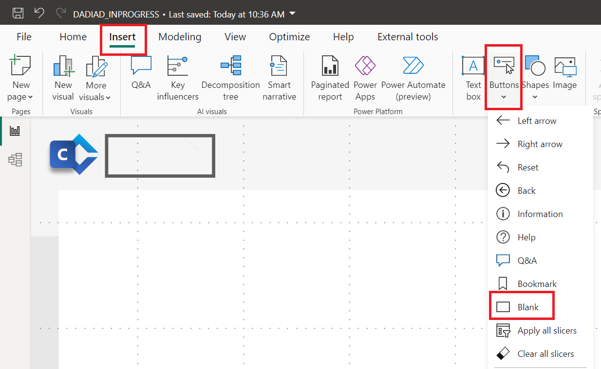

1. Utilizing the **Visualizations** pane's **Format your visual** section, we'll update the following configurations below for our blank button properties.

    > [!NOTE]
    > Utilize the Search box, to easily discover configurable settings.

    | | |
    | :- | :- |
    | 🔍 Search term | **Style** |
    | Style > Text > Font (size) | **18** |
    | Style > Text > Font color | **White, 50% darker** |
    | Style > Text > Horizontal alignment | **Left** |

    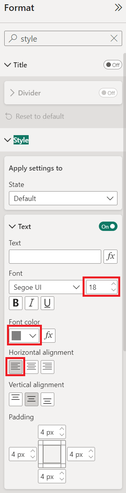

    | 🔍 Search term | **Style** |
    | Style > Text > Text | **Fx** |

    - Once in the **Text - state** window, set the value for the **What field should we base this on?** to the **Selected Manufactruer** measure located in the **DimProduct** table.

    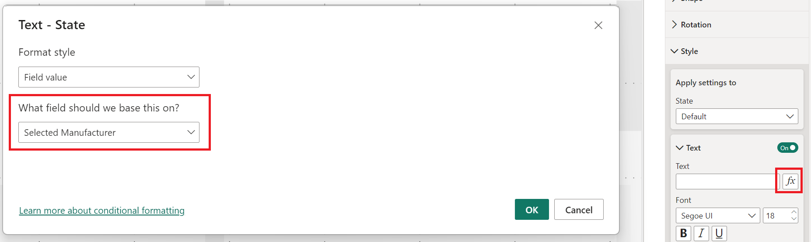

    | | |
    | :- | :- |
    | 🔍 Search term | **Border** |
    | Style > Border | **Off** |

    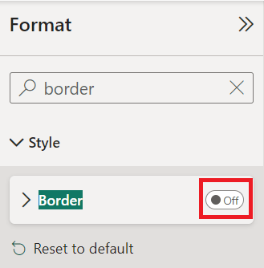

    - Stretch the width of the button as necessary along the top of the page.

1. From the **Data** pane, we'll locate the **Manufacturer** field from the **DimProduct** table and drag-and-drop this value into the **Visualizations** pane's **Add dril-through field values here** field well.

    

1. In the top left side of our page an automatic button has been added to return to the previous drill page. Because we already have a page navigation button, let's select this object and press **Delete** on the keyboard to remove this element.

    

1. Return to the **Summary** page, either by selecting the page name in the bottom left or holding **ctrl** and clicking the **Summary** button from the page navigator in the top right of the page. In the bottom left of the page right click the bar for **Contoso, Ltd** and navigate to the **Drill-through** option and then select the **Detail** page.

    

1. We have now returned to the **Detail** page and our matrix visual only includes the **Contoso, Ltd** manufacturer. In the bottom right of the **Visualizations** pane the **Manufacturer is Contoso, Ltd** and the current **DateKey** range from the **Date** slicer is also passed due to the **Keep all filters** toggle being enabled.

    

### Spark lines

Sparklines are tiny charts shown within cells of a table or matrix that make it easy to see and compare trends quickly. You can use them to show trends in a series of values, such as seasonal increases or decreases, economic cycles, or to highlight max and min values. Sparklines are currently in public preview.

Learn more about [sparklines](https://learn.microsoft.com/power-bi/create-reports/power-bi-sparklines-tables)

---

1. Return to the **Detail** page if not already selected, either by clicking the page name in the bottom left or holding **ctrl** and clicking the **Detail** button from the page navigator in the top right of the page.

    > [!NOTE]
    > For reports with a large number of pages, we can also right click the page navigation arrows (**<>**) to the left of the page tabs to display a pop-up of all page names. This technique is also applicable to Excel workbooks.

    

1. From the **Visualizations** pane add the **Matrix** visual to the top right rectangle in the **Detail** page and complete the following configurations.
    | Field | Table | Field/Measure |
    | :-- | :-- | :-- |
    | Rows | DimProduct | Manufacturer |
    | Rows | DimStore | StoreName |
    | Rows | DimProduct | ProductName |
    | Values | FactOnlineSales | Total Sales Amount |

    

1. From the **Visualizations** pane, we'll right click the **Total Sales Amount** option and select the **Add a sparkline** option.
    1. Note: You can also add a sparkline by navigating to the **Insert** tab and then selecting the **Add a sparkline** button.

    

1. Within the **Add a sparkline** dialog window, select the drop down under the **X-axis** and select the **DateKey** filed from the **DimDate** table. Once complete select **Create** to continue.

    

1. From the **Visualizations** pane, we'll right click the **Total Sales Amount by DateKey** sparkline option and select the **Rename for this visual** option. For the updated title, we'll simply type the **space character** to ensure at least one character so that Power BI accepts our rename and press enter once complete.

    

1. From the **Visualizations** pane, we can verify our sparkline is still present, albeit with no visible characters and in our matrix, if the sparklines are not visible, resize the right most column to view.

    

## Sparkline formatting

1. Utilizing the **Visualizations** pane's **Format your visual** section, we'll now update our matrix with the following configurations below.

    **Note**: Utilize the Search box, to easily discover configurable settings.

    | | |
    | :- | :- |
    | 🔍 Search term | **Style** |
    | Style presets | **None** |

    

    | | |
    | :- | :- |
    | 🔍 Search term | **Header** |
    | Column headers > Text > Font | **Segoe UI Semibold** |
    | Column headers > Text > Font size | **10** |
    | Column headers > Text > Text color | **Black** |
    | Column headers > Text > Text wrap | **Off** |
    | Column headers > Options > Auto-size width | **Off** |

    

    | | |
    | :- | :- |
    | 🔍 Search term | **Pad** |
    | Grid > Options > Row padding | **6** |

    

    | | |
    | :- | :- |
    | 🔍 Search term | **icons** |
    | Row headers > +/- icons > Color | **White, 30% darker** |
    | Row headers > +/- icons > Size | **12** |

    

    | | |
    | :- | :- |
    | 🔍 Search term | **spark** |
    | Sparklines > Sparkline > Data color | **White, 30% darker** |
    | Sparklines > Sparkline > Show these markers | **Highest** |
    | Sparklines > Marker > Color | **#118DFF** |
    | Sparklines > Marker > Size | **4** |

    

1. With our matrix visual now configured, let's return to visual itself and resize the columns so that they fit the complete width of our top left rectangle so that they are easy to read for our end users so that they can find new insights with our sparklines.

    

## Artificial Intelligence

### Anomaly detection

1. From the **Visualizations** pane we'll now add a **Line** visual to the bottom left rectangle on our canvas and insert the following fields and measures to the values below:
    1. X-axis: **DimDate** table, **DateKey** field
    1. Y-axis: **Total Sales Amount** measure

    

1. Utilizing the **Visualizations** pane's **Add further analyses to your visual** section, we'll update the following configurations below for our line chart to infuse additional insights.

    **Note**: Utilize the Search box, to easily discover configurable settings.

    | | |
    | :- | :- |
    | 🔍 Search term | **Anomalies** |
    | Find anomalies | **On** |

    

1. From our line chart, anomalies have now been detected, if we were to select any of the anomaly markers a new **Anomalies** pane is then available, this same experience will be available to our end users as they view our reports within the Power BI service (cloud).

    The anomalies pane includes information information like why the anomaly was detected and possible explanations including their overall strength score as displayed in the black highlighted areas.

    

Learn more about [Anomaly detection](https://learn.microsoft.com/power-bi/visuals/power-bi-visualization-anomaly-detection)

### Smart narrative

1. From the **Visualizations** pane we'll now add a **Smart narrative** visual to the top right rectangle on our canvas.

    

1. Utilizing the **Visualizations** pane's **Format your visual** section, we'll now update our matrix with the following configurations below.

    **Note**: Utilize the Search box, to easily discover configurable settings.

    | | |
    | :- | :- |
    | 🔍 Search term | **Title** |
    | Title | **On** |
    | Title > Text | **Sales Summary** |

    

1. Now as we make selections on our report pages, the **Smart narrative** visual's dynamic text will automatically rewrite and update its summary based upon its findings.

    

Learn more about [Smart narrative](https://learn.microsoft.com/power-bi/visuals/power-bi-visualization-smart-narrative)

### Q&A visual

1. For our last visual we'll now add the **Q&A** visual to the bottom right rectangle on our canvas by simply double clicking.

    With including the **Q&A** visual, we can provide our end users the ability to find new insights by typing their own questions, for scenarios that we may not have even thought to visualize yet.

    

Learn more about the [Q&A](https://learn.microsoft.com/power-bi/visuals/power-bi-visualization-q-and-a) visual.

# Lab check

<i>Finished summary page</i>


<i>Finished detail page</i>


# Next steps
We hope this portion of the lab has shown how well designed reports can lead to increased usage and adoption.

- Return to the [Day After Dashboard in a Day](./README.md) homepage