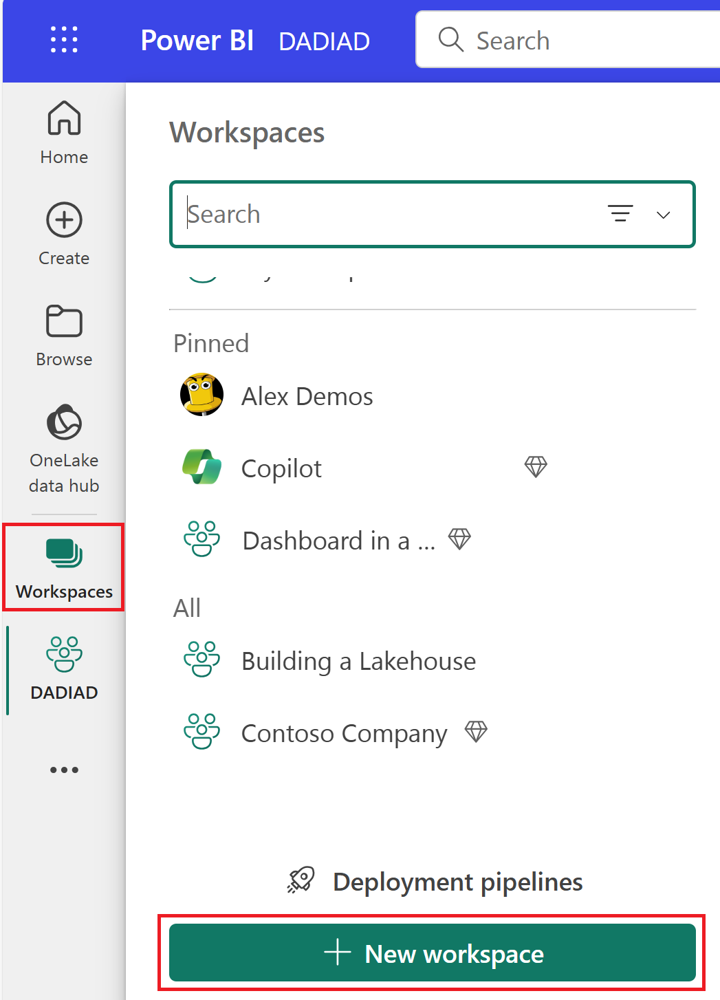
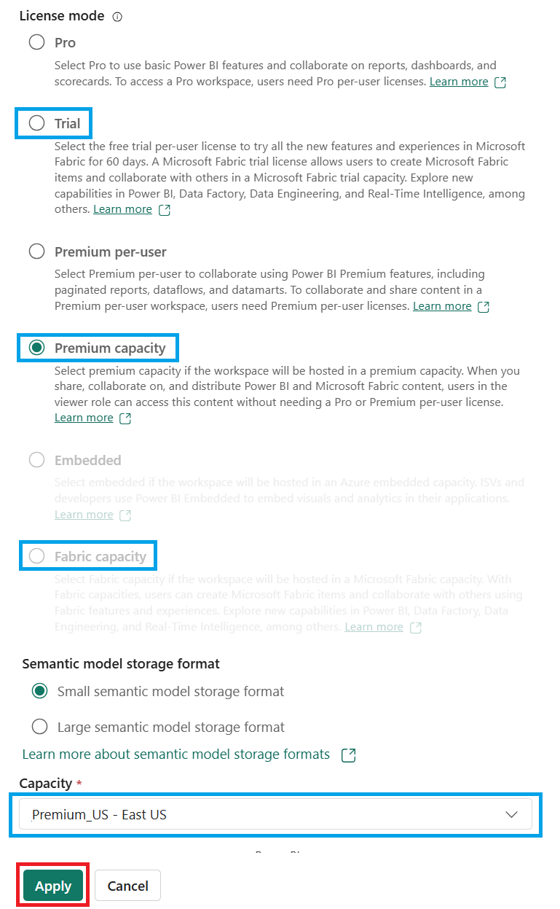
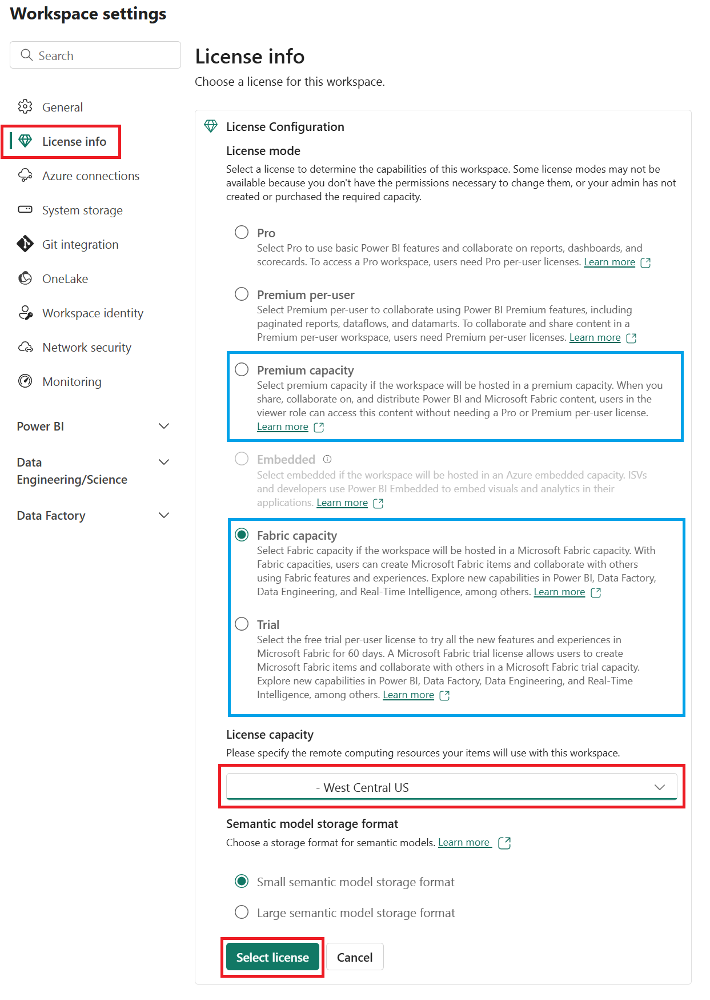
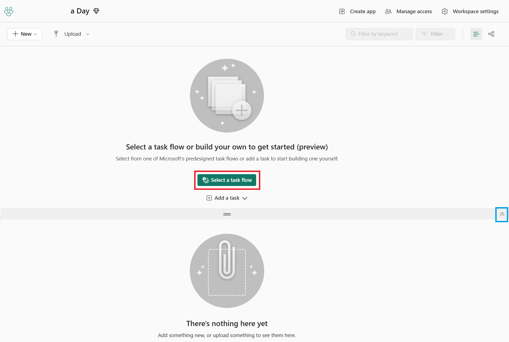
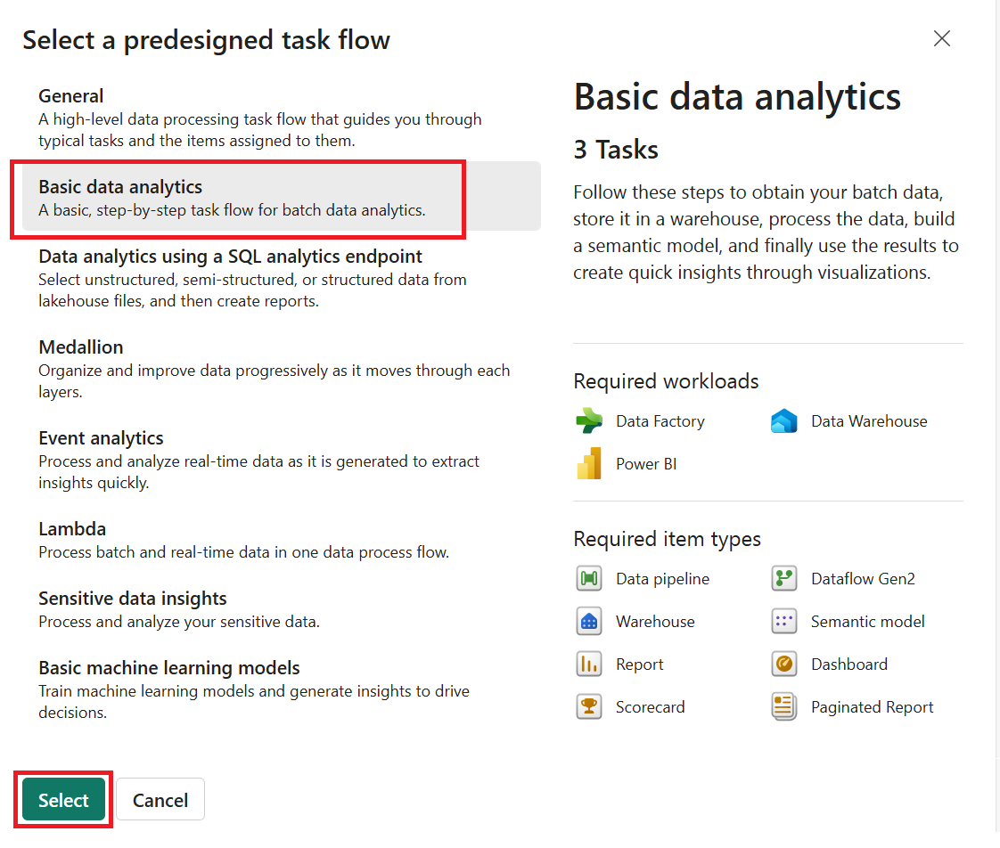
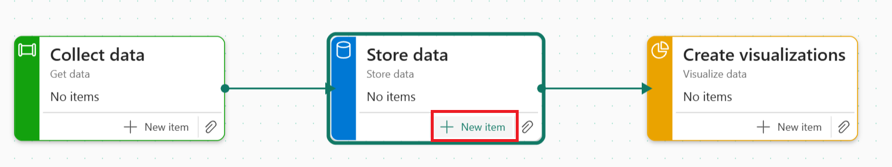
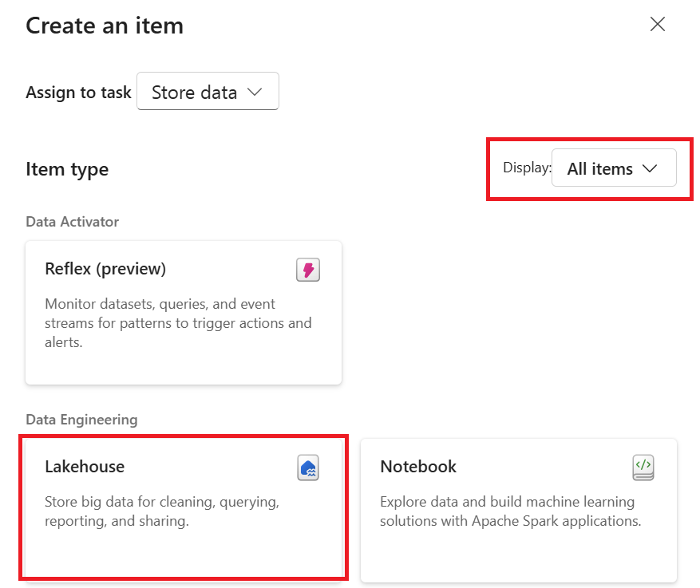
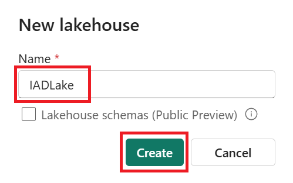
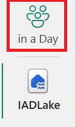

# Getting started

### Checking and enabling workspace capacity

We'll begin by navigating to a new, empty, or non-production workspace to check if a capacity has been assigned. If not, we can enable it by following these steps:

#### (Optional) New workspace creation

1. First, if you need to create a new workspace, select **Workspaces** on the left side rail and then click on **+ New workspace.**

   

1. Give the workspace a unique name; using your initials followed by **demo workspace** is sufficient.

    

1. Scroll down and within the **License info** section, ensure that one of the following modes is enabled: [Premium capacity](https://docs.microsoft.com/power-bi/admin/service-premium-gen2-faq), [Fabric capacity](https://learn.microsoft.com/fabric/enterprise/buy-subscription#buy-an-azure-sku), or [Trial](https://learn.microsoft.com/fabric/get-started/fabric-trial).

    1. If you have selected **Premium capacity** or **Fabric capacity**, select a capacity from the **Capacity** drop-down list.

    

#### (Optional) Existing workspace license check

1. To check the license of an existing workspace, start by navigating to the **Settings** pane. Within the **License info** section, ensure that one of the following modes is enabled: [Premium capacity](https://docs.microsoft.com/power-bi/admin/service-premium-gen2-faq), [Fabric capacity](https://learn.microsoft.com/fabric/enterprise/buy-subscription#buy-an-azure-sku), or [Trial](https://learn.microsoft.com/fabric/get-started/fabric-trial).

    1. If you have selected **Premium capacity** or **Fabric capacity**, select a capacity from the **Capacity** drop-down list.

    **License mode:**
    - [Premium capacity](https://docs.microsoft.com/power-bi/admin/service-premium-gen2-faq)
    - [Fabric capacity](https://learn.microsoft.com/fabric/enterprise/buy-subscription#buy-an-azure-sku)
    - [Trial](https://learn.microsoft.com/fabric/get-started/fabric-trial)

1. If you have modified the license mode, click **Select license** to save your changes. Finally, close the Workspace settings pane by clicking the **X** in the top right corner of the window.

    

### Basic data analytics task flow

1. To begin, from the empty workspace, select the option **Select a task flow** to choose one of Microsoft's predesigned task flows. These predesigned task flows provide a structured approach to managing data projects, ensuring that best practices are followed and that the workflow is efficient and effective.

    **Note:** If you do not see the task flow section within your workspace, check for the chevron to expand or collapse this section from the workspace item view. This ensures that you have access to all the necessary tools and options for your project.

    

1. From the **Select a task flow** window, choose the **Basic data analytics** option. This option includes the description "Follow these steps to obtain your batch data, store it in a warehouse, process the data, build a semantic model, and finally use the results to create quick insights through visualizations." Select the **Select** option to continue.

    

1. A task flow has now been created within your workspace, which can be considered an architectural template. This template provides a structured framework for your data project. No items have been created yet, so select the **New item** option on the **Store data** task to start adding items to your task flow.

    

1. In the Create an item window, the available options within Microsoft Fabric are initially filtered to **Recommended items**. This filtering helps you choose the most appropriate tools and resources for your project. For this lab, we'll change the Display option filter to **All items** and select the **Lakehouse** item for your data storage.

    

1. In the New lakehouse window, set the lakehouse name to "IADLake" (shorthand for in a day) and then select **Create**.

    

1. A new lakehouse will be created for you. For now, return to the workspace by selecting the workspace name on the left side-rail. This step ensures that you can continue working on other aspects of your project while the lakehouse is being set up.

    

1. Within the workspace, you will notice that three items have now been created and are associated with your lakehouse. These items include the lakehouse (storage), SQL analytics endpoint, and a default Semantic model. As you continue to add more items to your projects and select different tasks, the workspace item view list will filter to show only those components associated with each task. This filtering helps you stay organized and focused on the relevant parts of your project.

# Next steps

This conclusion of the lab has demonstrated how to get started with creating a task flow, a data pipeline, the copy activity, and the expression builder. By following these steps, you have gained practical experience in setting up and creating a data ingestion solution using Microsoft Fabric.

- Continue to the [Data preparation](./DataPreparation.md) lab
- Return to the [Day After Dashboard in a Day](./README.md) homepage