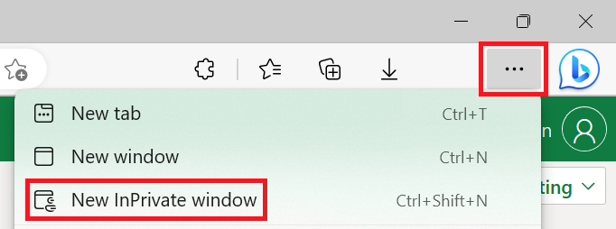
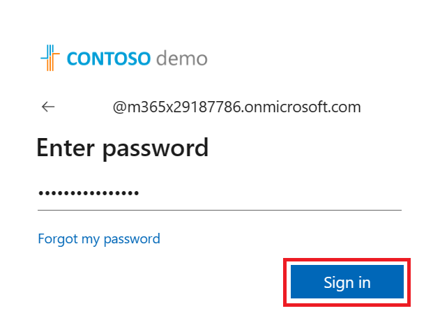
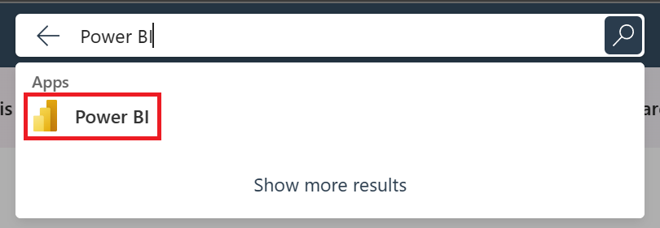
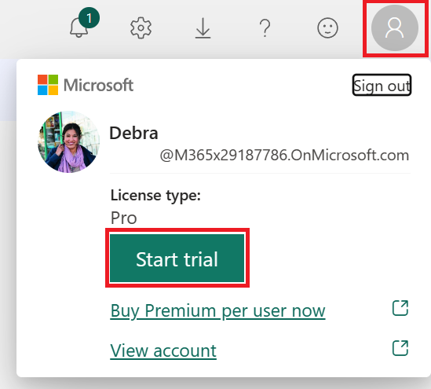

# Prerequisites

The following prerequisites and setup must be done for successful completion of the lab:
1. You must be connected to the internet.
1. You must be signed up for a Power BI account.
    1. Go to http://aka.ms/pbidiadtraining and sign up for Power BI with an organizational email address. If you have an existing account, please use the same URL as above to log in.
1. You must have a Power BI Premium backed workspace, thru one of the following methods.
    1. Dedicated capacity licensing (P,EM or A)
    1. User based capacity license (Premium Per User).
1. You must [verify minimum system requirements](https://docs.microsoft.com/power-bi/fundamentals/desktop-get-the-desktop#minimum-requirements) are met for Power BI Desktop.

1. You must download and install Power BI Desktop from one of the options listed below:
    1. [Microsoft Store](https://aka.ms/pbidesktop)
        1. [Learn more about the benefits of installing from the Microsoft Store including automatic updates](https://docs.microsoft.com/power-bi/fundamentals/desktop-get-the-desktop#install-as-an-app-from-the-microsoft-store).
    1. [Download Center](https://www.microsoft.com/en-us/download/details.aspx?id=58494)
        1. If you have Power BI Desktop installed from Download Center, ensure you have the latest version of downloaded.

### Trial tenant

To create a trial tenant, please visit: https://go.microsoft.com/fwlink/p/?LinkID=698279

[Microsoft 365 developer subscription in Visual Studio subscriptions](https://docs.microsoft.com/visualstudio/subscriptions/vs-m365)

### Trial profile

f you have already been assigned a trial user profile for this workshop, follow these steps:

1. Open a **New InPrivate window** in your web browser by selecting the ellipses (**…**) and then **New InPrivate window**.
    1.  Alternatively, you can use the keyboard shortcut **Ctrl+Shift+N**
    
1. Go to [Office.com](https://www.office.com) and select **Sign in**
    
1. Enter the assigned user name and password to sign into the account, and then select **Sign in**.
    1. If prompted to **Stay signed in** select **Yes**.
    
1. In the global search bar in the middle of screen, type **Power BI** and click the result to continue.
    
1. In the Power BI service, select the user profile in the top right corner and then click the **Start trial** option.
    1. If prompted to **Start trial** in a new pop-up select **Start trial** to continue.
    

### Sample data

The data for this lab is from the [Contoso Retail Industry](https://www.microsoft.com/en-ca/download/details.aspx?id=18279) sample database, published by Microsoft to showcase how to design SQL Server databases and Analysis Services business intelligence models.

# Document Structure

This document and has two main sections:
1. **Power BI Desktop**: This section highlights the features available in Power BI Desktop and walks the user through the process of bringing in data from the data source, modeling and creating visualizations.
1. **Power BI service**: This section highlights the features available in the Power BI service including the ability to publish the Power BI Desktop datasets and reports to the web.