# Paginated Reports In An Hour 

Paginated reports are designed to be printed or shared. They're called paginated because they're formatted to fit well on a page. They display all the data in a table, even if the table spans multiple pages. They're also called pixel perfect because you can control their report page layout exactly. Power BI Report Builder is the standalone tool for authoring paginated reports for the Power BI service.

[Learn More](https://docs.microsoft.com/en-us/power-bi/paginated-reports/paginated-reports-report-builder-power-bi)

# Prerequisites

For this workshop a **Power BI Pro** or **Premium Per User** license and access to a workspace (recommended non-production) is needed to upload the sample Power BI dataset.

**Follow Along:**
- [Download Power BI Report Builder](https://go.microsoft.com/fwlink/?LinkID=734968)
- [Download the Contoso_Sample.pbix File](https://github.com/microsoft/pbiworkshops/raw/main/Paginated%20Reports%20in%20an%20Hour/Source%20Files/Contoso_Sample.pbix)


___

## Setup

### Power BI service
1. Navigate to the [Power BI service](https://app.powerbi.com).
2. Within the Power BI service, select the Workspaces option within the navigation menu and locate a workspace that is backed by either Premium Capacity or Premium Per User.
3. Within the Workspace:
    - Select **New** and the **Upload a file** option
    - Within **Create new content**, select **Local file** and upload the **Contoso_Sample.pbix**

### Power BI Report Builder
1. Navigate to the **View** tab and check the **Properties**, **Parameters** and **Grouping** options if they are not currently enabled.

___

# Query Designer

### Objective - Connect to a Data Source and create a Dataset using the Power BI Dataset Connection.

1. Within the **Report Data** pane, right click the **Data Sources** option and select **Add Power BI Dataset Connection...**

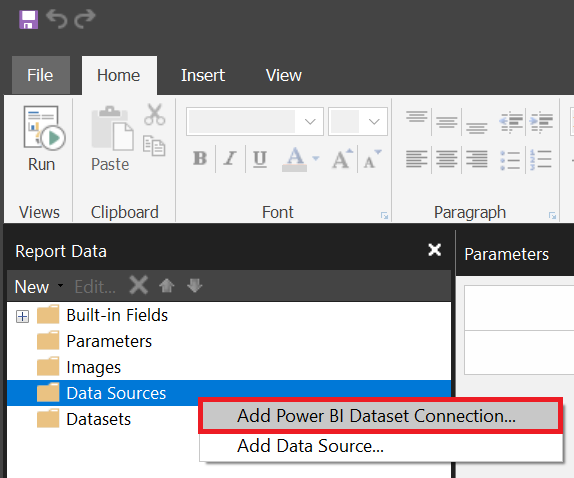

2. Within the **Select a dataset from the Power BI service** window navigate to the workspace the **Contoso_Sample.pbix** was uploaded to and press **Select** to create a connection.

1. Within the **Report Data** pane, right click the **Datasets** option and select **Add Dataset...**

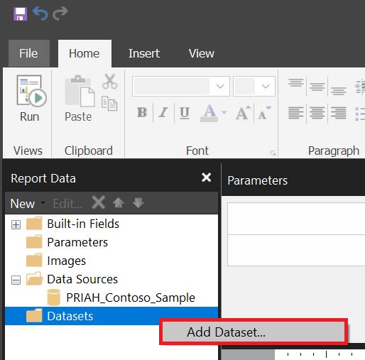

4. In the **Dataset Properties** window and the **Query** group update or select the following:
    1. Update the **Name:** property to **Sales**.
    1. Within the **Data source:** option select Power BI dataset connection from your Data Sources list.
    1. Select **Query Designer...**
1. In the **Query Designer** window add the following fields and measures to the grid from the **Model** view and press **OK** when complete.

| | Date | Category | Brand | Total Sales | # Quantity |
:------------- |:------------- | :---------- | :---------- | :---------- | :---------- |
| Object | Date[Date] | Product[Category] | Product[Brand] | Measures (Sales) - [Total Sales] | Measures (Sales) - [# Quantity] |

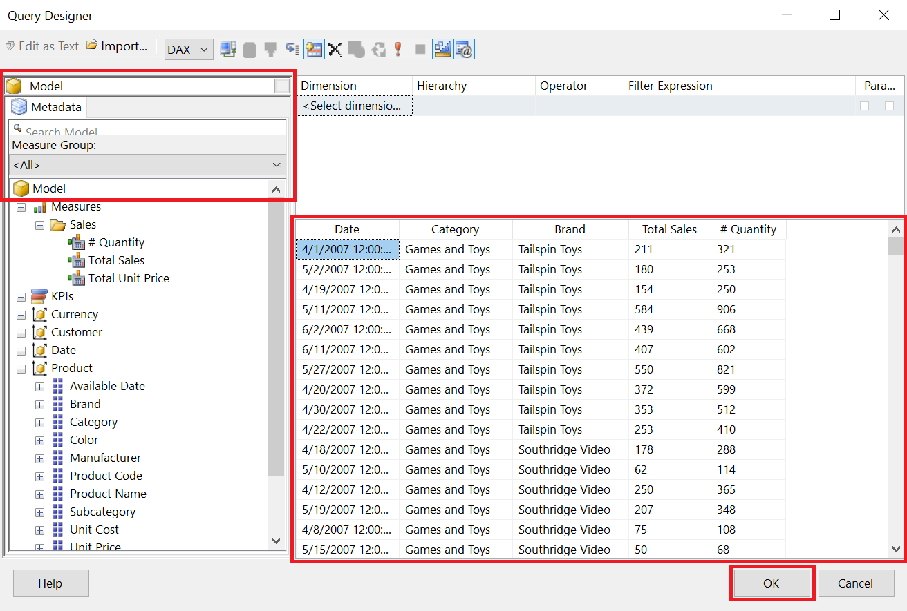

6. A system generated query has now been written into the **Dataset Properties** field, press **OK** to continue.
    1. **⚠ Important Note** you can edit this text by pressing the **fX** option or write your own custom query without the use of the Query Designer.

___

# Table

### Objective - Create and format a table including alternate row colors

1. Select the dark grey area within the report designer and in the **Properties** pane update the **Left** and **Right** margins to **0.5**.
1. Within the ribbon navigate to the **Insert** tab, select **Table** and the **Insert Table** option.
1. Add the following fields to the table by either dragging and dropping from the **Datasets** group or by selecting the details symbol 

    | Date | Category | Brand | Total Sales | ID Quantity |
    :------------- |:------------- | :---------- | :---------- | :---------- |
    | Date  | Category | Brand | Total_Sales | ID__Quantity |

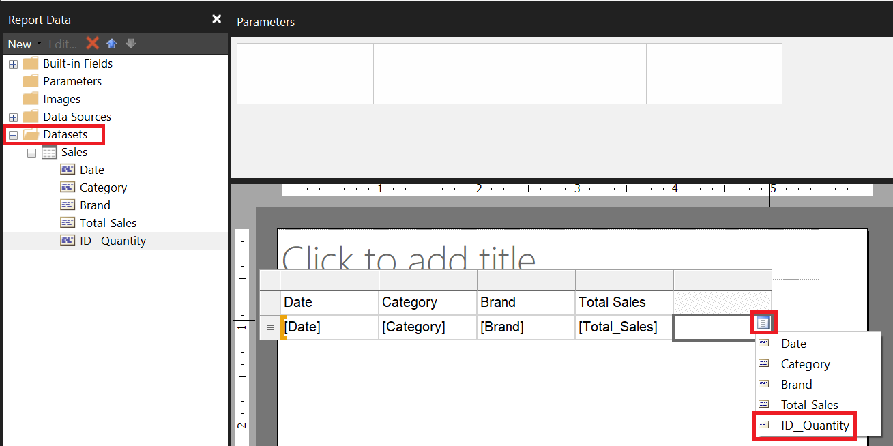

4. Update the column header for **ID Quantity** to **Total Quantity**.
1. Resize the following columns **Width** and **Height**, within the **Properties** pane in the **Position** category.

    | |  Category | Brand |
    | ---: | ---: | ---: |
    | **Size** |  2.25, 0.25 | 1.5, 0.25 |
1. Format the following columns from the **Home** tab.

    | Date | Total Sales | Total Quantity |
    | ---: | ---: | ---: |
    | Date  | Currency | Number |

1. Select the **Date** column header and with the table object now being the active object select the entire header row by clicking the all selection to the left.
1. Within the **Properties** set the following properties:
    1. **Fill** group **BackgroundColor**
    1. **Font** group **Color**

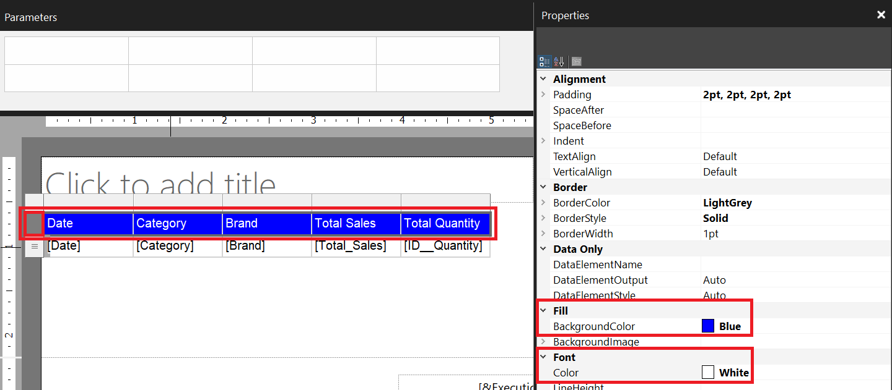

8. Navigate to the ribbon, select the **Home** tab and the **Run (F5)** button.
1. Within the **Run** tab select the **Print Layout** to view the output if the report was to be printed.
1. Select the **Design (F8)** button to return to design view.
1. Navigate to the **Insert** tab, select **Header** and the **Add Header** option.
1. Within the report canvas move the current text box to the header region and update to **Contoso Sales Results** and then **Bold** the text.
1. Select the table object and the cell selector in the top left to edit the **Tablix** properties.
    1. **Position** group:
        1. **Left** 0in
        1. **Top** 0in
    
❗ **Important:** Tablix = Table, List, Matrix

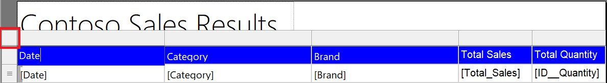

14. Right click the [Total_Sales] value and select **Add Total**.
1. Select the empty cell in the total row in the **Total Quantity** column and select the [ID__Quantity] column to automatically generate the expression **[Sum(ID__Quantity)]**.
1. Select the empty cell in the total row in the **Date** column, add the text **Grand Total** and then **Bold**.

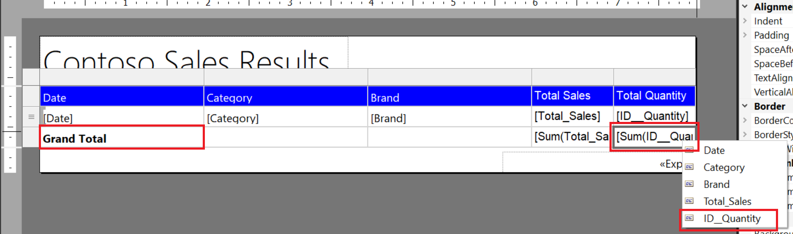

17. Within the text box **[&ExecutionTime]** right click, select **Expression...** and update the current expression to concatenate the following text.

```
="Run Time: " & Globals!ExecutionTime
```

18. Within the **Grouping** pane select the 🔽 option and enable **Advanced Mode**.
1. Within the **Row Groups** update the following properties:
    1.  Select the first **(Static)** option, navigate to the **Properties** pane and update the **RepeatOnNewPage** property to **True**

    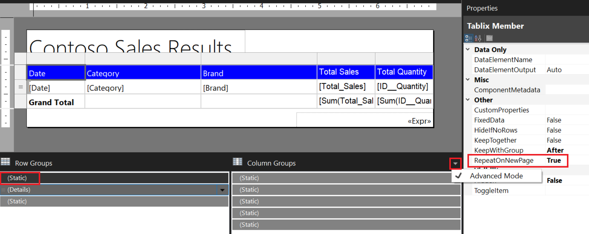

    2. Right click **(Details)**, select **Group Properties**, navigate to the **Sorting** group, Add a sorting option to **Sort by [Date] Order Z to A** and then press **OK** when complete.

20. Select the table object and the cell selector in the rows field to the left to edit the **Tablix Member** objects properties.
    1. **Fill** group:
        1. **BackgroundColor** Expression...
        1. Include the following expression below:
        ```
        =IIF( RowNumber(Nothing) Mod 2 = 1 , "No Color","Silver" )
        ```

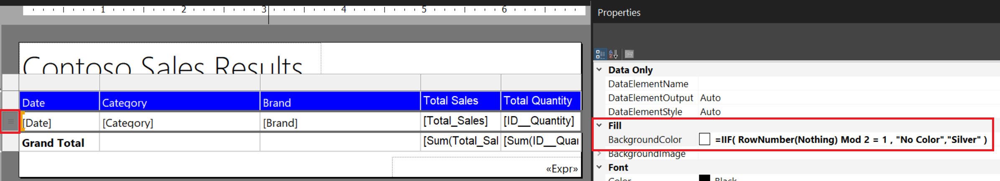

21. Remove any excess spacing between the header, body and footer of the report page.
1. Navigate to the ribbon, select the **Home** tab and the **Run (F5)** button.

[Learn More](https://docs.microsoft.com/en-us/sql/reporting-services/report-design/tables-report-builder-and-ssrs?view=sql-server-ver15)

___

# Parameters and Expressions

### Objective - Add a parameter and a custom expression.

1. Within the **Report Data** pane, right click the **Sales** dataset and select **Query**.
1. Within the **Query Designer** window set the following properties:

    | Dimension | Hierarchy | Operator | Filter Expression | Parameters |
    | ---: | ---: | ---: | ---: |---: |
    | Product  | Brand | Equal | Contoso | ✅ |

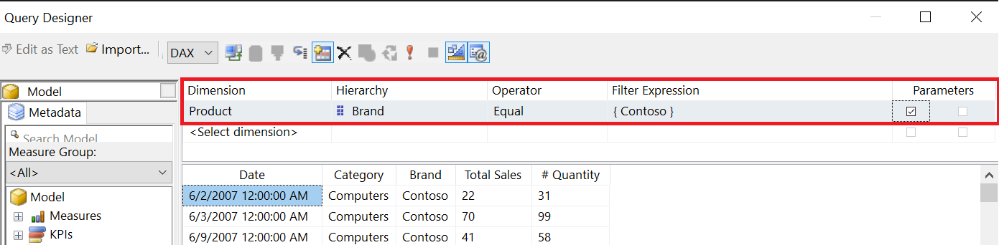

3. Within the **Report Data** pane, expand the **Parameters** folder, right click the **ProductBrand** parameter and select **Parameter Properties**.
1. Within the **Report Parameter Properties** window update the following configurations and press **OK** when complete:
    1. **General** group, deselect **Allow blank values("")** and **Allow multiple values**.
    1. **Default Values** group, select **No default value**.
1. Navigate to the ribbon, select the **Home** tab and the **Run (F5)** button.
1. From the **Brand** parameter, select **Adventure Works** and press **View Report**.
1. Select the **Design (F8)** button to return to design view.
1. Right click the text box within the **header** and select **Expression..**
1. Within the **Expression** window complete the following and press **OK** when complete:
    1. Remove the current text within the **Value** field.
    1. Within the **Category:** listing to the **Parameters** group and double click to select the **ProductBrand** from **Values:** field.
1. Update the expression value to match the below text:
    ```
    =Parameters!ProductBrand.Value & " Sales Results"
    ```

1. Update the current text box width to extend to the current page size.
1. Navigate to the ribbon, select the **Home** tab and the **Run (F5)** button.
1. From the **Brand** parameter, select any brand and press **View Report**.

___

# Groups and Sparklines

### Objective - Using the table wizard create a grouped table and add Sparklines

1. Within the **Report Data** pane, right click the **Datasets** option and select **Add Dataset...**
2. In the **Dataset Properties** window and the **Query** group update or select the following:
    1. Update the **Name:** property to **Manufacturers**.
    1. Within the **Data source:** option select Power BI dataset connection from your Data Sources list.
    1. Press the **Fx** icon, insert the below DAX query and press **OK** in the **Expression** window.

    ```
    EVALUATE
    SUMMARIZECOLUMNS (
        'Date'[Calendar Year],
        'Date'[Month],
        'Date'[Month Number],
        'Product'[Manufacturer],
        "Total Sales", [Total Sales]
    )
    ```
3. Press **Refresh Fields** and then navigate to the **Fields** group.

    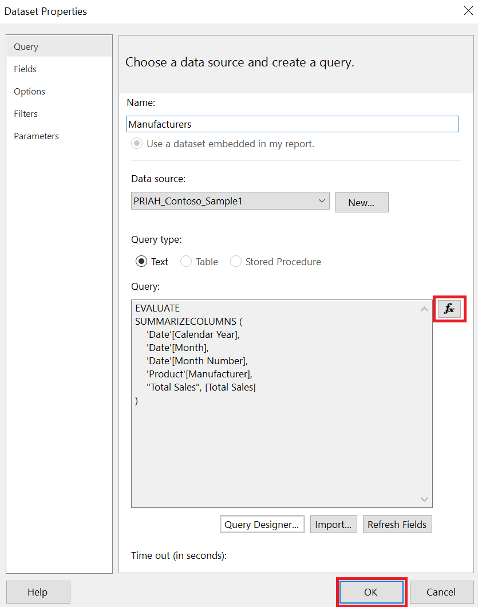    

4. Update the **Field Name** results as shown in the table below and then press **OK** to exit.
    
    | Field Name | Field Source |
    | :-- | :-- |
    | Calendar_Year | Date[Calendar Year] |
    | Month | Date[Calendar Year Month Number] |
    | Month_Number | Date[Month Number] |
    | Manufacturer | Product[Manufacturer] |
    | Total_Sales | [Total Sales] |

5. Navigate to the **Insert** tab and expand the **Matrix** option to select the **Matrix Wizard**.
1. From the **New Table or Matrix** window complete the following steps:
    1. select the **Manufacturers** dataset and then press **Next >**.
    1. Arrange the fields in the following groups or values.

| Field | Area |
| :-- | :-- |
| Calendar_Year | Row groups |
| Manufacturer | Row groups |
| Column groups | Month |
| Values | Total_Sales |

7. From the **Values** group select the chevron next to **Total_Sales**, set to **Sum** and then press **Next >**
    1. Leave the default **Layout** with subtotal below, press **Next >**
    1. Press **Finish >>**
8. Holding ctrl select all the [Sum(Total_Sales)] values in the matrix and set the formatting to **Currency** within the **Number** group on the **Home** tab.
1. Navigate to the ribbon, select the **Home** tab and the **Run (F5)** button.
1. Select the **Design (F8)** button to return to design view.
1. Bold the text and values in the **Manufacturer** total row.
1. From the **Column Groups** right click the **Month** group and select **Group Properties...**
1. Within the **Group Properties** window navigate to **Sorting**, select **Add** and change the sort to **[Month_Number]** and then press **OK**.

    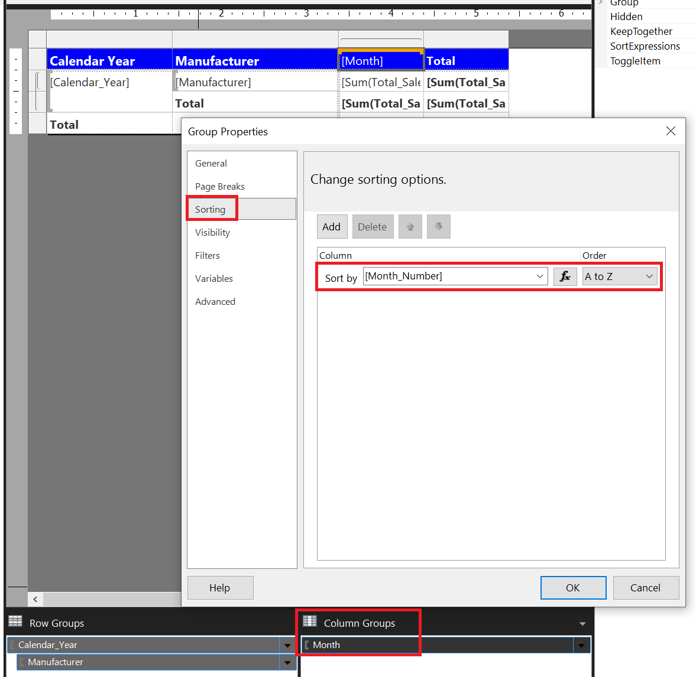

14. Navigate to the ribbon, select the **Home** tab and the **Run (F5)** button.
1. Select the **Design (F8)** button to return to design view.
1. Right click the **Month** column in the Matrix and select **Outside Group - Right** to add a new chart and within the headers add the title **Trend**.
1. Navigate to the **Insert** tab, select **Sparkline** and within the **Select Sparkline Type** select the **Smooth Line With Markers** option and then press **OK**.
1. Click anywhere on the report to add the Sparkline and then select the object to get the **Chart Data** menu and complete the following.
    1. Within **Category Groups** add the **Month_Number** column.
    1. Within **Values** add the **Total_Sales** measure, select the chevron to the right and change the **Aggregate** to **Sum**

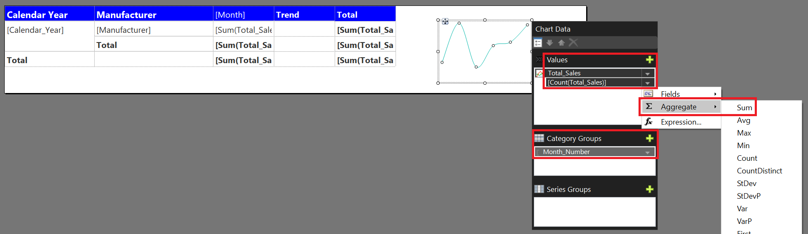

19. Select the **Sparkline** object, copy (Ctrl+C) and paste into the Matrix within the first two empty cells of the **Trend** column.
    1. Delete the original Sparkline chart when complete.
1. Right click the second Sparkline within the Matrix, choose **Chart Properties** and complete the following within the window:
    1. Navigate to the **Visibility** group and enable the **Display can be toggled by this report item:**
    1. Choose the value **Calendar_Year**
    1. Press **OK** when complete.
1. Navigate to the ribbon, select the **Home** tab and the **Run (F5)** button.
___

# Continue Your Journey

### Paginated Reports in a Day

The Power BI Paginated Reports in a Day video-based course empowers you as a report author with the technical knowledge required to create, publish, and distribute Power BI paginated reports. It comprises almost 4 hours 20 minutes of viewable content—available on demand, and is free of charge. 

Source: [Microsoft Docs](https://docs.microsoft.com/en-us/power-bi/learning-catalog/paginated-reports-online-course)

### Paginated Report Recipes

This e-book is a revision, in part, of the original SQL Server Reporting Services Recipes book with new content modernized to work with Power BI Paginated Reports. These recipes can be used or adapted to work with SQL Server Reporting Services, Power BI Report Server or the Power BI Service in Premium Capacity (or Premium per User licensing).

2021 (c) Paul Turley, with contributions from multiple authors

Source: [Paul Turley's SQL Server BI Blog](https://sqlserverbi.blog/paginated-report-recipes-2020-2021/)

### Twelve Days of Paginated Reports


https://www.youtube.com/watch?v=G9UNql1bTlk&list=PLclDw3xU_tI5bypr74FnLuLGTyuTfKpV1