# Power Query SDK for Visual Studio Code

Microsoft Power Query provides a powerful "Get data" experience that encompasses many features. A core capability of Power Query is to filter and combine, that is, to "mash-up" data from one or more of a rich collection of supported data sources. Any such data mashup is expressed using the Power Query Formula Language (informally known as "**M**").

The Power Query Formula Language is a powerful **query language** optimized for building queries that **mashup** data. It's a **functional**, **case sensitive** language.

For computer language theorists: Power Query is a mostly pure, higher-order, dynamically typed, partially lazy, functional language.

[Learn more about the Power Query formula language](https://docs.microsoft.com/powerquery-m/m-spec-introduction)


## Install the Power Query / M Language extension for VS Code

Release: **General Availability**

Available in the [Visual Studio Code Marketplace](https://marketplace.visualstudio.com/items?itemName=PowerQuery.vscode-powerquery), the Power Query SDK is a set of tools that allow you as the developer to create new connectors for Power Query experiences available in products such as Power BI Desktop for creating semantic models, Power BI service for Datamarts, Power BI Dataflows, Fabric Dataflows Gen2 and more.

The Power Query / M Language extension provides the following capabilities:

- **Fuzzy autocomplete**
    - Suggests keywords, local variables, and the standard Power Query library.
- **Hover**
    - Displays function documentation if it exists, and validates the types for function arguments.
- **Functional hints**
    - Displays function documentation if it exists, and validates the types for function arguments.
- **Code formatting**
    - Provides a formatter for the "Format Document" (Ctrl + Shift + F) command.
- **Test Framework**
    - A ready-to-go test harness with prebuilt tests to standardize the testing of new and existing extension connectors. It has the ability to perform functional, compliance, and regression testing-at-scale. It helps address the need for a comprehensive test framework to satisfy the needs of extension connectors. 
    
        [Learn more about the Power Query SDK test framework](https://learn.microsoft.com/power-query/sdk-testframework/test-framework)

    


## Hello, World

This Hello, World tutorial guides you through creating and testing a Power Query extension project using the Power Query SDK. It covers setting up the project, defining functions, handling authentication, and evaluating queries to ensure your connector works as expected.

1. To create and test a Power Query extension project, start by expanding the **POWER QUERY SDK** group in the Explorer and selecting **Create an extension project**.

    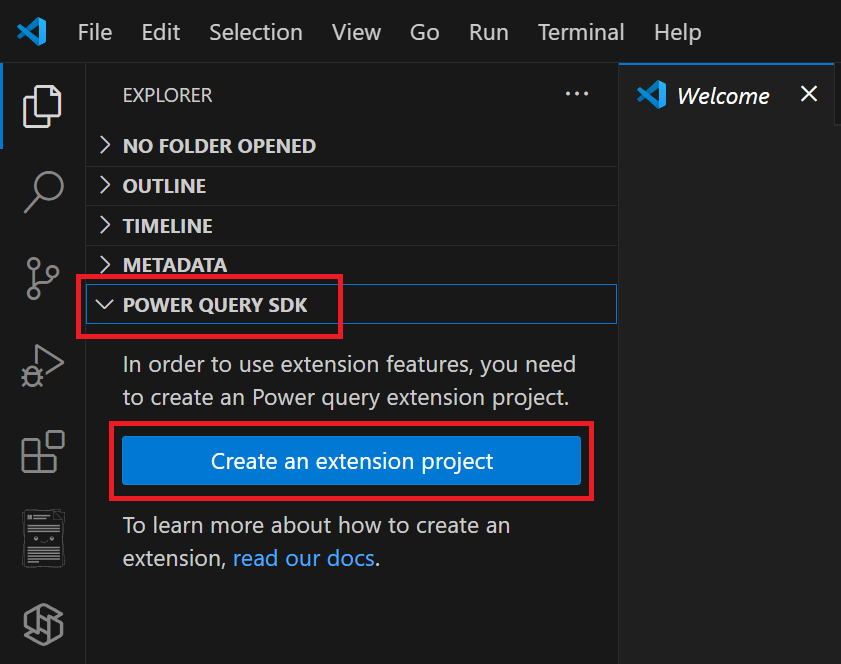

1. Set the project name to **HelloWorld** and press enter to confirm.

    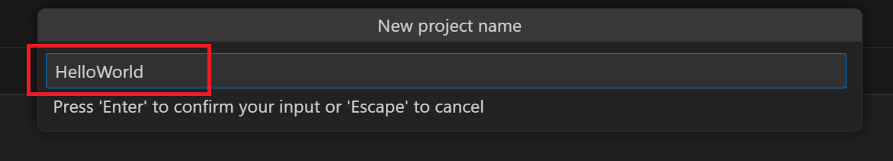

1. Next, in Windows Explorer, choose a folder for deploying the connector; for this tutorial, a location like C:\temp\ is recommended for easy access.

1. Once the project is created, review its contents in the Explorer, focusing on the **HelloWorld.pq** file, which contains the definitions and logic for the connector. The **HelloWorld.Contents** function is defined here, accepting an optional text input and returning a string. The current authentication is set to **Anonymous**, meaning no keys or credentials are required to connect.

    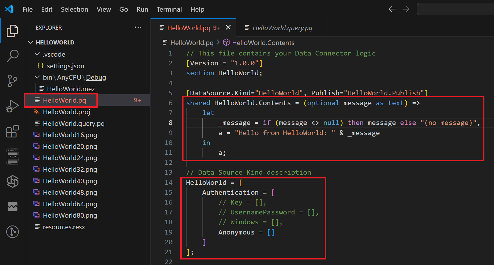

1. To create and evaluate tests, select the **HelloWorld.query.pq** file in the Explorer. Right-click within the file and select **Evaluate current project query file**. If a PQTest window appears indicating an error that credentials are required to connect to the HelloWorld source, you will need to set the credentials despite the project being anonymous.

    

1. The PQTest window appears indicating an error that credentials are required to connect to the HelloWorld source (**Credentials are required to connect to the HelloWorld source. (Source at HelloWorld.)**), you will need to set the credentials despite the project being anonymous.

    To resolve the error, navigate to the **POWER QUERY SDK** section in the Explorer and select **Set credentials**.

    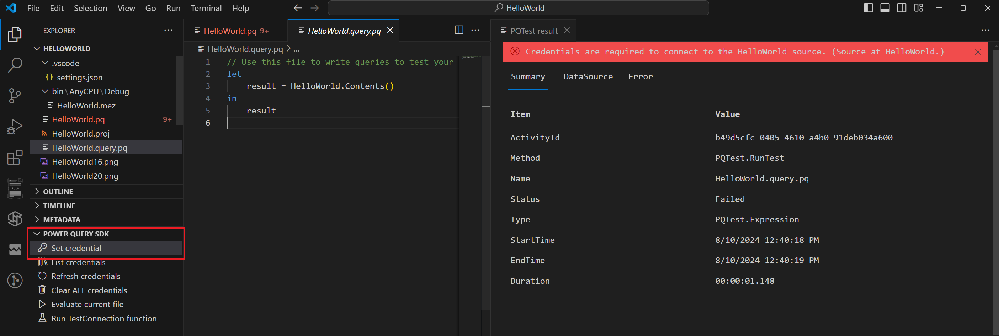

1. Choose the **HelloWorld** project from the data source options.

    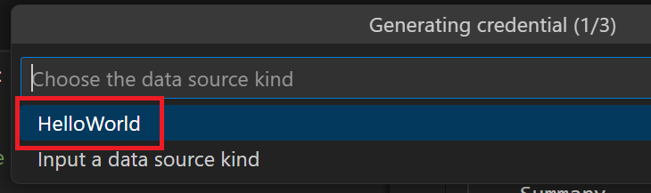

1. Choose the **HelloWorld.query.pq** test file from the query/test file options.

    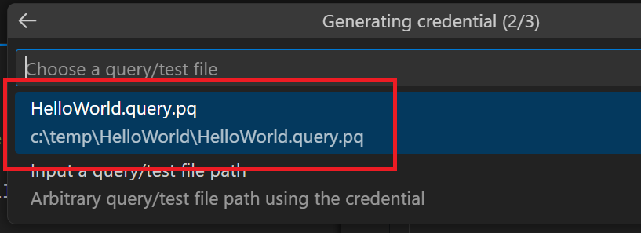

1. Select the **Anonymous** authentication method.

    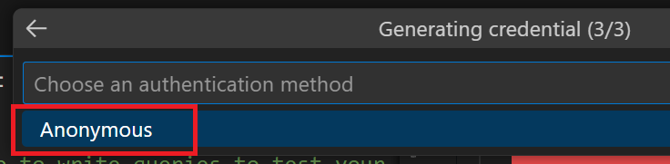

1. Within the **OUTPUT** a new credential has been successfully created for **HelloWorld**.

    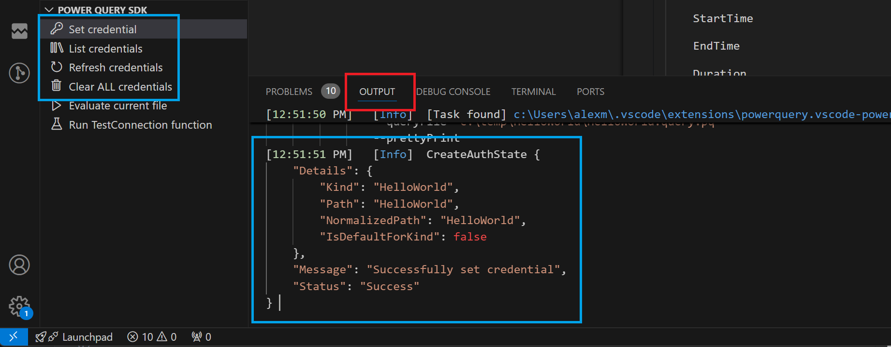

    **Note:**  The **POWER QUERY SDK** options allow you to set, list, refresh, and clear credentials, which is crucial for testing various authentication methods or switching between development, testing, and production credentials to ensure valid results.

1. After setting the credentials, right-click within the **HelloWorld.query.pq** file again and select **Evaluate current project query file**.

    

1. The PQTest window will now execute the mashup definition of the connector, returning a text value based on the provided logic.

    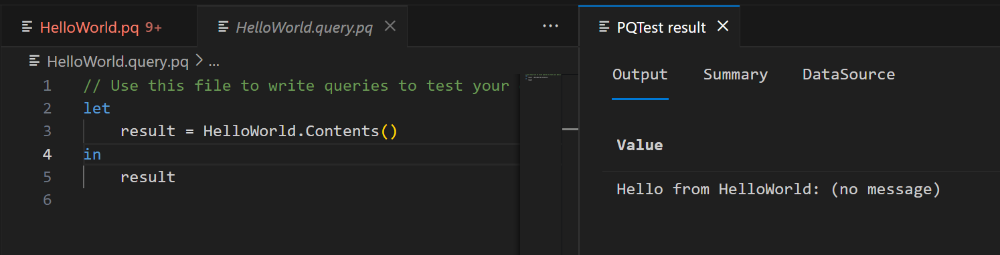

1. Update and test the function, by modifying the **HelloWorld.Contents** function to include a text value, save the file (Ctrl+S), and right-click within the **HelloWorld.query.pq** file again to select **Evaluate current project query file**. The PQTest window will display the results, including the concatenated string based on the updated function definition.

    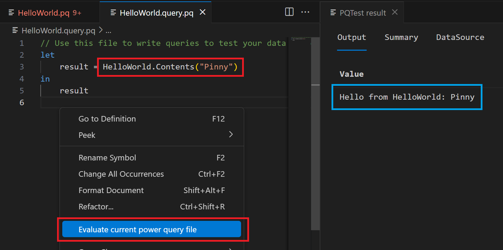

## Building a connector file (.mez)

1. Create a new Power Query extension project by expanding the **POWER QUERY SDK** group in the Explorer and selecting **Create an extension project**.

    **Note:** If you are still in a previous project, select File > New Window (Ctrl+Shift+N) to open a new, empty project window.

    

1. Set the project name to **Northwind** and press enter to confirm.

    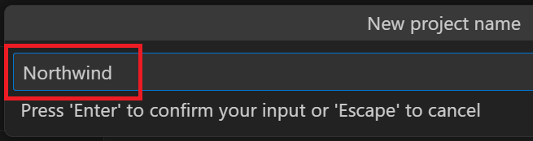

1. Next, in Windows Explorer, choose a folder for deploying the connector; for this tutorial, a location like C:\temp\ is recommended for easy access.

1. Once the project is created, select the **Northwind.pq** file, which contains the definitions and logic for the connector. Overwrite the **Northwind.Contents** function with the Power Query M query provided below, removing the argument values and hardcoding the Northwind OData feed address. Leave the current authentication type as **Anonymous** within the project.

    ```powerquery-m
    shared Northwind.Contents = () =>
        let
            Source = OData.Feed("https://services.odata.org/V4/Northwind/Northwind.svc/")
        in
            Source;
    ```

    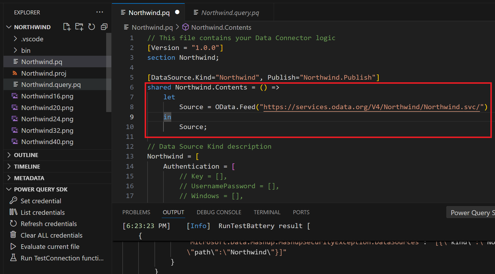

1. Navigate to the **POWER QUERY SDK** section in the Explorer and select **Set credentials**.

    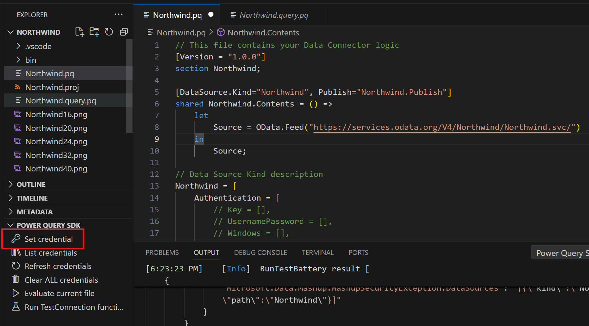

1. Choose the **HelloWorld** project from the data source options.

    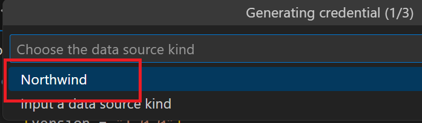

1. Choose the **Northwind.query.pq** test file from the query/test file options.

    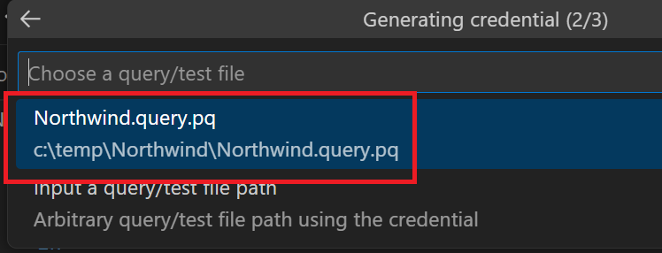

1. Select the **Anonymous** authentication method.

    

1. After setting the credentials, right-click within the **HelloWorld.query.pq** file again and select **Evaluate current project query file**.

    The PQTest window will now execute the mashup definition of the connector, and a representation of the data from the Northwind OData feed.

    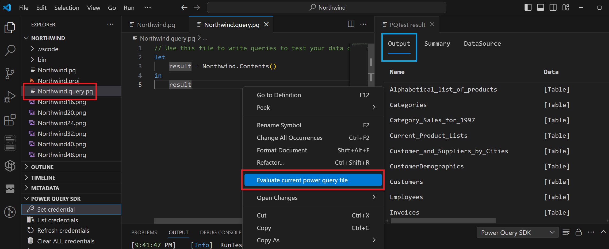

1. To build the project, select **Terminal** and then **Run Build Task…** (Ctrl+Shift+B) to convert the project’s definition into a .mez file extension that can be tested within Power BI Desktop. 

    From the Explorer, you can expand the bin section to locate the .mez file stored on your local machine.

    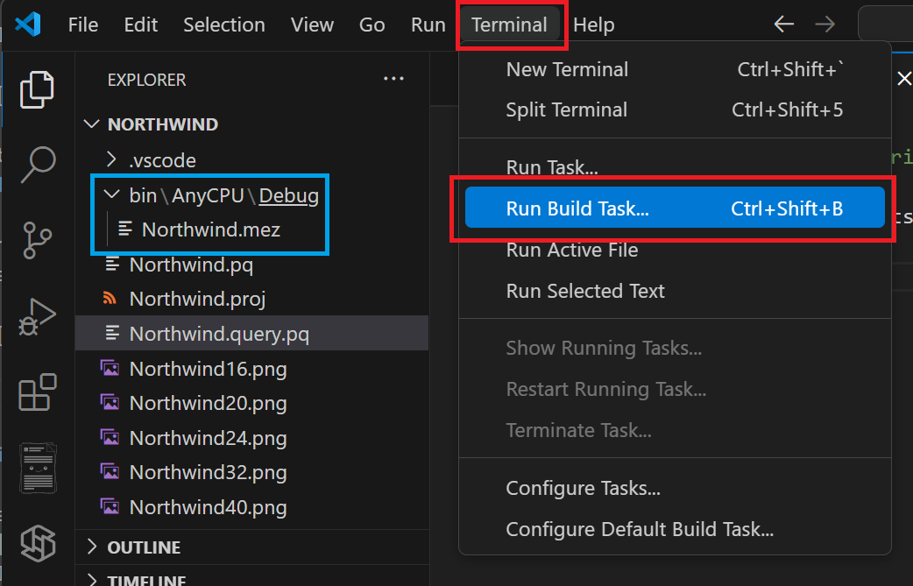

1. In Windows Explorer, open the folder location ``C:\temp\Northwind\bin\AnyCPU\Debug`` and copy the Northwind.mez file into the Power BI custom connectors folder ( ``C:\Users\(username)\Documents\Power BI Desktop\Custom Connectors`` )

    For complete instructions on enabling custom connectors, please visit [Power BI Desktop connector extensibility](https://learn.microsoft.com/power-bi/connect-data/desktop-connector-extensibility#custom-connectors).

1. Open Power BI Desktop and from a new blank report select Get data > More...

    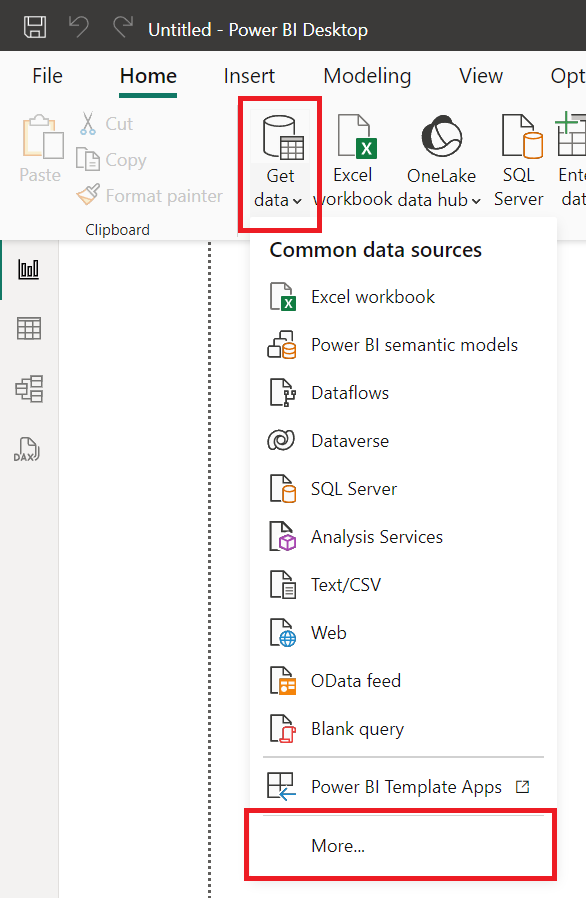

1. Within the Get data window, search for and select the Northwind connector, and then **Connect**.

    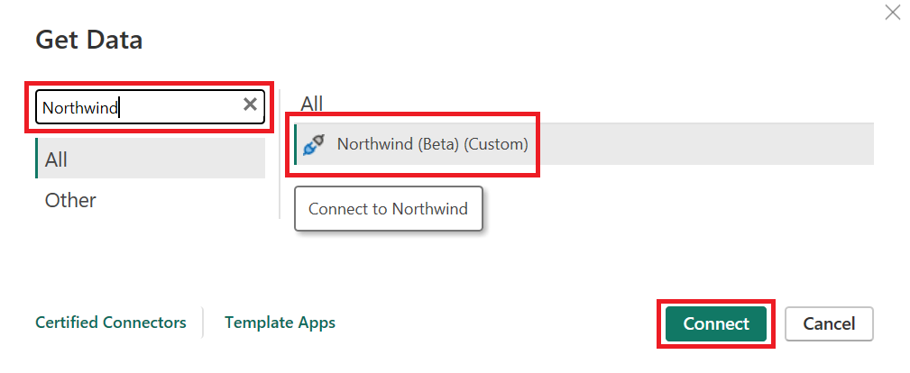

1. A warning window will be displayed for the custom connector, select **Continue**.

    **Note:** The option **Don't warn me again for this connector** exists, if you want to ignore this window in the future.

    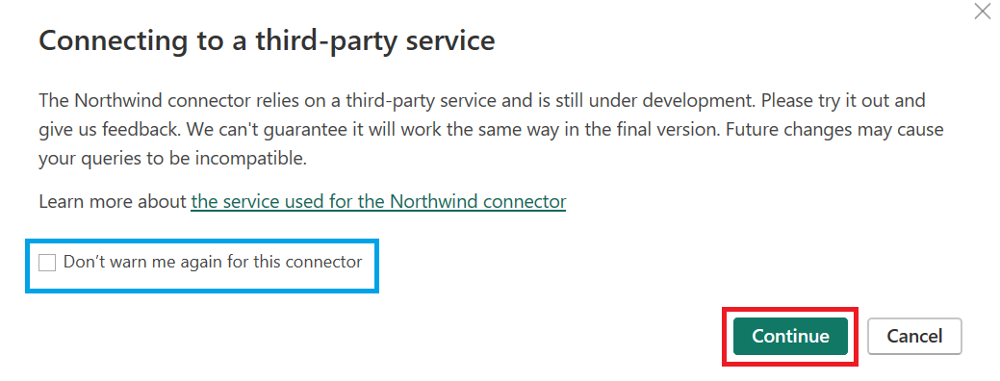

1. An authentication window will not be presented, because we only defined anonymous authentication as a supported option within the connector, we can select **Connect**.

    

1. The navigator will now appear, allowing you to navigate objects within the OData, make selections and also connect to and trasnform the underlying data.

    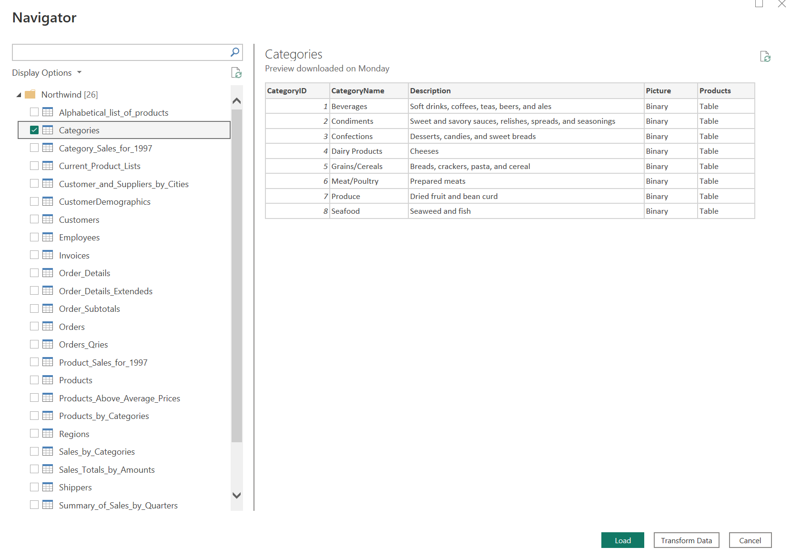


## Creating an OpenWeather Custom Connector

In this tutorial, we’ll walk through the steps to set up an OpenWeather connector in Power BI. The connector allows you to retrieve data from the OpenWeather API.

Before we begin, make sure you [sign up](https://home.openweathermap.org/users/sign_up) for a free developer account on [OpenWeather](https://openweathermap.org/price#current) to obtain an API key. This key will be used for authentication when connecting to the API. Once an account has been created select the **API Keys** section within the account portal and then select the **Generate** button to create an API key.

1. Create a new Power Query extension project by expanding the **POWER QUERY SDK** group in the Explorer and selecting **Create an extension project**.

    **Note:** If you are still in a previous project, select File > New Window (Ctrl+Shift+N) to open a new, empty project window.

    

1. Set the project name to **OpenWeather** and press enter to confirm.

    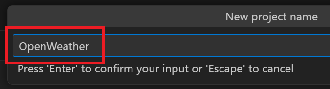

1. Next, in Windows Explorer, choose a folder for deploying the connector; for this tutorial, a location like C:\temp\ is recommended for easy access.

1. Locate the **OpenWeather.pq** file within your project. This file contains the definitions and logic for the connector. Overwrite the current authentication type with **Key**.

    ```powerquery-m
    // Data Source Kind description
    OpenWeather = [
        Authentication = [
            Key = [
                // Label for UI window
                KeyLabel = "Api Key"
            ]
            // UsernamePassword = [],
            // Windows = [],
            // Anonymous = []
        ]
    ];
    ```

    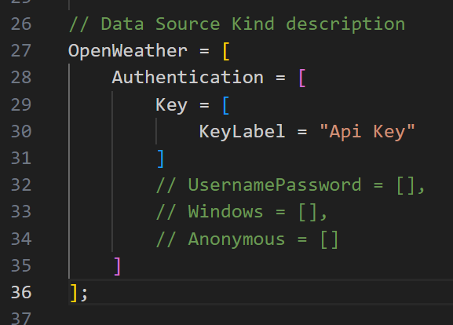

1. Within the same file, locate the **OpenWeather.Contents** function and replace its existing content with the following Power Query M query. This query creates a function that utilizes the Web.Contents data access function to create a GET request to the OpenWeather API - including the arguments for latitude, longitude and the endpoint path.

    ```powerquery-m
    shared OpenWeather.Contents = (latitude as number, longitude as number, path as text) =>
        let
            url = "https://api.openweathermap.org/data/2.5",
            // Obtains the Key value from the current credentials
            apiKey = Extension.CurrentCredential()[Key],
            request = Web.Contents(
                url,
                [
                    RelativePath = path,
                    ManualCredentials = true,
                    Query = [
                        lat = Text.From(latitude),
                        lon = Text.From(longitude),
                        appId = apiKey
                    ]
                ]
            ),
            jsonResponse = Json.Document(request)
        in
            jsonResponse;
    ```

    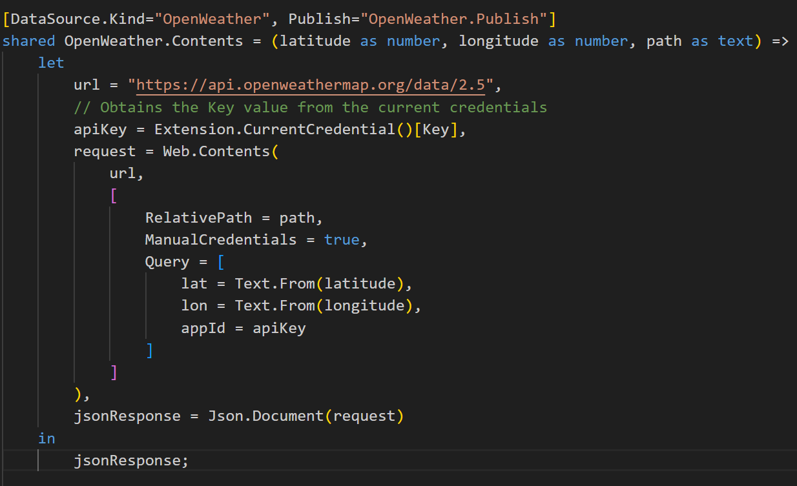

1. Build the project, select **Terminal** and then **Run Build Task…** (Ctrl+Shift+B) to convert the project’s definition into a .mez file extension that can be tested with the updated authentication method.

    From the Explorer, you can expand the bin section to locate the .mez file stored on your local machine.

    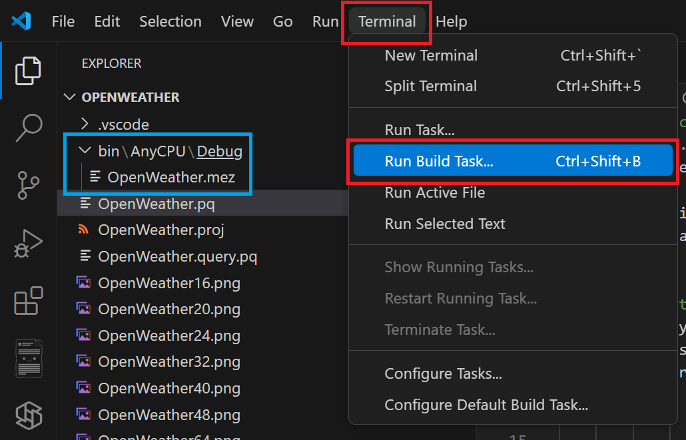

1. In Windows Explorer, open the folder location ``C:\temp\OpenWeather\bin\AnyCPU\Debug`` and copy the OpenWeather.mez file into the Power BI custom connectors folder ( ``C:\Users\(username)\Documents\Power BI Desktop\Custom Connectors`` )

    For complete instructions on enabling custom connectors, please visit [Power BI Desktop connector extensibility](https://learn.microsoft.com/power-bi/connect-data/desktop-connector-extensibility#custom-connectors).

1. Open Power BI Desktop and from a new blank report select Get data > More...

    

1. Within the Get data window, search for and select the OpenWeather connector, and then **Connect**.

    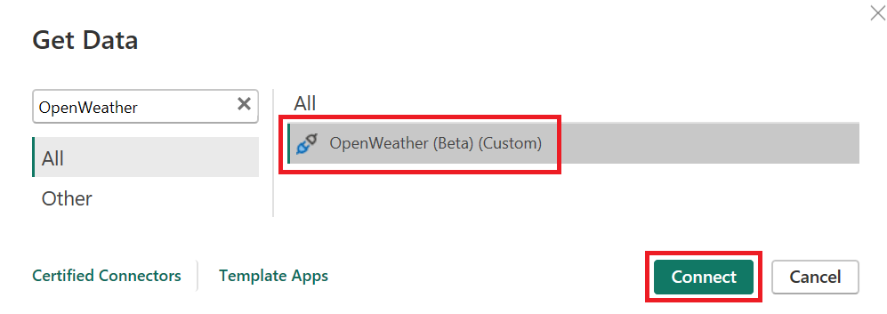

1. A warning window will be displayed for the custom connector, select **Continue**.

    **Note:** The option **Don't warn me again for this connector** exists, if you want to ignore this window in the future.

    

1. The OpenWeather.Contents window will display the arguments defined in your connector (latitude, longitude, and endpoint path). You can adjust the latitude and longitude values according to your desired location and then specify the path for [current weather data](https://openweathermap.org/current) by entering "**weather**" in the appropriate field and then selecting **OK**.

    | Latitude | Longitude | Path |
    | :--- | :--- | :--- |
    | 38.627003 | -90.199402 | weather |

    

1. An authentication window will appear, provide the API key from your OpenWeather developer account within the input field. Select **Connect** to continue.

    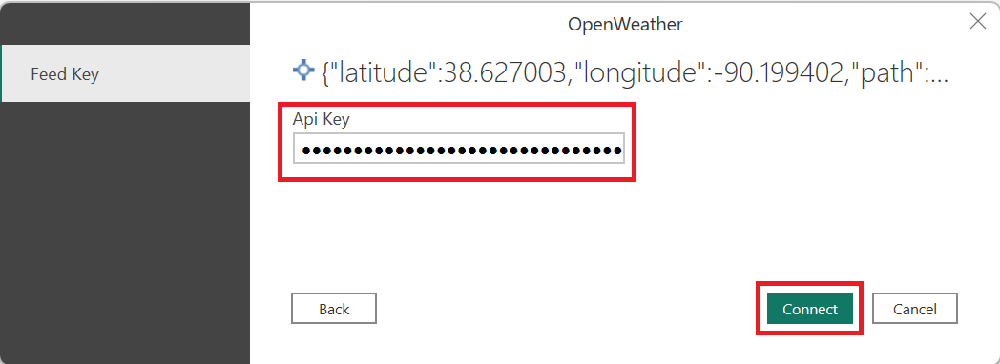

1. The Power Query Editor will open, executing the extension definition. Currently, the response is defined as a JSON record from the OpenWeather API for current weather data.

    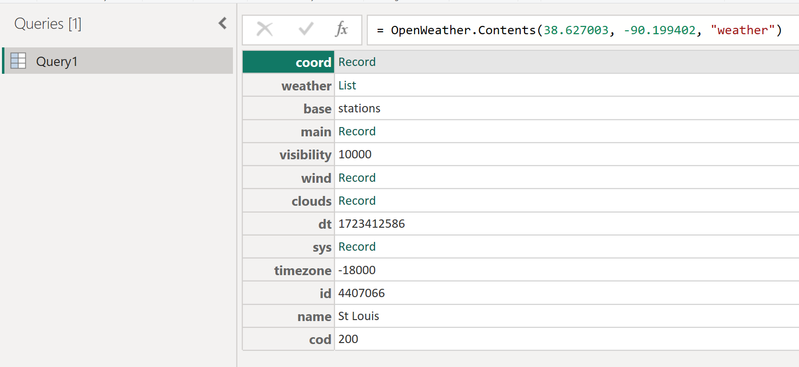

And that’s it! You’ve successfully set up an OpenWeather connector for use in Power Query!

## Creating a Navigation Table for the OpenWeather Custom Connector

After reviewing the OpenWeather APIs, you’ve noticed a consistent pattern among the available data endpoints: they all require similar API inputs, with the only variation being the endpoint path. To streamline your solution and avoid creating separate connectors for each option, you aim to provide end users with a seamless experience through a navigation table. Your goal is to maximize code reuse while ensuring efficient access to different data endpoints.

| Title | API Doc | Path |
| :-- | :-- | :-- |
| Current weather data | [link](https://openweathermap.org/current) | weather |
| 5 day weather forecast | [link](https://openweathermap.org/forecast5) | forecast |
| Air Pollution | [link](https://openweathermap.org/api/air-pollution) | air_pollution |

1. To begin, add the [Table.ToNavigationTable](https://learn.microsoft.com/power-query/helper-functions#tabletonavigationtable) function to the **OpenWeather.pq** project files definition by copying the Power Query M query below anywhere into the project. This function will assist with the creation of a Navigation Table in the project.

    ```powerquery-m
    Table.ToNavigationTable = (
        table as table,
        keyColumns as list,
        nameColumn as text,
        dataColumn as text,
        itemKindColumn as text,
        itemNameColumn as text,
        isLeafColumn as text
    ) as table =>
        let
            tableType = Value.Type(table),
            newTableType = Type.AddTableKey(tableType, keyColumns, true) meta 
            [
                NavigationTable.NameColumn = nameColumn, 
                NavigationTable.DataColumn = dataColumn,
                NavigationTable.ItemKindColumn = itemKindColumn, 
                Preview.DelayColumn = itemNameColumn, 
                NavigationTable.IsLeafColumn = isLeafColumn
            ],
            navigationTable = Value.ReplaceType(table, newTableType)
        in
            navigationTable;
    ```

    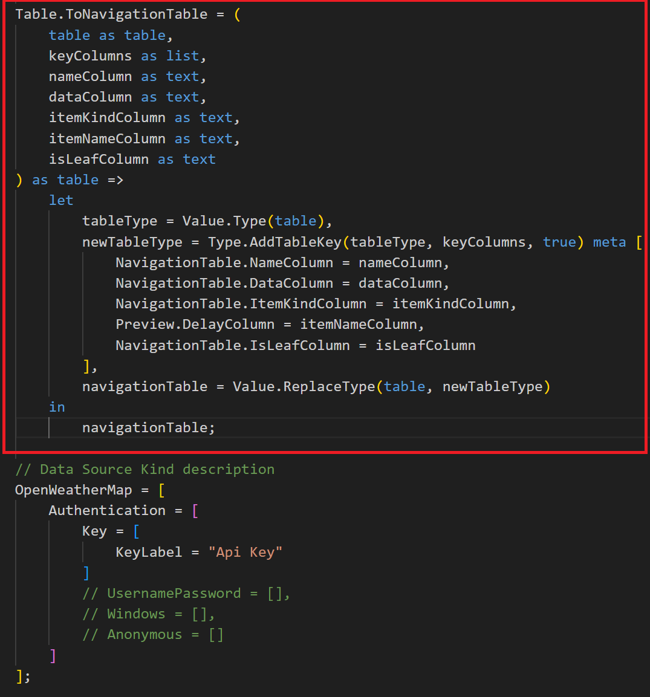

1. Next, update the project definitions to allow for greater reuse of the code and the building of a [flat navigation table](https://learn.microsoft.com/power-query/handling-navigation-tables#flat-navigation-table).
    - The **OpenWeather.Contents** function will be updated to reference the **OpenWeatherNavTable**, which will remain as a globally accessible function accessible to end user within the Power Query editor through the continued use of shared.
    - The **OpenWeatherNavTable** will now be a local function that accepts the latitude and longitude inputs, but will hardcode the various endpoint paths.
    - The **getOpenWeatherAPI** function will now be a local function that continues to accept the latitude, longitude, and path values to construct the generic API call, including accepting the key authentication.

    ```powerquery-m
    shared OpenWeather.Contents = Value.ReplaceType(
        OpenWeatherNavTable, type function (latitude as number, longitude as number) as any
    );
    
    OpenWeatherNavTable = (latitude as number, longitude as number) as table =>
        let
            source = #table(
                {"Name", "Data", "ItemKind", "ItemName", "IsLeaf"},
                {
                    {"Air Pollution", getOpenWeatherAPI(latitude, longitude, "air_pollution"), "Record", "Record", true},
                    {"Current Weather", getOpenWeatherAPI(latitude, longitude, "weather"),"Record", "Record", true},
                    {"Forecast", getOpenWeatherAPI(latitude, longitude, "forecast"), "Record", "Record", true}
                }
            ),
            navTable = Table.ToNavigationTable(source, {"Name"}, "Name", "Data", "ItemKind", "ItemName", "IsLeaf")
        in
            navTable;
    
    getOpenWeatherAPI = (latitude as number, longitude as number, path as text) =>
        let
            url = "https://api.openweathermap.org/data/2.5",
            apiKey = Extension.CurrentCredential()[Key],
            request = Web.Contents(
                url,
                [
                    RelativePath = path,
                    ManualCredentials = true,
                    Query = [
                        lat = Text.From(latitude),
                        lon = Text.From(longitude),
                        appId = apiKey
                    ]
                ]
            ),
            jsonResponse = Json.Document(request)
        in
            jsonResponse;
    ```

    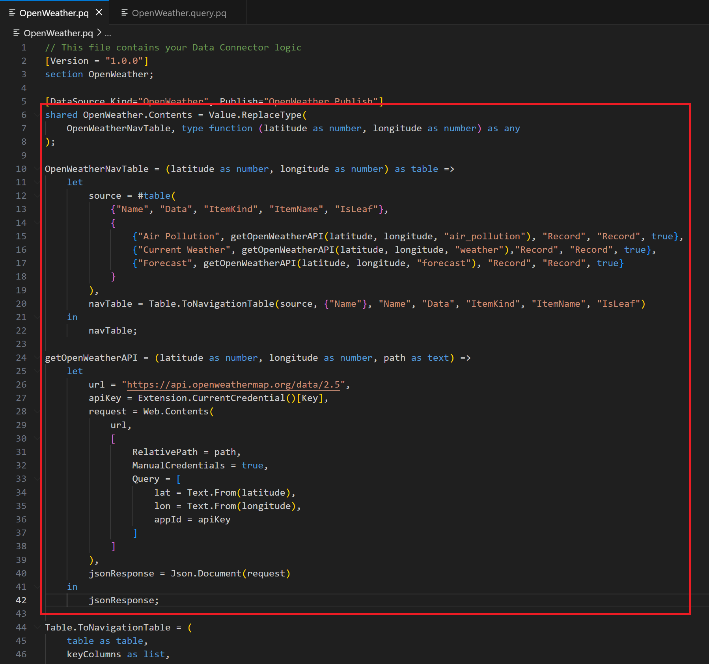

1. Build the project, select **Terminal** and then **Run Build Task…** (Ctrl+Shift+B) to convert the project’s definition into a .mez file extension that can be tested with the updated authentication method.

    From the Explorer, you can expand the bin section to locate the .mez file stored on your local machine.

    

1. In Windows Explorer, open the folder location ``C:\temp\OpenWeather\bin\AnyCPU\Debug`` and copy the OpenWeather.mez file into the Power BI custom connectors folder ( ``C:\Users\(username)\Documents\Power BI Desktop\Custom Connectors`` )

    For complete instructions on enabling custom connectors, please visit [Power BI Desktop connector extensibility](https://learn.microsoft.com/power-bi/connect-data/desktop-connector-extensibility#custom-connectors).

1. Open Power BI Desktop and from a new blank report select Get data > More...

    

1. Within the Get data window, search for and select the OpenWeather connector, and then **Connect**.

    

1. A warning window will be displayed for the custom connector, select **Continue**.

    **Note:** The option **Don't warn me again for this connector** exists, if you want to ignore this window in the future.

    

1. The OpenWeather.Contents window will display the arguments defined in your connector (latitude, longitude). You can adjust the latitude and longitude values according to your desired location and then select **OK**.

    | Latitude | Longitude |
    | :--- | :--- |
    | 38.627003 | -90.199402 |

    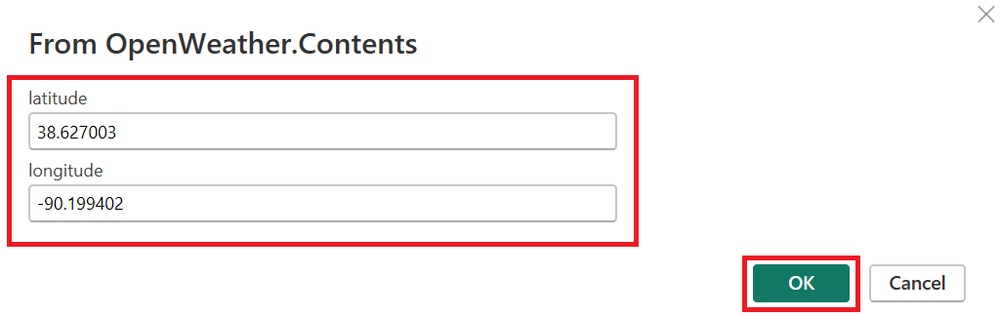

1. An authentication window will appear, provide the API key from your OpenWeather developer account within the input field. Select **Connect** to continue.

    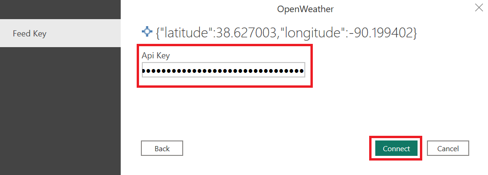

1. The Navigator window will now display the three previously defined options: Air Pollution, Current Weather, and Forecast. You can select any of these options to preview the current record data types returned.

    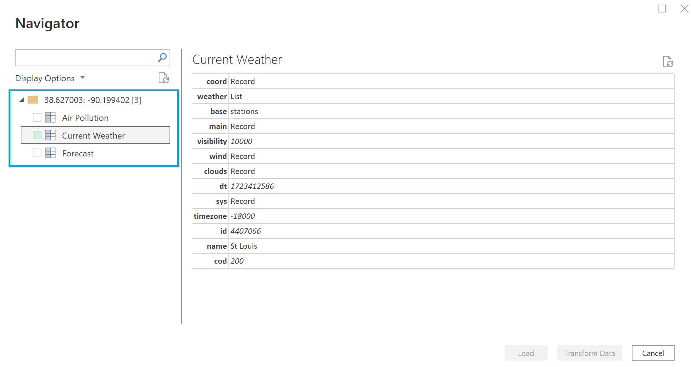

In this section, we enhanced the OpenWeather.pq project by adding the [Table.ToNavigationTable](https://learn.microsoft.com/power-query/helper-functions#tabletonavigationtable) function to facilitate the creation of a Navigation Table. We then updated the project definitions to improve code reusability by constructing a generic API call and building a navigation table for each item in our project.

By modularizing functions and making them reusable, you can easily update and extend your project without duplicating code. This approach reduces the likelihood of errors and makes the codebase more manageable.

Offering a simple navigator to end users through a UI interface within Power Query is equally important. It provides a user-friendly way for users to interact with the data, allowing them to easily select and preview thier data. This improves the overall user experience and makes the data more accessible to a broader audience.

## Shaping the data for the OpenWeather Custom Connector

In conclusion, the enhancements made to the **OpenWeather.pq** project through this tutorial go beyond merely connecting to new data sources. We can also define the transformation logic within the connector to significantly reduce the pre-preparation steps required for our end users. This ensures that data is brought into their projects in a tabular format right from the start.

Additionally, the ability to add, remove, or transform the data within the connector further streamlines the data preparation process, making it more efficient and user-friendly. These improvements not only enhance the overall user experience but also empower users to focus on analyzing and utilizing the data rather than spending time on tedious data preparation activities.

1. To begin, we'll add a new function to the **OpenWeather.pq** project, this function uses several of the common functions available within the power query library, like [Record.ToTable](https://learn.microsoft.com/powerquery-m/record-totable), [Table.Transpose](https://learn.microsoft.com/powerquery-m/table-transpose), and [Table.PromoteHeaders](https://learn.microsoft.com/powerquery-m/table-promoteheaders) to help shape our data.

    ```powerquery-m
    shapeRecord = (jsonResponse as record) =>
    let
        #"Converted to Table" = Record.ToTable(jsonResponse),
        #"Transposed Table" = Table.Transpose(#"Converted to Table"),
        #"Promoted Headers" = Table.PromoteHeaders(#"Transposed Table", [PromoteAllScalars=true])
    in
        #"Promoted Headers";
    ```

    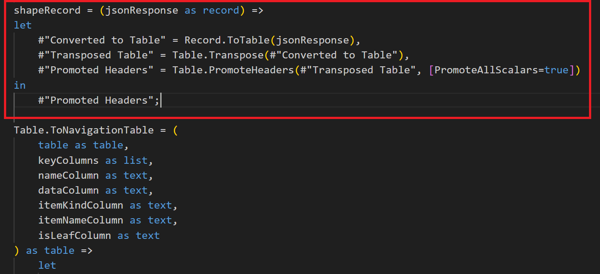

1. Next, we'll update the navigation table by wrapping the **shapeRecord** function around each of the three API endpoint path names. Also, change the **ItemKind** and **ItemName** values to table, so their icons will be properly displayed within the Navigator window.

    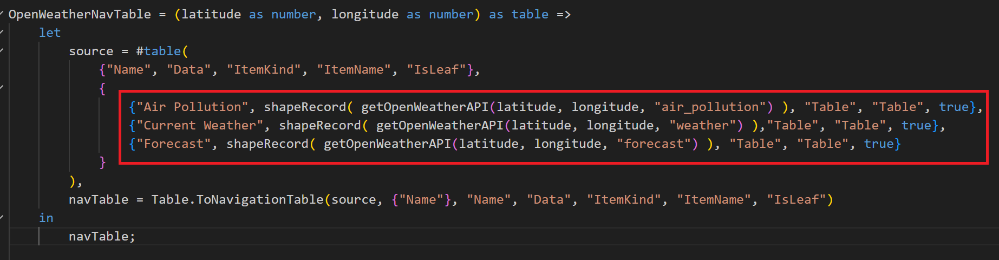

1. Build the project, select **Terminal** and then **Run Build Task…** (Ctrl+Shift+B) to convert the project’s definition into a .mez file extension that can be tested with the updated authentication method.

    From the Explorer, you can expand the bin section to locate the .mez file stored on your local machine.

    

1. In Windows Explorer, open the folder location ``C:\temp\OpenWeather\bin\AnyCPU\Debug`` and copy the OpenWeather.mez file into the Power BI custom connectors folder ( ``C:\Users\(username)\Documents\Power BI Desktop\Custom Connectors`` )

    For complete instructions on enabling custom connectors, please visit [Power BI Desktop connector extensibility](https://learn.microsoft.com/power-bi/connect-data/desktop-connector-extensibility#custom-connectors).

1. Open Power BI Desktop and from a new blank report select Get data > More...

    

1. Within the Get data window, search for and select the OpenWeather connector, and then **Connect**.

    

1. A warning window will be displayed for the custom connector, select **Continue**.

    **Note:** The option **Don't warn me again for this connector** exists, if you want to ignore this window in the future.

    

1. The OpenWeather.Contents window will display the arguments defined in your connector (latitude, longitude). You can adjust the latitude and longitude values according to your desired location and then select **OK**.

    | Latitude | Longitude |
    | :--- | :--- |
    | 38.627003 | -90.199402 |

    

1. An authentication window will appear, provide the API key from your OpenWeather developer account within the input field. Select **Connect** to continue.

    

1. The Navigator window will now display the three defined options: Air Pollution, Current Weather, and Forecast as table data types. You can select any of these options to preview the current columns returned.

    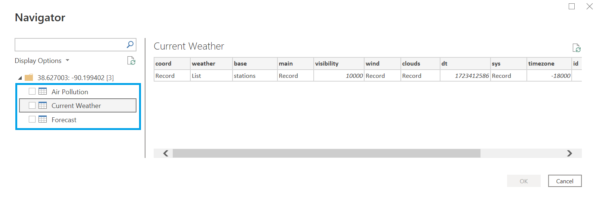

# Continue Your Journey

I hope this tutorial has provided you with insights and inspiration to continue exploring the creation of custom connectors. As you progress on your journey, feel free to leverage the official Microsoft Docs, Learn video content, and community resources. These tools and resources will support you in continuning to build even more robust and efficient connectors.

[Develop a connector using the Power Query SDK](https://learn.microsoft.com/power-query/install-sdk)

[Microsoft Power BI: Building connectors - BRK4003](https://www.youtube.com/watch?v=srQ-DLqhoxM&t=1228s)

[Hello Analyst: Power Query SDK intro](https://www.youtube.com/@hello-analyst/videos)