# Query Folding In An Hour

### About:

Query folding is the ability for a Power Query query to generate a single query statement to retrieve and transform source data. The Power Query mashup engine strives to achieve query folding whenever possible for reasons of efficiency.

Website: https://docs.microsoft.com/en-us/power-query/power-query-folding
___

# Table of Contents
- [Setup](#setup)
- [Connectivity Modes](#connectivity-modes)
- [Transformations That Can Achieve Query Folding](#transformations-that-can-achieve-query-folding)
    - [Query Optimizer](#query-optimizer)
    - [Recommended Practices](#recommended-practices)
- [Partial Query Folding](#partial-query-folding)
- [Advanced Techniques](#advanced-techniques)
- [Incremental Refresh](#incremental-refresh)
- [Continue Your Journey](#continue-your-journey)

___

# Setup

## Instructions

### SQL Server

Download and restore the Lightweight edition of - AdventureWorksLT*

Website: https://docs.microsoft.com/en-us/sql/samples/adventureworks-install-configure

___

# Connectivity Modes

#### Import:
- Data refresh will take place efficiently for Import model tables (Power Pivot or Power BI Desktop), in terms of resource utilization and refresh duration.

#### DirectQuery (and Dual storage mode - Power BI only):
- Each table must be based on a query that can be folded to the source system.

[Learn more about Connectivity Modes](https://docs.microsoft.com/en-us/power-bi/connect-data/service-dataset-modes-understand)

___

**Transformations that can achieve query folding**

Relational data source transformations that can be query folded are those that can be written as a single **SELECT** statement. A **SELECT** statement can be constructed with appropriate **WHERE**, **GROUP BY** and **JOIN** clauses. It can also contain column expressions (calculations) that use common built-in functions supported by SQL databases.

</br>


## Instructions

### Power BI Desktop
1. Navigate to the Home tab and select **SQL Server**.
2. Enter the local Server name or Azure SQL Database address in the **Server** field.

    a. **Optional:** You can also include the Database name
  
3. For the Data Connectivity mode leave the default **Import**.
4. Expand the **Advanced options*** to review some of the various settings and press **OK** to proceed:

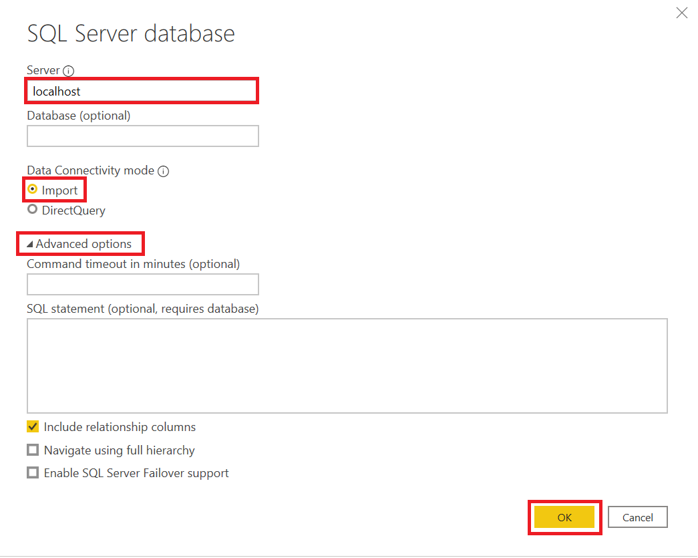

5. Within the **Navigator** window, if you have multiple databases locate the **AdventureWorksLT** and expand to review the views, tables and stored procedures that you currently maintain access to.

    - If you restored from a local .bak file there may be a year suffix attached.

6. Select the check mark next to **SalesLT.Customer** and **SalesLT.Address** and then press **Transform Data** to open the **Power Query Editor**.

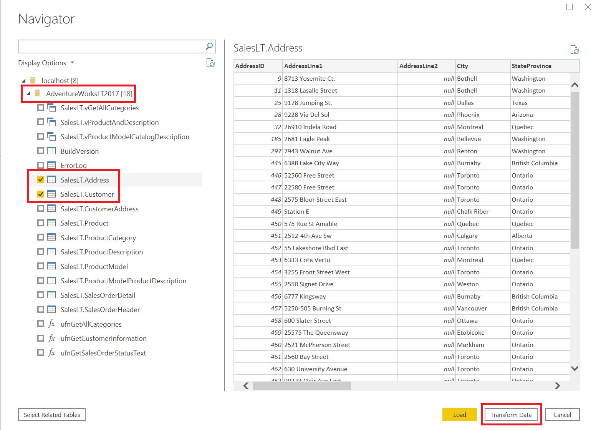

</br>

### Power Query Editor

7. Within the **SalesLT.Address** query, within the **Home** tab and press the **Choose Columns** button.
8. Deselect the following columns and then press **OK**
    - **rowguid**
    - **ModifiedDate**
    - **SalesLT.CustomerAddress**
    - **SalesLT.SalesOrderHeader(AddressID)**
    - **SalesLT.SalesOrderHeader(AddressID) 2**

9. Navigate to the **CountryRegion** field, alternate click any of the rows that contain the value **United States**, hover over **Text Filters** and then select **Equals**.

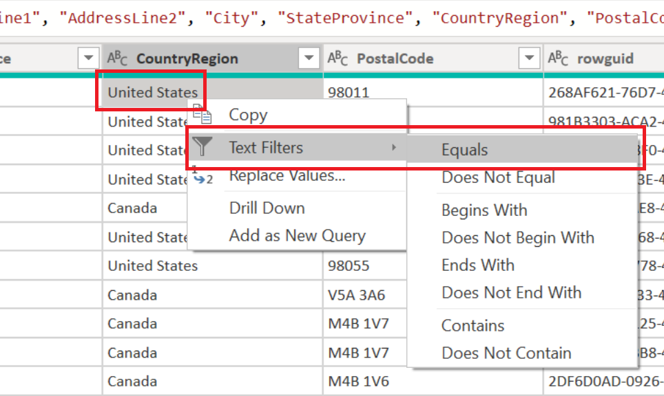

10. Within the **Query Settings** pane, navigate to the **APPLIED STEPS** section to complete the following actions:

    a. Alternate click the last recorded step **Filtered Rows** and select the option **View Native Query**
    
    - **Note:** Within Power Query Online's [dataflows](https://docs.microsoft.com/en-us/power-bi/transform-model/dataflows/dataflows-create) this is titled **View data source query**

    b. Review the generated **Native Query**:
    
    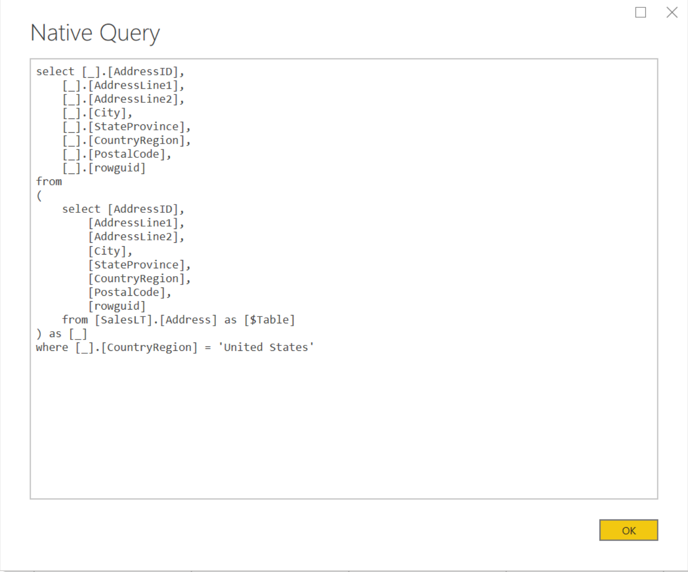
    
    c. Alternate click the last recorded step **Filtered Rows** and select the **Move before** option.
    
    d. Alternate click the last recorded step **Removed Other Columns** and select the option **View Native Query**
    
    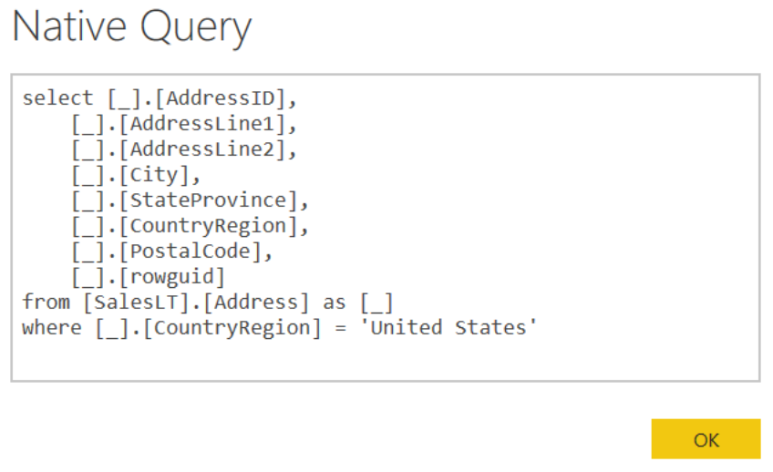

## Query Optimizer

Since SQL is a high-level declarative language, it only defines what data to get from the database, not the steps required to retrieve that data, or any of the algorithms for processing the request.

1. The first job of the query processor is to devise a plan, as quickly as possible, which describes the best possible way to execute said query (or, at the very least, an efficient way).

2. Its second job is to execute the query according to that plan.

Each of these tasks is delegated to a separate component within the query processor; the **Query Optimizer** devises the plan and then passes it along to the **Execution Engine**, which will actually get the results from the database.

[Learn more about Query Optimizer](https://www.red-gate.com/simple-talk/sql/sql-training/the-sql-server-query-optimizer/)

</br>

## Recommended Practices

Every source system and scenario is different with a bold **"it depends"** in terms of production ready guidance; but the following is a suggested framework when applying transformations within the Power Query Editor to structure efficient system generated SQL. The **Query Optimizer** may be more than robust enough for simple queries as demonstrated above but with more complex data transformations performance issues may arise when not carefully constructed.


**Applied Steps Order:**
1. Filters and Joins
2. Transformations
3. Column Selection
___

## Instructions

### Power Query Editor

1. Navigate to the **SalesLT.Customer** query and select the **ModifiedDate** column.
2. While the **ModifiedDate** column is the active selection, within the ribbon select the **Add Column** tab and complete the following operations:
    - Select the **Date** option, **Year** and then select **Year**
    - (Select **ModifiedDate** once again) Select the **Date** option, **Day** and then select **Name of Day**
3. Within the Query Settings pane, navigate to the **APPLIED STEPS** section and review the steps to determine if query folding has occurred.

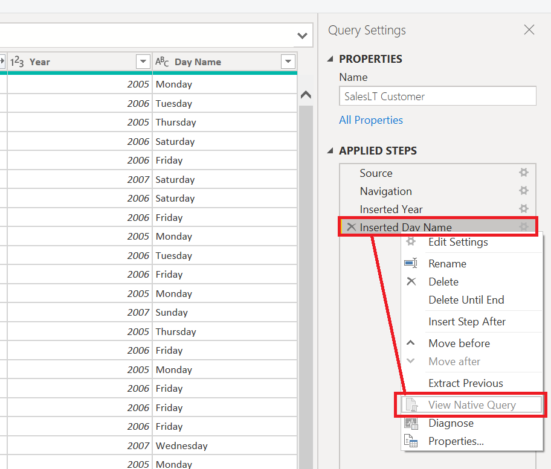
</br>

4. Remove the **Inserted Day Name** step, select the **ModifiedDate** column and within the ribbon select the **Add Column** tab, **Date**, **Day** and **Day of Week**.
    - 1 = Sunday , ... , 7 = Saturday

5. Navigate to the **Add Column** tab and select the **Conditional Column** option.
    - Noting the previous output, edit the **New column name** property to **WeekdayName** and provide the below values and outputs, press the **Add Clause** button to add new conditions.

| Column Name | Operator | Value | Output |
| :----- | :----- | :----- | :----- |
| Day of Week | equals | 1 | Sunday |
| Day of Week | equals | 2 | Monday |
| Day of Week | equals | 3 | Tuesday |
| Day of Week | equals | 4 | Wednesday |
| Day of Week | equals | 5 | Thursday |
| Day of Week | equals | 6 | Friday |
| Day of Week | equals | 7 | Saturday |

</br>

6. Within the Query Settings pane, navigate to the **APPLIED STEPS** section and review the steps to determine if query folding has occurred.
7. Select the top left of the **WeekdayName** column to change the any data type (ABC123) to text and review the steps to determine if query folding has occurred.
8. To avoid the additional subquery, delete the **Changed Type** applied step that was just created and within the formula bar update the **Added Conditional Column** step by including the optional argument "```, type text```" after the ```else null``` condition.

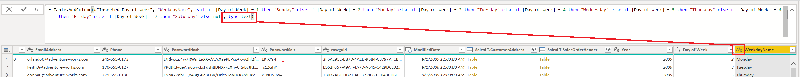

9. Within the formula bar press the **Add Step** button (Fx) and insert the following complex Power Query M formula to add a space whenever a capital letter occurs in your column headers:

```
= Table.TransformColumnNames( #"Added Conditional Column" , each Text.Combine( Splitter.SplitTextByCharacterTransition({"a".."z"},{"A".."Z"})(_) , " " ) )
```

10. Within the Query Settings pane, navigate to the **APPLIED STEPS** section and review the final step to determine if query folding has occurred.

</br>


# Partial Query Folding

Data sources will support different levels of query capabilities. To provide a consistent data transformation experience, the Mashup Engine compensates (i.e. does the processing locally) for transformations that cannot be sent to the source. It is the Data Connector's responsibility to report its capabilities to the engine, carving off the transformations it can handle, generating the appropriate query syntax, and letting the **Mashup Engine** handle the remaining work.

</br>

**Transformations that prevent query folding:**

Merging or appending queries based on different sources (ex. merging an Excel file or SharePoint list with a SQL table). The use of complex logic that have no equivalent functions in the data source.


</br>

## Instructions

### Power Query Editor

1. Within the Power Query Editor select **New Source** and then **SQL Server**.
2. Insert your **Server** address and **Database** name, leave the Data Connectivity mode set to the Import.
3. Expand the **Advanced options** and within the **SQL statement (optional, requires database)** insert the below SQL statement and press **OK** once complete:
    - After the preview window has displayed the truncated results, press **OK** to proceed.

```
SELECT * 
FROM SalesLT.Address 
WHERE CountryRegion = 'United States'
```

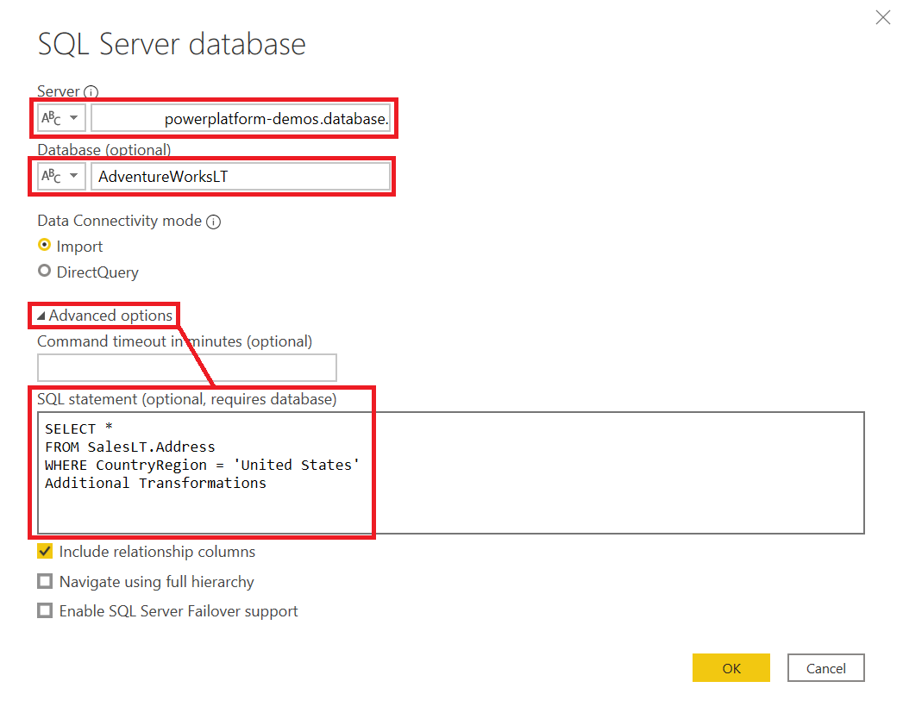

4. Leveraging the Power Query Editor add an additional **WHERE** type of condition by navigating to the **City** column, alternate selecting a row that contains the term **Dallas**, **Text Filters** and then **Equals**.

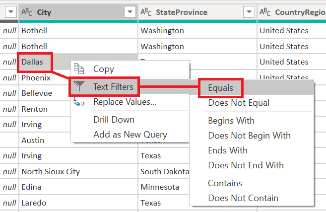

5. Within the Query Settings pane, navigate to the **APPLIED STEPS** section and review the steps to determine if query folding has occurred.

</br>

## Partial Folding Guidance
If a SQL statement has been provided within the initial connection, this is the **ONLY** step that can be folded. All steps after the fact will have to be performed within the Mashup Engine. It is recommended (though not required) to store the logic of a custom SQL statement behind a [view](https://docs.microsoft.com/en-us/sql/relational-databases/views/views?view=sql-server-ver15) within your database in order to provide a seamless experience when used in combination with the graphical user interface (GUI) of the Power Query Editor.

</br>

___


# Advanced Techniques

### Combining Native SQL with the Power Query interface, using the Power Query M formula language.
</br>

1. Within the Power Query Editor select **New Source** and then **SQL Server**.
2. Insert your **Server** address and leave the Data Connectivity mode set to the Import.
3. Alternate click the database name **AdventureWorksLT** (or as it appears on your machine) and select **Transform Data**.


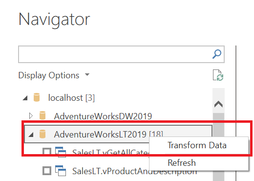


4. Within the formula bar press the **Add Step** button (Fx) and insert the following Power Query M formula:

```
= Value.NativeQuery( Source, "SELECT * FROM SalesLT.Address WHERE CountryRegion = 'United States'", null , [EnableFolding=true] )
```

5. Leveraging the Power Query Editor add an additional **WHERE** type of condition by navigating to the **City** column, alternate selecting a row that contains the term **Dallas**, **Text Filters** and then **Equals**.


6. Within the Query Settings pane, navigate to the **APPLIED STEPS** section and review the steps to determine if query folding has occurred.

____

</br>

### Creating an IN condition
</br>

1. Within the Power Query Editor select **Recent Sources** and the AdventureWorksLT database used throughout the walkthrough.
2. Select the **SalesLT.Customer** table and press **OK**.
    - If prompted leave the connectivity mode as **Import**
4. Navigate to the **Add Column** tab and select the **Conditional Column** option.
    - Edit the **New column name** property to **Gender** and provide the below values and outputs, press the **Add Clause** button to add new conditions. For the **Else** condition use the value **Unknown**

</br>

| Column Name | Operator | Value | Output |
| :----- | :----- | :----- | :----- |
| Title | equals | Mr. | Male |
| Title | equals | Sr. | Male |
| Title | equals | Ms. | Female |
| Title | equals | Sra. | Female |

</br>

5. Within the Query Settings pane, navigate to the **APPLIED STEPS** section and review the steps to determine if query folding has occurred.
6. Within the formula bar replace the current formula to instead use the [**List.Contains**](https://docs.microsoft.com/en-us/powerquery-m/list-contains) function, [ignore any case sensitivity](https://docs.microsoft.com/en-us/powerquery-m/comparer-functions) and declare the column type:

    - Copy and paste the following formula into the formula bar:
        ```
        = Table.AddColumn(SalesLT_Customer, "Gender", each if List.Contains({"Mr.", "Sr."}, [Title], Comparer.OrdinalIgnoreCase ) then "Male" else if List.Contains({"Sra.", "Ms."} , [Title] , Comparer.OrdinalIgnoreCase ) then "Female" else "Unknown", type text )
        ```
7. Within the Query Settings pane, navigate to the **APPLIED STEPS** section and review the steps to determine if query folding has occurred.


____

</br>

### Merging Tables
</br>

1. Within the Power Query Editor select **Recent Sources** and the AdventureWorksLT database used throughout the walkthrough.
2. Select the **SalesLT.ProductCategory** and the **Select Related Tables** button. Because an existing key exists the **SalesLT.Product** is now selected as well. Press **OK** to continue.
    - If prompted leave the connectivity mode as **Import**
3. From the **Home** tab select the **Merge Queries** option, complete the following steps below in the dialog window and press **OK** when complete.
    - In the **SalesLT Product** table preview select the **ProductCategoryID** column.
    - In the drop-down select the **SalesLT ProductCategory** table.
    - In the **SalesLT ProductCategory** table preview select the **ProductCategoryID** column.
    - Change the **Join Kind** option to **Inner (only matching rows)**

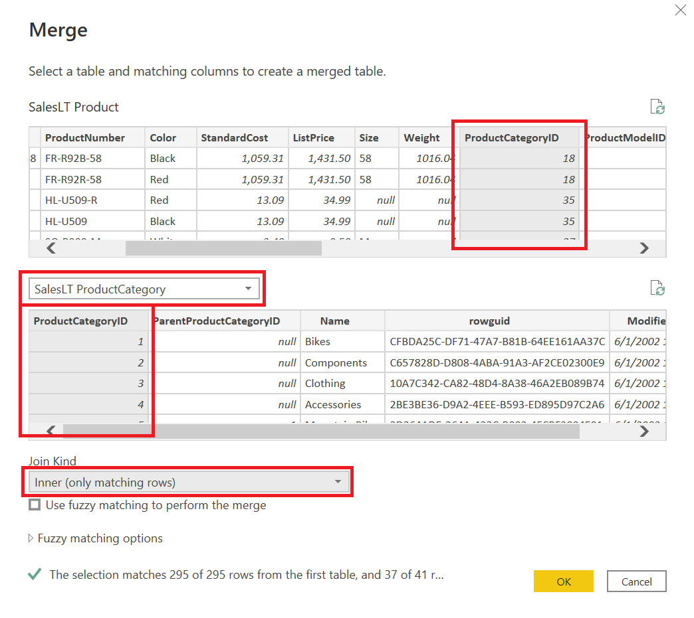

4. Check the **Merged Queries** step that was now created to ensure Query Folding occurred.
5. From the **SalesLT ProductCategory** press the **Expand** button, select the **Name** column in the dialog window and then **OK**.
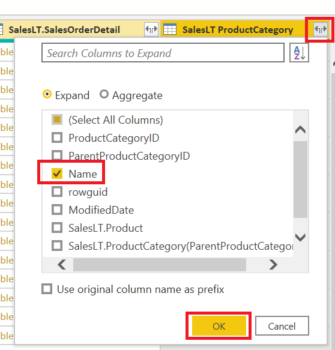
6. Check the **Expanded SalesLT ProductCategory** step that was now created to ensure Query Folding occurred.
___

## Incremental Refresh:
- Incremental data refresh (Power BI only) will be efficient, in terms of resource utilization and refresh duration. In fact, the Power BI Incremental Refresh configuration window will notify you of a warning should it determine that query folding for the table cannot be achieved. If it cannot be achieved, the objective of incremental refresh is defeated. The mashup engine would then be required to retrieve all source rows, and then apply filters to determine incremental changes.

___

# Continue Your Journey:

 [30 Day Challenge: Query Folding](https://www.youtube.com/playlist?list=PLKW7XPyNDgRCorKNS1bfZoAO3YSIAVz3N)

**About:** Set aside a few minutes each day for 30 days to challenge yourself and accelerate your understanding of Power Query, M and Query Folding.

</br>

[VSCode - Power Query Fomula Language extension](https://marketplace.visualstudio.com/items?itemName=PowerQuery.vscode-powerquery)

**About:** Power Query Formula Language extension for VS Code, includes intellisense and code formatting.