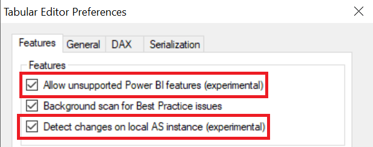
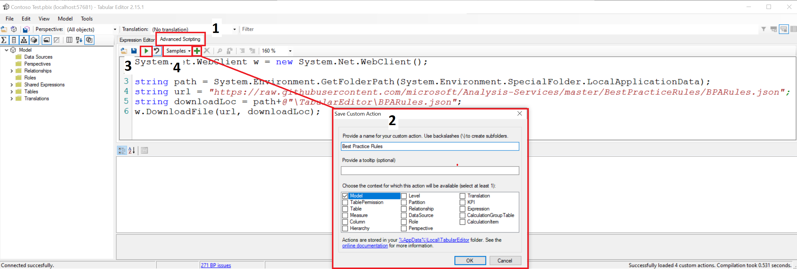
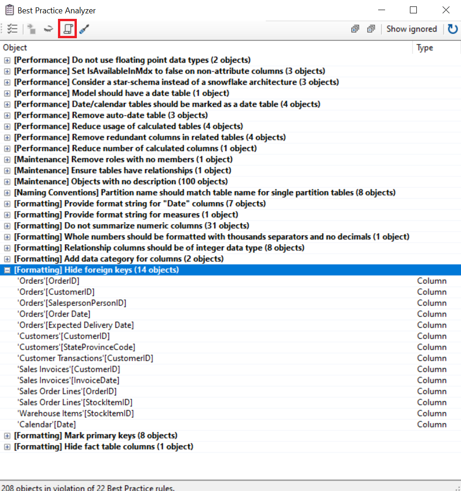
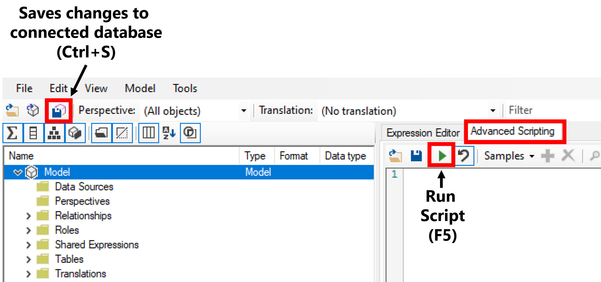
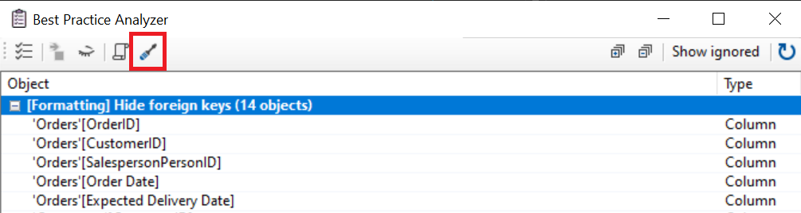
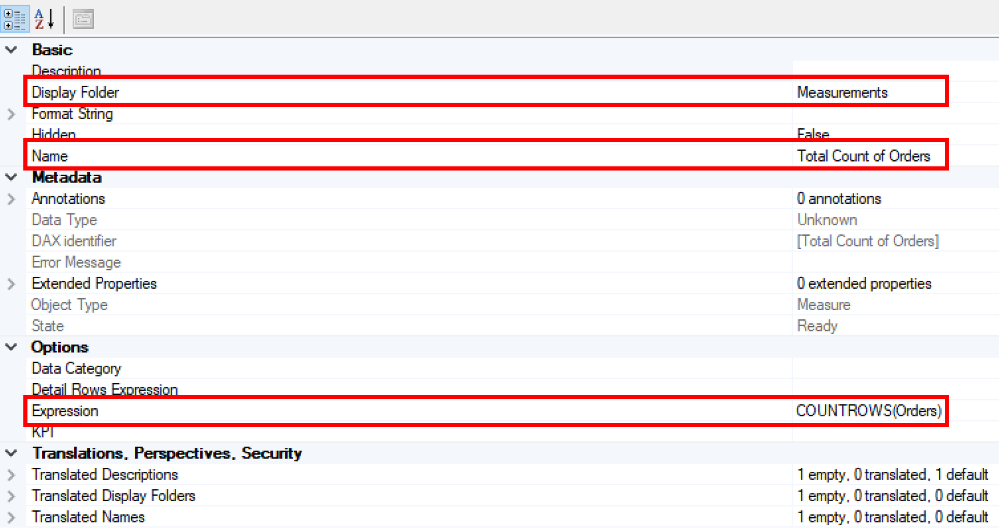
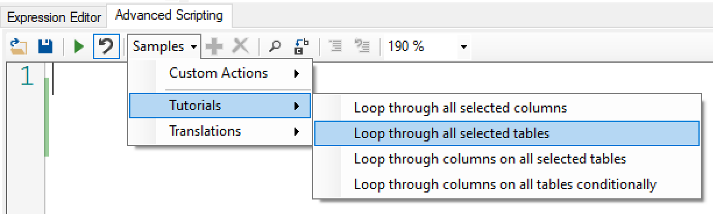
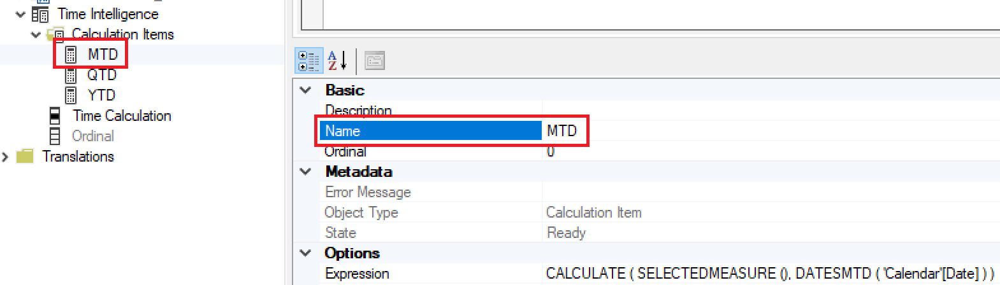
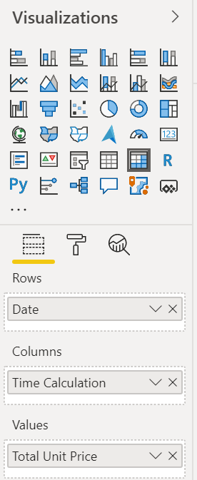

# Tabular Editor In An Hour 

Tabular Editor provides an intuitive hierarchical view of every object in your Tabular Model metadata. Columns, Measures and Hierarchies are arranged in Display Folders by default. You can edit properties of one or more objects, by (multi)selecting them in the tree. A DAX Editor with syntax highlighting lets you easily edit the expressions of Measures, Calculated Columns and Calculated Tables.

Website: https://tabulareditor.com/
___

**Follow Along:**
- [Download and Install Tabular Editor](https://github.com/otykier/TabularEditor/releases)
    - <a href="https://www.youtube.com/watch?v=7Cb7ZuK5EZA&list=PLKW7XPyNDgRCOiC69kZWfRQdOxcnQy2yA&index=1" target="_blank">Optional: Guided Video</a>
- [Download and open the Sales Demo PBIX File](https://github.com/microsoft/pbiworkshops/raw/main/Tabular%20Editor%20In%20An%20Hour/Sales%20Demo.pbix)

___

# Setup

### [Optional Guided Video](https://www.youtube.com/watch?v=pFX20PPxXjs&list=PLKW7XPyNDgRCOiC69kZWfRQdOxcnQy2yA&index=2)

### Power BI Desktop [Only applicable to July and August 2020 Versions]
1. Ensure the Power BI preview feature [Store datasets using enhanced metadata format](https://docs.microsoft.com/en-us/power-bi/connect-data/desktop-enhanced-dataset-metadata) is enabled.
2. Navigate to the **File** menu and select **Options and Settings** and then **Options**
3. Navigate to **Preview features** and enable **Store datasets using enhanced metadata format**

### Tabular Editor
1. Navigate to the **File** menu and select **Preferences**
2. Enable the settings:
    1. **Allow unsupported Power BI features (experimental)**
    2. **Detect changes on local AS instance (experimental)**



⚠ Important Note: Always create a backup of your PBIX file prior to editing to avoid any issues in the event of a corrupted model.

# Tabular Object Model Hierarchy
**Source:** Microsoft Docs

The Tabular Object Model (TOM) exposes native tabular metadata, such as model, tables, columns, and relationships objects. A high-level view of the object model tree, provided below, illustrates how the component parts are related.


From a logical perspective, all tabular objects form a tree, the root of which is a Model, descended from Database. Server and Database are not considered tabular because these objects can also represent a multidimensional database hosted on a server running in Multidimensional mode, or a tabular model at a lower compatibility level that does not use tabular metadata for object definitions.

### Objective - Extract the underlying metadata from the model.

### [Optional Guided Video](https://www.youtube.com/watch?v=NFz-NaGXZ4w&list=PLKW7XPyNDgRCOiC69kZWfRQdOxcnQy2yA&index=3)
1. Open the Sales Demo (PBIX) file, navigate to the **External Tools** ribbon in Power BI Desktop and select **Tabular Editor**.
2. On your local machine create a folder titled: **Sales Demo**
3. Within Tabular Editor 
    1. Navigate to **File > Save to Folder...** and select the above **Sales Demo** that was created.
    2. Navigate to the **Sales Demo** folder and review the outputs in comparison with the TOM hierarchy above.
4. To view the full solution navigate to **File > Save As..** and save the output **model.bim** (bim: business intelligence model), to your local machine to review.

⚠ Important Note: The underlying **model.bim** file can now be incorporated into your CI/CD pipelines for deployments with Azure DevOps. To deploy changes directly to existing datasets published in the Power BI service, enabling the XMLA read/write endpoint in the capacity settings and Power BI Premium is required. Once changes have been made to a dataset published in the service using the XMLA end point, a PBIX file will no longer be able to be downloaded.

[Learn More About Data Modeling and Management Tools](https://docs.microsoft.com/en-us/power-bi/admin/service-premium-connect-tools#data-modeling-and-management-tools) 

___

# Best Practice Analyzer

The best practices rules are a collection of community contributions for Tabular Model development. They let you define global or model-specific rules using a simple expression language. At any time, you can check whether objects in your model satisfy the rules.

Website: https://powerbi.microsoft.com/en-us/blog/best-practice-rules-to-improve-your-models-performance/

### Objective - Import the Best Practice Rules collection and apply to the model.
   
Tabular Editor

1. Navigate to **Advanced Scripting** tab and paste the following code:

```
    System.Net.WebClient w = new System.Net.WebClient(); 
    
    string path = System.Environment.GetFolderPath(System.Environment.SpecialFolder.LocalApplicationData);
    string url = "https://raw.githubusercontent.com/microsoft/Analysis-Services/master/BestPracticeRules/BPARules.json";
    string downloadLoc = path+@"\TabularEditor\BPARules.json";
    w.DownloadFile(url, downloadLoc);
```

2. Press the **Custom Action** button to save the above script, include the following properties and press **OK** when complete.

    1. Custom action name: **Best Practice Rules**
    2. Action context: **Model**
    


3. Press the **Run script (selection only) F5** button. ▶
4. Select **Samples** and review the **Custom Actions** that have now been saved to your local machine.

    ⚠ Important Note:  If new rules are added in the future you can re-run this script to incorporate any updates.

5. Navigate to **Tools** and select **Best Practice Analyzer...** or press the hotkey (**F10**)
6. Review the current list of objects needing attention based on the rules.
7. Select the header **[Formatting] Hide foreign key columns (14 objects)**
    4. Press the **Generate fix script** icon to copy to the clipboard.
    
    5. In the **Fix script generation** dialog box prompt press **OK**.
    1. Select the **Advanced Scripting** tab and paste the generated script (**Ctrl+V**) or from the navigation menu (**Edit > Paste**)
    2. Press the **Run script (selection only) F5** button. ▶
    3. Press the **Saves the changes to the connected database (Ctrl+S) button.**



Power BI Desktop

1. Review the **Orders** table to confirm that all the applicable columns (OrderID, CustomerID, SalesPersonID, Order Date and Expected Delivery Date) are now hidden.
2. Right click any field and select **Unhide All**

Tabular Editor

1. In the **External change detected** dialog box press **Yes**
2. Confirm that the fields hidden are now visible.
3. Navigate to **Tools** and select **Best Practice Analyzer...** or press the hotkey (**F10**)
4. Select the header **[Formatting] Hide foreign key columns (14 objects)**
5. Press the **Apply fix** icon to instantly apply fixes.

6. Press the **Saves the changes to the connected database (Ctrl+S) button.**
    
⚠ Important Note: Changes to the model can be both read from and written to the Power BI dataset. Any changes within Tabular Editor will need to be saved back to the connected database.
___

# Advanced Scripting (Automation)

Advanced Scripting, lets users write a script, to more directly manipulate the objects in the loaded Tabular Model, that can be saved as Custom Actions for easy invocation directly in the Explorer Tree.

Website: https://github.com/otykier/TabularEditor/wiki/Advanced-Scripting

⚠ Important Note: 
- You can use CTRL+Z to undo or CTRL+Y to redo changes.
- The scripting language is C#

### Objective - Create a script to automate the addition of measures in the model.

### [Optional Guided Video](https://www.youtube.com/watch?v=qtNVvaaCKnc&list=PLKW7XPyNDgRCOiC69kZWfRQdOxcnQy2yA&index=5)

### Tables

1. Select the **Advanced Scripting** tab and enter the below script
```
Selected.Table.AddMeasure( 
    "Total Count of " + Selected.Table.Name,
    "COUNTROWS('" + Selected.Table.Name + "')",
    "Measurements" 
);
```
**Recommended Practice:** Utilize a single quote in the event of a table name containing a space for the expression.

2. Select the **Orders** table and then press the **Run script (selection only) F5** button. ▶
3. Within the Model Explorer navigate to the **Orders** table, the **Measurements** folder and select the **Total Count of Orders** measure.
4. Review the following arguments from the script earlier in comparison with the Property Pages
```
Selected.Table.AddMeasure( 
    Argument1 // Name ,
    Argument2 // DAX expression ,
    Argument3 // Display Folder
);
```


5. Press the **Saves the changes to the connected database (Ctrl+S) button.**
6. Navigate to Power BI Desktop to confirm the new measure has been added to the file.
7. With the Model Explorer focused, press **CTRL+Z** to undo actions until the folder and measure have been removed from the **Orders** table.
8. Within the **Advanced Scripting** tab update the script to include a variable
```
var tableName = Selected.Table.Name;

Selected.Table.AddMeasure(
    "Total Count of " + tableName,
    "COUNTROWS('" + tableName + "')",
    "Measurements"
);
```
9. Select the **Orders** table and then press the **Run script (selection only) F5** button. ▶
10. Confirm within the Model Explorer in the the **Orders** table and the **Measurements** folder the the **Total Count of Orders** measure exists.
11. Select the **Customers** and **Employees** table and press the **Run script (selection only) F5** button. ▶
12. An error will now be displayed stating **The selection contains more than one object of type Table** indicating only one active object can be selected.
13. Within the  **Advanced Scripting** tab select **Samples**, **Tutorials** and **Loop through all selected tables**

14. Update the script to include the below:

```
foreach(var table in Selected.Tables) {
   
    var tableName = table.Name;
   
    table.AddMeasure(
        "Total Count of " + tableName,
        "COUNTROWS('" + tableName + "')",
        "Measurements"
    );
    
};
```
15. Select the **Orders**, **Customers**, **Employeees** and **Customer Transactions** tables and then press the **Run script (selection only) F5** button. ▶
16. Press the **Saves the changes to the connected database (Ctrl+S) button.**
17. Navigate to Power BI Desktop to confirm the new measure has been added to the file.

### Columns

1. Within the  **Advanced Scripting** tab select **Samples**, **Tutorials** and **Loop through all selected columns**
2. Update the script to include the below:
```
foreach(var column in Selected.Columns) {

    column.Table.AddMeasure(
        "Sum of " + column.Name,
        "SUM(" + column.DaxObjectFullName + ")",
        "Measurements"
    );

}
```
⚠ Important Note: The DaxObjectFullName property provides the fully qualified name of the column for use in the DAX expression: 'TableName'[ColumnName].

3. Select the following columns in the **Sales Order Lines** table and then press the **Run script (selection only) F5** button. ▶
    1. **Quantity**
    2. **Unit Price**
    3. **Picked Quantity**
4. Review the **Measurements** folder in the **Sales Order Lines** table to confirm the new measures have been added.
5. Select the **Model Explorer** to focus and press **Ctrl+Z** to undo the above script.
6. Update the script to include the below:
```
foreach(var column in Selected.Columns) {

    column.Table.AddMeasure(
        "Sum of " + column.Name,
        "SUM(" + column.DaxObjectFullName + ")",
        "Measurements"
    );
    
    column.Table.AddMeasure(
        "Average of " + column.Name,
        "AVERAGE(" + column.DaxObjectFullName + ")",
        "Measurements"
    );

}
```
**🏆 Challenge:** Update the above code to include variables.

7. Select the following columns in the **Sales Order Lines** table and then press the **Run script (selection only) F5** button. ▶
    1. **Quantity**
    2. **Unit Price**
    3. **Picked Quantity**
8. Review the **Measurements** folder in the **Sales Order Lines** table to confirm the new measures have been added.
9. Press the **Saves the changes to the connected database (Ctrl+S) button.**

___

# Calculation Groups

A calculation group is a set of calculation items that are conveniently grouped together because they are variations on the same topic.

### Objective - Create a calculation group for various time intelligence expressions.

### [Optional Guided Video](https://www.youtube.com/watch?v=xOkmNZd0SY4&list=PLKW7XPyNDgRCOiC69kZWfRQdOxcnQy2yA&index=6)

Within Tabular Editor:
1. Navigate to the **Calendar** table's **Date** column and edit the Property Pages **Hidden** property to **False**.
2. Right click the **Tables** object and select **Create New** and **Calculation Group ALT+7**
3. Rename the **New Calculation Group** to **Time Intelligence**
4. Change the **Name** column's, **Name** property to **Time Calculation** (Pro Tip: **F2** for Edit Mode)
5. Right click **Calculation Items** and select **New Calculation Item**, repeat the following three times.
6. For each of the following insert the following expression:

| Key | Value |
| :--- | :----- |
| New Calculation | CALCULATE ( SELECTEDMEASURE (), DATESMTD ( 'Calendar'[Date] ) ) |
| New Calculation 1 | CALCULATE ( SELECTEDMEASURE (), DATESQTD ( 'Calendar'[Date] ) ) |
| New Calculation 2 | CALCULATE ( SELECTEDMEASURE (), DATESYTD ( 'Calendar'[Date] ) ) | 

7. Individually select and rename each of the following Calcuation Items individually within the Property Page's **Name** property:

| Key | Value |
| :--- | :----- |
| New Calculation | MTD |
| New Calculation 1 | QTD |
| New Calculation 2 | YTD | 



8. Select all three calculation items (MTD, QTD, YTD) to bulk update the Property Page's **Format String Expression** property to **"$#,0.00"**


9. Press the **Saves the changes to the connected database (Ctrl+S) button.**
 
Within Power BI Desktop:
1. Navigate to the **Time Intelligence** table, right click and select **Refresh data**
2. Using a **Matrix** visual insert the following:

| Key | Value |
| :--- | :----- |
| Rows | 'Calendar'[Date] |
| Values | [Total Unit Price] |
| Columns | 'Time Intelligence'[Time Calculation] |



___

# Continue Your Journey

### An indepth walk through of Tabular Editor
[PowerBI.Tips - Tabular Editor Playlist](https://www.youtube.com/watch?v=c-jZMzsvKnM&list=PLZjKz7bVsqV1mmA48wXqrSDPbDSGBvLdL)

Includes:
- Intro to Tabular Editor (1:03:33)
- Using Scripts (1:09:31)
- Best Practice Analyzer (1:05:42)
- Using Devops (1:24:05)

### Advanced Scripting
[Script Snippets](https://docs.tabulareditor.com/Useful-script-snippets.html)

[Community Scripts](https://github.com/TabularEditor/Scripts)

### Calculation Groups
[Microsoft Docs](https://docs.microsoft.com/en-us/analysis-services/tabular-models/calculation-groups?view=asallproducts-allversions)

[SQLBI - Creating calculation groups in Power BI Desktop using Tabular Editor](https://www.youtube.com/watch?v=a4zYT-N-zsU)

[SQLBI - Calculation Groups (Blog)](https://www.sqlbi.com/calculation-groups/)